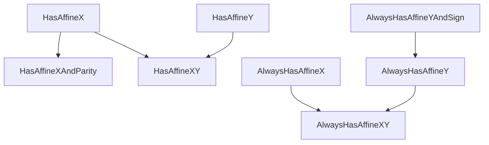
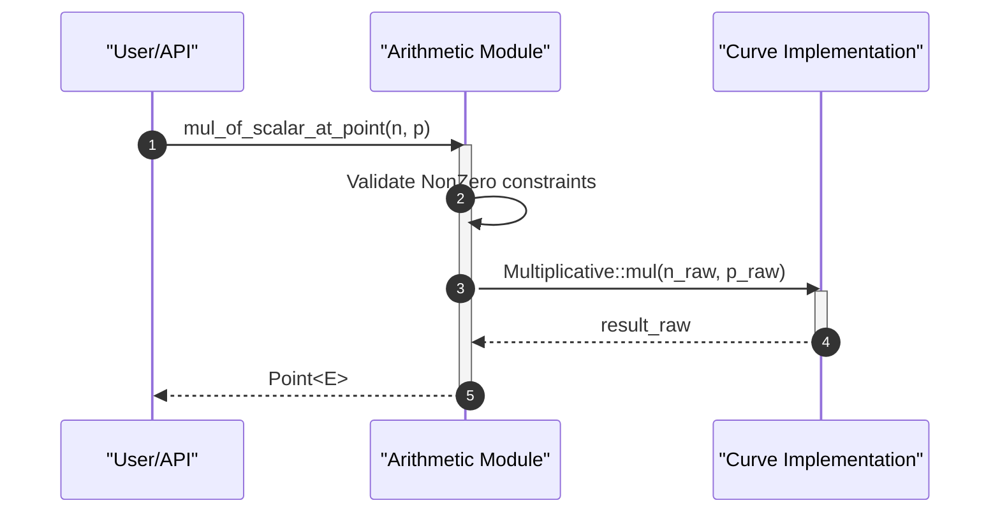

# Core EC Implementations

This section provides a technical deep dive into the generic elliptic curve primitives implemented within the library. The architecture leverages Rust's trait system to provide a curve-agnostic framework for coordinate representation and point arithmetic.

## Coordinate Systems

The library utilizes a generic approach to coordinate representation, allowing different elliptic curves to define their own underlying storage while maintaining a consistent interface for the rest of the system.

### Coordinate Representation

The primary unit of data for a point's position is the `Coordinate<E>`, which wraps a curve-specific array.

```rust
pub struct Coordinate<E: Curve>(E::CoordinateArray);
```

Key functionalities of the `Coordinate` struct include:
- **Byte Conversion**: Support for Big-Endian (BE) bytes via `as_be_bytes()` and `from_be_bytes()`.
- **Scalar Conversion**: The `to_scalar()` method converts a coordinate into a `Scalar<E>` using `from_be_bytes_mod_order`.
- **Validation**: `from_be_bytes` ensures that the input byte slice length matches the expected `CoordinateArray` length of the curve.

### Affine Coordinate Traits

To handle different levels of point availability (e.g., compressed vs. uncompressed points), the library employs a tiered trait system. These traits allow functions to specify exactly which coordinates they require.

| Trait | Description |
| :--- | :--- |
| `HasAffineX` | Provides optional access to the $x$ coordinate via `x()`. |
| `HasAffineY` | Provides optional access to the $y$ coordinate. |
| `HasAffineXAndParity` | Access to $x$ and the parity (even/odd) of $y$. |
| `HasAffineXY` | Combined access to both $x$ and $y$ coordinates. |
| `AlwaysHasAffineX` | Guaranteed access to the $x$ coordinate. |
| `AlwaysHasAffineXY` | Guaranteed access to both $x$ and $y$ coordinates. |

The parity and sign of coordinates are managed via specific enums:
- **`Parity`**: Defines if a value is `Even` or `Odd`.
- **`Sign`**: Defines if a value is `Positive` or `Negative`.



## Point Arithmetic

The library abstracts elliptic curve arithmetic through `Additive` and `Multiplicative` traits, ensuring that the core logic remains independent of the specific curve implementation.

### Fundamental Operations

Point and scalar operations are implemented using a variety of macros (`impl_binary_ops`, `impl_unary_ops`, `impl_op_assign`) to provide standard Rust operator overloading.

#### Point Operations
The following primitives are exposed for point manipulation:
- **Addition/Subtraction**: `Additive::add` and `Additive::sub`.
- **Doubling**: `Additive::double`.
- **Negation**: `Additive::negate`.
- **Scalar Multiplication**: `Multiplicative::mul` (multiplying a point by a scalar).

#### Scalar Operations
Scalar arithmetic is handled in the `scalar` module, providing:
- `add`, `sub`, `mul`
- `neg` (negation)
- `neg_nonzero` and `neg_nonzero_secret` for specialized scalar types.

### Non-Zero Constraints

To prevent edge-case errors (such as multiplying by the identity point or a zero scalar), the library utilizes `NonZero<T>` wrappers. This allows the type system to enforce that certain operations are only performed on non-identity elements.



## Generator Logic

The `Generator<E>` is a phantom type that represents the base point of the elliptic curve. It serves as the starting point for most scalar multiplication operations.

- **Type Definition**: `pub struct Generator<E: Curve>(PhantomType<E>);`
- **Conversions**:
    - `to_point()`: Converts the generator into a standard `Point<E>`.
    - `to_nonzero_point()`: Converts the generator into a `NonZero<Point<E>>` using `NonZero::new_unchecked`.

## Mathematical Law Validation

The `laws` module in `arithmetic.rs` provides a suite of validation functions used to ensure that the curve implementation adheres to the expected mathematical properties of elliptic curves.

| Validation Function | Purpose |
| :--- | :--- |
| `sum_of_points_is_valid_point` | Verifies that $P + Q$ results in a valid point on the curve. |
| `double_point_is_valid_point` | Verifies that $2P$ is a valid point. |
| `neg_point_is_valid_point` | Verifies that $-P$ is a valid point. |
| `mul_of_scalar_at_point_is_valid_point` | Verifies that $nP$ is a valid point. |
| `mul_of_generator_at_scalar_is_valid_point` | Verifies that $nG$ is a valid point. |
| `non_zero_scalar_at_non_zero_scalar_is_non_zero_scalar` | Ensures scalar multiplication doesn't unexpectedly result in zero. |