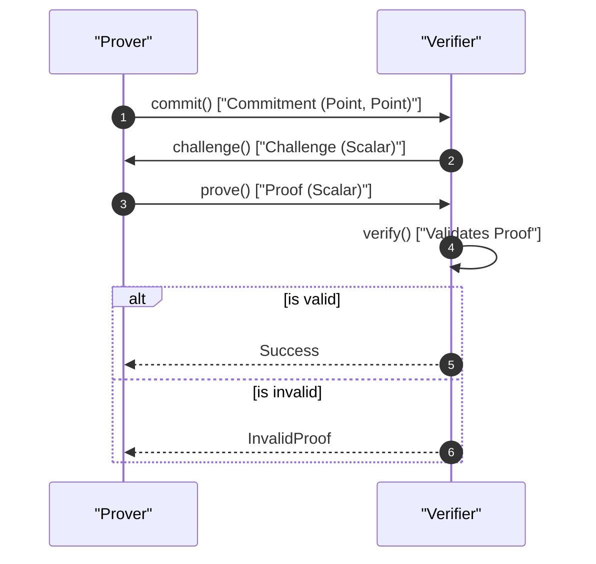
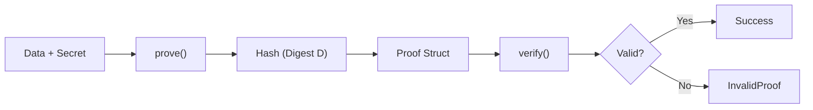

# Zero-Knowledge Proofs

The `generic-ec-zkp` crate provides primitives for creating and verifying Zero-Knowledge Proofs (ZKPs) using generic elliptic curve implementations. The primary focus of this module is the implementation of discrete logarithm equality proofs, allowing a prover to demonstrate knowledge of a secret scalar used across different generators without revealing the secret itself.

## Discrete Logarithm Equality (DLogEq)

The core functionality centers on proving that two points, $P_1$ and $P_2$, were created using the same secret scalar $x$ with two different generators, $G$ and $H$. Specifically, it proves that if $P_1 = G \cdot x$, then $P_2 = H \cdot x$.

### The Data Structure

The `Data<E>` struct encapsulates the necessary parameters for a discrete logarithm equality proof.

| Field | Type | Description |
| :--- | :--- | :--- |
| `gen1` | `Point<E>` | The first generator ($G$). |
| `prod1` | `Point<E>` | The result of the first operation ($G \cdot x$). |
| `gen2` | `Point<E>` | The second generator ($H$). |
| `prod2` | `Point<E>` | The result of the second operation ($H \cdot x$). |

For common use cases, the library provides `from_secret_key`, which initializes the data where $G$ is the principal group generator and $H$ is set to the generator while $Z$ is set to $G \cdot x$.

```rust
pub fn from_secret_key(x: &generic_ec::SecretScalar<E>, gen: Point<E>) -> Data<E>
```

---

## Interactive Protocol

The `interactive` module implements a multi-step protocol based on the "Zero-Knowledge Proofs Notes" (2024) by Jorge L. Villar. This protocol requires an exchange of messages between a Prover and a Verifier.

### Workflow Process

The interactive process follows a commitment-challenge-response pattern:

1.  **Commitment**: The Prover generates a random value and sends a commitment to the Verifier.
2.  **Challenge**: The Verifier sends a random challenge scalar.
3.  **Proof**: The Prover computes a response scalar based on the secret, the random value, and the challenge.
4.  **Verification**: The Verifier validates the response against the commitment and the public data.

### Interactive Sequence Diagram



### Interactive API Types

| Type | Alias | Description |
| :--- | :--- | :--- |
| `Commitment<E>` | `(Point<E>, Point<E>)` | The public commitment sent by the prover. |
| `PrivateCommitment<E>` | `Scalar<E>` | The secret randomness used by the prover. |
| `Challenge<E>` | `Scalar<E>` | The random challenge issued by the verifier. |
| `Proof<E>` | `Scalar<E>` | The final response sent by the prover. |

---

## Non-Interactive Proofs

To eliminate the need for back-and-forth communication, the `non_interactive` module implements a version of the protocol where the challenge is generated using a cryptographic hash (the Fiat-Shamir heuristic).

### Non-Interactive Workflow



The non-interactive implementation requires a type `D` that implements `digest::Digest` to generate the challenge internally.

```rust
pub fn prove<E: Curve, D: digest::Digest>(...) -> Proof<E>
pub fn verify<E: Curve, D: digest::Digest>(...) -> Result<(), InvalidProof>
```

---

## Auxiliary Modules

### Polynomial Utilities

The library includes a `polynomial` module used for complex ZKP constructions. Based on the benchmark suite, it provides utilities for Lagrange interpolation:

*   `lagrange_coefficient`: Calculates coefficients for polynomial interpolation.
*   `lagrange_coefficient_at_zero`: Specifically computes the Lagrange coefficient evaluated at zero.

### Library Structure Overview

The `generic-ec-zkp` crate is organized into the following modules:

*   `dlog_eq`: Discrete logarithm equality proofs (Interactive and Non-Interactive).
*   `polynomial`: Mathematical utilities for polynomial operations and Lagrange coefficients.
*   `schnorr_pok`: Schnorr Proof of Knowledge implementations.