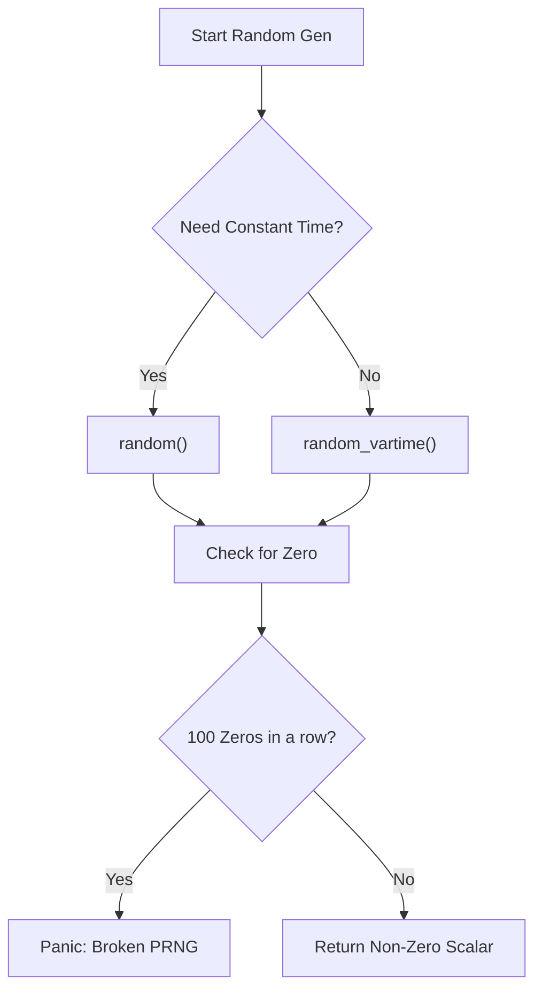
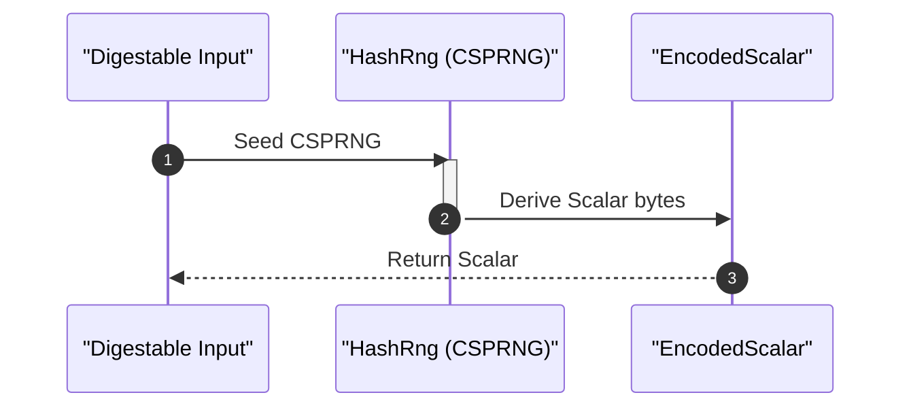

# Mathematical Foundations

This section provides a detailed mathematical and technical explanation of how scalars are handled, generated, and derived within the `generic-ec` library.

## Scalar Representations

The library distinguishes between public and secret representations of scalars and points to ensure memory safety and side-channel resistance.

### Encoded Scalars
Scalars are represented in their byte form through the `EncodedScalar` and `EncodedSecretScalar` types.

| Type | Purpose | Key Property |
| :--- | :--- | :--- |
| `EncodedScalar<E>` | Public byte representation of a scalar. | Implements `PartialEq`, `Eq`, and `Default`. |
| `EncodedSecretScalar<E>` | Secret byte representation of a scalar. | Automatically zeroed on drop using `Zeroize`; supports `ConstantTimeEq`. |

### Encoded Points
Elliptic curve points are similarly handled via `EncodedPoint` and `EncodedSecretPoint`. `EncodedPoint` supports two internal formats:
- **Compressed**: Uses `E::CompressedPointArray`.
- **Uncompressed**: Uses `E::UncompressedPointArray`.

```rust
pub struct EncodedPoint<E: Curve>(EncodedPointInner<E>);

enum EncodedPointInner<E: Curve> {
    Compressed(E::CompressedPointArray),
    Uncompressed(E::UncompressedPointArray),
}
```

## Random Scalar Generation

The library provides two primary strategies for generating non-zero scalars, allowing developers to choose between strict security (constant-time) and raw performance.

### Constant-Time Generation (`random`)
The standard `random` method is designed for high-security contexts where side-channel attacks are a concern.

**Guarantees:**
1. **Uniform Distribution**: Output scalars are uniformly distributed (given a uniform PRNG), with negligible bias relative to the curve's target security level.
2. **Constant-Time**: The algorithm does not branch on input randomness and avoids rejection-sampling (except in the negligible event of generating a zero scalar).
3. **Reproducibility**: Identical PRNG seeds produce identical scalars across all platforms.

### Variable-Time Generation (`random_vartime`)
The `random_vartime` method is intended for use cases where constant-time properties and reproducibility are not required.

**Guarantees:**
1. **Uniform Distribution**: Maintains the same uniform distribution properties as the constant-time variant.
2. **Performance**: Typically executes faster than the constant-time version.

### Failure Conditions
Both random generation strategies implement a safety check to detect broken randomness sources. The library will **panic** if the randomness source returns 100 zero scalars in a row. 

> **Note:** For the secp256k1 curve, the probability of this happening naturally is approximately $2^{-25600}$, meaning a panic almost certainly indicates a faulty PRNG.



## Hashing to Scalars

The library provides a mechanism to derive a scalar from arbitrary structured data. This is useful for deterministic key derivation or mapping inputs to the scalar field.

### Implementation Logic
The conversion from data to a scalar does not use a direct mapping but instead leverages a Cryptographically Secure Pseudo-Random Number Generator (CSPRNG).

1. **Input**: Any data that implements the `Digestable` trait (from the `udigest` crate).
2. **Seeding**: The input data is used to seed a `HashRng` instance.
3. **Derivation**: The `HashRng` is then used to derive the final scalar.



### Security Considerations for Hashing
Users should be aware of the following constraints when using the hash-to-scalar primitive:
- **Non-Constant Time**: The operation is not performed in constant time.
- **Non-Standard**: This implementation does not follow any existing formal standards for "hash-to-scalar" primitives.