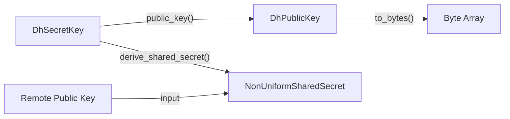

# WASM and No-Std Integration

This section provides technical guidance for integrating the `generic-ec` library into restricted environments, specifically focusing on WebAssembly (WASM) and embedded systems that operate without the Rust standard library (`no_std`).

## No-Std Compatibility

The library is designed to support environments where the `std` library is unavailable. This is critical for embedded firmware and certain WASM targets where a full operating system abstraction is not provided.

### Panic Handling in No-Std
In a `no_std` environment, the compiler requires a defined panic handler to manage unrecoverable errors. The `wasm/nostd` module implements a custom panic handler to ensure the library can be compiled for bare-metal or restricted targets.

```rust
fn panic(_panic: &PanicInfo<'_>) -> ! {
    // Custom panic implementation for no-std environments
}
```

## WASM Implementation Example

The library provides a reference implementation for WebAssembly targets, demonstrating how to perform cryptographic operations such as Diffie-Hellman (DH) key exchanges. This implementation utilizes a subset of the elliptic curve primitives optimized for WASM execution.

### DH Key Exchange Workflow

The following diagram illustrates the data flow for generating keys and deriving a shared secret within the WASM environment.



### Core Data Structures

The WASM integration utilizes specific wrappers to manage secret and public keys.

| Structure | Description | Key Characteristics |
| :--- | :--- | :--- |
| `DhSecretKey` | Represents the private component of the key pair. | Capable of random generation and public key derivation. |
| `DhPublicKey` | Represents the public component of the key pair. | Can be serialized to bytes for transmission. |
| `NonUniformSharedSecret` | The resulting secret derived from a DH exchange. | Used as the basis for subsequent symmetric encryption. |

## API Reference

The following methods are available for managing keys and secrets in the WASM/No-Std context.

### Key Management

| Method | Receiver | Return Type | Description |
| :--- | :--- | :--- | :--- |
| `random()` | `DhSecretKey` | `Self` | Generates a new random secret key. |
| `public_key()` | `DhSecretKey` | `DhPublicKey` | Derives the corresponding public key from the secret. |
| `to_bytes()` | `DhPublicKey` | `Box<[u8]>` | Serializes the public key into a boxed byte slice. |
| `derive_shared_secret()` | `DhSecretKey` | `NonUniformSharedSecret` | Computes the shared secret using a remote public key. |

### Implementation Detail: Public Key Serialization
The `to_bytes` implementation ensures that the internal point representation is converted into a portable format suitable for network transmission or storage.

```rust
impl DhPublicKey {
    pub fn to_bytes(&self) -> Box<[u8]> {
        self.point.to_bytes(true).to_vec().into_boxed_slice()
    }
}
```

## Integration Sequence

The following sequence diagram details the interaction between two entities (Alice and Bob) utilizing the WASM-integrated library to establish a shared secret.

```mermaid
sequenceDiagram
    autonumber
    participant A as "Alice (WASM)"
    participant B as "Bob (WASM)"

    A->>A: "DhSecretKey::random()"
    A->>A: "secret_a.public_key()"
    A->>B: "Send DhPublicKey"
    
    B->>B: "DhSecretKey::random()"
    B->>B: "secret_b.public_key()"
    B->>A: "Send DhPublicKey"
    
    A->>A: "secret_a.derive_shared_secret(pub_b)"
    B->>B: "secret_b.derive_shared_secret(pub_a)"
    
    Note over A,B: "Both now possess NonUniformSharedSecret"