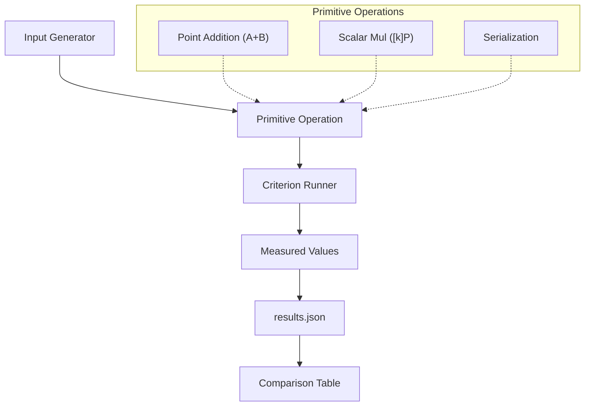
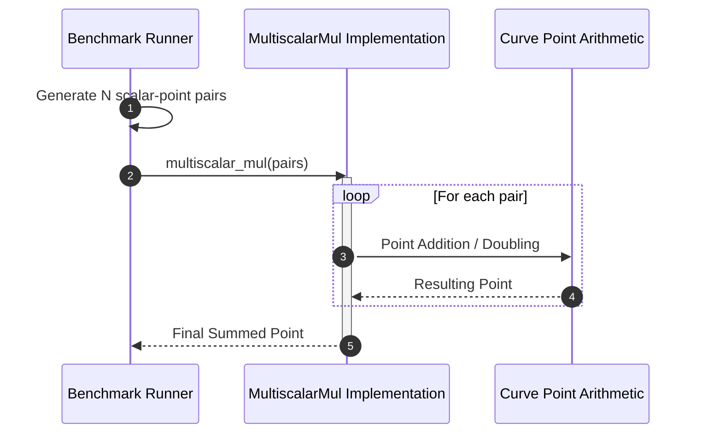

# Performance and Benchmarking

This section provides a detailed analysis of the computational performance of the `generic-ec` library. It covers the benchmarking methodology for elliptic curve primitives and multiscalar multiplication, along with a comparative analysis of supported curves.

## Benchmark Methodology

The library utilizes the `criterion` crate to provide statistically significant performance measurements. Benchmarks are categorized into primitive curve operations and high-level multiscalar multiplication.

### Performance Evaluation Workflow

The following diagram illustrates the process of capturing performance data for curve primitives.



### Benchmarking Suite Structure

The benchmarking suite is split across two primary areas:
1. **Curve Primitives**: Located in `generic-ec-curves/benches/curves.rs`, focusing on the basic building blocks of the curve.
2. **Multiscalar Multiplication**: Located in `tests/benches/multiscalar.rs`, focusing on the efficiency of summing multiple scalar-point products.

## Curve Primitive Performance

The library evaluates several key operations to ensure the efficiency of the generic implementation across different curve types.

### Comparative Performance Table

The following table summarizes the execution time for core operations across supported curves:

| Operation | secp256k1 | secp256r1 | stark | ed25519 |
| :--- | :--- | :--- | :--- | :--- |
| **A+B** (Point Addition) | 300ns | 453ns | 505ns | 215ns |
| **[k]P** (Scalar Mul) | 52.5μs | 140.8μs | 153.5μs | 36.6μs |
| **SmallFactorCheck** | 8ns | 5ns | 6ns | 36606ns |
| **EncodeCompressedPoint**| 5.8μs | 21.1μs | 14.9μs | 3.5μs |
| **DecodeCompressedPoint**| 5.7μs | 7.0μs | 2599.6μs | 4.0μs |
| **a+b** (Scalar Add) | 11ns | 11ns | 11ns | 35ns |
| **a*b** (Scalar Mul) | 41ns | 58ns | 29ns | 98ns |
| **inv(a)** (Inversion) | 13.2μs | 21.9μs | 8.3μs | 11.4μs |

### Analysis of Results
*   **Ed25519** demonstrates the highest efficiency in point addition (`A+B`) and scalar multiplication (`[k]P`).
*   **Stark** shows significantly higher latency in point decoding (`DecodeCompressedPoint`) and bytes reduction compared to other curves.
*   **Scalar Arithmetic** (`a+b`, `a*b`) remains relatively consistent across most curves, with the exception of Ed25519.

## Multiscalar Multiplication (MSM)

Multiscalar multiplication $\sum_{i=1}^{n} k_i P_i$ is a critical operation for ZKP and signature verification. The library benchmarks this via the `MultiscalarMul` trait.

### Benchmarking Implementation

The MSM benchmarks test scalability by varying the number of scalar-point pairs ($n$) from 2 up to 250.

```rust
// Extracted from tests/benches/multiscalar.rs
for n in iter::once(2).chain((10..=250).step_by(5)) {
    c.bench_function(
        &format!("multiscalar_mul/{multiscalar_algo}/{curve_name}/n{n}"),
        |b| {
            b.iter_batched(
                || {
                    // Generation of scalar-point pairs
                    (0..n).map(|_| (random_scalar::<E>(), random_point::<E>())).collect::<Vec<_>>()
                },
                |scalar_points| M::multiscalar_mul(scalar_points.into_iter()),
                criterion::BatchSize::SmallInput,
            )
        },
    );
}
```

### MSM Execution Flow



## Detailed Analysis: secp256k1

Using the raw data from `perf/curves/results.json`, we can observe the linear scaling of basic operations.

### Point Addition ($A+B$)
For `secp256k1`, the measured values show a strong linear correlation between the number of iterations and time:
*   **Typical Estimate**: $\approx 297.5$ ns per operation.
*   **Slope**: $297.5$ ns, indicating highly predictable performance.

### Scalar Multiplication ($[k]P$)
The scalar multiplication operation exhibits a significantly higher cost but maintains linear scaling:
*   **Base Cost**: $\approx 52.5 \mu s$ per operation.

## Interpretation of Result Tables

When analyzing the benchmark results, the following metrics should be considered:

1.  **Typical Estimate**: The most likely execution time for a single operation.
2.  **Lower/Upper Bounds**: The confidence interval for the measurement.
3.  **Slope**: Used in `results.json` to determine the cost per single unit of work when benchmarking batches of operations.
4.  **Unit Scaling**: Note the transition from nanoseconds (ns) for scalar addition to microseconds ($\mu s$) for scalar multiplication.