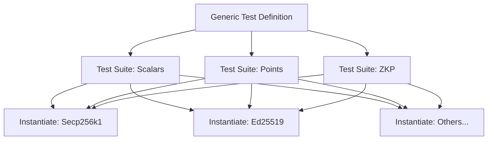
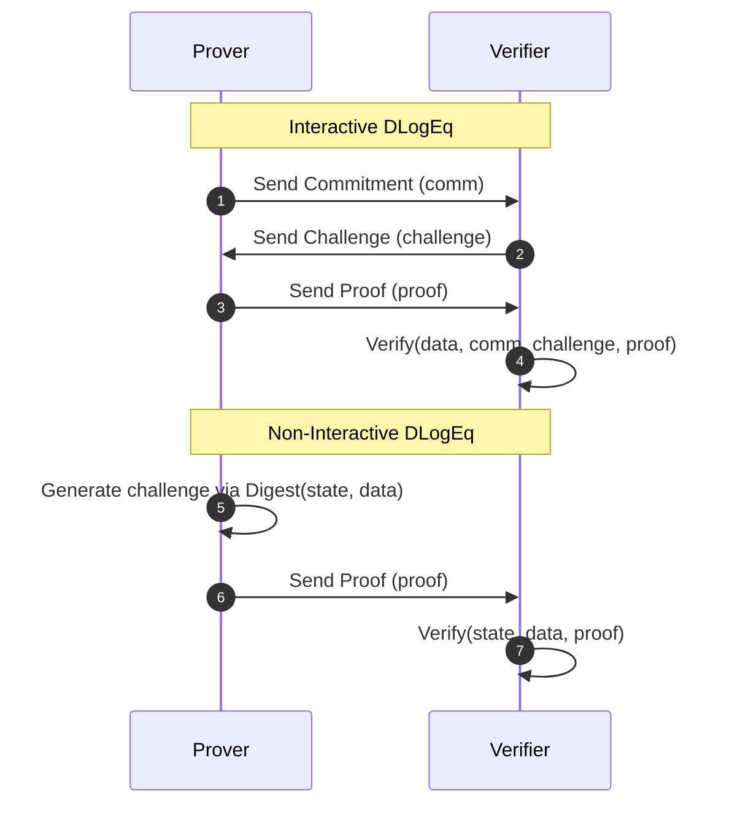

# Testing and Validation

The `generic-ec` project employs a rigorous validation strategy designed to ensure that cryptographic primitives behave consistently across different elliptic curve implementations. The testing architecture leverages Rust's generics to define a core set of properties that must hold true for any curve implementing the `Curve` trait, which are then instantiated for specific curves.

## Testing Strategy Overview

The project utilizes a "Define and Instantiate" pattern. Rather than writing separate tests for every curve, the test suite defines generic modules that are then applied to all supported curves (e.g., Secp256k1, Ed25519, Stark).



## Unit Testing for Curves

The unit tests located in `tests/tests/curves.rs` focus on the fundamental algebraic properties of scalars and points.

### Scalar Validation
Tests ensure that scalar arithmetic and conversions are lossless and mathematically sound.

| Test Category | Validated Properties |
| :--- | :--- |
| **Byte Conversion** | Big-endian and Little-endian serialization/deserialization consistency. |
| **Identities** | Verification of `zero()` and `one()` additive and multiplicative identities. |
| **Inversion** | Ensuring $s \times s^{-1} = 1$. |
| **Mod-Order** | Correct reduction of arbitrary length byte arrays into the curve's scalar field. |
| **Radix Conversion** | Correctness of `as_radix16_be()` and `as_radix16_le()` iterations. |

### Point Validation
Point tests verify the geometry and serialization of the elliptic curve points.

- **Identity Point**: Ensuring the zero point behaves correctly in addition and scalar multiplication.
- **Serialization**: Validating that compressed and uncompressed byte representations can be round-tripped without data loss.
- **Scalar Multiplication**: Verifying that points generated via scalar multiplication are non-zero and that $P + (-P) = 0$.
- **Coordinates**: Validating that affine coordinates (X, Y) and parity are correctly exposed and can be used to reassemble the original point.

## Zero-Knowledge Proof (ZKP) Validation

The `tests/tests/dlog_eq.rs` file validates the Discrete Log Equality (DLogEq) proofs, ensuring that proofs are generated correctly and that invalid proofs are rejected.

### Validation Flow
The ZKP tests cover two primary modes:

1.  **Interactive**: Validates the commit $\rightarrow$ challenge $\rightarrow$ prove $\rightarrow$ verify cycle.
2.  **Non-Interactive**: Validates the Fiat-Shamir heuristic implementation using a digest (e.g., SHA-256) and shared state.



### Negative Testing
To prevent false positives, the suite includes "failing tests" where the input data is intentionally corrupted (e.g., by adding the generator point to the expected product), ensuring the `verify` function returns an error.

## Analysis and Performance Tooling

The project includes a specialized analysis binary (`tests/src/bin/analyze.rs`) used to process benchmark results and generate visual reports.

### Tool Capabilities
The `analyze` tool processes JSON output from benchmark runs (likely generated by Criterion) and supports two primary commands:

| Command | Output | Description |
| :--- | :--- | :--- |
| `multiscalar` | SVG Files | Generates performance plots for Multi-Scalar Multiplication (MSM) showing execution time relative to $n$. |
| `curves` | Markdown Table | Produces a comparison table of various curve operations and their mean execution times. |

### Data Processing Pipeline
The tool implements a pipeline to transform raw JSON measurements into human-readable formats:

1.  **Parsing**: Uses `serde_json` to extract `BenchmarkComplete` measurements.
2.  **Normalization**: Converts nanoseconds to milliseconds or microseconds for better readability using `choose_uniform_unit`.
3.  **Visualization**: 
    - For **MSM**, it uses the `plotters` crate to draw line series of algorithm performance per curve.
    - For **Curve Ops**, it uses the `tabled` crate to format a Markdown-compatible comparison table.

### Example Analysis Logic
The tool employs a regex-based ID parser to extract algorithm and curve metadata from benchmark strings:
```rust
// Simplified logic from analyze.rs
let regex = regex::Regex::new(r"^([^/]+?)/([^/]+?)/([^/]+?)/n(\d+?)$")?;
let captures = regex.captures(id)?;
let (_, [operation, algo, curve, n]) = captures.extract();