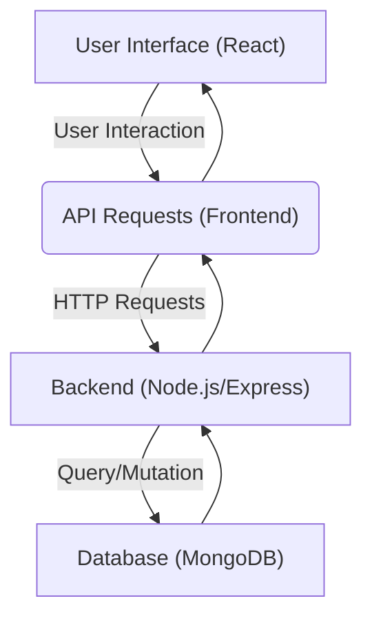
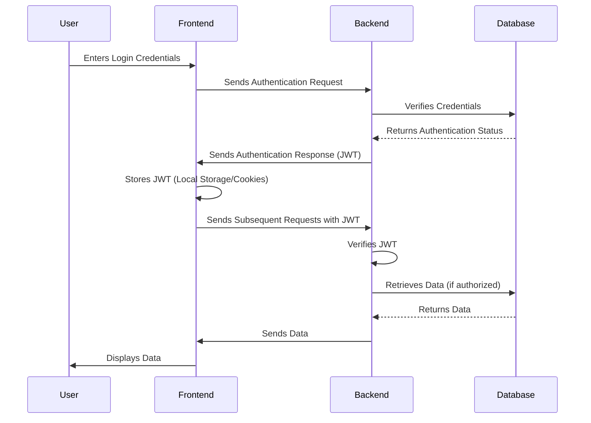

# Project Overview

PC Forge is a web application designed to simplify the process of building custom PCs. It provides users with detailed information about various PC components, including real-time pricing data aggregated from major Indian e-commerce platforms like Amazon and Flipkart. Users can create, customize, and save their ideal PC builds, making informed decisions based on up-to-date information.

## Key Features

*   **Component Database:** A comprehensive catalog of PC components with specifications and details.
*   **Price Aggregation:** Real-time pricing data from multiple e-commerce platforms, allowing users to compare prices and find the best deals.
*   **Build Customization:** Tools for users to select and configure components to create their ideal PC builds.
*   **Build Saving:** The ability to save customized builds for future reference and modification.

## Technology Stack

| Category    | Technology   | Purpose                                              |
| ----------- | ------------ | ---------------------------------------------------- |
| Frontend    | React        | User interface and interactive components             |
| Frontend    | Vite         | Frontend build tool                                  |
| Frontend    | Tailwind CSS | Styling and responsive design                        |
| Backend     | Node.js      | Server-side logic and API development                |
| Backend     | Express.js   | Web application framework for Node.js               |
| Backend     | MongoDB      | Database for storing component data and user builds |
| Backend     | Mongoose     | MongoDB object modeling tool                         |

## Backend Structure

The backend of PC Forge is built using Node.js and Express.js, providing a RESTful API for the frontend to interact with. Mongoose is used as an ORM to interact with the MongoDB database.

### Code Snippet: Express.js Route
```javascript
// backend/index.js
import express from 'express';
import cors from 'cors';

const app = express();
const port = process.env.PORT || 5000;

app.use(cors());
app.use(express.json());

app.get('/', (req, res) => {
  res.send('PC Forge Backend is Running');
});

app.listen(port, () => {
  console.log(`Server is running on port: ${port}`);
});

export default app;
```
This snippet demonstrates a basic Express.js route that handles a GET request to the root endpoint. It configures CORS and JSON body parsing. [View on GitHub](https://github.com/Ojasp21/pc_forge/blob/main/backend/index.js)

### Code Snippet: MongoDB Connection
```javascript
// backend/db/conn.js
import mongoose from "mongoose";
import dotenv from 'dotenv';
dotenv.config();

const Db = process.env.ATLAS_URI;
const connectToDatabase = async () => {
  try {
    await mongoose.connect(Db, {
      useNewUrlParser: true,
      useUnifiedTopology: true,
    });
    console.log("Successfully connected to MongoDB!");
  } catch (error) {
    console.error("Error connecting to MongoDB:", error);
  }
};

export default connectToDatabase;
```
This snippet shows how the backend connects to the MongoDB database using Mongoose. It utilizes environment variables for the connection URI. [View on GitHub](https://github.com/Ojasp21/pc_forge/blob/main/backend/db/conn.js)

## Frontend Structure

The frontend is built using React and Vite. Tailwind CSS is used for styling, providing a responsive and visually appealing user interface. Zustand is used for state management.

### Code Snippet: React Component
```jsx
// frontend/src/components/Navbar.jsx
import React from 'react';

function Navbar() {
  return (
    <nav className="bg-gray-800 p-4 text-white">
      <div className="container mx-auto">
        <a href="/" className="text-xl font-bold">PC Forge</a>
      </div>
    </nav>
  );
}

export default Navbar;
```
This is a simple React component for the navigation bar. It demonstrates basic JSX syntax and Tailwind CSS classes. [View on GitHub](https://github.com/Ojasp21/pc_forge/blob/main/frontend/src/components/Navbar.jsx)

### Code Snippet: Vite Configuration
```javascript
// frontend/vite.config.js
import { defineConfig } from 'vite'
import react from '@vitejs/plugin-react'

// https://vitejs.dev/config/
export default defineConfig({
  plugins: [react()],
})
```
This is the Vite configuration file, which specifies the React plugin to enable React support in the frontend. [View on GitHub](https://github.com/Ojasp21/pc_forge/blob/main/frontend/vite.config.js)

### Frontend State Management (Zustand)

```javascript
//frontend/src/store/store.js
import { create } from 'zustand';

const useStore = create((set) => ({
  components: [],
  setComponents: (newComponents) => set({ components: newComponents }),
}));

export default useStore;
```

This code snippet shows how Zustand is used for state management. It defines a store with a `components` array and a `setComponents` function to update the state. [View on GitHub](https://github.com/Ojasp21/pc_forge/blob/main/frontend/src/store/store.js)

## Data Flow Diagram





This diagram illustrates the flow of data within the PC Forge application. The user interacts with the React frontend, which sends API requests to the Node.js backend. The backend then interacts with the MongoDB database to retrieve or update data, and the response is sent back to the frontend for display.

## Key Integration Points

The key integration points in PC Forge are the interactions between the frontend and backend via API calls, and the database interactions within the backend. The frontend makes requests to specific backend endpoints to retrieve component data, submit build configurations, and manage user accounts. The backend handles these requests, interacts with the MongoDB database using Mongoose, and returns the appropriate responses to the frontend.

## Best Practices

*   **API Design:** Follow RESTful API design principles for clear and consistent communication between the frontend and backend.
*   **Data Validation:** Implement data validation on both the frontend and backend to ensure data integrity and prevent errors.
*   **Error Handling:** Implement comprehensive error handling throughout the application to gracefully handle unexpected situations.
*   **Security:** Secure API endpoints with authentication and authorization mechanisms to protect sensitive data and prevent unauthorized access.

## User Authentication Flow





This diagram details the user authentication flow. The user enters credentials, the frontend sends these to the backend for verification. Upon successful verification from the database, the backend sends a JWT to the frontend, which is then used for subsequent authenticated requests.

### Code Snippet: JWT Authentication Middleware
```javascript
// backend/middleware/auth.js
import jwt from 'jsonwebtoken';
import dotenv from 'dotenv';
dotenv.config();

const verifyToken = (req, res, next) => {
  const token = req.header('Authorization');

  if (!token) {
    return res.status(401).json({ message: 'No token, authorization denied' });
  }

  try {
    const decoded = jwt.verify(token, process.env.JWT_SECRET);
    req.user = decoded.user;
    next();
  } catch (err) {
    res.status(400).json({ message: 'Token is not valid' });
  }
};

export default verifyToken;
```
This snippet shows the middleware used to verify JWT tokens in the backend. It checks for the presence of a token in the request header and verifies its validity. [View on GitHub](https://github.com/Ojasp21/pc_forge/blob/main/backend/middleware/auth.js)
```