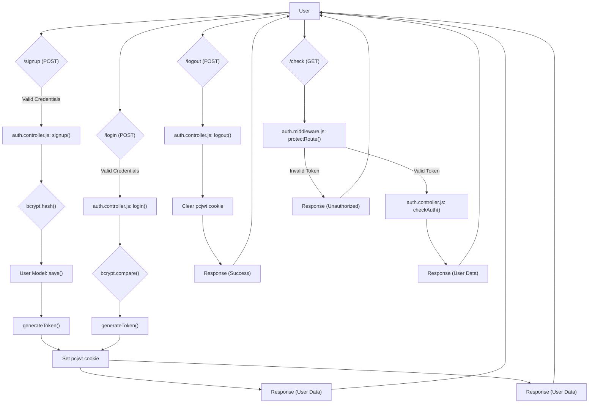

# Authentication and Authorization

This document details the authentication and authorization mechanisms implemented in the backend of the `pc_forge` application. It covers the signup, login, logout, and authentication check processes, along with the middleware used to protect routes.

## Authentication Flow

The application uses JSON Web Tokens (JWT) for authentication.  Upon successful signup or login, a JWT is generated and stored as an HTTP-only cookie in the user's browser. Subsequent requests to protected routes require this cookie to be present.  The backend verifies the token's validity before granting access.

### Key Features:

*   **JWT-based Authentication:** Uses JWTs for secure session management.
*   **Cookie-based Storage:** Stores JWTs in HTTP-only cookies to prevent client-side access and mitigate XSS attacks.
*   **bcrypt Password Hashing:**  Employs bcrypt for securely hashing user passwords.
*   **Route Protection:** Uses middleware to protect specific routes, requiring valid authentication.

## Core Components

The authentication system comprises the following key files:

*   `backend/controllers/auth.controller.js`:  Handles user signup, login, logout, and authentication checks.
*   `backend/middleware/auth.middleware.js`:  Implements the `protectRoute` middleware, which verifies JWTs.
*   `backend/routes/auth.route.js`: Defines the authentication-related routes.

## Signup Process

The `signup` function in `backend/controllers/auth.controller.js` handles user registration.

```javascript title="backend/controllers/auth.controller.js"
import User from "../models/User.js";
import bcrypt from "bcryptjs";
import jwt from "jsonwebtoken"

export const signup = async (req, res) => {
    const {fullName, email, password} = req.body;
    try {
        if(!fullName || !email || !password) {
            return res.status(400).json({message: "Please fill in all fields."});
        }
        if (password.length < 6) {
            return res.status(400).json({message: "Password must be at least 6 characters."});
        }
        const user = await User.findOne({email});
        if (user) return res.status(400).json({message: "Email already exists."});

        const salt = await bcrypt.genSalt(10);
        const hashedPassword = await bcrypt.hash(password, salt);
        
        const newUser = new User({
            fullName,
            email,
            password: hashedPassword,
        });
        if(newUser){
            //generate jwt token here
            generateToken(newUser._id, res);
            await newUser.save();

            res.status(201).json({
                _id: newUser._id,
                fullName: newUser.fullName,
                email: newUser.email,   
                profilePic: newUser.profilePic,
            });
        } else {
            res.status(400).json({message: "Invalid user data."});
        }
    } catch (error) {
        console.log("Error in signup controller", error.message)
        res.status(500).json({message: "Something went wrong."});
    }
};
```

[View on GitHub](https://github.com/Ojasp21/pc_forge/blob/main/backend/controllers/auth.controller.js)

This function performs the following steps:

1.  **Input Validation:**  Checks if all required fields (`fullName`, `email`, `password`) are provided.
2.  **Password Strength:** Verifies that the password length is at least 6 characters.
3.  **Email Existence Check:** Checks if a user with the provided email already exists.
4.  **Password Hashing:**  Generates a salt and hashes the password using bcrypt.
5.  **User Creation:** Creates a new `User` object with the hashed password.
6.  **Token Generation:** Generates a JWT using `generateToken` after successful user creation and saves the new User.
7.  **Response:** Sends a success response with the new user's data (excluding the password).

## Login Process

The `login` function in `backend/controllers/auth.controller.js` handles user authentication.

```javascript title="backend/controllers/auth.controller.js"
export const login = async (req, res) => {
    const {email, password} = req.body;
    try {
        const user = await User.findOne({email});

        if(!user) {
            return res.status(400).json({message: "Invalid credentials."});
        }

        const isPasswordCorrect = await bcrypt.compare(password, user.password);
        if(!isPasswordCorrect) {
            return res.status(400).json({message: "Invalid credentials."});
        }

        generateToken(user._id, res);
        res.status(200).json({
            _id: user._id,
            fullName: user.fullName,
            email: user.email,
            profilePic: user.profilePic,
        });
        console.log("authUser sent after login :", user)

    } catch (error) {
        console.log("Error in login controller", error.message);
        res.status(500).json({message: "Something went wrong."});
    }
};
```

[View on GitHub](https://github.com/Ojasp21/pc_forge/blob/main/backend/controllers/auth.controller.js)

This function performs the following steps:

1.  **User Retrieval:** Attempts to find a user with the provided email.
2.  **Credential Validation:**  If the user is found, it compares the provided password with the stored hashed password using bcrypt.
3.  **Token Generation:** If the credentials are valid, it generates a JWT using `generateToken`.
4.  **Response:** Sends a success response with the user's data (excluding the password).

## Logout Process

The `logout` function in `backend/controllers/auth.controller.js` handles user logout by clearing the `pcjwt` cookie.

```javascript title="backend/controllers/auth.controller.js"
export const logout = (req, res) => {
  try {
    res.clearCookie("pcjwt", {
      httpOnly: true,
      secure: true,
      sameSite: "none",
      path: "/", // important: must match the path used when setting the cookie
    });
    res.status(200).json({ message: "Logged out successfully." });
  } catch (error) {
    console.log("Error in logout controller:", error.message);
    res.status(500).json({ message: "Internal Server Error" });
  }
};
```

[View on GitHub](https://github.com/Ojasp21/pc_forge/blob/main/backend/controllers/auth.controller.js)

This function clears the `pcjwt` cookie, effectively logging the user out.  It's important to set the `path` attribute of the cookie options to match the path used when setting the cookie initially.

## JWT Generation

The `generateToken` function in `backend/controllers/auth.controller.js` is responsible for creating and setting the JWT as a cookie.

```javascript title="backend/controllers/auth.controller.js"
import jwt from "jsonwebtoken"

export const generateToken = (userId, res) => {

    const token = jwt.sign({userId}, process.env.JWT_SECRET, 
        {expiresIn: "7d"});

    res.cookie("pcjwt", token, {
        maxAge: 7 * 24 * 60 * 60 * 1000, 
        httpOnly: true,
        sameSite: "none",
        secure: process.env.NODE_ENV !== "development",
    });
    console.log("cookie generated: ", token)
    return token;
};
```

[View on GitHub](https://github.com/Ojasp21/pc_forge/blob/main/backend/controllers/auth.controller.js)

This function performs the following steps:

1.  **JWT Creation:** Creates a JWT using the `jsonwebtoken` library, embedding the `userId` and setting an expiration time of 7 days.  The `JWT_SECRET` environment variable is used to sign the token.
2.  **Cookie Setting:** Sets the JWT as an HTTP-only cookie named `pcjwt` with the following attributes:
    *   `maxAge`:  Expiration time of 7 days.
    *   `httpOnly`:  Prevents client-side JavaScript from accessing the cookie.
    *   `sameSite`:  Set to `"none"` to allow cross-site requests (requires `secure: true`).
    *   `secure`:  Set to `true` in non-development environments to ensure the cookie is only sent over HTTPS.

## Route Protection Middleware

The `protectRoute` middleware in `backend/middleware/auth.middleware.js` is used to protect routes by verifying the JWT.

```javascript title="backend/middleware/auth.middleware.js"
import jwt from "jsonwebtoken"
import User from "../models/User.js";

export const protectRoute = async (req, res, next) => {
    try {
        const token = req.cookies.pcjwt;
        if(!token){
            return res.status(401).json({message: "Unauthorized - No Token Provided"});
        }

        const decoded = jwt.verify(token, process.env.JWT_SECRET)

        if(!decoded) {
            return res.status(401).json({message: "Unauthorized - Invalid Token"});
        }
        const user = await User.findById(decoded.userId).select("-password");

        if(!user) {
            return res.status(404).json({message: "User not found"});
        }
        req.user = user;

        next();
    } catch (error) {
        console.log("Error in protectRoute middleware", error.message);
        return res.status(500).json({message: "Internal Server Error"});

    }

};
```

[View on GitHub](https://github.com/Ojasp21/pc_forge/blob/main/backend/middleware/auth.middleware.js)

This middleware performs the following steps:

1.  **Token Retrieval:** Retrieves the JWT from the `pcjwt` cookie.
2.  **Token Existence Check:** Checks if a token is present in the cookie.
3.  **Token Verification:** Verifies the token's validity using the `JWT_SECRET` environment variable.
4.  **User Retrieval:**  If the token is valid, it extracts the `userId` from the decoded token and retrieves the corresponding user from the database.
5.  **User Existence Check:** Checks if the user exists.
6.  **Request Augmentation:**  Adds the user object to the request (`req.user`) for use in subsequent route handlers.
7.  **Next Middleware:** Calls the `next()` function to proceed to the next middleware or route handler.

## Authentication Check

The `checkAuth` function in `backend/controllers/auth.controller.js` simply returns the authenticated user.

```javascript title="backend/controllers/auth.controller.js"
export const checkAuth = (req, res) => {
    try {
        res.status(200).json(req.user);
    } catch (error) {
        console.log("Error in checkAuth controller", error.message);
        res.status(500).json({message: "Internal Server Error"});
    }
};
```

[View on GitHub](https://github.com/Ojasp21/pc_forge/blob/main/backend/controllers/auth.controller.js)

This function relies on the `protectRoute` middleware to have already authenticated the user and attached the user object to the request.

## Route Definitions

The `backend/routes/auth.route.js` file defines the authentication-related routes.

```javascript title="backend/routes/auth.route.js"
import express from "express"

import { login, logout, signup , checkAuth } from  "../controllers/auth.controller.js"
import { protectRoute } from "../middleware/auth.middleware.js"
const router = express.Router();

router.post("/signup", signup);

router.post("/login", login);

router.post("/logout", logout);

router.get("/check", protectRoute, checkAuth)

export default router;
```

[View on GitHub](https://github.com/Ojasp21/pc_forge/blob/main/backend/routes/auth.route.js)

It imports the controller functions and the `protectRoute` middleware and defines the following routes:

*   `POST /signup`:  Registers a new user.
*   `POST /login`:  Authenticates an existing user.
*   `POST /logout`:  Logs out the current user.
*   `GET /check`:  Checks if the user is authenticated (protected by `protectRoute` middleware).

## Authentication Flow Diagram





## Cookie Configuration

```plaintext title=".env"
JWT_SECRET=Your_Secret_Key_Here
NODE_ENV=production
```

It is crucial to set the `JWT_SECRET` environment variable to a strong, randomly generated string in a production environment.  The `NODE_ENV` variable should be set to `"production"` to enable secure cookie settings.

## Key Integration Points

*   The `protectRoute` middleware is applied to any route that requires authentication. This middleware verifies the JWT and attaches the authenticated user to the request object.
*   The `generateToken` function is called after successful signup or login to generate a JWT and set it as an HTTP-only cookie.
*   The `logout` function clears the JWT cookie, effectively logging the user out.

## Best Practices

*   **Use a strong, randomly generated `JWT_SECRET`:**  This is essential for the security of your JWTs.
*   **Store JWTs in HTTP-only cookies:**  This helps prevent client-side JavaScript from accessing the tokens, mitigating XSS attacks.
*   **Use HTTPS in production:**  This ensures that the JWT cookie is only transmitted over a secure connection.
*   **Implement proper error handling:**  Provide informative error messages to the client while avoiding exposing sensitive information.
*   **Regularly audit your authentication and authorization mechanisms:**  This helps identify and address potential security vulnerabilities.
```