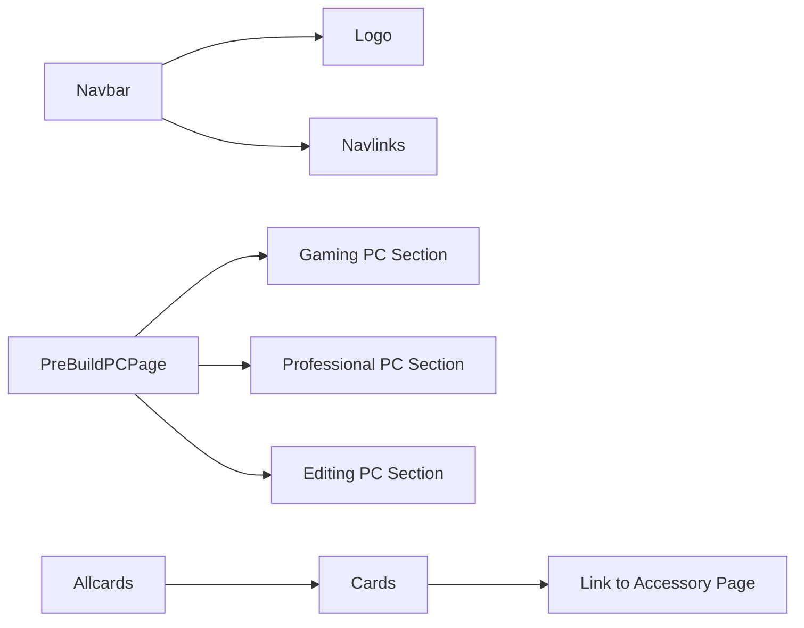

# Component Architecture

This document outlines the component architecture of the frontend application for pc_forge, focusing on the primary components and their relationships. Understanding this architecture is crucial for developers contributing to the project. We'll explore key components like the Navbar, PreBuildPCPage, and the Allcards component, detailing their responsibilities and integration points.

## Core Components

The frontend is built using React and utilizes a component-based architecture. Here's a breakdown of the key components:

*   **Navbar:** Provides navigation links and the application logo.
*   **PreBuildPCPage:** Displays pre-built PC configurations for different use cases (Gaming, Professional, Editing).
*   **Allcards:** Dynamically renders accessory categories as clickable cards.

## Navbar Component

The `Navbar` component, located in `frontend/src/components/Navbar/Navbar.jsx`, is responsible for displaying the navigation bar at the top of the application. It includes the application logo and navigation links.

```javascript
// File: frontend/src/components/Navbar/Navbar.jsx
import Navlinks from "./Navlinks";
import Logo from "./Logo";
import './Navbar.css';
import {motion, useScroll} from "motion/react"

export default function Navbar() {
  const { scrollYProgress } = useScroll();
  return (
    <>
    
      <nav className="navbar font-honk ">
        <Logo />
        <Navlinks />
      </nav>
      <motion.div
    style={{ scaleX: scrollYProgress }}
    className="bg-blue-900 z-50 origin-left w-full h-2 fixed top-0 left-0 transform progress"
  ></motion.div>
      </>
    
  );
}
```

This snippet shows the basic structure of the Navbar.  It imports `Logo` and `Navlinks` components.  The `motion.div` component implements a progress bar that tracks the user's scroll position, adding a dynamic visual element to the page.  [View on GitHub](https://github.com/Ojasp21/pc_forge/blob/main/frontend/src/components/Navbar/Navbar.jsx)

## PreBuildPCPage Component

The `PreBuildPCPage` component, found in `frontend/src/components/PreBuildPCPage.jsx`, presents different pre-built PC configurations to the user. It showcases configurations tailored for Gaming, Professional, and Editing purposes.

```javascript
// File: frontend/src/components/PreBuildPCPage.jsx
import React from "react";
import { motion, useScroll, useTransform } from "framer-motion";
import "./PreBuildPCPage.css";

const PrebuildPCPage = () => {
  const { scrollYProgress } = useScroll();
  const opacity = useTransform(scrollYProgress, [0, 0.5, 1], [0.4, 1, 0.4]); // Fade in on scroll

  return (
    <div className="container">
      {/* Gaming PC Section */}
      <motion.div className="pc-section" style={{ opacity }}>
        <h2>Gaming PC</h2>
        
        <div className="intro">
          <p>
            The ultimate gaming experience awaits! Designed for seamless performance in modern AAA titles and esports games, this PC delivers immersive visuals and blazing-fast responsiveness.
          </p>
          <p><strong>Uses:</strong> Competitive gaming, live streaming, and virtual reality (VR) experiences.</p>
          <p><strong>Abilities:</strong> Handles resource-intensive games, ultra settings, and multi-monitor setups with ease.</p>
        </div>
        <a href="/gaming">
          <button>Explore Gaming PC<i className="arrow-icon">➔</i></button>
        </a>
      </motion.div>

      {/* Professional PC Section */}
      <motion.div className="pc-section" style={{ opacity }}>
        <h2>Professional PC</h2>
        
        <div className="intro">
          <p>
            Power and efficiency combine in this PC, crafted for professionals who demand reliability for high-performance workflows.
          </p>
          <p><strong>Uses:</strong> Software development, data analysis, and engineering simulations.</p>
          <p><strong>Abilities:</strong> Multitasks effortlessly, supports virtual environments, and accelerates computation-heavy tasks.</p>
        </div>
        <a href="/professional">
          <button>Explore Professional PC<i className="arrow-icon">➔</i></button>
        </a>
      </motion.div>

      {/* Editing PC Section */}
      <motion.div className="pc-section" style={{ opacity }}>
        <h2>Editing PC</h2>
        
        <div className="intro">
          <p>
            Unleash your creativity with a PC tailored for photo and video editing, 3D rendering, and content creation.
          </p>
          <p><strong>Uses:</strong> Professional video editing, 3D modeling, and digital art creation.</p>
          <p><strong>Abilities:</strong> Renders projects quickly, manages large media files, and ensures smooth creative workflows.</p>
        </div>
        <a href="/editing">
          <button>Explore Editing PC <i className="arrow-icon">➔</i></button>
        </a>
      </motion.div>
    </div>
  );
};

export default PrebuildPCPage;
```

This component uses `framer-motion` for scroll-based animations.  The `useScroll` hook tracks the scroll progress, and `useTransform` maps that progress to the opacity of each PC section, creating a fade-in/out effect as the user scrolls. [View on GitHub](https://github.com/Ojasp21/pc_forge/blob/main/frontend/src/components/PreBuildPCPage.jsx)

## Allcards Component

The `Allcards` component, located in `frontend/src/accessories/Allcards.jsx`, dynamically fetches and displays accessory categories. Each category is rendered as a card, linking to a dedicated page for that accessory type.

```javascript
// File: frontend/src/accessories/Allcards.jsx
import { Link } from "react-router-dom";
import { useEffect, useState } from "react";
import axiosInstance from "../axiosInstance.js";
import Cards from "./cards";
import "./Allcards.css";

export default function Allcards() {
  const [categories, setCategories] = useState([]);

  useEffect(() => {
    const fetchCategories = async () => {
      try {
        const response = await axiosInstance.get("/parts/accessories/categories");
        setCategories(response.data);
      } catch (error) {
        console.error("Error fetching accessory categories:", error);
      }
    };

    fetchCategories();
  }, []);

  return (
    <div className="cards-container">
      {categories.map((category) => (
        <Link
          to={`/accessories/${category.replace(/&/g, "and").replace(/\s+/g, "-")}`}
          key={category}
          className="card-link"
        >
          <Cards title={category} />
        </Link>
      ))}
    </div>
  );
}
```

This component utilizes `useEffect` to fetch category data from the `/parts/accessories/categories` endpoint using `axiosInstance`.  The fetched data is then used to render a series of `Cards` components, each wrapped in a `Link` that navigates to the appropriate accessory page.  The category name is sanitized to create a URL-friendly slug. [View on GitHub](https://github.com/Ojasp21/pc_forge/blob/main/frontend/src/accessories/Allcards.jsx)

```css
/* File: frontend/src/accessories/Allcards.css */
.cards-container {
  display: flex;
  flex-wrap: wrap;
  justify-content: center;
  gap: 20px;
  padding: 20px;
}

.card-link {
  text-decoration: none;
  color: inherit;
}

```

This CSS styles the container that holds the cards, ensuring they wrap to the next line on smaller screens and are centered. It also removes the default text decoration from the links, inheriting the color from the parent. [View on GitHub](https://github.com/Ojasp21/pc_forge/blob/main/frontend/src/accessories/Allcards.jsx)

```javascript
// File: frontend/src/axiosInstance.js
import axios from 'axios';

const axiosInstance = axios.create({
  baseURL: 'http://localhost:8000/api/', // Replace with your API base URL
  timeout: 5000, // Optional: Set a timeout for requests (in milliseconds)
  headers: {
    'Content-Type': 'application/json',
    'Accept': 'application/json',
  },
});

export default axiosInstance;
```

This `axiosInstance.js` file centralizes the configuration of the Axios HTTP client.  It sets the base URL for all API requests, a timeout, and default headers for content type and accepted response types.  Using an instance simplifies making API calls throughout the frontend application. [View on GitHub](https://github.com/Ojasp21/pc_forge/blob/main/frontend/src/axiosInstance.js)

## Component Relationships

The following diagram illustrates the relationships between the key components:





This diagram provides a visual representation of how the components are structured and connected within the application. For instance, the Navbar utilizes the Logo and Navlinks components, while the Allcards component renders individual Cards, each linking to a specific accessory page.

## Key Integration Points

*   **API Communication:** The `Allcards` component demonstrates the integration with the backend API to fetch data.  Ensure the `axiosInstance` is correctly configured to point to the appropriate API endpoint.
*   **Routing:** The `react-router-dom` library is used to handle navigation between different pages. The `Link` component in `Allcards` is a prime example of this.
*   **State Management:** React's `useState` hook is used to manage the state of the `categories` in the `Allcards` component.  Consider using a more robust state management solution like Redux or Context API for larger applications.
*   **Animation:** The `framer-motion` library is used in `PreBuildPCPage` for scroll-based animations.  Ensure proper configuration and optimization for performance.

## Best Practices

*   **Component Reusability:** Design components to be reusable across different parts of the application.
*   **Separation of Concerns:** Keep components focused on specific tasks to improve maintainability.
*   **Code Style Consistency:** Follow a consistent code style guide to ensure readability and collaboration.
*   **Error Handling:** Implement proper error handling mechanisms, especially when fetching data from the API.
```