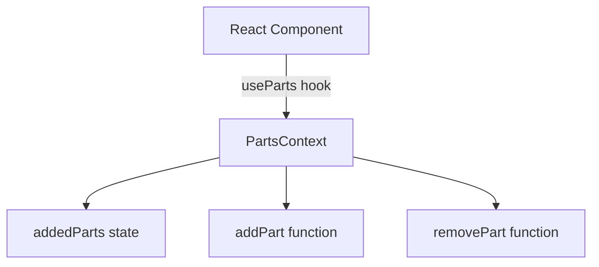
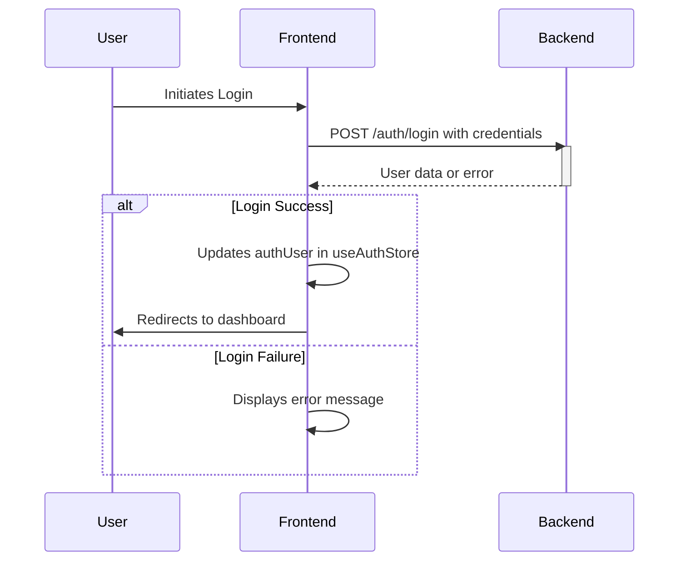
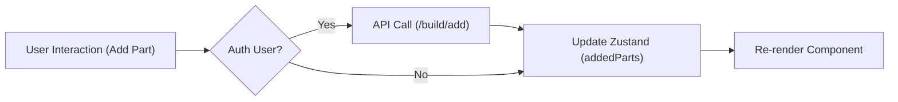

# State Management

This document describes the state management solutions utilized in the frontend of the `pc_forge` application.  We employ a combination of React Context and Zustand to manage application state effectively.  React Context is used for managing parts added to the build locally, while Zustand is used for managing user authentication and build data persisted on the backend.

## Overview

The frontend state management is handled using:

*   **React Context API:** For managing local state, specifically the list of parts added to a build. This allows components to access and update the added parts easily.
*   **Zustand:** A small, fast, and scalable bearbones state-management solution.  It's used here for authentication and build data, as these states are persisted across sessions and need to be shared globally.

## React Context: `PartsContext.jsx`

The `PartsContext` provides a simple way to manage the parts added to the current build within the frontend.  It stores the list of added parts and provides functions to add and remove parts from the list.

```javascript title="frontend/src/context/PartsContext.jsx"
import { createContext, useContext, useState } from 'react';

const PartsContext = createContext();

export const useParts = () => useContext(PartsContext);

export const PartsProvider = ({ children }) => {
  const [addedParts, setAddedParts] = useState([]);

  const addPart = (part) => {
    if (!addedParts.find((p) => p._id === part._id)) {
      setAddedParts((prev) => [...prev, part]);
    }
  };

  const removePart = (partId) => {
    setAddedParts((prev) => prev.filter((p) => p._id !== partId));
  };

  return (
    <PartsContext.Provider value={{ addedParts, addPart, removePart }}>
      {children}
    </PartsContext.Provider>
  );
};
```

[View on GitHub](https://github.com/Ojasp21/pc_forge/blob/main/frontend/src/context/PartsContext.jsx)

This snippet demonstrates the basic structure of a React Context.

*   `createContext()` creates a new context.
*   `useContext()` is a hook that allows functional components to subscribe to context changes.
*   `PartsProvider` is a component that provides the context value to its children.  It manages the `addedParts` state using `useState` and provides `addPart` and `removePart` functions to update the state.

### Usage

Components that need to access or update the added parts can use the `useParts` hook:

```javascript
import { useParts } from './PartsContext';

function MyComponent() {
  const { addedParts, addPart, removePart } = useParts();

  // ...
}
```





## Zustand Store: `useAuthStore.js`

The `useAuthStore` Zustand store is responsible for managing the authentication state of the user. It includes the user's authentication data, signup, login, logout and auth checking functionalities.

```javascript title="frontend/src/store/useAuthStore.js"
import { create } from "zustand"
import axiosInstance from "../axiosInstance";

import toast from "react-hot-toast";

export const useAuthStore = create((set)=>({
    authUser: null,
    isSigningUp: false,
    isLoggingIn: false,
    isCheckingAuth: true,

    checkAuth: async () => {
        try { 
            const res = await axiosInstance.get('/auth/check', {withCredentials: true,});

            set({authUser: res.data});

        } catch(error) {
            set({authUser: null});
            console.log("Error in checkAuth: ",error);
        } finally {
            set({isCheckingAuth: false});
        }
    },

    signup: async (data)  => {
        set({isSigningUp: true});
        try {
            const res = await axiosInstance.post("/auth/signup", data);
            set({authUser: res.data});
            toast.success("Account created successfully");

        } catch (error) {
            toast.error(error.response.data.message);
        }
        finally {
            set({isSigningUp: false});
        }
    },

    logout: async () => {
        try {
            axiosInstance.post("/auth/logout");
            set({authUser: null});
            toast.success("Logged out successfully");

        } catch (error) {
            toast.error(error.response.data.message);
        }
    },

    login : async (data) => {
        set({isLoggingIn: true});
        try {
            const res = await axiosInstance.post("/auth/login", data);
            set({authUser: res.data});
            toast.success("Logged in successfully");
        } catch (error) {
            toast.error(error.response.data.message);
        } finally{
            set({isLoggingIn: false});
        }
    }
}))
```

[View on GitHub](https://github.com/Ojasp21/pc_forge/blob/main/frontend/src/store/useAuthStore.js)

This code defines a Zustand store with the following features:

*   `authUser`: Stores the authenticated user object.
*   `isSigningUp`, `isLoggingIn`, `isCheckingAuth`: Boolean flags to indicate the state of authentication processes.
*   `checkAuth`:  Fetches the user's authentication status from the backend.
*   `signup`:  Registers a new user.
*   `logout`:  Logs out the current user.
*   `login`:  Logs in an existing user.

### Usage

```javascript
import { useAuthStore } from './useAuthStore';

function MyComponent() {
  const { authUser, login, logout } = useAuthStore();

  // ...
}
```

### Authentication Flow





## Zustand Store: `useBuildStore.js`

The `useBuildStore` Zustand store is responsible for managing the computer build state, including the added parts. It interacts with the backend to persist the build data for authenticated users.

```javascript title="frontend/src/store/useBuildStore.js"
import { create } from "zustand";
import axiosInstance from "../axiosInstance";
import toast from "react-hot-toast";
import { useAuthStore } from "./useAuthStore.js"

const useBuildStore = create((set, get) => ({
  addedParts: [],
  isLoading: false,
  error: null,

  fetchBuild: async () => {
    const authUser = useAuthStore.getState().authUser;
    if (!authUser) return;

    set({ isLoading: true, error: null });
    try {
      const response = await axiosInstance.get("/build");
      // Set addedParts from the populated parts array
      set({ 
        addedParts: response.data?.parts || [],
        isLoading: false 
      });
    } catch (error) {
      console.error("Error fetching build:", error);
      set({ 
        error: "Failed to fetch build",
        isLoading: false 
      });
      toast.error("Failed to fetch your build");
    }
  },

  addPart: async (part) => {
    const { addedParts } = get();
    const authUser = useAuthStore.getState().authUser;

    // Check if another part from the same category exists
    if (addedParts.some((p) => p.category === part.category)) {
      toast.error(`Only one ${part.category} per build is allowed`);
      return;
    }

    if (authUser) {
      try {
        const response = await axiosInstance.post("/build/add", { partId: part._id });
        // Update state with the populated response from backend
        set({ addedParts: response.data.parts });
        toast.success(`Added ${part.title} to your build`);
      } catch (error) {
        console.error("Error adding part:", error);
        toast.error(error.response?.data?.message || "Failed to add part");
        return;
      }
    } else {
      // For non-authenticated users, just update local state
      set((state) => ({ addedParts: [...state.addedParts, part] }));
      toast.success(`Added ${part.title} to your build`);
    }
  },

  removePart: async (partId) => {
    const authUser = useAuthStore.getState().authUser;
    const { addedParts } = get();
    
    // Find the part title for the toast message
    const removedPart = addedParts.find(part => part._id === partId);

    if (authUser) {
      try {
        const response = await axiosInstance.post("/build/remove", { partId });
        // Update state with the populated response from backend
        set({ addedParts: response.data.parts });
        toast.success(`Removed ${removedPart?.title || 'part'} from your build`);
      } catch (error) {
        console.error("Error removing part:", error);
        toast.error("Failed to remove part");
        return;
      }
    } else {
      // For non-authenticated users, just update local state
      set((state) => ({
        addedParts: state.addedParts.filter((part) => part._id !== partId)
      }));
      toast.success(`Removed ${removedPart?.title || 'part'} from your build`);
    }
  },

  resetBuild: async () => {
    const authUser = useAuthStore.getState().authUser;

    if (authUser) {
      try {
        await axiosInstance.delete("/build/reset");
        set({ addedParts: [] });
        toast.success("Build reset successfully");
      } catch (error) {
        console.error("Error resetting build:", error);
        toast.error("Failed to reset build");
        return;
      }
    } else {
      set({ addedParts: [] });
      toast.success("Build reset successfully");
    }
  },

  // Helper method to check if a category is already in the build
  hasCategoryInBuild: (category) => {
    const { addedParts } = get();
    return addedParts.some((part) => part.category === category);
  }
}));

export default useBuildStore;
```

[View on GitHub](https://github.com/Ojasp21/pc_forge/blob/main/frontend/src/store/useBuildStore.js)

Key functionalities of `useBuildStore` are:

*   `addedParts`: Stores the list of parts added to the build.
*   `isLoading`:  Indicates if the build data is being fetched.
*   `error`: Stores any error that occurred during data fetching.
*   `fetchBuild`: Fetches the build data from the backend for authenticated users.
*   `addPart`: Adds a part to the build, persisting it to the backend if the user is authenticated and updating the local state. It also checks for category duplication.
*   `removePart`: Removes a part from the build, persisting the change to the backend if the user is authenticated and updating the local state.
*   `resetBuild`: Resets the build, clearing the added parts and persisting the change to the backend if the user is authenticated.
    *   `hasCategoryInBuild`: A helper function which returns a boolean signifying if the category is present or not.

### Adding a Part

```javascript
 addPart: async (part) => {
    const { addedParts } = get();
    const authUser = useAuthStore.getState().authUser;

    // Check if another part from the same category exists
    if (addedParts.some((p) => p.category === part.category)) {
      toast.error(`Only one ${part.category} per build is allowed`);
      return;
    }

    if (authUser) {
      try {
        const response = await axiosInstance.post("/build/add", { partId: part._id });
        // Update state with the populated response from backend
        set({ addedParts: response.data.parts });
        toast.success(`Added ${part.title} to your build`);
      } catch (error) {
        console.error("Error adding part:", error);
        toast.error(error.response?.data?.message || "Failed to add part");
        return;
      }
    } else {
      // For non-authenticated users, just update local state
      set((state) => ({ addedParts: [...state.addedParts, part] }));
      toast.success(`Added ${part.title} to your build`);
    }
  },
```

This function showcases the conditional logic for handling state updates based on user authentication.  If the user is authenticated, the part is added via an API call. If not, the state is updated locally. It also checks for existing items in the same category, implementing a "one part per category" rule.

### Usage

```javascript
import useBuildStore from './useBuildStore';

function MyComponent() {
  const { addedParts, addPart, removePart, fetchBuild } = useBuildStore();

  // ...
}
```

### Build Process





## Key Integration Points

*   **Authentication and Data Persistence:** `useAuthStore` manages user authentication.  `useBuildStore` utilizes the authentication status from `useAuthStore` to determine whether to persist build data to the backend.
*   **Category Constraints:** The `useBuildStore` enforces a constraint of one part per category within a build, enhancing build consistency.
*   **Local vs. Remote State Management:** React Context provides a lightweight solution for local state, while Zustand manages global state and data persistence, offering a balance between performance and data consistency.
*   **Error Handling:** Both stores implement error handling using `try...catch` blocks and display user-friendly error messages using `react-hot-toast`.

## Best Practices

*   **Separation of Concerns:** Keeping authentication and build data in separate stores improves code organization and maintainability.
*   **Centralized State Management:** Using Zustand for global state simplifies data sharing between components and reduces the need for prop drilling.
*   **Optimistic Updates:**  Consider implementing optimistic updates to improve the user experience by immediately updating the UI and then reverting the changes if the backend request fails. (Currently the state is updated with data returned by the backend for authenticated users).
*   **Asynchronous Actions:**  Wrap asynchronous actions (API calls) in `try...catch` blocks to handle errors gracefully.
```