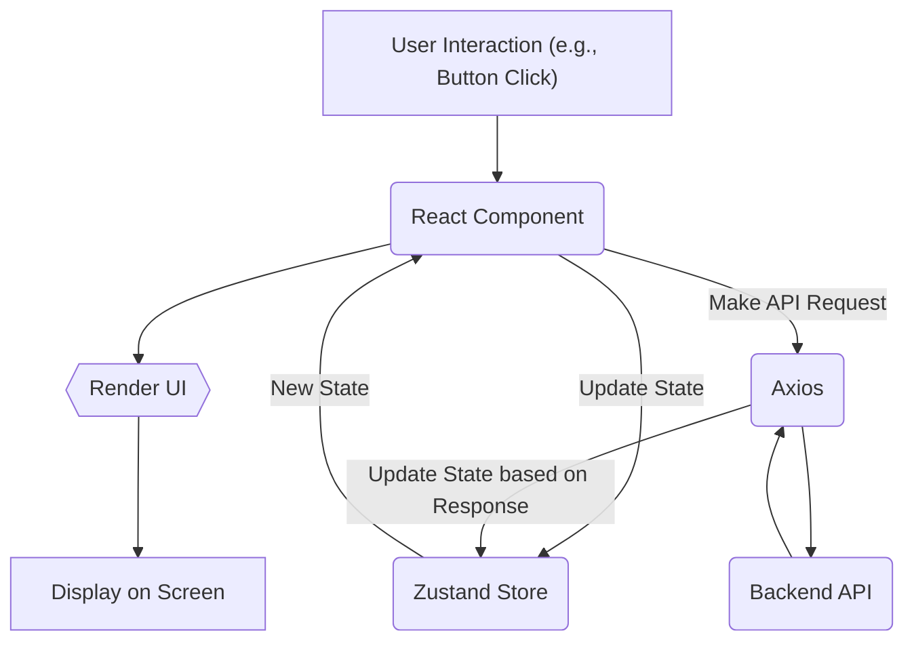
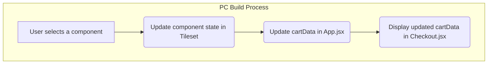

# Frontend Implementation

This section details the frontend implementation of the PC Forge application. It covers the technologies, structure, and key components that drive the user interface and overall user experience. The frontend is built using React, a popular JavaScript library for building user interfaces, along with other supporting libraries to enhance functionality and aesthetics.

## Technologies and Libraries

The frontend leverages a modern JavaScript stack, incorporating the following key technologies:

*   **React:** The core UI library, providing a component-based architecture for building reusable UI elements.
*   **React Router DOM:** Used for handling navigation and routing within the application.
*   **Vite:** A build tool that offers fast development and optimized production builds.
*   **Tailwind CSS:** A utility-first CSS framework for styling the application.
*   **Axios:** A promise-based HTTP client for making API requests to the backend.
*   **Zustand:** A small, fast, and scalable bearbones state-management solution.
*   **Framer Motion:** A motion library for creating smooth and engaging animations.

## Project Structure

The frontend project is structured as follows:

*   `frontend/`: The root directory for the frontend application.
    *   `src/`: Contains the source code for the application.
        *   `App.jsx`: The main application component.
        *   `components/`: Reusable UI components.
        *   `pages/`: Contains individual pages of the application.
        *   `context/`: React Context providers for managing global state.
        *   `store/`: Zustand stores for state management.
        *   `accessories/`: Components and pages related to accessories.
    *   `index.html`: The main HTML file for the application.
    *   `package.json`: Contains project dependencies and scripts.
    *   `vite.config.js`: Vite configuration file.

## Key Components

### `App.jsx`

This is the root component of the application. It sets up routing, authentication, and global state management.

```javascript
import { React,useState } from "react";
import { BrowserRouter, Routes, Route, Navigate } from "react-router-dom";
import { PartsProvider } from "./context/PartsContext";
import Navbar from "./components/Navbar/Navbar";
import Home from "./pages/Home.jsx";
import Tileset from "./components/Tileset/tileset.jsx";
import TilePage from "./components/Tileset/TilePage.jsx";
import PrebuildPCPage from "./components/PreBuildPCPage";
import GamingPC from "./components/GamingPC";
import ProfessionalPC from "./components/ProfessionalPC";
import EditingPC from "./components/EditingPC";
import GamingContainer1 from "./components/containers/GamingContainer1";
import GamingContainer2 from "./components/containers/GamingContainer2";
import ProfContainer1 from "./components/containers/ProfContainer1";
import ProfContainer2 from "./components/containers/ProfContainer2";
import EditingContainer1 from "./components/containers/EditingComtainer1";
import EditingContainer2 from "./components/containers/EditingContainer2";
import SignUpPage from "./pages/SignUpPage.jsx";
import { Toaster } from "react-hot-toast";
import LoginPage from "./pages/LoginPage.jsx";
import { useAuthStore } from "./store/useAuthStore.js";
import { useEffect } from "react";
import LangFlowAPIComponent from "./components/Langflow.jsx";
import useBuildStore from "./store/useBuildStore.js";
import AllCards from "./accessories/Allcards.jsx";
import ProductsPage from "./accessories/ProductPage.jsx";
import HomePageFooter from "./components/footer/HomePageFooter.jsx";
import FAQPage from "./components/FAQPage.jsx";
import Checkout from "./pages/Checkout.jsx";
import AboutUs from "./components/AboutUsPage.jsx";


function App() {
  const { authUser, checkAuth } = useAuthStore();
  const { fetchBuild } = useBuildStore();
  const [cartData, setCartData] = useState({ addedParts: [], removePart: () => {}, totalPrice: 0 });

  useEffect(() => {
    checkAuth();
  }, [checkAuth]);

  useEffect(() => {
    if (authUser) {
      fetchBuild();
    }
  }, [authUser]);

  return (
    <PartsProvider>
      <div className="flex flex-col min-h-screen"> {/* Full screen layout */}
        <BrowserRouter>
          <Toaster />
          <Navbar />        
          <div className="flex-grow mb-0 mt-[2.5rem] py-0"> {/* Push footer to bottom */}
            <Routes>
              <Route path="/signup" element={!authUser ? <SignUpPage /> : <Navigate to="/" />} />
              <Route path="/login" element={!authUser ? <LoginPage /> : <Navigate to="/" />} />
              <Route path="/" element={<Home />} />
              <Route path="/prebuildpc" element={<PrebuildPCPage />} />
              <Route path="/build" element={<Tileset setCartData={setCartData}/>} />
              <Route path="/build/:category" element={<TilePage />} />
              <Route path="/gaming" element={<GamingPC />} />
              <Route path="/professional" element={<ProfessionalPC />} />
              <Route path="/editing" element={<EditingPC />} />
              <Route path="/gaming-container1" element={<GamingContainer1 />} />
              <Route path="/gaming-container2" element={<GamingContainer2 />} />
              <Route path="/prof-container2" element={<ProfContainer2 />} />
              <Route path="/prof-container1" element={<ProfContainer1 />} />
              <Route path="/editing-container1" element={<EditingContainer1 />} />
              <Route path="/editing-container2" element={<EditingContainer2 />} />
              <Route path="/langflow" element={<LangFlowAPIComponent />} />
              <Route path="/accessories" element={<AllCards />} />
              <Route path="/accessories/:category" element={<ProductsPage />} />
              <Route path="/faqs" element={<FAQPage />} />
              <Route path="/checkout" element={<Checkout {...cartData} />} />
              <Route path="about-us" element={<AboutUs/>}/>
            </Routes>
          </div>
          <HomePageFooter />
        </BrowserRouter>
      </div>
    </PartsProvider>
  );
}

export default App;
```

[View on GitHub](https://github.com/Ojasp21/pc_forge/blob/main/frontend/src/App.jsx)

### `index.html`

The main HTML file that serves as the entry point for the application. It includes the root `div` element where the React application is mounted and links to external resources like Google Fonts.

```html
<!doctype html>
<html lang="en">
  <head>
    <meta charset="UTF-8" />
    <!-- <link rel="icon" type="image/svg+xml" href="/vite.svg" />
      -->
    <link 
  rel="icon" 
  type="image/svg+xml" 
  href="data:image/svg+xml,<svg xmlns=%22http://www.w3.org/2000/svg%22 viewBox=%220 0 100 100%22><text y=%22.9em%22 font-size=%2290%22>💻</text></svg>" 
/>
    <meta name="viewport" content="width=device-width, initial-scale=1.0" />
    <title>PC Forge</title>
    <link href="https://fonts.googleapis.com/icon?family=Material+Icons" rel="stylesheet">
  </head>
  <body>
    <div id="root"></div>
    <script type="module" src="/src/main.jsx"></script>
    <!-- <script src="/frontend/src/public/chatbot.js"></script> -->
    <!-- <script type="text/javascript">
      (function(d, t) {
          var v = d.createElement(t), s = d.getElementsByTagName(t)[0];
          v.onload = function() {
            window.voiceflow.chat.load({
              verify: { projectID: '6793ad8270f1b9c43e427e89' },
              url: 'https://general-runtime.voiceflow.com',
              versionID: 'production'
            });
          }
          v.src = "https://cdn.voiceflow.com/widget-next/bundle.mjs"; v.type = "text/javascript"; s.parentNode.insertBefore(v, s);
      })(document, 'script');
    </script> -->
  </body>
</html>
```

[View on GitHub](https://github.com/Ojasp21/pc_forge/blob/main/frontend/index.html)

### `vite.config.js`

Configuration file for Vite, the build tool. It specifies plugins and other build options.

```javascript
import { defineConfig } from 'vite'
import react from '@vitejs/plugin-react'

// https://vite.dev/config/
export default defineConfig({
  plugins: [react()],
})
```

[View on GitHub](https://github.com/Ojasp21/pc_forge/blob/main/frontend/vite.config.js)

### `Navbar` Component

This component provides navigation across the website. It includes links to different sections, such as Home, Prebuild PCs, Build Your Own PC, and user authentication links.

```javascript
// Example usage within Navbar component
import { Link } from 'react-router-dom';

function Navbar() {
  return (
    <nav>
      <ul>
        <li>
          <Link to="/">Home</Link>
        </li>
        <li>
          <Link to="/prebuildpc">Prebuild PCs</Link>
        </li>
        {/* More navigation links */}
      </ul>
    </nav>
  );
}

export default Navbar;
```

[View on GitHub](https://github.com/Ojasp21/pc_forge/blob/main/frontend/src/components/Navbar/Navbar.jsx)

### Zustand Stores

Zustand is used for state management. `useAuthStore.js` and `useBuildStore.js` manage authentication state and the PC build state, respectively.

```javascript
// Example from useAuthStore.js
import { create } from 'zustand';

const useAuthStore = create((set) => ({
  authUser: null,
  checkAuth: async () => {
    // Authentication check logic here
  },
  setUser: (user) => set({ authUser: user }),
}));

export default useAuthStore;
```

[View on GitHub](https://github.com/Ojasp21/pc_forge/blob/main/frontend/src/store/useAuthStore.js)

## Frontend Workflow

The application follows a standard React-based workflow:

1.  **Component Creation:** UI elements are built as reusable React components.
2.  **State Management:** Zustand stores are used to manage application state.
3.  **API Communication:** Axios is used to make API requests to the backend.
4.  **Routing:** React Router DOM handles navigation between different pages.
5.  **Styling:** Tailwind CSS provides a utility-first approach to styling.

## Mermaid Diagram

This diagram illustrates the basic flow of data and component interaction in the frontend.





## Key Integration Points

### Authentication Flow

The application uses Zustand to manage authentication state.  The `useAuthStore` store handles user login, signup, and logout. The `checkAuth` function verifies the user's authentication status on application load.

### PC Build Process

The PC build process involves selecting components from the `Tileset` and `TilePage` components.  The `PartsProvider` context provides access to available parts. When a user adds a part, the `cartData` state in `App.jsx` is updated, which then is passed to `Checkout.jsx` for displaying the items and total price.





### API Interactions

API requests are made using Axios.  For example, when fetching the PC build, `useBuildStore` uses Axios to make a GET request to the backend.

```javascript
// Example from useBuildStore.js
import { create } from 'zustand';
import axios from 'axios';

const useBuildStore = create((set) => ({
  build: {},
  fetchBuild: async () => {
    try {
      const response = await axios.get('/api/build'); // Replace with your actual API endpoint
      set({ build: response.data });
    } catch (error) {
      console.error("Error fetching build:", error);
    }
  },
}));

export default useBuildStore;
```

[View on GitHub](https://github.com/Ojasp21/pc_forge/blob/main/frontend/src/store/useBuildStore.js)

## Best Practices

*   **Component Reusability:** Design components to be reusable across the application.
*   **State Management:** Use Zustand stores to manage application state effectively.
*   **API Handling:** Handle API requests with Axios and manage errors gracefully.
*   **Routing:**  Use React Router DOM for navigation and routing.
*   **Styling:** Maintain a consistent style using Tailwind CSS utility classes.
*   **Authentication:** Secure user data and authentication tokens.

This documentation provides an overview of the frontend implementation of the PC Forge application. It outlines the technologies used, project structure, key components, and best practices for development.
```