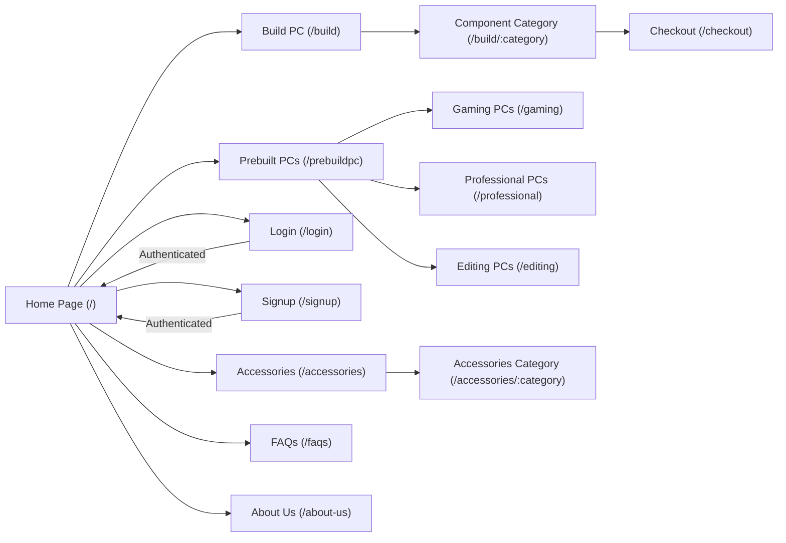
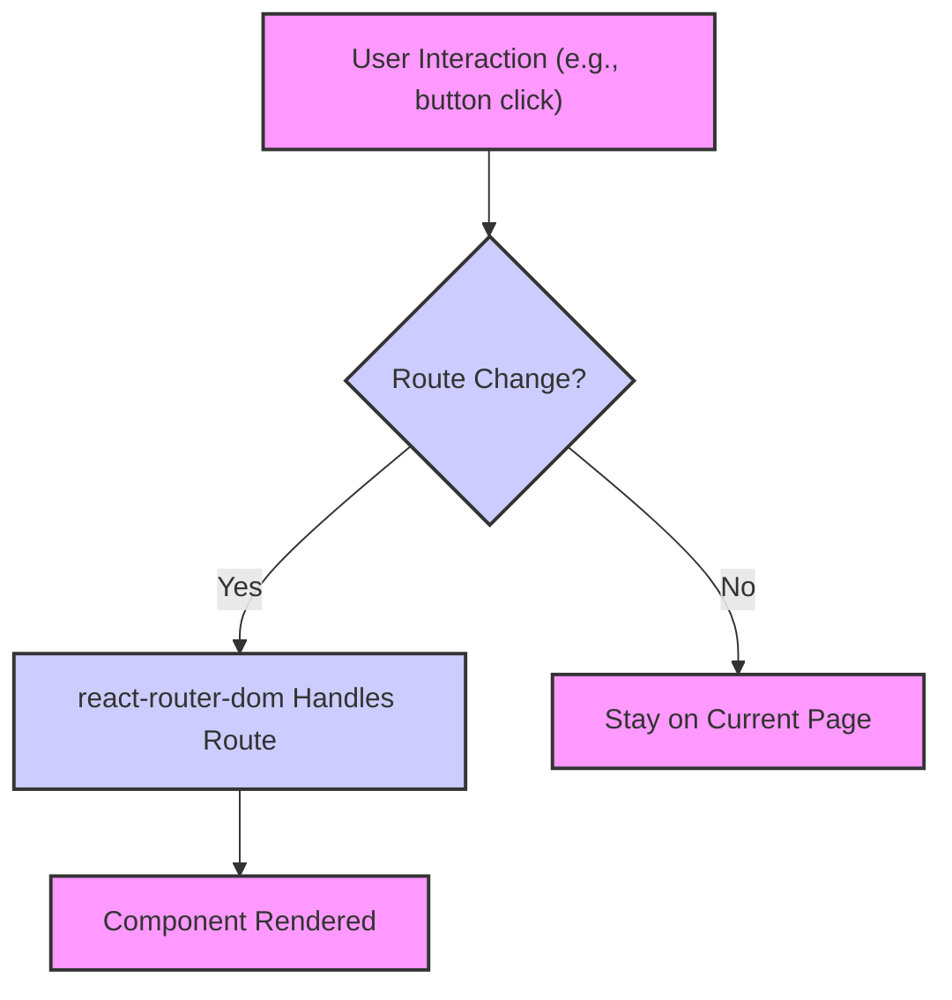

# Routing and Navigation

This document describes the routing implementation in the pc_forge application, explaining how users navigate between different sections and functionalities. The application leverages `react-router-dom` for client-side routing, providing a seamless user experience.

## Key Components

- **`App.jsx`**:  The main application component where the routing configuration is defined.
- **`Home.jsx`**: The home page component, serving as the entry point for users.
- **`LoginPage.jsx`**: Component for handling user login.

## Routing Implementation in `App.jsx`

The `App.jsx` file utilizes `BrowserRouter`, `Routes`, and `Route` components from `react-router-dom` to define the application's routing structure.

```javascript
// File: frontend/src/App.jsx
import { BrowserRouter, Routes, Route, Navigate } from "react-router-dom";
import Home from "./pages/Home.jsx";
import LoginPage from "./pages/LoginPage.jsx";
import SignUpPage from "./pages/SignUpPage.jsx";
import { useAuthStore } from "./store/useAuthStore.js";
import { useEffect } from "react";

function App() {
  const { authUser, checkAuth } = useAuthStore();

  useEffect(() => {
    checkAuth();
  }, [checkAuth]);

  return (
    <BrowserRouter>
      <Routes>
        <Route path="/signup" element={!authUser ? <SignUpPage /> : <Navigate to="/" />} />
        <Route path="/login" element={!authUser ? <LoginPage /> : <Navigate to="/" />} />
        <Route path="/" element={<Home />} />
        {/* Other routes... */}
      </Routes>
    </BrowserRouter>
  );
}

export default App;
```

[View on GitHub](https://github.com/Ojasp21/pc_forge/blob/main/frontend/src/App.jsx)

**Explanation:**

- `BrowserRouter` enables the use of HTML5 history API for managing navigation.
- `Routes` acts as a container for individual `Route` components.
- Each `Route` component defines a mapping between a specific path and the component to be rendered.
- The `Navigate` component is used for redirecting users based on authentication status.
- `useAuthStore` is a custom hook used to get the user's authentication status to show or hide login and signup page based on authentication status.

## Conditional Routing based on Authentication

The application implements conditional routing to restrict access to certain pages based on the user's authentication status. For example, the `/login` and `/signup` routes are only accessible to unauthenticated users.

```javascript
// File: frontend/src/App.jsx
<Route path="/signup" element={!authUser ? <SignUpPage /> : <Navigate to="/" />} />
<Route path="/login" element={!authUser ? <LoginPage /> : <Navigate to="/" />} />
```

**Explanation:**

- `!authUser ? <SignUpPage /> : <Navigate to="/" />` is a ternary operator that checks if the user is not authenticated (`!authUser`).
- If the user is not authenticated, the `SignUpPage` component is rendered.
- Otherwise, the user is redirected to the home page (`/`).
- The same logic applies to the `/login` route, ensuring that authenticated users cannot access the login page.

## Navigation from Home Page

The `Home.jsx` component provides links to other parts of the application, such as the PC building interface.

```javascript
// File: frontend/src/pages/Home.jsx
import React from "react";
import { Link } from "react-router-dom";
import BuildButton from "../components/Button/BuildButton";

const Home = () => {
  return (
    <div className="flex-col">
      {/* Hero Section */}
      <div className="w-full p-0 h-screen flex justify-center items-center relative">
        {/* Background Image */}
        <div className="m-0 h-full w-full bg-homepagebg inset-0 bg-cover bg-center bg-no-repeat brightness-50 "></div>
        <div className="absolute inset-0 bg-black opacity-45"></div>

        {/* Content Section */}
        <div className="absolute flex flex-col items-center space-y-8 px-4 text-center">
          {/* Text Content */}
          <TextContent />

          {/* Button */}
          <Link to="/build">
            <BuildButton />
          </Link>
        </div>
      </div>

      {/* Pre-built Section */}
      <div className="pre-builts w-full flex">
        <section id="prebuildpc">
        <PrebuildPCPage />
        </section>
      </div>
    </div>
  );
};

export default Home;
```

[View on GitHub](https://github.com/Ojasp21/pc_forge/blob/main/frontend/src/pages/Home.jsx)

**Explanation:**

- The `Link` component from `react-router-dom` is used to create a navigation link to the `/build` route.
- Clicking the `BuildButton` navigates the user to the PC building interface.

## Login Page Functionality

The `LoginPage.jsx` component handles user authentication.

```javascript
// File: frontend/src/pages/LoginPage.jsx
import { useState } from "react";
import { useAuthStore } from "../store/useAuthStore";
import toast from "react-hot-toast";
import { Link } from "react-router-dom";

const LoginPage = () => {
  const [formData, setFormData] = useState({
    email: "",
    password: "",
  });

  const { login, isLoggingIn } = useAuthStore();

  const handleSubmit = (e) => {
    e.preventDefault();
    login(formData);
  };

  return (
    <>
    
    <div className="min-h-screen flex justify-center items-center">
      <div className="bg-gray-300 shadow-lg rounded-lg px-8 py-6 w-full max-w-md bg-opacity-80">
        <h1 className="log text-2xl flex justify-center mb-4 text-gray-700 mt-3">Login</h1>

        <form onSubmit={handleSubmit} className="space-y-6">
          <div className="form-control">
            <label className="block text-gray-700 font-medium mb-2">Email</label>
            <input
              type="email"
              className="text-black font-medium w-full px-4 py-2 border border-gray-300 rounded-md focus:outline-none focus:ring-2 focus:ring-blue-500"
              placeholder="you@example.com"
              value={formData.email}
              onChange={(e) => setFormData({ ...formData, email: e.target.value })}
            />
          </div>

          <div className="form-control mb-6">
            <label className="block text-gray-700 font-medium mb-2">Password</label>
            <input
              type="password"
              className="text-black w-full px-4 py-2 border border-gray-300 rounded-md focus:outline-none focus:ring-2 focus:ring-blue-500"
              placeholder="••••••••"
              value={formData.password}
              onChange={(e) => setFormData({ ...formData, password: e.target.value })}
            />
          </div>

          <button
            type="submit"
            className="w-full bg-gradient-to-r from-blue-500 to-purple-500 hover:from-blue-600 hover:to-purple-600 text-white font-medium py-2 px-4 rounded-md focus:outline-none focus:ring-2 focus:ring-blue-500"
            disabled={isLoggingIn}
          >
            {isLoggingIn ? "Logging In..." : "Log In"}
          </button>
        </form>

        <div className="mt-4 text-gray-600 mb-3">
          <p className="">
            {"Don't have an account? "}
            <Link to="/signup" className="text-blue-500 hover:text-blue-600 font-semibold">
              Sign up
            </Link>
          </p>
        </div>
      </div>
    </div>
    </>
  );
};

export default LoginPage;
```

[View on GitHub](https://github.com/Ojasp21/pc_forge/blob/main/frontend/src/pages/LoginPage.jsx)

**Explanation:**

- The `useState` hook is used to manage the form data (email and password).
- The `useAuthStore` hook provides access to the `login` function, which handles the authentication logic.
- The `handleSubmit` function is called when the form is submitted, and it calls the `login` function with the form data.
- The `Link` component is used to provide a link to the signup page.

## Route Definitions

Here's a summary of the routes defined in `App.jsx`:

| Path                  | Component               | Description                                     |
| --------------------- | ----------------------- | ----------------------------------------------- |
| `/`                   | `Home`                  | The home page of the application.               |
| `/signup`              | `SignUpPage`            | The signup page, accessible to unauthenticated users. |
| `/login`               | `LoginPage`             | The login page, accessible to unauthenticated users.  |
| `/prebuildpc`          | `PrebuildPCPage`        | Page displaying pre-built PC configurations.   |
| `/build`               | `Tileset`               | The main PC building interface.                 |
| `/build/:category`     | `TilePage`              | Page for selecting components within a category. |
| `/gaming`              | `GamingPC`              | Page showcasing gaming PC builds.               |
| `/professional`        | `ProfessionalPC`        | Page showcasing professional PC builds.           |
| `/editing`             | `EditingPC`             | Page showcasing editing PC builds.                |
| `/gaming-container1`   | `GamingContainer1`      | Specific gaming container page.                 |
| `/gaming-container2`   | `GamingContainer2`      | Another gaming container page.                  |
| `/prof-container2`     | `ProfContainer2`        | Specific professional container page.           |
| `/prof-container1`     | `ProfContainer1`        | Another professional container page.            |
| `/editing-container1`  | `EditingContainer1`     | Specific editing container page.                |
| `/editing-container2`  | `EditingContainer2`     | Another editing container page.                 |
| `/langflow`            | `LangFlowAPIComponent`  | Page for LangFlow API component.                |
| `/accessories`         | `AllCards`              | Page displaying all accessories.                |
| `/accessories/:category`| `ProductsPage`          | Page displaying accessories by category.        |
| `/faqs`                | `FAQPage`               | Frequently Asked Questions page.                |
| `/checkout`            | `Checkout`              | Checkout page for completing orders.            |
| `/about-us`            | `AboutUs`               | About Us page.                                  |

## Navigation Flow





## Redirection

The application uses the `<Navigate>` component to redirect users based on conditions, such as authentication status.

```javascript
// Example: Redirecting authenticated users away from login/signup pages
<Route path="/signup" element={!authUser ? <SignUpPage /> : <Navigate to="/" />} />
```

## Key Integration Points

- **Authentication State:** The `useAuthStore` hook is crucial for managing the user's authentication state and controlling access to different routes.  It ensures that unauthenticated users are redirected to the login page, and authenticated users are redirected away from the login/signup pages.
- **Dynamic Routes:**  The application uses dynamic routes (e.g., `/build/:category`, `/accessories/:category`) to display content based on parameters passed in the URL. This allows for a flexible and scalable routing structure.

## Best Practices

- **Route Organization:**  Keep the route definitions in a central location (e.g., `App.jsx`) for easy management and maintainability.
- **Conditional Routing:** Use conditional routing to protect sensitive pages and improve the user experience.
- **Navigation Components:**  Use `Link` components for internal navigation to avoid full page reloads.
- **Error Handling:**  Implement error handling for invalid routes or unexpected errors during navigation.





```
```