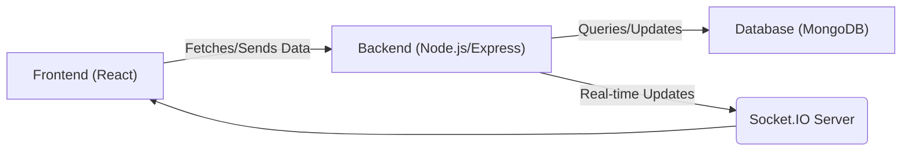
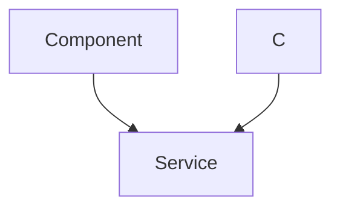

# Project Overview

Synverse is a full-stack web application designed to provide a real-time chat experience. It leverages modern web technologies like React, Node.js, Express, and MongoDB to deliver a responsive and interactive platform for users to connect and communicate. This document provides a high-level overview of the project, its architecture, and key components.

## Features

- **Real-time Messaging:** Enables instant communication between users.
- **User Authentication:** Securely manages user accounts and sessions.
- **Responsive Design:** Adapts to different screen sizes and devices.
- **Scalable Architecture:** Designed to handle a growing number of users and messages.

## Technology Stack

| Category    | Technology      | Purpose                                     |
|-------------|-----------------|---------------------------------------------|
| Frontend    | React           | User interface and client-side logic        |
| Backend     | Node.js, Express| Server-side logic and API endpoints         |
| Database    | MongoDB         | Data storage                                |
| Real-time   | Socket.IO       | Real-time communication                      |
| Authentication| JWT, bcryptjs   | User authentication and authorization      |

## Frontend

The frontend of Synverse is built using React, a popular JavaScript library for building user interfaces. It uses components to create a modular and reusable codebase.

```javascript
// Example: frontend/src/App.jsx
import React from 'react';
import { BrowserRouter as Router, Route, Routes } from 'react-router-dom';
import ChatPage from './pages/ChatPage';
import LoginPage from './pages/LoginPage';

function App() {
  return (
    <Router>
      <Routes>
        <Route path="/" element={<LoginPage />} />
        <Route path="/chat" element={<ChatPage />} />
      </Routes>
    </Router>
  );
}

export default App;
```

[View on GitHub](https://github.com/Priy1A2/Synverse/blob/main/frontend/src/App.jsx)

This snippet shows a basic routing setup in the React application using `react-router-dom`. It defines two routes: the root path ("/") which renders the `LoginPage` component, and the "/chat" path which renders the `ChatPage` component.

## Backend

The backend is built using Node.js and Express.js, providing a robust and scalable server-side environment.

```javascript
// Example: backend/src/index.js
import express from 'express';
import dotenv from 'dotenv';
import mongoose from 'mongoose';
import cookieParser from 'cookie-parser';
import cors from 'cors';

dotenv.config();

const app = express();
const PORT = process.env.PORT || 5000;

mongoose.connect(process.env.MONGO_URI)
  .then(() => console.log("MongoDB connected"))
  .catch(err => console.log("MongoDB connection error:", err));

app.use(cors());
app.use(express.json());
app.use(cookieParser());

app.listen(PORT, () => {
  console.log(`Server is running on port ${PORT}`);
});
```

[View on GitHub](https://github.com/Priy1A2/Synverse/blob/main/backend/src/index.js)

This code initializes an Express application, connects to a MongoDB database using Mongoose, and starts the server on a specified port. It also uses middleware for CORS, JSON parsing, and cookie parsing.  Environment variables are loaded from a `.env` file using `dotenv`.

## Real-time Communication with Socket.IO

Synverse uses Socket.IO for real-time communication between clients and the server.

```javascript
// Example: backend/src/socket.js (Hypothetical - file not directly provided but contextually relevant)

import { Server } from 'socket.io';

const setupSocket = (server) => {
  const io = new Server(server, {
    cors: {
      origin: "*",
      methods: ["GET", "POST"]
    }
  });

  io.on('connection', (socket) => {
    console.log('A user connected');

    socket.on('disconnect', () => {
      console.log('A user disconnected');
    });

    socket.on('chat message', (msg) => {
      io.emit('chat message', msg); // Broadcast message to all connected clients
    });
  });
};

export default setupSocket;
```

[View on GitHub](https://github.com/Priy1A2/Synverse/blob/main/backend/src/socket.js) (Hypothetical path, adjust if necessary)

This hypothetical `socket.js` file sets up a Socket.IO server that listens for client connections. When a client connects, it listens for 'chat message' events and broadcasts the received message to all connected clients.

## Authentication

User authentication is a critical aspect of Synverse. The backend uses JSON Web Tokens (JWT) and bcryptjs for secure user management.

```javascript
// Example: backend/src/controllers/authController.js (Hypothetical)
import bcrypt from 'bcryptjs';
import jwt from 'jsonwebtoken';

const registerUser = async (req, res) => {
    try {
        const { username, password } = req.body;

        const hashedPassword = await bcrypt.hash(password, 10);

        // Save user to database (omitted for brevity)

        const token = jwt.sign({ userId: user._id }, process.env.JWT_SECRET, { expiresIn: '1h' });

        res.status(201).json({ message: 'User registered successfully', token });
    } catch (error) {
        console.error(error);
        res.status(500).json({ message: 'Internal server error' });
    }
};

export { registerUser };
```

[View on GitHub](https://github.com/Priy1A2/Synverse/blob/main/backend/src/controllers/authController.js) (Hypothetical, adjust path if needed)

This hypothetical example demonstrates the user registration process. It hashes the user's password using bcryptjs and generates a JWT token upon successful registration.

## Package Management

The `package.json` files in the root, backend, and frontend directories define the project's dependencies and scripts.

```json
// Example: package.json
{
  "name": "chat-app",
  "version": "1.0.0",
  "main": "index.js",
  "scripts": {
    "build":"npm install --prefix backend && npm install --prefix frontend && npm run build --prefix frontend",
    "start": "npm run start --prefix backend"
  },
  "keywords": [],
  "author": "",
  "license": "ISC",
  "description": ""
}
```

[View on GitHub](https://github.com/Priy1A2/Synverse/blob/main/package.json)

The root `package.json` file orchestrates the build and start processes for both the frontend and backend. The "build" script installs dependencies for both the backend and frontend and then builds the frontend. The "start" script initiates the backend server.





## Key Integration Points

The Synverse application demonstrates a typical full-stack architecture, integrating frontend and backend components to provide a real-time chat experience.

- **Data Flow:** The frontend interacts with the backend via API calls to fetch and send data. The backend then interacts with the MongoDB database to persist the data.
- **Real-time Updates:** Socket.IO enables real-time updates between the server and the clients, ensuring that messages are delivered instantly.
- **Authentication Flow:**  Users authenticate with the backend, which generates a JWT token that is stored in the frontend.  Subsequent requests from the frontend include this token in the headers to authorize access to protected resources.
- **Build Process:**  The root `package.json` simplifies the build process, ensuring all dependencies are installed and the frontend is built correctly before deployment.

**Best Practices:**

- **Modularity:** The use of React components and Express routes promotes modularity and reusability.
- **Security:**  Using bcryptjs for password hashing and JWT for authentication enhances the security of the application.
- **Error Handling:**  Implement robust error handling in both the frontend and backend to provide a better user experience and prevent unexpected crashes.
- **Environment Variables:** Sensitive information like database URIs and JWT secrets should be stored in environment variables to avoid hardcoding them in the codebase.





```