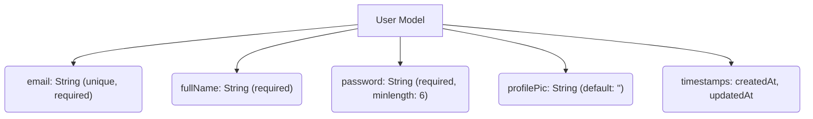
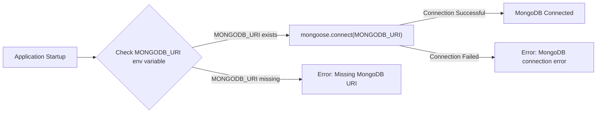

# Data Models and Schemas

This document outlines the data models and schemas used in the Synverse backend, focusing on the user and message models. Understanding these structures is crucial for developing and maintaining the application.  The models are defined using Mongoose, a MongoDB object modeling tool designed to work in an asynchronous environment.

## User Model

The `User` model represents user data within the Synverse application. It defines the structure for storing user information in the MongoDB database.

**Key Features:**

*   **Email:**  The user's email address, which must be unique.
*   **Full Name:**  The user's full name.
*   **Password:** The user's password, stored securely (hashing is assumed in the actual implementation, though not shown in the raw schema).
*   **Profile Picture:**  A URL or path to the user's profile picture.

```javascript
// File: backend/src/models/user.model.js
import mongoose from "mongoose";

const userSchema = new mongoose.Schema(
    {
        email:{
            type: String,
            required: true,
            unique: true,
        },
        fullName:{
            type: String,
            required: true,
        },
        password: {
            type: String,
            required: true,
            minlength: 6,
        },
        profilePic:{
            type: String,
            default: "",
        },
    },
    {
        timestamps: true,
    }
);

const User = mongoose.model("User", userSchema);

export default User;
```

This code snippet defines the `userSchema` using `mongoose.Schema`.  It specifies the data type, required status, and uniqueness constraints for each field. The `timestamps: true` option automatically adds `createdAt` and `updatedAt` fields to the documents.  The schema is then used to create the `User` model using `mongoose.model`. [View on GitHub](https://github.com/Priy1A2/Synverse/blob/main/backend/src/models/user.model.js)





## Message Model

The `Message` model represents messages exchanged between users in the Synverse application.

**Key Features:**

*   **Sender ID:**  A reference to the `User` who sent the message.
*   **Receiver ID:** A reference to the `User` who received the message.
*   **Text:** The message content (text).
*   **Image:**  A URL or path to an image attached to the message (optional).

```javascript
// File: backend/src/models/message.model.js
import mongoose from "mongoose";

const messageSchema = new mongoose.Schema({
    senderId: {
        type: mongoose.Schema.Types.ObjectId,
        ref: "User",
        required: true,
    },
    receiverId: {
        type: mongoose.Schema.Types.ObjectId,
        ref: "User",
        required: true,
    },
    text: {
        type: String,
    },
    image: {
        type: String,
    }
},
 {
    timestamps: true,
 });

const Message = mongoose.model("Message", messageSchema);

export default Message;
```

This code defines the `messageSchema` using `mongoose.Schema`.  The `senderId` and `receiverId` fields use `mongoose.Schema.Types.ObjectId` to establish a relationship with the `User` model. The `ref: "User"` option tells Mongoose that these IDs refer to documents in the `User` collection.  The `timestamps: true` option adds `createdAt` and `updatedAt` fields.  The schema is then used to create the `Message` model. [View on GitHub](https://github.com/Priy1A2/Synverse/blob/main/backend/src/models/message.model.js)

```javascript
// Example usage: Creating a new message
import Message from "./models/message.model.js";

async function createMessage(senderId, receiverId, text, image) {
  try {
    const newMessage = new Message({
      senderId,
      receiverId,
      text,
      image,
    });
    await newMessage.save();
    console.log("Message created:", newMessage);
    return newMessage;
  } catch (error) {
    console.error("Error creating message:", error);
    throw error;
  }
}

// Example call (replace with actual user IDs)
// createMessage("senderUserId", "receiverUserId", "Hello!", null);
```

This snippet shows how to create a new message using the `Message` model. It imports the `Message` model, creates a new `Message` instance, saves it to the database, and logs the created message. The example call is commented out and should be replaced with actual user IDs. [View on GitHub](https://github.com/Priy1A2/Synverse/blob/main/backend/src/models/message.model.js)

## Database Connection

The `connectDB` function handles the connection to the MongoDB database.

```javascript
// File: backend/src/lib/db.js
import mongoose from "mongoose";

export const connectDB = async() => {
    try {
        const conn = await mongoose.connect(process.env.MONGODB_URI);
        console.log(`MongoDB Connected: ${conn.connection.host}`);
    } catch (error) {
        console.log("MongoDB connection error:", error);
    }
};
```

This code imports the `mongoose` library and defines an asynchronous function `connectDB`.  It attempts to connect to the MongoDB database using the URI stored in the `MONGODB_URI` environment variable.  If the connection is successful, it logs a message to the console. If an error occurs, it logs the error message. [View on GitHub](https://github.com/Priy1A2/Synverse/blob/main/backend/src/lib/db.js)

```bash
# Example .env file (used to configure MONGODB_URI)
MONGODB_URI=mongodb://localhost:27017/synverse
```

This is an example `.env` file that sets the `MONGODB_URI` environment variable. This variable contains the connection string for the MongoDB database. Make sure to replace `mongodb://localhost:27017/synverse` with the actual URI of your MongoDB database. [View on GitHub](https://github.com/Priy1A2/Synverse/blob/main/backend/src/lib/db.js)





## Key Integration Points

*   **User Authentication:** The `User` model is central to user authentication and authorization.  User credentials (email and password) are validated against the data stored in the database.
*   **Real-time Messaging:** The `Message` model facilitates real-time messaging functionality.  New messages are stored in the database and retrieved as needed to update user interfaces.
*   **Data Validation:** Mongoose schema definitions enforce data validation rules, ensuring data integrity.  For example, the `required` and `unique` properties prevent invalid or duplicate data from being stored in the database.

**Best Practices:**

*   **Data Sanitization:**  Implement data sanitization techniques to prevent security vulnerabilities such as cross-site scripting (XSS) and SQL injection.
*   **Password Hashing:**  Always hash passwords before storing them in the database.  Use a strong hashing algorithm such as bcrypt.
*   **Error Handling:**  Implement robust error handling to gracefully handle database connection errors and other unexpected issues.
```