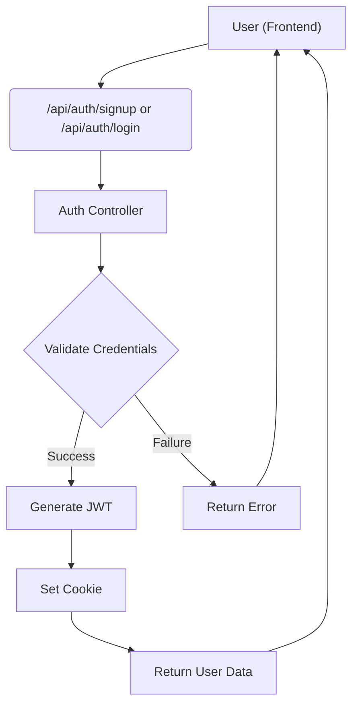
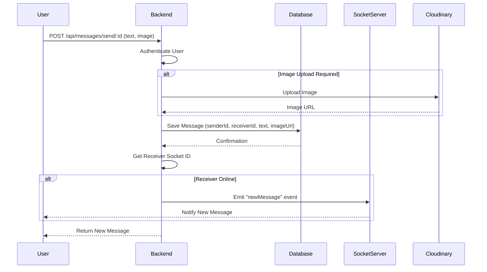

# API Endpoints and Routing

This section details the API endpoints available in Synverse and how requests are routed to the appropriate controllers. Synverse utilizes Express.js for its backend, providing a RESTful API for user authentication and messaging.

## Authentication Endpoints

These endpoints handle user registration, login, logout, profile updates, and authentication checks.

*   **`POST /api/auth/signup`**: Registers a new user.
*   **`POST /api/auth/login`**: Logs in an existing user.
*   **`POST /api/auth/logout`**: Logs out the current user.
*   **`PUT /api/auth/update-profile`**: Updates the user's profile (protected route).
*   **`GET /api/auth/check`**: Checks if the user is authenticated (protected route).

### Signup Controller

The `signup` controller handles user registration. It validates input, hashes the password, and saves the new user to the database.

```javascript title="backend/src/controllers/auth.controllers.js"
import { generateToken } from "../lib/utils.js";
import User from "../models/user.model.js";
import bcrypt from "bcryptjs";

export const signup = async (req, res) => {
    const {fullName, email, password} = req.body;
    try {
        if(!fullName || !email || !password){
            return res.status(400).json({message: "All fields are required"});
        }
        if(password.length < 6){
            return res.status(400).json({message: "Password should be at least 6 characters"});
        }

        const user = await User.findOne({email});

        if(user){
            return res.status(400).json({message: "Email already exists"});
        }

        const salt = await bcrypt.genSalt(10);
        const hashedPassword = await bcrypt.hash(password, salt);

        const newUser = new User({
            fullName,
            email,
            password: hashedPassword,
        })

        if(newUser){
            generateToken(newUser._id, res);
            await newUser.save();

            res.status(201).json({
                _id: newUser._id,
                fullName: newUser.fullName,
                email: newUser.email,
                profilePic: newUser.profilePic,
            });
        } else {
            return res.status(400).json({error: "Something went wrong"});
        }
    } catch (error) {
        console.log("Error in signup controller :", error.message);
        res.status(500).json({message: "Internal Server Error"});
    }
};
```

[View on GitHub](https://github.com/Priy1A2/Synverse/blob/main/backend/src/controllers/auth.controllers.js)

### Authentication Flow





### Login Controller

The `login` controller handles user authentication. It checks if the user exists and validates the password before generating a JWT.

```javascript title="backend/src/controllers/auth.controllers.js"
export const login = async (req, res) => {
    const {email, password} = req.body;
    try{
        const user = await User.findOne({email});

        if(!user){
            return res.status(400).json({message: "Invalid credentials"});
        }

        const isPasswordValid = await bcrypt.compare(password, user.password);

        if(!isPasswordValid){
            return res.status(400).json({message: "Invalid credentials"});
        }
        
        generateToken(user._id, res)

        res.status(200).json({
            _id: user._id,
            fullName: user.fullName,
            email: user.email,
            profilePic: user.profilePic
        })
    }catch(error){
        console.log("Error in login controller:", error.message);
        res.status(500).json({message: "Internal Server Error"});
    }
};
```

[View on GitHub](https://github.com/Priy1A2/Synverse/blob/main/backend/src/controllers/auth.controllers.js)

## Message Endpoints

These endpoints manage user interactions, message retrieval, and sending messages.

*   **`GET /api/messages/users`**: Retrieves a list of users for the sidebar (protected route).
*   **`GET /api/messages/:id`**: Retrieves messages between the current user and a specified user (protected route).
*   **`POST /api/messages/send/:id`**: Sends a new message to a specified user (protected route).

### Get Users for Sidebar Controller

This controller retrieves a list of users, excluding the logged-in user, to display in the sidebar.

```javascript title="backend/src/controllers/message.controller.js"
import User from "../models/user.model.js";

export const getUsersForSidebar = async (req, res) => {
  try {
    const loggedInUserId = req.user._id;
    const filteredUsers = await User.find({ _id: { $ne: loggedInUserId } }).select("-password");

    res.status(200).json(filteredUsers);
  } catch (error) {
    console.error("Error in getUsersForSidebar: ", error.message);
    res.status(500).json({ error: "Internal server error" });
  }
};
```

[View on GitHub](https://github.com/Priy1A2/Synverse/blob/main/backend/src/controllers/message.controller.js)

### Send Message Controller

The `sendMessage` controller handles sending new messages.  It saves the message to the database and emits a socket event to notify the recipient.

```javascript title="backend/src/controllers/message.controller.js"
import Message from "../models/message.model.js";
import { getReceiverSocketId, io } from "../lib/socket.js";

export const sendMessage = async (req, res) => {
  try {
    const { text, image } = req.body;
    const { id: receiverId } = req.params;
    const senderId = req.user._id;

    let imageUrl;
    if (image) {
      // Upload base64 image to cloudinary
      const uploadResponse = await cloudinary.uploader.upload(image);
      imageUrl = uploadResponse.secure_url;
    }

    const newMessage = new Message({
      senderId,
      receiverId,
      text,
      image: imageUrl,
    });

    await newMessage.save();

    const receiverSocketId = getReceiverSocketId(receiverId);
    if (receiverSocketId) {
      io.to(receiverSocketId).emit("newMessage", newMessage);
    }

    res.status(201).json(newMessage);
  } catch (error) {
    console.log("Error in sendMessage controller: ", error.message);
    res.status(500).json({ error: "Internal server error" });
  }
};
```

[View on GitHub](https://github.com/Priy1A2/Synverse/blob/main/backend/src/controllers/message.controller.js)

### Message Sending Flow





### Auth Route Definition

The `auth.route.js` file defines the routes for authentication. It imports the necessary controllers and middleware.

```javascript title="backend/src/routes/auth.route.js"
import express from "express";
import {signup, login, logout, updateProfile, checkAuth } from "../controllers/auth.controllers.js";
import { protectRoute } from "../middleware/auth.middleware.js";

const router = express.Router();

router.post("/signup", signup);
router.post("/login", login);
router.post("/logout", logout);

router.put("/update-profile", protectRoute, updateProfile);

router.get("/check", protectRoute, checkAuth);
export default router;
```

[View on GitHub](https://github.com/Priy1A2/Synverse/blob/main/backend/src/routes/auth.route.js)

## Key Integration Points

*   **Authentication Middleware**: The `protectRoute` middleware is crucial for securing API endpoints. It verifies the JWT and attaches the user object to the request.
*   **Real-time Messaging**: Socket.IO is used for real-time message delivery. When a message is sent, the server emits a `newMessage` event to the recipient.
*   **Cloudinary Integration**: Cloudinary is used for storing images. The `updateProfile` and `sendMessage` controllers utilize Cloudinary to upload and retrieve images.

## Best Practices

*   **Input Validation**: Always validate user input to prevent errors and security vulnerabilities.
*   **Error Handling**: Implement robust error handling to provide informative error messages to the client.
*   **Security**: Protect API endpoints with appropriate authentication and authorization mechanisms.
*   **Asynchronous Operations**: Use `async/await` for asynchronous operations to improve code readability and maintainability.
```