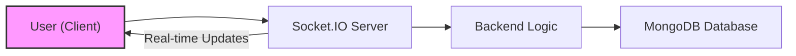
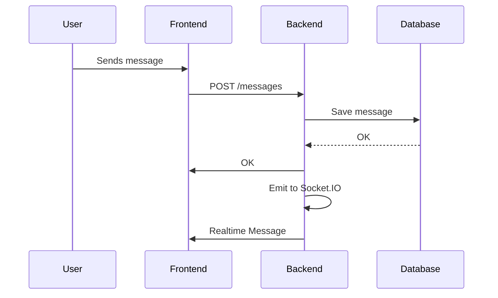

# Backend Architecture

This document details the backend architecture of Synverse, a chat application. It covers the technologies used, key modules, and their interactions. The backend is built using Node.js, Express, MongoDB, and Socket.IO.

## Overview

The backend is responsible for handling user authentication, managing chat messages, maintaining user presence, and providing real-time communication capabilities. It leverages a REST API for traditional HTTP requests and WebSockets for real-time updates.

### Technologies

| Technology   | Description                                       |
| :----------- | :------------------------------------------------ |
| Node.js      | JavaScript runtime environment                    |
| Express.js   | Web application framework for Node.js              |
| MongoDB      | NoSQL database for storing user and message data |
| Socket.IO    | Library for real-time, bidirectional communication |
| JSON Web Tokens (JWT) | For secure authentication. |
| bcryptjs | For hashing passwords. |
| Cors | For handling cross origin requests. |
| Dotenv | For managing env variables. |

## Key Modules

-   **Database (db.js):** Handles the connection to MongoDB.
-   **Socket (socket.js):** Manages WebSocket connections for real-time communication.
-   **Authentication:** Handles user registration, login, and session management.
-   **Message Handling:** Stores and retrieves chat messages.
-   **User Presence:** Tracks online users and their status.

### File: backend/package.json

This file defines the dependencies and scripts for the backend application.

```json
{
  "name": "backend",
  "version": "1.0.0",
  "main": "src/index.js",
  "type": "module",
  "scripts": {
    "dev": "nodemon src/index.js",
    "start": "node src/index.js"
  },
  "keywords": [],
  "author": "",
  "license": "ISC",
  "description": "",
  "dependencies": {
    "bcryptjs": "^3.0.2",
    "chat-app": "file:..",
    "cloudinary": "^2.6.0",
    "cookie-parser": "^1.4.7",
    "cors": "^2.8.5",
    "dotenv": "^16.4.7",
    "express": "^4.21.2",
    "jsonwebtoken": "^9.0.2",
    "mongoose": "^8.12.2",
    "socket.io": "^4.8.1"
  },
  "devDependencies": {
    "nodemon": "^3.1.9"
  }
}
```

The `dependencies` section lists all the required packages for the backend to function correctly. Notably, `express`, `mongoose`, and `socket.io` are crucial for the application's core functionality.  The `scripts` section defines commands for development (`dev`) and production (`start`).

[View on GitHub](https://github.com/Priy1A2/Synverse/blob/main/backend/package.json)

### Database Connection (backend/src/lib/db.js)

This module establishes the connection to the MongoDB database.

```javascript
import mongoose from "mongoose";

export const connectDB = async() => {
    try {
        const conn = await mongoose.connect(process.env.MONGODB_URI);
        console.log(`MongoDB Connected: ${conn.connection.host}`);
    } catch (error) {
        console.log("MongoDB connection error:", error);
    }
};
```

The `connectDB` function attempts to connect to the MongoDB database using the URI stored in the `MONGODB_URI` environment variable.  Error handling is included to catch any connection issues.

[View on GitHub](https://github.com/Priy1A2/Synverse/blob/main/backend/src/lib/db.js)

### Socket.IO Configuration (backend/src/lib/socket.js)

This module configures Socket.IO for real-time communication.

```javascript
import { Server } from "socket.io";
import http from "http";
import express from "express";

const app = express();
const server = http.createServer(app);

const io = new Server(server, {
    cors: {
        origin: ["http://localhost:5173"],
    },
});

export function getReceiverSocketId(userId) {
    return userSocketMap[userId];
}

// used to store online users
const userSocketMap = {};   // {key, value} => {userId: socketId}  => userId coming from database & socketId = socket.id

io.on("connection", (socket) => { 
    console.log("A user connected", socket.id);

    // after user connected we will update userSocketMap 
    const userId = socket.handshake.query.userId;   // query.userId in useAuthStore
    if(userId){
        userSocketMap[userId] = socket.id;
    }

    // io.emit() broadcasts that user is disconnected (offline) then go in the socket.on and broadcast it
    io.emit("getOnlineUsers", Object.keys(userSocketMap));

    socket.on("disconnect", () => {
        console.log("A user disconnected", socket.id);
        // user just became offline
        delete userSocketMap[userId];   // deleting key from userSocketMap
        io.emit("getOnlineUsers", Object.keys(userSocketMap));
    });
});

export {io, app, server};
```

This code initializes a Socket.IO server and sets up connection and disconnection event handlers. The `userSocketMap` object stores the mapping between user IDs and socket IDs, allowing the server to send messages to specific users. The `getOnlineUsers` event is emitted to update all connected clients with the list of online users. CORS is configured to allow connections from the frontend running on `http://localhost:5173`.

[View on GitHub](https://github.com/Priy1A2/Synverse/blob/main/backend/src/lib/socket.js)





This diagram illustrates the flow of data between the client, Socket.IO server, backend logic, and the MongoDB database. Real-time updates are facilitated through the Socket.IO connection.

### User Authentication Flow
The authentication flow typically involves the following steps:

1.  The user sends login credentials (username/email and password) to the backend.
2.  The backend validates the credentials against the stored user data in the database.
3.  If the credentials are valid, the backend generates a JWT.
4.  The JWT is sent back to the client.
5.  The client stores the JWT (e.g., in local storage or a cookie).
6.  For subsequent requests, the client includes the JWT in the `Authorization` header.
7.  The backend verifies the JWT before processing the request.

```javascript
// Example JWT verification middleware
import jwt from 'jsonwebtoken';

function authenticateToken(req, res, next) {
  const authHeader = req.headers['authorization'];
  const token = authHeader && authHeader.split(' ')[1];

  if (token == null) return res.sendStatus(401);

  jwt.verify(token, process.env.JWT_SECRET, (err, user) => {
    if (err) return res.sendStatus(403);
    req.user = user;
    next();
  });
}
```

This snippet demonstrates a middleware function that verifies the JWT included in the `Authorization` header of a request.  If the token is valid, the user information is attached to the request object, and the next middleware function is called.

[View on GitHub](https://github.com/Priy1A2/Synverse/blob/main/backend/src)

### Message Handling

The backend provides endpoints for sending and retrieving chat messages. Messages are typically stored in the MongoDB database with relevant metadata, such as sender ID, receiver ID, timestamp, and content.

```javascript
// Example of saving a message to the database
import mongoose from 'mongoose';

const messageSchema = new mongoose.Schema({
  sender: { type: mongoose.Schema.Types.ObjectId, ref: 'User' },
  receiver: { type: mongoose.Schema.Types.ObjectId, ref: 'User' },
  content: String,
  timestamp: { type: Date, default: Date.now }
});

const Message = mongoose.model('Message', messageSchema);

async function saveMessage(senderId, receiverId, content) {
  const newMessage = new Message({
    sender: senderId,
    receiver: receiverId,
    content: content
  });

  await newMessage.save();
  return newMessage;
}
```

This code defines a Mongoose schema for chat messages and a function to save new messages to the database. The `sender` and `receiver` fields are references to the `User` model, establishing a relationship between messages and users.

[View on GitHub](https://github.com/Priy1A2/Synverse/blob/main/backend/src)





This sequence diagram illustrates the process of sending and receiving a chat message, from the user sending the message to the message being saved to the database and propagated in real-time via Socket.IO.

### Environment Variables

The backend relies on environment variables for configuration, such as database connection strings, JWT secrets, and API keys.

```bash
MONGODB_URI=mongodb://localhost:27017/synverse
JWT_SECRET=your-secret-key
PORT=3000
```

These environment variables should be configured in a `.env` file and loaded using a library like `dotenv`.

[View on GitHub](https://github.com/Priy1A2/Synverse/blob/main/backend/.env)

## Key Integration Points

The backend integrates with the frontend through a combination of REST APIs and WebSockets. The REST APIs handle tasks such as user authentication and message retrieval, while WebSockets provide real-time updates for new messages and user presence.

### Best Practices

-   **Secure Authentication:** Implement robust authentication and authorization mechanisms using JWTs and secure password hashing.
-   **Input Validation:** Validate all user inputs to prevent security vulnerabilities such as SQL injection and cross-site scripting (XSS).
-   **Error Handling:** Implement comprehensive error handling to gracefully handle unexpected errors and provide informative error messages to the client.
-   **Logging:** Use logging to track application events and debug issues.
-   **Scalability:** Design the backend with scalability in mind to handle a growing number of users and messages. Consider using techniques such as load balancing and database sharding.
-   **Real-time updates**: use `socket.emit()` and `io.emit()` appropriately.
```