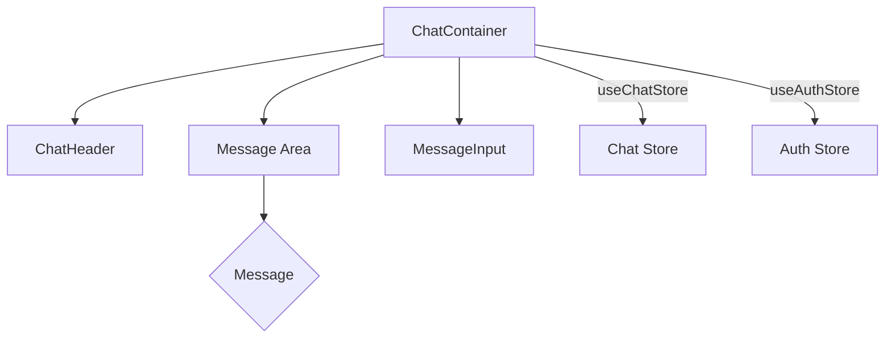
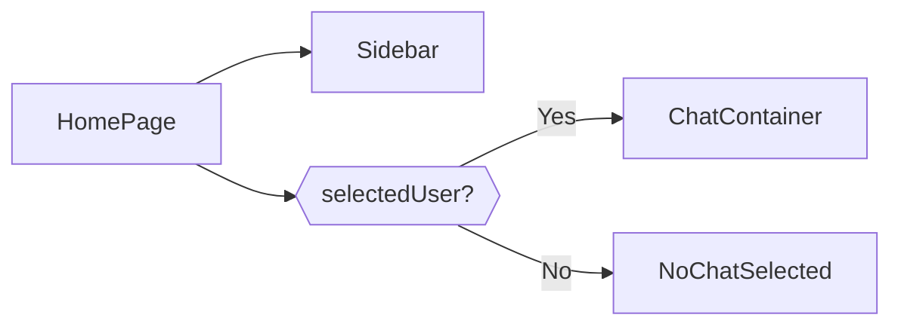

# Component Structure and UI

This document details the structure and functionality of the React components used in the Synverse frontend UI. Understanding these components is crucial for contributing to the project or customizing its behavior. We'll explore the key components responsible for chat management, user interaction, and overall page layout.

## Key Components

- **ChatContainer:** Manages the display of chat messages, handles loading states, and integrates the message input component.
- **Sidebar:** Displays a list of users and their online status, enabling user selection for initiating a chat.
- **MessageInput:** Provides the UI for composing and sending messages, including text input and image attachment functionality.
- **HomePage:** The main page that orchestrates the layout, combining the `Sidebar` and `ChatContainer` components.

## ChatContainer

The `ChatContainer` component is responsible for displaying the chat interface. It fetches messages between the authenticated user and the selected user, handles real-time updates, and renders the messages in a scrollable container.

```javascript title="frontend/src/components/ChatContainer.jsx"
import { useChatStore } from "../store/useChatStore";
import { useEffect, useRef } from "react";
import ChatHeader from "./ChatHeader";
import MessageInput from "./MessageInput";
import MessageSkeleton from "./skeletons/MessageSkeleton";
import { useAuthStore } from "../store/useAuthStore";
import { formatMessageTime } from "../lib/utils";

const ChatContainer = () => {
  const {
    messages,
    getMessages,
    isMessagesLoading,
    selectedUser,
    subscribeToMessages,
    unsubscribeFromMessages,
  } = useChatStore();

  const { authUser } = useAuthStore();
  const messageEndRef = useRef(null);

  useEffect(() => { 
    getMessages(selectedUser._id);  // wants to get messages b/w me and selected user

    subscribeToMessages();

    return () => unsubscribeFromMessages();

  }, [selectedUser._id, getMessages, subscribeToMessages, unsubscribeFromMessages]);


  useEffect(() => {
    if(messageEndRef.current &&  messages){
      messageEndRef.current.scrollIntoView({behavior: "smooth"});
    }
  }, [messages]);

  if(!isMessagesLoading){ 
    return (
    <div className="flex-1 flex flex-col overflow-auto">
      <ChatHeader />
      <MessageSkeleton />
      <MessageInput />
    </div>
    );
  };

  return (
    <div className="flex-1 flex flex-col overflow-auto">
      <ChatHeader />

      <div className="flex-1 overflow-y-auto p-4 space-y-4">
        {messages.map((message) => (
          <div key={message._id} 
          
          className={`chat ${message.senderId === authUser._id ? "chat-end" : "chat-start"}`}
          ref={messageEndRef}
          >
            <div className="chat-image avatar">
              <div className="size-10 rounded-full border">
                
              </div>
            </div>
            <div className="chat-header mb-1">
              <time className="text-xs opacity-50">
                {formatMessageTime(message.createdAt)}</time>
            </div>
            <div className="chat-bubble flex flex-col">
              {message.image && (
                
              )}
              {message.text && <p>{message.text}</p>}
            </div>
          </div>
        ))}
      </div>

      <MessageInput />
    </div>
  )
}

export default ChatContainer;
```

[View on GitHub](https://github.com/Priy1A2/Synverse/blob/main/frontend/src/components/ChatContainer.jsx)

The `useEffect` hook is used to fetch messages when the `selectedUser._id` changes and to subscribe/unsubscribe from message updates.  The `messageEndRef` is used to scroll to the bottom of the chat when new messages are received, ensuring the user always sees the latest content.  It utilizes `useChatStore` to manage the state of messages, loading status, and selected user. The `useAuthStore` is used to identify the authenticated user.

```javascript title="frontend/src/lib/utils.js"
export const formatMessageTime = (dateString) => {
    const date = new Date(dateString);
    const now = new Date();

    const diff = now.getTime() - date.getTime();
    const seconds = Math.floor(diff / 1000);
    const minutes = Math.floor(seconds / 60);
    const hours = Math.floor(minutes / 60);
    const days = Math.floor(hours / 24);

    if (days > 0) {
        return date.toLocaleDateString();  // Returns date if it's a different day
    } else if (hours > 0) {
        return `${hours} hour${hours > 1 ? 's' : ''} ago`;  // Returns "x hours ago"
    } else if (minutes > 0) {
        return `${minutes} minute${minutes > 1 ? 's' : ''} ago`;  // Returns "x minutes ago"
    } else {
        return 'Just now';  // Returns "Just now" if less than a minute
    }
}
```

[View on GitHub](https://github.com/Priy1A2/Synverse/blob/main/frontend/src/lib/utils.js)

The `formatMessageTime` function takes date string as input and return in human readable form such as `"x minutes ago"` or `"Just now"`.

### ChatContainer Mermaid Diagram





## MessageInput

The `MessageInput` component provides the interface for users to type and send messages. It includes functionalities for attaching images and clearing the input field.

```javascript title="frontend/src/components/MessageInput.jsx"
import { useRef, useState } from "react";
import { useChatStore } from "../store/useChatStore";
import { Image, Send, X } from "lucide-react";
import toast from "react-hot-toast";

const MessageInput = () => {
  const [text, setText] = useState("");
  const [imagePreview, setImagePreview] = useState(null);
  const fileInputRef = useRef(null);
  const { sendMessage } = useChatStore();

  const handleImageChange = (e) => {
    const file = e.target.files[0];
    if (!file.type.startsWith("image/")) {
      toast.error("Please select an image file");
      return;
    }

    const reader = new FileReader();
    reader.onloadend = () => {
      setImagePreview(reader.result);
    };
    reader.readAsDataURL(file);
  };

  const removeImage = () => {
    setImagePreview(null);
    if (fileInputRef.current) fileInputRef.current.value = "";
  };

  const handleSendMessage = async (e) => {
    e.preventDefault();
    if (!text.trim() && !imagePreview) return;

    try {
      await sendMessage({
        text: text.trim(),
        image: imagePreview,
      });

      // Clear form
      setText("");
      setImagePreview(null);
      if (fileInputRef.current) fileInputRef.current.value = "";
    } catch (error) {
      console.error("Failed to send message:", error);
    }
  };

  return (
    <div className="p-4 w-full">
      {imagePreview && (
        <div className="mb-3 flex items-center gap-2">
          <div className="relative">
            
            <button
              onClick={removeImage}
              className="absolute -top-1.5 -right-1.5 w-5 h-5 rounded-full bg-base-300
              flex items-center justify-center"
              type="button"
            >
              <X className="size-3" />
            </button>
          </div>
        </div>
      )}

      <form onSubmit={handleSendMessage} className="flex items-center gap-2">
        <div className="flex-1 flex gap-2">
          <input
            type="text"
            className="w-full input input-bordered rounded-lg input-sm sm:input-md"
            placeholder="Type a message..."
            value={text}
            onChange={(e) => setText(e.target.value)}
          />
          <input
            type="file"
            accept="image/*"
            className="hidden"
            ref={fileInputRef}
            onChange={handleImageChange}
          />

          <button
            type="button"
            className={`hidden sm:flex btn btn-circle
                     ${imagePreview ? "text-emerald-500" : "text-zinc-400"}`}
            onClick={() => fileInputRef.current?.click()}
          >
            <Image size={20} />
          </button>
        </div>
        <button
          type="submit"
          className="btn btn-sm btn-circle"
          disabled={!text.trim() && !imagePreview}
        >
          <Send size={22} />
        </button>
      </form>
    </div>
  );
};
export default MessageInput;
```

[View on GitHub](https://github.com/Priy1A2/Synverse/blob/main/frontend/src/components/MessageInput.jsx)

The `MessageInput` component uses the `useChatStore` hook to access the `sendMessage` function. The `useState` hook manages the text input and image preview. The component handles image selection, preview, and removal.  The `handleSendMessage` function sends the message (text and/or image) using the `sendMessage` function from the `useChatStore`.

```javascript title="frontend/src/store/useChatStore.js"
import { create } from 'zustand';

export const useChatStore = create((set, get) => ({
    messages: [],
    users: [],
    selectedUser: null,
    isUsersLoading: false,
    isMessagesLoading: false,
    
    // ... other actions
    
    sendMessage: async (message) => {
      // ... implementation
    },
}));
```

[View on GitHub](https://github.com/Priy1A2/Synverse/blob/main/frontend/src/store/useChatStore.js)

The `useChatStore` store is implemented using Zustand, and exposes the `sendMessage` action along with other relevant state variables like `messages`, `users` and `selectedUser`.

## Sidebar

The `Sidebar` component displays a list of users and their online status. It allows users to select a contact to start a chat.

```javascript title="frontend/src/components/Sidebar.jsx"
import { useEffect, useState } from "react";
import { useChatStore } from "../store/useChatStore";
import { useAuthStore } from "../store/useAuthStore";
import SidebarSkeleton from "./skeletons/SidebarSkeleton";
import { Users } from "lucide-react";

const Sidebar = () => {
  const { getUsers, users, selectedUser, setSelectedUser, isUsersLoading } = useChatStore();

  const { onlineUsers } = useAuthStore();
  const [showOnlineOnly, setShowOnlineOnly] = useState(false);

  useEffect(() => {
    getUsers();
  }, [getUsers]);

  const filteredUsers = showOnlineOnly
    ? users.filter((user) => onlineUsers.includes(user._id))
    : users;

  if (isUsersLoading) return <SidebarSkeleton />;

  return (
    <aside className="h-full w-20 lg:w-72 border-r border-base-300 flex flex-col transition-all duration-200">
      <div className="border-b border-base-300 w-full p-5">
        <div className="flex items-center gap-2">
          <Users className="size-6" />
          <span className="font-medium hidden lg:block">Contacts</span>
        </div>
        {/* TODO: Online filter toggle */}
        <div className="mt-3 hidden lg:flex items-center gap-2">
          <label className="cursor-pointer flex items-center gap-2">
            <input
              type="checkbox"
              checked={showOnlineOnly}
              onChange={(e) => setShowOnlineOnly(e.target.checked)}
              className="checkbox checkbox-sm"
            />
            <span className="text-sm">Show online only</span>
          </label>
          <span className="text-xs text-zinc-500">({onlineUsers.length - 1} online)</span>
        </div>
      </div>

      <div className="overflow-y-auto w-full py-3">
        {filteredUsers.map((user) => (
          <button
            key={user._id}
            onClick={() => setSelectedUser(user)}
            className={`
              w-full p-3 flex items-center gap-3
              hover:bg-base-300 transition-colors
              ${selectedUser?._id === user._id ? "bg-base-300 ring-1 ring-base-300" : ""}
            `}
          >
            <div className="relative mx-auto lg:mx-0">
              
              {onlineUsers.includes(user._id) && (
                <span
                  className="absolute bottom-0 right-0 size-3 bg-green-500 
                  rounded-full ring-2 ring-zinc-900"
                />
              )}
            </div>

            {/* User info - only visible on larger screens */}
            <div className="hidden lg:block text-left min-w-0">
              <div className="font-medium truncate">{user.fullName}</div>
              <div className="text-sm text-zinc-400">
                {onlineUsers.includes(user._id) ? "Online" : "Offline"}
              </div>
            </div>
          </button>
        ))}

        {filteredUsers.length === 0 && (
          <div className="text-center text-zinc-500 py-4">No online users</div>
        )}
      </div>
    </aside>
  );
};
export default Sidebar;
```

[View on GitHub](https://github.com/Priy1A2/Synverse/blob/main/frontend/src/components/Sidebar.jsx)

The `Sidebar` component uses the `useChatStore` hook to fetch the list of users and manage the selected user.  The `useAuthStore` hook is used to access the list of online users. A `useState` hook manages the online-only filter. The component displays a list of users, indicating their online status. When a user is clicked, the `setSelectedUser` function from `useChatStore` is called.

## HomePage

The `HomePage` component is the main page that combines the `Sidebar` and `ChatContainer`. It handles the overall layout of the chat application.

```javascript title="frontend/src/pages/HomePage.jsx"
import { useChatStore } from "../store/useChatStore";

import Sidebar from "../components/Sidebar";
import NoChatSelected from "../components/NoChatSelected";
import ChatContainer from "../components/ChatContainer";

const HomePage = () => {
  const { selectedUser } = useChatStore();

  return (
    <div className="h-screen bg-base-200">
      <div className="flex items-center justify-center pt-20 px-4">
        <div className="bg-base-100 rounded-lg shadow-cl w-full max-w-6xl h-[calc(100vh-8rem)]">
          <div className="flex h-full rounded-lg overflow-hidden">
            <Sidebar />

            {!selectedUser ? <NoChatSelected /> : <ChatContainer />}
          </div>
        </div>
      </div>
    </div>
  );
};
export default HomePage;
```

[View on GitHub](https://github.com/Priy1A2/Synverse/blob/main/frontend/src/pages/HomePage.jsx)

The `HomePage` component uses the `useChatStore` to determine whether a user is selected. If no user is selected, it renders the `NoChatSelected` component; otherwise, it renders the `ChatContainer`.

## Key Integration Points

- **State Management:** The `useChatStore` and `useAuthStore` hooks are central to managing the application state. They provide a consistent way to access and update data across different components.
- **Real-time Updates:** The `subscribeToMessages` and `unsubscribeFromMessages` functions from `useChatStore` handle real-time updates of messages.
- **Component Composition:** The `HomePage` component demonstrates the composition of different components to create the overall application layout. The `Sidebar` and `ChatContainer` work together to provide a complete chat interface.




