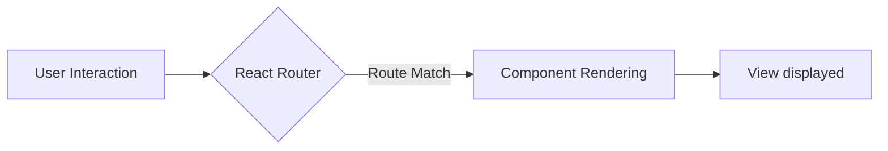
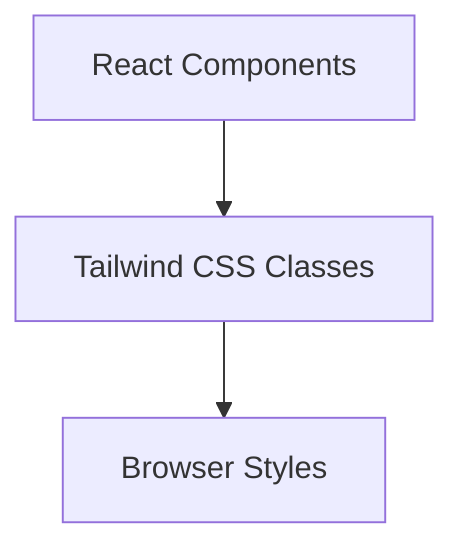

# Frontend Architecture

This document provides an overview of the frontend architecture of Synverse, covering its structure, component organization, state management, and key integration points.  The frontend is built using React, leveraging modern tools and libraries for a responsive and efficient user experience.

## Frontend Stack

The Synverse frontend utilizes the following core technologies:

*   **React:** A JavaScript library for building user interfaces.
*   **React Router DOM:** For handling client-side routing and navigation.
*   **Zustand:** A small, fast, and scalable bearbones state-management solution.
*   **Tailwind CSS:** A utility-first CSS framework for styling.
*   **Vite:** A build tool that provides a fast and optimized development experience.
*   **Axios:** A promise-based HTTP client for making API requests.
*   **Socket.IO Client:** Enables real-time, bidirectional communication between the client and server.
*   **Lucide React:** A collection of beautiful and consistent SVG icons.
*   **React Hot Toast:** For displaying toast notifications.

```json title="frontend/package.json"
{
  "name": "frontend",
  "private": true,
  "version": "0.0.0",
  "type": "module",
  "scripts": {
    "dev": "vite",
    "build": "vite build",
    "lint": "eslint ."
  },
  "dependencies": {
    "react": "^19.0.0",
    "react-dom": "^19.0.0",
    "react-router-dom": "^7.4.0",
    "zustand": "^5.0.3",
    "tailwindcss": "^3.4.17",
    "axios": "^1.8.4",
    "socket.io-client": "^4.8.1",
    "lucide-react": "^0.485.0",
    "react-hot-toast": "^2.5.2"
  },
  "devDependencies": {
    "@vitejs/plugin-react": "^4.3.4",
    "autoprefixer": "^10.4.21",
    "daisyui": "^5.0.9",
    "eslint": "^9.21.0",
    "postcss": "^8.4.35",
    "vite": "^6.2.0"
  }
}
```

[View on GitHub](https://github.com/Priy1A2/Synverse/blob/main/frontend/package.json)

## Component Organization

The Synverse frontend follows a component-based architecture. Components are organized into logical directories based on their functionality.  Key directories include:

*   **components:** Reusable UI elements like Navbar, Chat components, and input fields.
*   **pages:**  Top-level components representing different routes or views (e.g., HomePage, LoginPage, SignUpPage).
*   **store:** Contains the Zustand stores for managing global application state (e.g., authentication, theme).

This structure promotes code reusability, maintainability, and testability.

```javascript title="frontend/src/App.jsx"
import Navbar from "./components/Navbar";
import HomePage from "./pages/HomePage";
import SignUpPage from "./pages/SignUpPage";
import LoginPage from "./pages/LoginPage";
import SettingsPage from "./pages/SettingsPage";
import ProfilePage from "./pages/ProfilePage";

import { Routes, Route, Navigate } from "react-router-dom";
import { useAuthStore } from "./store/useAuthStore";
import { useThemeStore } from "./store/useThemeStore";
import { useEffect } from "react";

import { Loader } from "lucide-react";
import { Toaster } from "react-hot-toast";
```

[View on GitHub](https://github.com/Priy1A2/Synverse/blob/main/frontend/src/App.jsx)

## State Management with Zustand

Zustand is used for managing global application state, providing a simple and efficient way to share data between components.  The following stores are defined:

*   **useAuthStore:** Manages authentication state (user login, logout, authentication status).
*   **useThemeStore:** Manages the application's theme (light/dark mode).

```javascript title="frontend/src/App.jsx"
  const { authUser, checkAuth, isCheckingAuth, onlineUsers } = useAuthStore();
  const { theme } = useThemeStore();

  useEffect(() => {
    checkAuth();
  }, [checkAuth]);

  if (isCheckingAuth && !authUser)
    return (
      <div className="flex items-center justify-center h-screen">
        <Loader className="size-10 animate-spin" />
      </div>
    );
```

The `useAuthStore` is used in `App.jsx` to check authentication status and redirect the user to the appropriate page. The `checkAuth` function is called on mount to verify the user's token.  The `isCheckingAuth` flag is used to display a loader while the authentication status is being checked.

[View on GitHub](https://github.com/Priy1A2/Synverse/blob/main/frontend/src/App.jsx)

## Routing

React Router DOM is used to handle client-side routing, allowing users to navigate between different pages without full page reloads. The `App.jsx` component defines the routes for the application:

```javascript title="frontend/src/App.jsx"
      <Routes>
        <Route path="/" element={authUser ? <HomePage /> : <Navigate to="/login" />} />
        <Route path="/signup" element={!authUser ? <SignUpPage /> : <Navigate to="/" />} />
        <Route path="/login" element={!authUser ? <LoginPage /> : <Navigate to="/" />} />
        <Route path="/settings" element={<SettingsPage />} />
        <Route path="/profile" element={authUser ? <ProfilePage /> : <Navigate to="/login" />} />
      </Routes>
```

This code defines routes for the home page, signup page, login page, settings page, and profile page.  The `Navigate` component is used to redirect users based on their authentication status.

[View on GitHub](https://github.com/Priy1A2/Synverse/blob/main/frontend/src/App.jsx)





## Vite Configuration

Vite is used as the build tool, providing a fast development server and optimized production builds. The `vite.config.js` file configures Vite with the React plugin.

```javascript title="frontend/vite.config.js"
import { defineConfig } from 'vite'
import react from '@vitejs/plugin-react'

// https://vite.dev/config/
export default defineConfig({
  plugins: [react()],
})
```

[View on GitHub](https://github.com/Priy1A2/Synverse/blob/main/frontend/vite.config.js)

## Tailwind CSS and DaisyUI

Tailwind CSS is used for styling the application.  It's configured through `tailwind.config.js` and imported in `index.css` for global styling. DaisyUI is used as a component library to aid rapid UI development with a variety of premade components.

```css title="frontend/src/index.css"
@tailwind base;
@tailwind components;
@tailwind utilities;
```

[View on GitHub](https://github.com/Priy1A2/Synverse/blob/main/frontend/src/index.css)





## Key Integration Points

*   **Authentication Flow:** The `useAuthStore` manages the authentication state. When a user logs in or signs up, the store updates the `authUser` state. The `App` component uses this state to determine which routes to render.
*   **API Communication:** Axios is used to make API requests to the backend.  Components dispatch actions that trigger API calls, and the results are stored in the Zustand stores.
*   **Real-time Communication:** Socket.IO is integrated to provide real-time functionality, such as displaying online users and sending messages.
*   **Theming:** `useThemeStore` uses local storage to persist the user's preferred theme. The `App` component applies the theme to the root element.

**Best Practices:**

*   **Component-Based Architecture:** Break down the UI into small, reusable components.
*   **Centralized State Management:** Use Zustand to manage global application state.
*   **Asynchronous Actions:** Use async/await for handling asynchronous operations.
*   **Error Handling:** Implement proper error handling for API requests and other asynchronous operations using `try...catch` blocks.
*   **Code Splitting:** Consider using code splitting to improve initial load time, especially for larger applications. Vite supports code splitting out of the box.
```