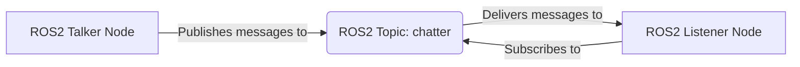
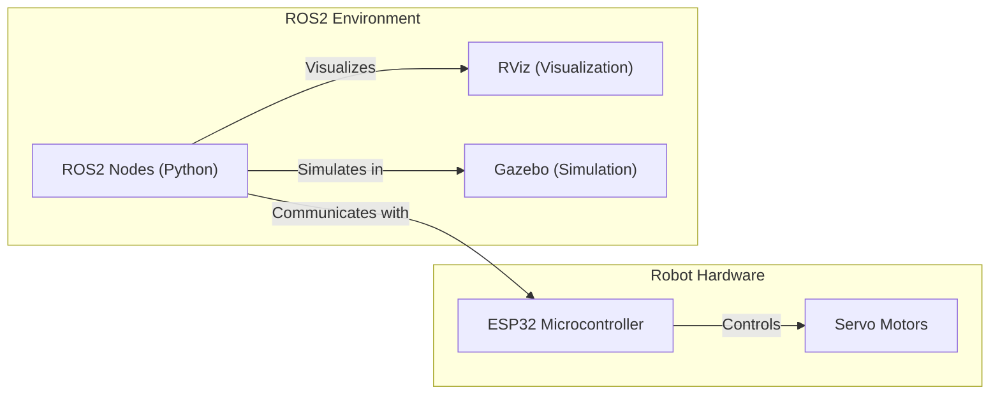

# Project Overview

MARIO (Manipulator on ROS Based Input Output) is a robotic arm project designed as a learning platform for robotics, ROS (Robot Operating System), and embedded systems. It features a 3-Degree of Freedom (DOF) manipulator controlled by servo motors, with a focus on providing practical experience in robotics concepts such as kinematics, simulation, and ROS integration. This project targets both beginners and experienced users, offering various levels of complexity from basic motor control to advanced ROS-based control and simulation.

## Key Features

*   **3-DOF Manipulator:** Provides a tangible platform for understanding robot arm kinematics and control.
*   **ROS2 Integration:** Utilizes ROS2 for robot control, communication, and simulation.
*   **Micro-ROS Support:** Enables integration with embedded systems for real-time control.
*   **Simulation Environments:** Includes Gazebo and RViz simulations for testing and development.
*   **ESP32 Firmware:** Offers firmware examples for controlling servo motors using the ESP-IDF framework.

## Software Stack

The MARIO project leverages a combination of software tools and frameworks:

*   **ROS2 (Humble):** The core robotics framework for communication, control, and simulation.
*   **micro-ROS:** A ROS2 extension for embedded systems, enabling real-time control on microcontrollers.
*   **Gazebo:** A 3D robot simulator for realistic environment interaction.
*   **RViz:** A 3D visualization tool for displaying robot models, sensor data, and other information.
*   **ESP-IDF:** The Espressif IoT Development Framework for programming the ESP32 microcontroller.
*   **Python:** Used for ROS2 node development and scripting.
*   **C/C++:** Used for firmware development in the ESP-IDF environment.

## File Structure Breakdown

The project's file structure is organized to provide a clear separation of concerns:

*   `1_chatter_listener`: Contains basic ROS2 publisher/subscriber examples for understanding ROS2 communication.
*   `2_simulation_dh`: Focuses on the simulation of Denavit-Hartenberg (DH) parameters, a key concept in robot kinematics.
*   `3_simulation_rviz`: Includes simulation setup for visualizing the MARIO bot in RViz.
*   `4_simulation_gazebo`: Contains simulation files for running the MARIO bot in the Gazebo environment.
*   `assets`: Stores images, GIFs, and other media files used in documentation and presentations.
*   `firmware`: Contains ESP-IDF firmware examples for controlling servo motors and interfacing with ROS2.
*   `LICENSE`: The project's license file (MIT License).
*   `README.md`: The main project documentation file.

## Code Snippets and Explanations

1.  **ROS2 Talker (Publisher) - `1_chatter_listener/talker.py`**

    This Python script creates a ROS2 node that publishes messages to a topic. It demonstrates basic ROS2 communication.

    ```python
    import rclpy
    from rclpy.node import Node
    from std_msgs.msg import String

    class Talker(Node):
        def __init__(self):
            super().__init__('talker')
            self.publisher_ = self.create_publisher(String, 'chatter', 10)
            timer_period = 0.5  # seconds
            self.timer = self.create_timer(timer_period, self.timer_callback)
            self.i = 0

        def timer_callback(self):
            msg = String()
            msg.data = 'Hello, world! %d' % self.i
            self.publisher_.publish(msg)
            self.get_logger().info('Publishing: "%s"' % msg.data)
            self.i += 1

    def main(args=None):
        rclpy.init(args=args)
        talker = Talker()
        rclpy.spin(talker)
        talker.destroy_node()
        rclpy.shutdown()

    if __name__ == '__main__':
        main()
    ```

    [View on GitHub](https://github.com/SRA-VJTI/MARIO/blob/humble/1_chatter_listener/talker.py)

    This script defines a `Talker` node that publishes a "Hello, world!" message to the 'chatter' topic every 0.5 seconds. The `rclpy.init()` and `rclpy.spin()` functions are essential for initializing and running the ROS2 node.

2.  **ROS2 Listener (Subscriber) - `1_chatter_listener/listener.py`**

    This Python script creates a ROS2 node that subscribes to the 'chatter' topic and prints the received messages.

    ```python
    import rclpy
    from rclpy.node import Node
    from std_msgs.msg import String

    class Listener(Node):
        def __init__(self):
            super().__init__('listener')
            self.subscription = self.create_subscription(
                String,
                'chatter',
                self.listener_callback,
                10)
            self.subscription  # prevent unused variable warning

        def listener_callback(self, msg):
            self.get_logger().info('I heard: "%s"' % msg.data)

    def main(args=None):
        rclpy.init(args=args)
        listener = Listener()
        rclpy.spin(listener)
        listener.destroy_node()
        rclpy.shutdown()

    if __name__ == '__main__':
        main()
    ```

    [View on GitHub](https://github.com/SRA-VJTI/MARIO/blob/humble/1_chatter_listener/listener.py)

    The `Listener` node subscribes to the 'chatter' topic and uses the `listener_callback` function to process incoming messages.  The `create_subscription` method sets up the subscription with the message type, topic name, callback function, and queue size.

3.  **ESP-IDF Servo Control Example - `firmware/1_servo_set_zero/main/servo_example_main.c`**

    This C code demonstrates how to control a servo motor using the ESP-IDF framework.

    ```c
    #include <stdio.h>
    #include "freertos/FreeRTOS.h"
    #include "freertos/task.h"
    #include "driver/gpio.h"
    #include "driver/mcpwm_prelude.h"

    #define SERVO_PIN 2

    void app_main(void)
    {
        mcpwm_timer_handle_t timer = NULL;
        mcpwm_oper_handle_t oper = NULL;
        mcpwm_cmpr_handle_t comparator = NULL;
        mcpwm_gen_handle_t generator = NULL;

        mcpwm_timer_config_t timer_config = {
            .clk_src = MCPWM_TIMER_CLK_SRC_DEFAULT,
            .resolution_hz = 10000000,
            .period_ticks = 20000,
            .count_mode = MCPWM_TIMER_COUNT_MODE_UP,
        };
        ESP_ERROR_CHECK(mcpwm_new_timer(&timer_config, &timer));

        mcpwm_operator_config_t operator_config = {
            .group_id = 0,
        };
        ESP_ERROR_CHECK(mcpwm_new_operator(&operator_config, &oper));
        ESP_ERROR_CHECK(mcpwm_operator_connect_timer(oper, timer));

        mcpwm_comparator_config_t comparator_config = {
            .flags.update_cmp_on_tez = true,
        };
        ESP_ERROR_CHECK(mcpwm_new_comparator(oper, &comparator_config, &comparator));

        mcpwm_generator_config_t generator_config = {
            .gen_gpio_num = SERVO_PIN,
        };
        ESP_ERROR_CHECK(mcpwm_new_generator(oper, &generator_config, &generator));

        ESP_ERROR_CHECK(mcpwm_comparator_set_compare_value(comparator, 1500));
        ESP_ERROR_CHECK(mcpwm_generator_set_actions_on_compare(generator,
                                                                 MCPWM_GEN_COMPARE_EVENT_ACTION_HIGH,
                                                                 MCPWM_GEN_COMPARE_EVENT_ACTION_LOW));

        ESP_ERROR_CHECK(mcpwm_enable_timer(timer));
        ESP_ERROR_CHECK(mcpwm_start_timer_sync(timer));

        while (1) {
            vTaskDelay(pdMS_TO_TICKS(1000));
        }
    }
    ```

    [View on GitHub](https://github.com/SRA-VJTI/MARIO/blob/humble/firmware/1_servo_set_zero/main/servo_example_main.c)

    This code configures the MCPWM (Motor Control Pulse Width Modulation) module on the ESP32 to generate a PWM signal for controlling a servo motor connected to `SERVO_PIN`. The `mcpwm_*` functions are used to configure the timer, operator, comparator, and generator.  This sets the servo to a specific angle (in this case, close to the zero position).

4.  **Linux Installation Script - `linux_installations.sh`**

    This bash script automates the installation of ROS2 Humble and other dependencies on a Linux system.

    ```bash
    #!/bin/bash
    # Install ROS2 Humble
    sudo apt update && sudo apt install -y curl gnupg2 lsb-release
    curl -s https://raw.githubusercontent.com/ros/rosdistro/master/ros.key  | sudo apt-key add -
    sudo sh -c 'echo "deb [arch=$(dpkg --print-architecture)] http://packages.ros.org/ros2/ubuntu $(lsb_release -cs) main" > /etc/apt/sources.list.d/ros2-latest.list'
    sudo apt update
    sudo apt install -y ros-humble-desktop
    source /opt/ros/humble/setup.bash

    #Install Colcon
    sudo apt install python3-colcon-common-extensions -y

    #Install rosdep
    sudo apt install python3-rosdep2 -y
    sudo rosdep init
    rosdep update
    ```

    [View on GitHub](https://github.com/SRA-VJTI/MARIO/blob/humble/linux_installations.sh)

    This script simplifies the setup process by automating the installation of ROS2, Colcon, and `rosdep`. It first adds the ROS2 package repository to the system, then installs the necessary packages. The script also installs `colcon`, a command line tool which is used to build ROS packages.

5.  **Micro-ROS Configuration - `firmware/3_microros_rviz/microros_ws/freertos_apps/apps/mario_app/main/mario_app.c`**

    Illustrates the setup needed in the `mario_app.c` for Micro-ROS integration.

    ```c
    #include <rcl/rcl.h>
    #include <rcl/error_handling.h>
    #include <rclc/rclc.h>
    #include <rclc/executor.h>
    #include <std_msgs/msg/int32.h>

    #include "freertos/FreeRTOS.h"
    #include "freertos/task.h"
    #include "esp_log.h"

    #define RCCHECK(fn) { rcl_ret_t temp_rc = fn; if((temp_rc != RCL_RET_OK)){printf("Failed status on line %d: %d. Aborting.\n",__LINE__,(int)temp_rc);vTaskDelete(NULL);}}
    #define RCSOFTCHECK(fn) { rcl_ret_t temp_rc = fn; if((temp_rc != RCL_RET_OK)){printf("Failed status on line %d: %d. Continuing.\n",__LINE__,(int)temp_rc);}}

    static const char *TAG = "mario_app";

    rcl_publisher_t publisher;
    std_msgs__msg__Int32 msg;

    void timer_callback(rcl_timer_t * timer, int64_t last_call_time)
    {
    	(void) last_call_time;
    	if (timer != NULL) {
    		RCSOFTCHECK(rcl_publish(&publisher, &msg, NULL));
    		msg.data++;
    		ESP_LOGI(TAG, "Published message %d", msg.data);
    	} else {
    		ESP_LOGI(TAG, "timer_callback");
    	}
    }

    void microros_task(void * arg)
    {
    	rcl_allocator_t allocator = rcl_get_default_allocator();
    	rclc_support_t support;

    	rcl_init_options_t init_options = rcl_get_zero_initialized_init_options();
    	RCCHECK(rcl_init_options_init(&init_options, allocator));
    	rclc_support_init(&support, 0, &init_options, allocator);

    	rcl_node_options_t node_ops = rcl_node_get_default_options();
    	rcl_node_t node;
    	RCCHECK(rcl_node_init(&node, "mario_app_node", "", &support));

    	rcl_timer_t timer;
    	const unsigned int timer_timeout = 1000;
    	RCCHECK(rclc_timer_init_default(&timer, &support, RCL_MS_TO_NS(timer_timeout), timer_callback));

    	rclc_executor_t executor;
    	RCCHECK(rclc_executor_init(&executor, &support.context, 1, &allocator));
    	RCCHECK(rclc_executor_add_timer(&executor, &timer));

    	rcl_publisher_options_t publisher_ops = rcl_publisher_get_default_options();
    	RCCHECK(rcl_publisher_init(&publisher, &node, ROSIDL_GET_MSG_TYPE_SUPPORT(std_msgs, msg, Int32), "mario_publisher", &publisher_ops));

    	msg.data = 0;

    	while(1){
    		rclc_executor_spin_some(&executor, RCL_MS_TO_NS(100));
    		usleep(100000);
    	}

    	// free resources
    	RCCHECK(rcl_publisher_fini(&publisher, &node));
    	RCCHECK(rcl_node_fini(&node));

    	vTaskDelete(NULL);
    }
    ```

    [View on GitHub](https://github.com/SRA-VJTI/MARIO/blob/humble/firmware/3_microros_rviz/microros_ws/freertos_apps/apps/mario_app/main/mario_app.c)

    This code initializes a micro-ROS node on the ESP32, creates a publisher, and publishes an integer message to the "mario_publisher" topic. It demonstrates how to integrate micro-ROS with the ESP-IDF framework. This example is designed to work with RViz, allowing the published data to be visualized in the RViz environment.

## Diagram: ROS2 Communication Flow





## Diagram: MARIO System Architecture





## Key Integration Points

*   **ROS2 and Micro-ROS Integration:** The project aims to bridge the gap between ROS2 and embedded systems using micro-ROS. This involves configuring micro-ROS on the ESP32 and establishing communication with ROS2 nodes.
*   **Simulation and Real-World Control:** The Gazebo and RViz simulations allow for testing and development in a virtual environment before deploying to the physical robot. This helps in identifying and resolving issues early on.
*   **Kinematics and DH Parameters:** Understanding the kinematics of the MARIO bot is crucial for controlling its movements. The DH parameters are used to define the robot's geometry and derive the forward and inverse kinematics equations.
*   **Firmware and Hardware Interfacing:** The ESP-IDF firmware examples provide a starting point for controlling the servo motors and interfacing with the hardware components of the MARIO bot. This involves configuring the PWM signals and mapping them to the desired servo angles.

By integrating these key components, the MARIO project provides a comprehensive learning experience in robotics, ROS2, and embedded systems.
```