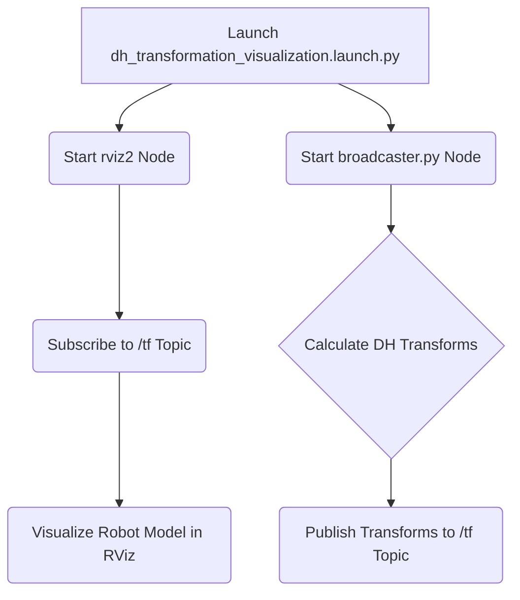
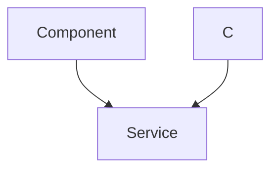

# Denavit-Hartenberg Transformation Visualization

This document outlines the simulation setup used to visualize the Denavit-Hartenberg (DH) transformations of a 3-DOF robotic arm within a ROS 2 environment, utilizing RViz for 3D visualization. The simulation demonstrates how DH parameters define the relationships between the joints of the robot.

## Understanding DH Parameters

DH parameters provide a standardized method for describing the kinematics of robotic manipulators. The four key parameters are:

- **Link Length (a):** The distance between the joint axes.
- **Link Twist (α):** The angle between the joint axes.
- **Link Offset (d):** The distance between the common normal and the previous joint along the joint axis.
- **Joint Angle (θ):** The angle between the common normals.

These parameters are crucial for forward and inverse kinematics calculations, and standardizing frame transformations.

## Simulation Setup

The simulation involves several components:

- **`dh_transformation_visualization.launch.py`:** A launch file that starts the necessary ROS 2 nodes, including the broadcaster and RViz.
- **`broadcaster.py`:** A Python script that calculates and publishes the transformations between the robot's links based on the DH parameters.
- **RViz:** The ROS 2 visualization tool used to display the robot model and its transformations.

## Installation and Execution

### Prerequisites

- ROS 2 (Humble Hawksbill) installed and configured.
- A working ROS 2 workspace (`ros2_ws`).
- The MARIO repository cloned.

### Installation Steps

1.  Copy the simulation files to your ROS 2 workspace:

    ```bash
    cp -r ~/MARIO/2_simulation_dh ~/ros2_ws/src
    ```

2.  Navigate to your ROS 2 workspace:

    ```bash
    cd ~/ros2_ws
    ```

3.  Build the packages:

    ```bash
    colcon build
    ```

4.  Source the workspace:

    ```bash
    source install/setup.bash
    ```

### Running the Simulation

Launch the visualization:

```bash
ros2 launch simulation_dh dh_transformation_visualization.launch.py
```

This command will start RViz and the `broadcaster.py` script, visualizing the robot arm and the transformations based on the defined DH parameters.

## Code Snippets and Explanations

### 1. Launch File (`dh_transformation_visualization.launch.py`)

The launch file defines the nodes that will be executed for the simulation.

```python
#!/usr/bin/python3
import os
from ament_index_python.packages import get_package_share_directory
from launch import LaunchDescription
from launch_ros.actions import Node

def generate_launch_description():
    package_description = "simulation_dh"

    rviz_launch = Node(
            package='rviz2',
            namespace='',
            executable='rviz2',
            name='rviz2',
            parameters=[{'use_sim_time' : True}],
            arguments=['-d' + os.path.join(get_package_share_directory(package_description), 'rviz', 'rviz_config.rviz')]
        )

    python_node = Node(
        package=package_description,
        executable='broadcaster.py'
    )
    return LaunchDescription([
        python_node,
        rviz_launch,
    ])
```

[View on GitHub](https://github.com/SRA-VJTI/MARIO/blob/humble/2_simulation_dh/launch/dh_transformation_visualization.launch.py)

This script launches two nodes: `rviz2` for visualization and `broadcaster.py` to publish the transforms. The `rviz_config.rviz` file specifies the RViz configuration, including the robot model and TF frames to display.

### 2. Transform Broadcaster (`broadcaster.py`) - Initialization

The `broadcaster.py` script publishes the transformations between the robot's links.

```python
import rclpy
from rclpy.node import Node
from geometry_msgs.msg import TransformStamped
import tf2_ros as tf
import numpy as np
import math
import sys

class DHBroadcaster(Node):
    def __init__(self):
        super().__init__('dh_broadcaster')
        self.broadcaster = tf.TransformBroadcaster(self)
        self.timer = self.create_timer(0.2, self.broadcaster_callback)
        # DH parameters initialization...
        self.alpha1 = math.pi/2
        self.d1 = 0.5
        self.a2 = 0.5
        self.theta3 = math.pi/2
        self.alpha3 = math.pi/2
        self.d4 = 0.5
        self.dummy_a3 = 0.1

        self.new_alpha1 = 0.0
        self.new_d1 = 0.0
        self.new_a2 = 0.0
        self.new_theta3 = 0.0
        self.new_alpha3 = 0.0
        self.new_d4 = 0.0
        self.new_dummy_a3 = 0.0

    # ... rest of the class
```

[View on GitHub](https://github.com/SRA-VJTI/MARIO/blob/humble/2_simulation_dh/scripts/broadcaster.py)

This code initializes the ROS 2 node, the TF broadcaster, DH parameters, and a timer to publish the transforms periodically.

### 3. Transform Broadcaster (`broadcaster.py`) - Quaternion Calculation

```python
def quaternion_from_euler(self, ai, aj, ak):
    ai /= 2.0
    aj /= 2.0
    ak /= 2.0
    ci = math.cos(ai)
    si = math.sin(ai)
    cj = math.cos(aj)
    sj = math.sin(aj)
    ck = math.cos(ak)
    sk = math.sin(ak)
    cc = ci*ck
    cs = ci*sk
    sc = si*ck
    ss = si*sk

    q = np.empty((4, ))
    q[0] = cj*sc - sj*cs
    q[1] = cj*ss + sj*cc
    q[2] = cj*cs - sj*sc
    q[3] = cj*cc + sj*ss

    return q
```

[View on GitHub](https://github.com/SRA-VJTI/MARIO/blob/humble/2_simulation_dh/scripts/broadcaster.py)

This function converts Euler angles (roll, pitch, yaw) to a quaternion representation, which is used to define the orientation of each link.

### 4. Transform Broadcaster (`broadcaster.py`) - Transform Publishing

```python
    def get_transform(self, x, y, z, orientation, link, base):
        temp = TransformStamped()
        temp.header.stamp = self.get_clock().now().to_msg()
        temp.header.frame_id = base
        temp.child_frame_id = link
        temp.transform.translation.x = float(x)
        temp.transform.translation.y = float(y)
        temp.transform.translation.z = float(z)
        temp.transform.rotation.x = orientation[0]
        temp.transform.rotation.y = orientation[1]
        temp.transform.rotation.z = orientation[2]
        temp.transform.rotation.w = orientation[3]

        return temp

    def broadcaster_callback(self):
        link1_orientation = self.quaternion_from_euler(self.alpha1, 0, 0)
        link2_orientation = self.quaternion_from_euler(0, 0, 0)
        link3_orientation = self.quaternion_from_euler(self.alpha3, 0, self.theta3)
        link4_orientation = self.quaternion_from_euler(0, 0, 0)

        link1_to_base_transform = self.get_transform(0, 0, self.d1, link1_orientation, 'link1', 'base')
        link2_to_link1_transform = self.get_transform(self.a2, 0, 0, link2_orientation, 'link2', 'link1')
        link3_to_link2_transform = self.get_transform(self.dummy_a3, 0, 0, link3_orientation, 'link3', 'link2')
        link4_to_link3_transform = self.get_transform(0, 0, self.d4, link4_orientation, 'link4', 'link3')

        self.broadcaster.sendTransform(link1_to_base_transform)
        self.broadcaster.sendTransform(link2_to_link1_transform)
        self.broadcaster.sendTransform(link3_to_link2_transform)
        self.broadcaster.sendTransform(link4_to_link3_transform)
```

[View on GitHub](https://github.com/SRA-VJTI/MARIO/blob/humble/2_simulation_dh/scripts/broadcaster.py)

This code creates `TransformStamped` messages and publishes them using the `tf2_ros` broadcaster. The `get_transform` function creates the transform message, and the `broadcaster_callback` function sends the transforms for each link.

### 5. Broadcaster Animation logic

```python
 # Tracing from base and link1
    def animation_broadcaster(self):
      #Tracing logic defined here
        link1_orientation = self.quaternion_from_euler(self.alpha1, 0, 0)
        link2_orientation = self.quaternion_from_euler(0, 0, 0)
        link3_orientation = self.quaternion_from_euler(self.alpha3, 0, self.theta3)
        link4_orientation = self.quaternion_from_euler(0, 0, 0)
        
        if self.new_d1 < self.d1:
            self.new_d1 = self.new_d1 + 0.005
            new_link1_orientation = self.quaternion_from_euler(self.new_alpha1, 0, 0)
            mobile1_to_link1_transform = self.get_transform(0, 0, self.new_d1, new_link1_orientation, 'mobile1', 'base')
            self.broadcaster.sendTransform(mobile1_to_link1_transform)

        elif self.new_alpha1 < self.alpha1 and self.new_d1 >= self.d1:
            self.new_alpha1 = self.new_alpha1 + 0.015
            new_link1_orientation = self.quaternion_from_euler(self.new_alpha1, 0, 0)
            mobile1_to_link1_transform = self.get_transform(0, 0, self.new_d1, new_link1_orientation, 'mobile1', 'base')
            self.broadcaster.sendTransform(mobile1_to_link1_transform)

        # Tracing from link1 and link2
        elif self.new_alpha1 >= self.alpha1 and self.new_d1 >= self.d1 and self.new_a2 < self.a2:
            if self.new_a2 < self.a2:
                self.new_a2 = self.new_a2 + 0.005
                mobile2_to_link2_transform = self.get_transform(self.new_a2, 0, 0, link2_orientation, 'mobile2', 'link1')
                self.broadcaster.sendTransform(mobile2_to_link2_transform)

        # Tracing from link2 and link3
        elif self.new_alpha1 >= self.alpha1 and self.new_d1 >= self.d1 and self.new_a2 >= self.a2:
            if self.new_theta3 < self.theta3:
                self.new_theta3 = self.new_theta3 + 0.015
                new_link3_orientation = self.quaternion_from_euler(self.new_alpha3, 0, self.new_theta3)
                mobile3_to_link3_transform = self.get_transform(0, 0, 0, new_link3_orientation, 'mobile3', 'link2')
                self.broadcaster.sendTransform(mobile3_to_link3_transform)
            elif self.new_alpha3 < self.alpha3 and self.new_theta3 >= self.theta3:
                self.new_alpha3 = self.new_alpha3 + 0.015
                self.new_dummy_a3 = self.new_dummy_a3 + 0.00095493
                new_link3_orientation = self.quaternion_from_euler(self.new_alpha3, 0, self.new_theta3)
                mobile3_to_link3_transform = self.get_transform(self.new_dummy_a3, 0, 0, new_link3_orientation, 'mobile3', 'link2')
                self.broadcaster.sendTransform(mobile3_to_link3_transform)

        # Tracing from link3 and link4
        elif self.new_alpha1 >= self.alpha1 and self.new_d1 >= self.d1 and self.new_a2 >= self.a2 and self.new_theta3 >= self.theta3 and self.new_alpha3 >= self.alpha3 and self.new_d4 < self.d4:
            self.new_d4 = self.new_d4 + 0.005
            mobile4_to_link4_transform = self.get_transform(0, 0, self.new_d4, link4_orientation, 'mobile4', 'link3')
            self.broadcaster.sendTransform(mobile4_to_link4_transform)

        # All parameters values are reset
        elif self.new_alpha1 >= self.alpha1 and self.new_d1 >= self.d1 and self.new_a2 >= self.a2 and self.new_theta3 >= self.theta3 and self.new_alpha3 >= self.alpha3 and self.new_d4 >= self.d4:
            self.new_alpha1 = 0
            self.new_d1 = 0
            self.new_a2 = 0
            self.new_theta3 = 0
            self.new_alpha3 = 0
            self.new_d4 = 0
            self.new_dummy_a3 = 0
```

[View on GitHub](https://github.com/SRA-VJTI/MARIO/blob/humble/2_simulation_dh/scripts/broadcaster.py)

This code animates the DH parameters step by step. This part incrementally updates the parameters and publishes the transforms to visualize the changes in RViz.

## Visualization Flow





This diagram illustrates the flow of data and execution in the DH transformation visualization. The launch file starts the RViz node and the transform broadcaster node. The broadcaster calculates the DH transforms and publishes them to the `/tf` topic. RViz subscribes to this topic and visualizes the robot model based on the received transforms.

## Key Integration Points

1.  **TF (Transformations):** The `tf2_ros` library is crucial for managing the transformations between different coordinate frames. The `TransformBroadcaster` publishes the transformations, and RViz uses these transformations to display the robot model correctly.

2.  **RViz Configuration:** The `rviz_config.rviz` file defines the RViz settings, including the fixed frame, the displayed robot model, and the TF frames to visualize. Properly configuring RViz is essential for a clear and informative visualization.

## Best Practices

-   **Modular Design:** Break down the simulation into smaller, reusable components. For example, the DH parameter calculations and the TF broadcasting can be separated into different functions or classes.
-   **Parameterization:** Use ROS 2 parameters to configure the simulation. This allows you to easily modify the DH parameters and other settings without modifying the code.
-   **Error Handling:** Implement error handling to catch potential issues, such as invalid DH parameters or TF lookup failures.
-   **Clear Visualization:** Use RViz effectively to visualize the robot model, TF frames, and other relevant information. This can help you understand the simulation and debug any issues.

## Sequence of events





This sequence diagram illustrates the main steps of the DH transformation visualization, focusing on the interaction between `broadcaster.py` and RViz.

By following these guidelines, you can effectively simulate and visualize DH transformations of robotic manipulators in ROS 2.
```