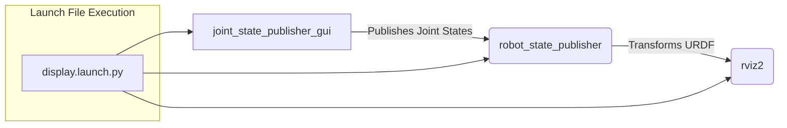
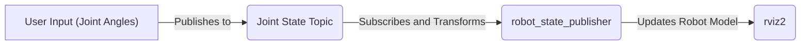

# Rviz Visualization

This section explores the configuration and usage of RViz (ROS Visualization) for visualizing the robotic arm model and simulated data within the MARIO project. RViz is a powerful tool for visualizing robot models, sensor data, and other relevant information in a 3D environment, aiding in development, debugging, and testing.

## Running the RViz Demo

The following steps outline how to run the RViz demo to visualize the MARIO robotic arm:

1.  **Source ROS Environment:**

    Before running any ROS commands, ensure the ROS environment is properly sourced in each terminal.

    ```bash
    source install/setup.bash
    ```

2.  **Launch the Display File (with GUI):**

    This command launches the RViz environment with a GUI, allowing interactive joint control.

    ```bash
    ros2 launch simulation_rviz display.launch.py
    ```
    [View on GitHub](https://github.com/SRA-VJTI/MARIO/blob/humble/3_simulation_rviz/README.md)

3.  **Handling Missing GUI Package:**

    If you encounter an error indicating that the `joint_state_publisher_gui` package is missing, install it using:

    ```bash
    sudo apt install ros-<your_version_of_ros>-joint-state-publisher-gui
    ```

    Replace `<your_version_of_ros>` with the specific ROS distribution you're using (e.g., `humble`, `iron`). Install other missing packages as needed.

4.  **Launch the RViz File (Command Line Input):**

    For controlling the robot arm via command-line inputs, use this command.

    ```bash
    ros2 launch simulation_rviz rviz.launch.py
    ```
    [View on GitHub](https://github.com/SRA-VJTI/MARIO/blob/humble/3_simulation_rviz/README.md)

5.  **Run the Python Script for Angle Input:**

    This runs a Python script that prompts you to enter joint angles from the command line.

    ```bash
    ros2 run simulation_rviz rviz.py
    ```
    [View on GitHub](https://github.com/SRA-VJTI/MARIO/blob/humble/3_simulation_rviz/README.md)

6.  **View Active Topics:**

    To see the list of topics being published, use:

    ```bash
    ros2 topic list
    ```

    This command is useful to verify that the joint angles are being published.

7.  **Observe Published Data:**

    To observe the data being published on a specific topic:

    ```bash
    ros2 topic echo /joint_states # Replace /joint_states with the topic you want to inspect
    ```

    Initially, set all joint values to zero to observe the manipulator's default position.

## Configuration File: `manipulator.yaml`

The `manipulator.yaml` file configures the controllers used for the robotic arm, including the `joint_state_broadcaster`, `forward_position_controller`, and `joint_trajectory_position_controller`.

```yaml
controller_manager:
  ros__parameters:
    update_rate: 10  # Hz

    joint_state_broadcaster:
      type: joint_state_broadcaster/JointStateBroadcaster

    forward_position_controller:
      type: forward_command_controller/ForwardCommandController

    joint_trajectory_position_controller:
      type: joint_trajectory_controller/JointTrajectoryController


forward_position_controller:
  ros__parameters:
    joints:
      - joint_1
      - joint_2
      - joint_3
      - joint_4
      - joint_5
    interface_name: position


joint_trajectory_position_controller:
  ros__parameters:
    joints:
      - joint_1
      - joint_2
      - joint_3
      - joint_4
      - joint_5

    command_interfaces:
      - position

    state_interfaces:
      - position

    action_monitor_rate: 20.0 # Defaults to 20

    allow_partial_joints_goal: false # Defaults to false
    open_loop_control: true
    allow_integration_in_goal_trajectories: true
    constraints:
      stopped_velocity_tolerance: 0.01 # Defaults to 0.01
      goal_time: 0.0 # Defaults to 0.0 (start immediately)
```
[View on GitHub](https://github.com/SRA-VJTI/MARIO/blob/humble/3_simulation_rviz/config/manipulator.yaml)

*   **`update_rate`**: Specifies the frequency (in Hz) at which the controller manager updates.
*   **`joint_state_broadcaster`**:  Broadcasts the current state of the robot's joints.
*   **`forward_position_controller`**: A simple controller that directly sets joint positions.
*   **`joint_trajectory_position_controller`**:  A more advanced controller that can execute joint trajectories.
*   **`joints`**: Lists the joints controlled by each controller.
*   **`interface_name`**: Specifies the control interface (e.g., `position`).

## Launch File: `display.launch.py`

The `display.launch.py` file is responsible for launching the necessary ROS nodes to visualize the robot model in RViz. It includes nodes for the joint state publisher, robot state publisher, and RViz itself.

```python
#!/usr/bin/python3
# with GUI 
import os
from ament_index_python.packages import get_package_share_directory
from launch import LaunchDescription
from launch.actions import DeclareLaunchArgument,  ExecuteProcess, RegisterEventHandler
from launch.substitutions import Command
from launch_ros.actions import Node
import launch_ros.actions
from launch.event_handlers import (OnProcessStart, OnProcessExit)
from launch_ros.descriptions import ParameterValue
import random

# this is the function launch  system will look for
def generate_launch_description():
    ####### DATA INPUT ##########
    urdf_file = 'manipulator.urdf'
    #xacro_file = "box_bot.xacro"robot_description
    package_description = "simulation_rviz"
    ####### DATA INPUT END ##########
    config = os.path.join( get_package_share_directory('simulation_rviz'),
    'config',
    'manipulator.yaml'
    )
    robot_desc_path = os.path.join(get_package_share_directory(package_description), "urdf", urdf_file)
    print("Fetching URDF ==>")

    joint_state_publisher = Node(
            package="joint_state_publisher_gui",
            executable="joint_state_publisher_gui"
            )


    # Robot State Publisher
    robot_state_publisher_node = Node(
        package='robot_state_publisher',
        executable='robot_state_publisher',
        name='robot_state_publisher',
        emulate_tty=True,
        parameters=[{'use_sim_time': True, '-r': 10, 'robot_description': ParameterValue(Command(['xacro ',robot_desc_path]), value_type=str)}],
        output="screen"
    )

    rviz_launch = Node(
            package='rviz2',
            namespace='',
            executable='rviz2',
            name='rviz2',
            parameters=[{'use_sim_time' : True}],
            arguments=['-d' + os.path.join(get_package_share_directory(package_description), 'rviz', 'manipulator.rviz')]
        )
    tf2_link1 = Node(
            package='tf2_ros',
            namespace='',
            executable='static_transform_publisher',
            arguments=["-0.0030196", "0.046937", "0.0635", "0", "0", "0", "base_link", "link_1"]
        )
    tf2_link2 = Node(
            package='tf2_ros',
            namespace='',
            executable='static_transform_publisher',
            arguments=["0.00031511", "-0.0095653", "0.034407", "0", "0", "0", "link_1", "link_2"]
        )

    tf2_link3 = Node(
            package='tf2_ros',
            namespace='',
            executable='static_transform_publisher',
            arguments=["0.071531", "0.011279", "-0.0041348", "0", "0", "0", "link_2", "link_3"]
        )
    
    tf2_claw_right = Node(
            package='tf2_ros',
            namespace='',
            executable='static_transform_publisher',
            arguments=["0.020925", "-0.013767", "-0.090331", "0", "0", "0", "link_3", "claw_right"]
        )
    
    tf2_claw_left = Node(
            package='tf2_ros',
            namespace='',
            executable='static_transform_publisher',
            arguments=["0.0091023", "0.0182709", "-0.090512", "0", "0", "0", "link_3", "claw_left"]
        )
    print("==> Using Sim time\n")
    return LaunchDescription([  

        tf2_link1,tf2_link2,tf2_link3,tf2_claw_left,tf2_claw_right,
        robot_state_publisher_node,
        rviz_launch,
        joint_state_publisher,
    ])
```
[View on GitHub](https://github.com/SRA-VJTI/MARIO/blob/humble/3_simulation_rviz/launch/display.launch.py)

Key Nodes Launched:

*   **`joint_state_publisher_gui`**: Provides a GUI for manually controlling joint angles.

*   **`robot_state_publisher`**:  Transforms the robot's URDF model based on joint states, making it visible in RViz. The `robot_description` parameter is crucial here, loading the URDF model. The `use_sim_time` parameter tells the robot state publisher to use the simulation time.

    ```python
    robot_state_publisher_node = Node(
        package='robot_state_publisher',
        executable='robot_state_publisher',
        name='robot_state_publisher',
        emulate_tty=True,
        parameters=[{'use_sim_time': True, '-r': 10, 'robot_description': ParameterValue(Command(['xacro ',robot_desc_path]), value_type=str)}],
        output="screen"
    )
    ```
    [View on GitHub](https://github.com/SRA-VJTI/MARIO/blob/humble/3_simulation_rviz/launch/display.launch.py)

*   **`rviz2`**: Launches the RViz application itself, configured with the `manipulator.rviz` configuration file.

    ```python
    rviz_launch = Node(
        package='rviz2',
        namespace='',
        executable='rviz2',
        name='rviz2',
        parameters=[{'use_sim_time' : True}],
        arguments=['-d' + os.path.join(get_package_share_directory(package_description), 'rviz', 'manipulator.rviz')]
    )
    ```
    [View on GitHub](https://github.com/SRA-VJTI/MARIO/blob/humble/3_simulation_rviz/launch/display.launch.py)
*   **`tf2_ros`**: Launches static transform publishers to define the static relationships between the robot's links.





## Key Integration Points

*   **URDF Model Loading**: The `robot_state_publisher` relies on the URDF (or XACRO) model of the robot, specified via the `robot_description` parameter. This model defines the robot's physical structure, including links, joints, and visual properties.

*   **Joint State Publishing**:  The `joint_state_publisher` (or `joint_state_publisher_gui`) provides the joint angles, which are then used by the `robot_state_publisher` to update the robot's pose in RViz.

*   **RViz Configuration**: The `manipulator.rviz` configuration file defines the RViz layout, including the displayed axes, robot model visualization, and other visual elements.

## Best Practices

*   **Verify Topic Names**: Ensure that the topic names used in the launch file and configuration files match the actual topics being published by the controllers.

*   **Check URDF Path**: Double-check the path to the URDF file to avoid errors during robot model loading.

*   **Use Simulation Time**:  Set the `use_sim_time` parameter to `True` in both the `robot_state_publisher` and `rviz2` nodes to ensure that the simulation time is used. This is crucial when working with simulated environments.

*   **Static Transforms**: Correctly define static transforms between links using `tf2_ros` to ensure accurate robot representation.




