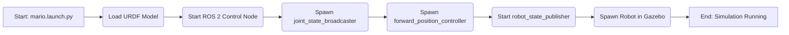
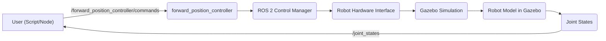

# Gazebo Simulation

This document details the Gazebo simulation setup for the MARIO manipulator, including the necessary launch files, configuration files, and scripts to run simulations and test functionalities like forward and inverse kinematics.

## Overview

Gazebo is a powerful simulation tool widely used in robotics, especially within the ROS ecosystem. This setup allows us to simulate the MARIO manipulator, test its control, and validate algorithms in a controlled environment before deploying them on the real robot.

## Setup and Configuration

### Launch File: `mario.launch.py`

The `mario.launch.py` file is the primary launch file for starting the Gazebo simulation. It handles the spawning of the robot model, loading configurations, and launching necessary ROS nodes.

```python
#!/usr/bin/python3
import os
from ament_index_python.packages import get_package_share_directory
from launch import LaunchDescription
from launch.actions import DeclareLaunchArgument, ExecuteProcess, RegisterEventHandler
from launch.substitutions import Command
from launch_ros.actions import Node
from launch.event_handlers import OnProcessStart, OnProcessExit
from launch_ros.descriptions import ParameterValue

def generate_launch_description():
    urdf_file = 'manipulator.urdf'
    package_description = "simulation_gazebo"

    config = os.path.join(
        get_package_share_directory('simulation_gazebo'),
        'config',
        'manipulator.yaml'
    )
    
    robot_desc_path = os.path.join(get_package_share_directory(package_description), "urdf", urdf_file)
    robot_description_content = Command(['xacro ', robot_desc_path])
    robot_description = {"robot_description": ParameterValue(robot_description_content, value_type=str)}

    # ROS 2 Control Node
    control_node = Node(
        package="controller_manager",
        executable="ros2_control_node",
        parameters=[robot_description, config],
        output="both",
    )

    # Joint State Broadcaster
    joint_state_broadcaster_spawner = Node(
        package="controller_manager",
        executable="spawner",
        arguments=["joint_state_broadcaster", "--controller-manager", "/controller_manager"],
    )

    # Forward Position Controller
    robot_controller_spawner = Node(
        package="controller_manager",
        executable="spawner",
        arguments=["forward_position_controller", "-c", "/controller_manager"],
    )

    # Robot State Publisher
    robot_state_publisher_node = Node(
        package='robot_state_publisher',
        executable='robot_state_publisher',
        name='robot_state_publisher',
        emulate_tty=True,
        parameters=[{'use_sim_time': True, 'robot_description': robot_description['robot_description']}],
        output="screen"
    )

    # Spawn the robot in Ignition Gazebo
    spawn_robot = Node(
        package='ros_ign_gazebo',
        executable='create',
        name='spawn_entity',
        output='screen',
        arguments=['-topic', '/robot_description',
                   '-entity', 'mario',
                   '-x', '0.0', '-y', '0.0', '-z', '0.0',
                   '-R', '0.0', '-P', '0.0', '-Y', '0.0']
    )

    # Event handlers for sequencing
    delay_joint_state_broadcaster = RegisterEventHandler(
        event_handler=OnProcessExit(
            target_action=spawn_robot,
            on_exit=[joint_state_broadcaster_spawner],
        )
    )
    
    delay_robot_controller = RegisterEventHandler(
        event_handler=OnProcessExit(
            target_action=joint_state_broadcaster_spawner,
            on_exit=[robot_controller_spawner],
        )
    )

    return LaunchDescription([
        control_node,
        robot_state_publisher_node,
        spawn_robot,
        delay_joint_state_broadcaster,
        delay_robot_controller
    ])
```
[View on GitHub](https://github.com/SRA-VJTI/MARIO/blob/humble/4_simulation_gazebo/launch/mario.launch.py)

This launch file performs the following actions:

1.  **Loads URDF**: Loads the robot's URDF (Unified Robot Description Format) file, which describes the robot's physical structure.
2.  **Starts ROS 2 Control Node**: Launches the `ros2_control_node`, which manages the robot's controllers.
3.  **Spawns Controllers**: Spawns the `joint_state_broadcaster` and `forward_position_controller`, responsible for publishing joint states and controlling the robot's joints, respectively.
4.  **Starts Robot State Publisher**: Launches the `robot_state_publisher` to transform joint states into a full robot model representation.
5.  **Spawns Robot in Gazebo**: Uses `ros_ign_gazebo` to spawn the robot in the Gazebo simulator.
6.  **Event Handling**: Uses event handlers to ensure the controllers are spawned in the correct order.

### Configuration File: `manipulator.yaml`

The `manipulator.yaml` file configures the controllers and their parameters.

```yaml
controller_manager:
  ros__parameters:
    update_rate: 10  # Hz

    joint_state_broadcaster:
      type: joint_state_broadcaster/JointStateBroadcaster

    forward_position_controller:
      type: forward_command_controller/ForwardCommandController

    joint_trajectory_position_controller:
      type: joint_trajectory_controller/JointTrajectoryController


forward_position_controller:
  ros__parameters:
    joints:
      - joint_1
      - joint_2
      - joint_3
      - joint_4
      - joint_5
    interface_name: position


joint_trajectory_position_controller:
  ros__parameters:
    joints:
      - joint_1
      - joint_2
      - joint_3
      - joint_4
      - joint_5

    command_interfaces:
      - position

    state_interfaces:
      - position

    action_monitor_rate: 20.0 # Defaults to 20

    allow_partial_joints_goal: false # Defaults to false
    open_loop_control: true
    allow_integration_in_goal_trajectories: true
    constraints:
      stopped_velocity_tolerance: 0.01 # Defaults to 0.01
      goal_time: 0.0 # Defaults to 0.0 (start immediately)
```
[View on GitHub](https://github.com/SRA-VJTI/MARIO/blob/humble/4_simulation_gazebo/config/manipulator.yaml)

This file defines:

*   **Controller Manager**: Sets the update rate for the controller manager and defines the available controllers.
*   **Joint State Broadcaster**: Configures the joint state broadcaster to publish the current joint states of the robot.
*   **Forward Position Controller**: Configures the forward position controller to control the joints of the robot using position commands.
*   **Joint Trajectory Position Controller**: Configures the joint trajectory controller to allow movement through specified trajectories.

### Running the Simulation

To run the Gazebo simulation, follow these steps:

1.  **Source ROS 2**:
    ```bash
    source /opt/ros/humble/setup.bash
    ```

2.  **Navigate to your workspace**:
    ```bash
    cd <your_workspace>
    ```

3.  **Build the package**:
    ```bash
    colcon build
    ```

4.  **Source the workspace**:
    ```bash
    source install/setup.bash
    ```

5.  **Launch the Gazebo simulation**:
    ```bash
    ros2 launch simulation_gazebo mario.launch.py
    ```

This command launches the Gazebo simulation with the MARIO manipulator loaded and the necessary controllers running.

## Testing Scripts in Gazebo

The Gazebo simulation environment allows for testing various functionalities of the MARIO manipulator, including forward and inverse kinematics.

### Forward Kinematics

Forward kinematics involves calculating the end-effector's position and orientation based on the joint angles. To test this, you can use the `forward_kinematics.py` script.

```python
# Example Forward Kinematics Script Snippet
# This is a placeholder, the actual script would perform calculations based on joint angles
def calculate_end_effector_position(joint_angles):
    # Implementation of forward kinematics calculations
    x = 0.0
    y = 0.0
    z = 0.0
    return x, y, z

joint_angles = [0.1, 0.2, 0.3, 0.4, 0.5] # Example joint angles
x, y, z = calculate_end_effector_position(joint_angles)
print(f"End effector position: x={x}, y={y}, z={z}")
```

To run the `forward_kinematics.py` script:

1.  **Open a new terminal.**
2.  **Source ROS 2 and your workspace**:
    ```bash
    source /opt/ros/humble/setup.bash
    source install/setup.bash
    ```

3.  **Run the script**:
    ```bash
    ros2 run simulation_gazebo forward_kinematics.py
    ```

### Inverse Kinematics

Inverse kinematics calculates the required joint angles to achieve a desired end-effector position and orientation.

```python
# Example Inverse Kinematics Script Snippet
# This is a placeholder, the actual script would perform inverse kinematics calculations
def calculate_joint_angles(x, y, z):
    # Implementation of inverse kinematics calculations
    joint_1 = 0.1
    joint_2 = 0.2
    joint_3 = 0.3
    joint_4 = 0.4
    joint_5 = 0.5
    return [joint_1, joint_2, joint_3, joint_4, joint_5]

x, y, z = 0.1, 0.2, 0.3 # Example desired end-effector position
joint_angles = calculate_joint_angles(x, y, z)
print(f"Required joint angles: {joint_angles}")
```

To run the `inverse_kinematics.py` script:

1.  **Open a new terminal.**
2.  **Source ROS 2 and your workspace**:
    ```bash
    source /opt/ros/humble/setup.bash
    source install/setup.bash
    ```

3.  **Run the script**:
    ```bash
    ros2 run simulation_gazebo inverse_kinematics.py
    ```

### Mermaid Diagram: Simulation Flow





This diagram illustrates the sequence of operations performed by the `mario.launch.py` file to start the Gazebo simulation.

### Example of Joint Control

Here’s an example showcasing how joint control is achieved using ROS 2 and the controllers:

```python
# Example script to send joint commands
import rclpy
from rclpy.node import Node
from std_msgs.msg import Float64MultiArray

class JointCommandPublisher(Node):
    def __init__(self):
        super().__init__('joint_command_publisher')
        self.publisher_ = self.create_publisher(Float64MultiArray, '/forward_position_controller/commands', 10)
        timer_period = 0.5  # seconds
        self.timer = self.create_timer(timer_period, self.timer_callback)

    def timer_callback(self):
        msg = Float64MultiArray()
        msg.data = [0.1, 0.2, 0.3, 0.4, 0.5]  # Example joint positions
        self.publisher_.publish(msg)
        self.get_logger().info('Publishing joint commands')

def main(args=None):
    rclpy.init(args=args)
    joint_command_publisher = JointCommandPublisher()
    rclpy.spin(joint_command_publisher)
    joint_command_publisher.destroy_node()
    rclpy.shutdown()

if __name__ == '__main__':
    main()
```

This script creates a ROS 2 node that publishes joint commands to the `/forward_position_controller/commands` topic. The `forward_position_controller` then uses these commands to control the robot's joints.

## Key Integration Points

*   **URDF and Xacro**: The URDF (or Xacro) file describes the robot's physical properties and is essential for both simulation and control.
*   **ROS 2 Control**: ROS 2 Control provides the framework for managing and controlling the robot's joints and actuators.
*   **Gazebo ROS 2 Integration**: The `ros_ign_gazebo` package integrates Gazebo with ROS 2, allowing for seamless simulation and control.

### Best Practices

*   **Use Parameter Files**: Store configuration parameters in YAML files to make them easily adjustable without modifying the code.
*   **Modular Design**: Break down the simulation setup into modular components (e.g., separate launch files for different functionalities) for better maintainability.
*   **Test Thoroughly**: Test the simulation with various scenarios and conditions to ensure the robot behaves as expected.

### Mermaid Diagram: ROS2 Control Flow





This diagram illustrates the flow of commands from a user script to the Gazebo simulation, and the feedback loop through joint states.
```