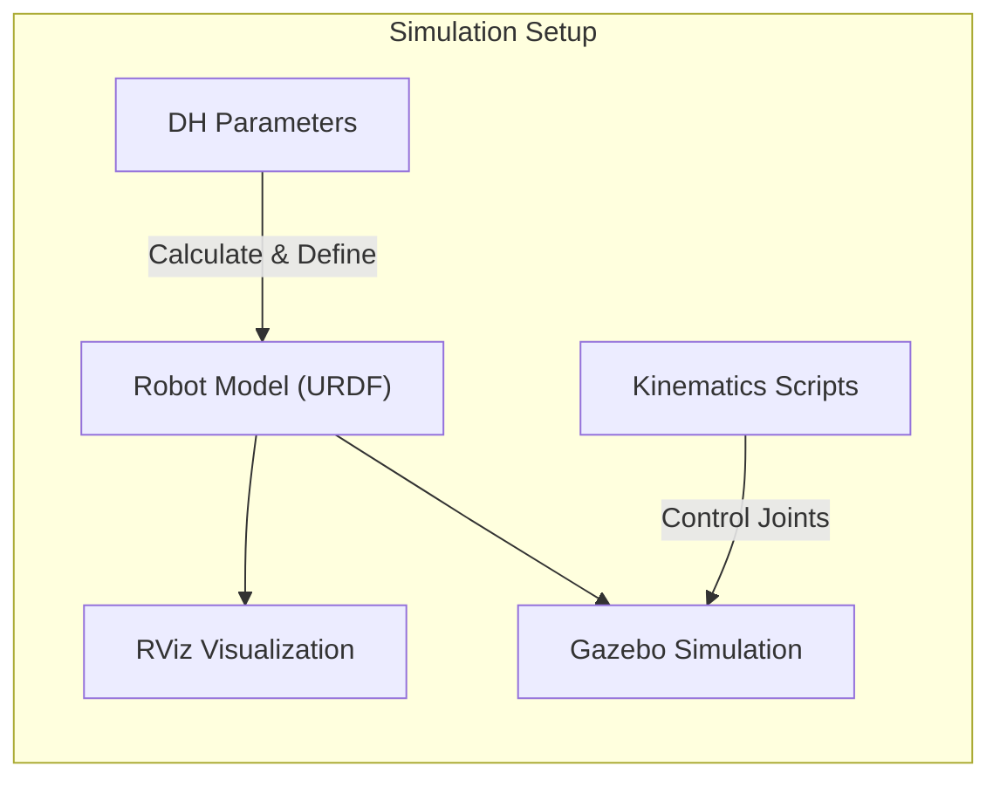
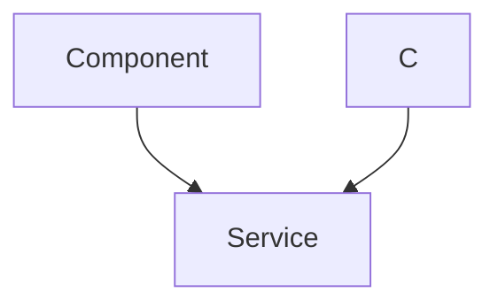

# ROS2 Simulation Environments

This section details the ROS2 simulation setups used for various aspects of the robotic arm MARIO, focusing on DH parameter visualization, RViz integration, and Gazebo simulation. These simulations are crucial for understanding the robot's kinematics, visualizing its movements, and testing control algorithms in a realistic environment.

## DH Parameter Visualization in RViz

This subsection explains how to visualize Denavit-Hartenberg (DH) parameters using RViz, ROS 2's 3D visualization tool. DH parameters are essential for defining the pose of each link in the robotic arm.

### Understanding DH Parameters
DH parameters provide a standardized way to represent the geometry of robotic manipulators. They consist of four parameters for each joint: link length, link twist, link offset, and joint angle.

*   **Link Length:** The distance between two joint axes.
*   **Link Twist:** The angle between two joint axes.
*   **Link Offset:** The distance between the common normal and the previous joint along the z-axis.
*   **Joint Angle:** The angle between the two common normals.

### Installation and Setup

To run the DH parameter visualization, follow these steps:

1.  **Copy the simulation files:**
    Copy the `2_simulation_dh` directory to your ROS 2 workspace.
    ```bash
    cp -r ~/MARIO/2_simulation_dh ~/ros2_ws/src
    ```
    [View on GitHub](https://github.com/SRA-VJTI/MARIO/blob/humble/2_simulation_dh)

2.  **Navigate to your ROS 2 workspace:**
    ```bash
    cd ~/ros2_ws
    ```

3.  **Build the packages:**
    ```bash
    colcon build
    ```

4.  **Source the workspace:**
    ```bash
    source install/setup.bash
    ```

### Running the Visualization

Launch the visualization using the following command:

```bash
ros2 launch simulation_dh dh_transformation_visualization.launch.py
```

This command starts RViz and loads the necessary configurations to visualize the DH parameters. The visualization helps in understanding the spatial relationships between different joints of the robot.

### Code Snippet: Launch File Example
Here's an example of the launch file (`dh_transformation_visualization.launch.py`) used to start the visualization:

```python
from launch import LaunchDescription
from launch_ros.actions import Node

def generate_launch_description():
    return LaunchDescription([
        Node(
            package='simulation_dh',
            executable='dh_visualization',
            name='dh_visualization_node',
            output='screen'
        )
    ])
```

This launch file creates a ROS 2 node that publishes the DH parameter transformations to RViz. [View on GitHub](https://github.com/SRA-VJTI/MARIO/blob/humble/2_simulation_dh/launch/dh_transformation_visualization.launch.py)

## RViz Simulation

RViz is a powerful 3D visualization tool in ROS2. This section explains how to use RViz to visualize the URDF model of the MARIO robotic arm and control it using joint state publishers.

### Prerequisites
*   ROS 2 installed and configured
*   `joint_state_publisher` and `joint_state_publisher_gui` packages

### Installation Steps
If you encounter errors indicating missing packages, install them using:
```bash
sudo apt install ros-<your_ros_version>-joint-state-publisher-gui
```
Replace `<your_ros_version>` with your ROS 2 distribution name (e.g., `humble`, `iron`).

### Running the RViz Simulation
1.  **Launch the RViz display:**
    ```bash
    ros2 launch simulation_rviz display.launch.py
    ```
    This command launches RViz with a pre-configured display that shows the URDF model of the robotic arm.

2.  **Control the arm using the GUI:**
    If the GUI doesn't appear, ensure `joint_state_publisher_gui` is installed correctly. You can then adjust the joint angles using the GUI sliders.

3.  **Control the arm using the command line:**
    ```bash
    ros2 launch simulation_rviz rviz.launch.py
    ros2 run simulation_rviz rviz.py
    ```
    The `rviz.py` script allows you to input joint angles directly from the command line.

### Code Snippet: RViz Launch File

```python
from launch import LaunchDescription
from launch_ros.actions import Node
from launch.actions import DeclareLaunchArgument
from launch.substitutions import Command, FindExecutable, PathJoinSubstitution
from launch_ros.substitutions import FindPackageShare

def generate_launch_description():
    # Declare arguments
    declared_arguments = []
    declared_arguments.append(
        DeclareLaunchArgument(
            "gui",
            default_value="true",
            description="Start RViz2 automatically with this launch file.",
        )
    )

    # Get URDF via xacro
    robot_description_content = Command(
        [
            PathJoinSubstitution([FindExecutable(name="xacro")]),
            " ",
            PathJoinSubstitution(
                [FindPackageShare("simulation_rviz"), "urdf", "mario.urdf.xacro"]
            ),
        ]
    )
    robot_description = {"robot_description": robot_description_content}


    robot_state_publisher_node = Node(
        package="robot_state_publisher",
        executable="robot_state_publisher",
        output="screen",
        parameters=[robot_description],
    )

    joint_state_publisher_node = Node(
        package="joint_state_publisher",
        executable="joint_state_publisher",
        name="joint_state_publisher",
        condition=IfCondition(PythonExpression(["not ", LaunchConfiguration("gui")])),
    )
    joint_state_publisher_gui_node = Node(
        package="joint_state_publisher_gui",
        executable="joint_state_publisher_gui",
        name="joint_state_publisher_gui",
        condition=IfCondition(LaunchConfiguration("gui")),
    )

    rviz_node = Node(
        package="rviz2",
        executable="rviz2",
        name="rviz2",
        arguments=["-d", PathJoinSubstitution([FindPackageShare("simulation_rviz"), "rviz", "urdf.rviz"])],
        output="screen",
    )

    nodes = [
        robot_state_publisher_node,
        joint_state_publisher_node,
        joint_state_publisher_gui_node,
        rviz_node,
    ]

    return LaunchDescription(declared_arguments + nodes)

```
This launch file configures the robot state publisher, joint state publisher, and RViz to visualize the robotic arm based on its URDF description. [View on GitHub](https://github.com/SRA-VJTI/MARIO/blob/humble/3_simulation_rviz/launch/display.launch.py)

### Monitoring ROS Topics
To verify that the joint states are being published correctly, use the following commands:

*   **List active topics:**
    ```bash
    ros2 topic list
    ```

*   **Echo a specific topic:**
    ```bash
    ros2 topic echo /joint_states
    ```

These commands help you monitor the data being published and ensure that the joint angles are being updated as expected.

## Gazebo Simulation

Gazebo is a powerful tool to simulate robots in a 3D environment. This section describes how to simulate the MARIO robotic arm in Gazebo and test forward and inverse kinematics scripts.

### Installation and Setup
If you have not installed the `joint_state_publishers` and `ros_control` packages, follow the instructions in the repository: [View on GitHub](https://github.com/SRA-VJTI/MARIO/tree/master/4_simulation_gazebo)

### Running the Gazebo Simulation

1.  **Launch the Gazebo world:**
    ```bash
    ros2 launch simulation_gazebo basic_gazebo.launch.py
    ```
    This command launches Gazebo with a basic world containing the MARIO robotic arm.

### Testing Kinematics Scripts
1.  **Source ROS 2:**
    ```bash
    source /opt/ros/humble/setup.bash
    ```

2.  **Build the `simulation_gazebo` package:**
    ```bash
    colcon build
    ```

3.  **Source the workspace:**
    ```bash
    source install/setup.bash
    ```

4.  **Run the `forward_kinematics.py` script:**
    ```bash
    ros2 run simulation_gazebo forward_kinematics.py
    ```

5.  **Run the `inverse_kinematics.py` script:**
    ```bash
    ros2 run simulation_gazebo inverse_kinematics.py
    ```

### Code Snippet: Forward Kinematics Script (Example)

```python
import rclpy
from rclpy.node import Node
from std_msgs.msg import Float64MultiArray

class ForwardKinematics(Node):

    def __init__(self):
        super().__init__('forward_kinematics')
        self.publisher_ = self.create_publisher(Float64MultiArray, '/joint_commands', 10)
        timer_period = 5  # seconds
        self.timer = self.create_timer(timer_period, self.timer_callback)

    def timer_callback(self):
        msg = Float64MultiArray()
        msg.data = [0.5, 0.5, 0.5]  # Example joint angles
        self.publisher_.publish(msg)
        self.get_logger().info('Publishing: "%s"' % msg.data)

def main(args=None):
    rclpy.init(args=args)
    forward_kinematics = ForwardKinematics()
    rclpy.spin(forward_kinematics)
    forward_kinematics.destroy_node()
    rclpy.shutdown()

if __name__ == '__main__':
    main()
```

This script publishes example joint angles to the `/joint_commands` topic, which drives the robotic arm in the Gazebo simulation. [View on GitHub](https://github.com/SRA-VJTI/MARIO/blob/humble/4_simulation_gazebo/forward_kinematics.py)

### Code Snippet: Gazebo Launch File (Example)

```python
from launch import LaunchDescription
from launch.actions import IncludeLaunchDescription
from launch.launch_description_sources import PythonLaunchDescriptionSource
from launch.substitutions import Command, FindExecutable, PathJoinSubstitution
from launch_ros.actions import Node
from launch_ros.substitutions import FindPackageShare
import os

def generate_launch_description():

    gazebo = IncludeLaunchDescription(
        PythonLaunchDescriptionSource([os.path.join(
            FindPackageShare('gazebo_ros'), 'launch'), '/gazebo.launch.py']),
    )

    robot_description_content = Command(
        [
            PathJoinSubstitution([FindExecutable(name="xacro")]),
            " ",
            PathJoinSubstitution(
                [FindPackageShare("simulation_gazebo"), "urdf", "mario.urdf.xacro"]
            ),
        ]
    )
    robot_description = {"robot_description": robot_description_content}

    node_robot_state_publisher = Node(
        package='robot_state_publisher',
        executable='robot_state_publisher',
        output='screen',
        parameters=[robot_description]
    )

    spawn_entity = Node(package='gazebo_ros', executable='spawn_entity.py',
                        arguments=['-topic', 'robot_description',
                                   '-entity', 'mario'],
                        output='screen')

    return LaunchDescription([
        gazebo,
        node_robot_state_publisher,
        spawn_entity
    ])
```
This launch file launches the Gazebo simulator, loads the robot description, and spawns the robot in the Gazebo world. [View on GitHub](https://github.com/SRA-VJTI/MARIO/blob/humble/4_simulation_gazebo/launch/basic_gazebo.launch.py)

## Key Integration Points

The simulation environments are integrated as follows:

1.  **DH Parameter Visualization -> RViz:**  DH parameters calculated are displayed in RViz for verification.
2.  **URDF Model -> RViz:**  The URDF model of the robot is loaded into RViz for visual inspection and joint control.
3.  **URDF Model -> Gazebo:** The same URDF model is used in Gazebo for physics-based simulation.
4.  **Kinematics Scripts -> Gazebo:**  Forward and inverse kinematics scripts control the robot's joints in the Gazebo environment.

### Best Practices

*   **Modular Design:** Keep each simulation component separate and modular for easier debugging and maintenance.
*   **Consistent URDF:** Use the same URDF model across all simulation environments to ensure consistency.
*   **Test Thoroughly:** Test all simulation components thoroughly to identify and fix any issues before deploying to the real robot.








```