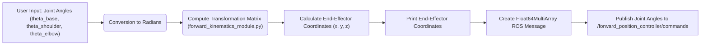
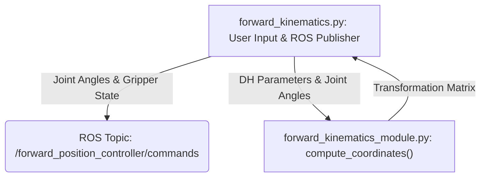

# Forward Kinematics Implementation

This document details the Python implementation for calculating the forward kinematics of the MARIO robotic arm. Forward kinematics involves determining the end-effector's position and orientation in Cartesian space given the joint angles of the robot.  This implementation uses Denavit-Hartenberg (DH) parameters to define the transformations between the robot's links.

## Implementation Details

The implementation consists of two primary Python files:

*   `forward_kinematics.py`: This file contains the main execution logic, including user input for joint angles, publishing the joint angles to ROS, and printing the calculated end-effector coordinates.
*   `forward_kinematics_module.py`: This file contains the core function for computing the transformation matrix based on the provided DH parameters and joint angles.

### Denavit-Hartenberg (DH) Parameters

The DH parameters used in this implementation are based on the kinematic structure of the MARIO robotic arm.  The DH parameters are defined as follows:

| Parameter | Description                  | Link 1 (Base to Shoulder) | Link 2 (Shoulder to Elbow) | Link 3 (Elbow to End) | Link 4 |
| --------- | ---------------------------- | ------------------------- | -------------------------- | ----------------------- | ----- |
| θ         | Joint angle (about Z axis)   | `theta_base`            | `theta_shoulder`           | `theta_elbow`          | 0     |
| d         | Link offset (along Z axis)  | 10                       | 0                          | 0                      | 13    |
| α         | Link twist (about X axis)    | π/2                       | 0                          | π/2                     | 0     |
| a         | Link length (along X axis)   | 0                         | 6                          | 0                       | 0     |

These parameters are crucial for accurately representing the robot's geometry and calculating the transformations between links.

### `forward_kinematics_module.py`

This file contains the function `compute_coordinates`, which calculates the final transformation matrix.

```python
# -*- coding: utf-8 -*-
import math
import numpy as np

def compute_coordinates(theta, d, alpha, a):
    
    #Converting angles to radians
    for index in range(len(theta)):
        theta[index] = math.radians(theta[index])	
    
    transformation_matrix_0_to_4 = [[1,0,0,0], [0,1,0,0], [0,0,1,0], [0,0,0,1]]		#initialization of transformation matrix

    #Multiplication of tranformation matrices
    for index in range(len(theta)):

        row1 = [math.cos(theta[index]), -math.cos(alpha[index]) * math.sin(theta[index]), \
        		math.sin(alpha[index]) * math.sin(theta[index]), a[index] * math.cos(theta[index])]

        row2 = [math.sin(theta[index]), math.cos(alpha[index]) * math.cos(theta[index]), \
        		-math.sin(alpha[index]) * math.cos(theta[index]), a[index] * math.sin(theta[index])]

        row3 = [0, math.sin(alpha[index]), math.cos(alpha[index]), d[index]]

        row4 = [0,0,0,1]

        transformation = np.matrix([row1, row2, row3, row4])
        transformation_matrix_0_to_4 = transformation_matrix_0_to_4 * transformation

    return transformation_matrix_0_to_4
```

[View on GitHub](https://github.com/SRA-VJTI/MARIO/blob/humble/4_simulation_gazebo/scripts/forward_kinematics_module.py)

This function takes the joint angles (`theta`), link offsets (`d`), link twists (`alpha`), and link lengths (`a`) as input. It then calculates the transformation matrix for each link and multiplies them together to obtain the final transformation matrix from the base frame to the end-effector frame. Key steps include converting joint angles to radians and constructing individual transformation matrices using DH parameters.

### `forward_kinematics.py`

This file handles user input, ROS communication, and displaying the calculated coordinates.

```python
#!/usr/bin/python3
# -*- coding: utf-8 -*-
import rclpy
from rclpy.node import Node
from std_msgs.msg import Float64MultiArray
import forward_kinematics_module
from rclpy import qos
import math
import sys
```

[View on GitHub](https://github.com/SRA-VJTI/MARIO/blob/humble/4_simulation_gazebo/scripts/forward_kinematics.py)

This snippet shows the necessary imports for ROS2, including `rclpy` for ROS functionality, `std_msgs.msg` for standard message types, and the custom `forward_kinematics_module`.

```python
def forward_kinematics_publisher():

    global node

    Joints = node.create_publisher(Float64MultiArray, '/forward_position_controller/commands',qos_profile=qos.qos_profile_parameter_events)
    #Input angles
    theta_base = float(input("{:22s}".format("Enter theta_base: ")))
    theta_shoulder = float(input("{:22s}".format("Enter theta_shoulder: ")))
    theta_elbow = float(input("{:22s}".format("Enter theta_elbow: ")))
    gripper_open = float(input("{:22s}".format("Enter Gripper Position(0 - close/ 1 - open): ")))
    theta = [theta_base, theta_shoulder, theta_elbow, 0]

    final_transformation_matrix = forward_kinematics_module.compute_coordinates(theta, d, alpha, a)

    #Print End-effector's Coordinates
    print ("*************************")
    print ("{:21s}".format("x-coordinate"), "{0:.5f}".format(final_transformation_matrix[0, 3]))
    print ("{:21s}".format("y-coordinate"), "{0:.5f}".format(final_transformation_matrix[1, 3]))
    print ("{:21s}".format("z-coordinate"), "{0:.5f}".format(final_transformation_matrix[2, 3]))

    joint = Float64MultiArray()
    joint.data = [0.0,0.0,0.0,0.0,0.0]
    if 0.0 <= theta_base <= 180.0 and 0.0 <= theta_shoulder <= 180.0 and 0.0 <= theta_elbow <= 180.0:
        joint.data[0] =(theta_base)*math.pi/180
        joint.data[1] = (theta_shoulder)*math.pi/180
        joint.data[2] = (theta_elbow)*math.pi/180
        if gripper_open:
            joint.data[3] = 0.8
            joint.data[4] = 0.8
        else:
            joint.data[3] = 0.0
            joint.data[4] = 0.0

        print("\ntheta_base = ", joint.data[0], "\n", "theta_shoulder = " , joint.data[1], "\n", "theta_elbow = " , joint.data[2], "\n", "Gripper Open = " , gripper_open, "\n")

        print ("=========================\n")

    else:
        print ("Enter angles in range 0 to 180")

    Joints.publish(joint)
```

This function prompts the user for joint angles, calculates the end-effector coordinates using the `compute_coordinates` function, and publishes the joint angles to the `/forward_position_controller/commands` topic. It also includes basic input validation to ensure angles are within a reasonable range (0-180 degrees).

```python
    joint = Float64MultiArray()
    joint.data = [0.0,0.0,0.0,0.0,0.0]
    if 0.0 <= theta_base <= 180.0 and 0.0 <= theta_shoulder <= 180.0 and 0.0 <= theta_elbow <= 180.0:
        joint.data[0] =(theta_base)*math.pi/180
        joint.data[1] = (theta_shoulder)*math.pi/180
        joint.data[2] = (theta_elbow)*math.pi/180
        if gripper_open:
            joint.data[3] = 0.8
            joint.data[4] = 0.8
        else:
            joint.data[3] = 0.0
            joint.data[4] = 0.0
```

This snippet shows how the joint angles are converted to radians and packaged into a `Float64MultiArray` message for publishing to the ROS topic.  It also sets the gripper values (open/close).

```python
if __name__ == '__main__':
    rclpy.init(args=sys.argv)
    global node
    node = Node('forward_kinematics_publisher')
    node.create_timer(0.2, forward_kinematics_publisher)
    rclpy.spin(node)
    rclpy.shutdown()
```

This is the main execution block that initializes the ROS node, creates a timer to repeatedly call the `forward_kinematics_publisher` function, and spins the node to keep it alive.

## Visualization

Here's a flowchart illustrating the flow of data and computations in this forward kinematics implementation:





## Key Integration Points

*   **ROS Communication:** The implementation relies heavily on ROS2 for publishing joint angles. The `rclpy` library is used for node creation, message publishing, and handling ROS lifecycle.
*   **DH Parameter Mapping:** Accurate DH parameter mapping is crucial for correct forward kinematics calculations. Verify that the DH parameters defined in the code match the physical robot's dimensions and joint configurations.
*   **Module Separation:** The separation of concerns between `forward_kinematics.py` and `forward_kinematics_module.py` promotes code reusability and maintainability. The `compute_coordinates` function can be easily integrated into other robotic control systems or simulations.

## Best Practices

*   **Input Validation:** Implement more robust input validation to handle invalid angle ranges and potential errors.
*   **Error Handling:** Add error handling to gracefully manage exceptions, such as incorrect DH parameter values or ROS communication failures.
*   **Modularity:** Further modularize the code by creating separate functions for each step of the forward kinematics calculation. This improves code readability and testability.
*   **Testing:** Write unit tests to verify the correctness of the `compute_coordinates` function and the overall forward kinematics implementation.  This will increase confidence in the accuracy of the calculated results.
*   **Visualization:** Integrate a visualization tool (e.g., RViz) to display the robot's pose and end-effector position in real-time. This provides a visual confirmation of the forward kinematics calculations.




