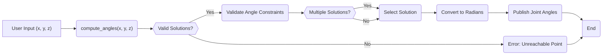

# Inverse Kinematics Implementation

This document details the Python implementation of inverse kinematics for the MARIO robotic arm, focusing on converting desired end-effector positions (x, y, z coordinates) into corresponding joint angles. The implementation is split into two main files: `inverse_kinematics.py`, which handles ROS2 node creation and communication, and `inverse_kinematics_module.py`, which contains the core inverse kinematics calculations.

## Overview

The inverse kinematics problem involves determining the joint angles required to achieve a specific end-effector pose.  For a robotic arm, this means calculating the angles for each joint (base, shoulder, elbow in this case) given the desired x, y, and z coordinates of the end-effector.  This implementation provides two possible solutions (if they exist) and selects the most appropriate one based on joint constraints and a redundancy resolution strategy.

## Relevant Files

*   `4_simulation_gazebo/scripts/inverse_kinematics.py`: [View on GitHub](https://github.com/SRA-VJTI/MARIO/blob/humble/4_simulation_gazebo/scripts/inverse_kinematics.py) - ROS2 node that takes user input for desired coordinates, calls the inverse kinematics module, and publishes the resulting joint angles to the ROS2 topic.
*   `4_simulation_gazebo/scripts/inverse_kinematics_module.py`: [View on GitHub](https://github.com/SRA-VJTI/MARIO/blob/humble/4_simulation_gazebo/scripts/inverse_kinematics_module.py) - Contains the `compute_angles` function which performs the inverse kinematics calculations based on the provided x, y, and z coordinates.

## Inverse Kinematics Module (`inverse_kinematics_module.py`)

This module contains the core logic for calculating the joint angles.  It takes the desired x, y, and z coordinates as input and returns a list of possible joint angle solutions.

### Code Snippet 1: Constants Definition

```python
import numpy as np
import math

# Variables
d0 = 10		#Base to shoulder link length
a1 = 6		#Shoulder to elbow link length
d3 = 13		#Elbow to end effector link length

ROUNDING_ERROR = 10
```

[View on GitHub](https://github.com/SRA-VJTI/MARIO/blob/humble/4_simulation_gazebo/scripts/inverse_kinematics_module.py)

This snippet defines the physical parameters of the robotic arm, such as link lengths (`d0`, `a1`, `d3`). These values are crucial for the geometric calculations involved in inverse kinematics.  `ROUNDING_ERROR` defines the precision used for rounding intermediate results.

### Code Snippet 2: `compute_angles` function

```python
def compute_angles(x, y, z):
	theta_base = round(math.atan2(y, x), ROUNDING_ERROR)

	sin_theta_elbow = round(((x * x + y * y + (z - d0) * (z - d0)) - a1 * a1 - d3 * d3) / (2 * a1 * d3), ROUNDING_ERROR)

	if (sin_theta_elbow) <= 1 and (sin_theta_elbow) >=- 1:

		theta_elbow = round(math.asin(sin_theta_elbow), ROUNDING_ERROR)
		theta_elbow_possible = round(math.pi - theta_elbow, ROUNDING_ERROR)

		denominator = x * x + y * y + (z - d0) * (z - d0)

		if theta_base != 90:
			# Calculate x / cos(theta_base)
			numerator_theta_shoulder = (z - d0) * (a1 + d3 * math.sin(theta_elbow)) \
										+ d3 * math.cos(theta_elbow) * x / math.cos(theta_base)

			numerator_theta_shoulder_possible = (z - d0) * (a1 + d3 * math.sin(theta_elbow_possible)) + \
												d3 * math.cos(theta_elbow_possible) * x / math.cos(theta_base)

			theta_shoulder = round(math.asin(numerator_theta_shoulder / denominator), ROUNDING_ERROR)
			theta_shoulder_possible = round(math.asin(numerator_theta_shoulder_possible / denominator), ROUNDING_ERROR)

		elif theta_base != 0:
			# Calculate y / sin(theta_base)
			numerator_theta_shoulder = (z - d0) * (a1 + d3 * math.sin(theta_elbow)) \
										+ d3 * math.cos(theta_elbow) * y / math.sin(theta_base)
			numerator_theta_shoulder_possible = (z - d0) * (a1 + d3 * math.sin(theta_elbow_possible)) \
												+ d3 * math.cos(theta_elbow_possible) * y / math.sin(theta_base)

			theta_shoulder = round(math.asin(numerator_theta_shoulder / denominator), ROUNDING_ERROR)
			theta_shoulder_possible = round(math.asin(numerator_theta_shoulder_possible / denominator), ROUNDING_ERROR)

	else:

		print ("Point is not in range due to constraint in link length")
		return [[None, None, None],[None, None, None]]

	result = [[math.degrees(theta_base), math.degrees(theta_shoulder), math.degrees(theta_elbow)], \
			[math.degrees(theta_base), math.degrees(theta_shoulder_possible), math.degrees(theta_elbow_possible)]]

	# Return set of possible angles in degrees
	return result
```

[View on GitHub](https://github.com/SRA-VJTI/MARIO/blob/humble/4_simulation_gazebo/scripts/inverse_kinematics_module.py)

This function implements the core inverse kinematics calculations.  It first calculates `theta_base` using `atan2(y, x)`.  Then, it calculates `theta_elbow` using the law of cosines.  If a valid `theta_elbow` exists (i.e., `sin_theta_elbow` is within the range [-1, 1]), it proceeds to calculate `theta_shoulder`. Two possible solutions are computed for both `theta_elbow` and `theta_shoulder`. The function returns a list containing both possible sets of joint angles (base, shoulder, elbow) in degrees. Error handling is included to return `None` values if the target point is unreachable.

## ROS2 Node (`inverse_kinematics.py`)

This file creates a ROS2 node that interacts with the user, calls the inverse kinematics module, and publishes the resulting joint angles.

### Code Snippet 3: ROS2 Publisher Setup

```python
import rclpy
from rclpy.node import Node
import inverse_kinematics_module
from std_msgs.msg import Float64MultiArray
from rclpy import qos
import math
import sys

def inverse_kinematics_publisher():
    Joints = node.create_publisher(Float64MultiArray, '/forward_position_controller/commands',qos_profile=qos.qos_profile_parameter_events)
    joint = Float64MultiArray()
    joint.data = [0.0,0.0,0.0,0.0,0.0]
```

[View on GitHub](https://github.com/SRA-VJTI/MARIO/blob/humble/4_simulation_gazebo/scripts/inverse_kinematics.py)

This snippet sets up the ROS2 publisher.  It initializes a publisher named `Joints` that publishes `Float64MultiArray` messages to the `/forward_position_controller/commands` topic.  This topic is where the joint angles are sent to control the robot's movement. A `joint` message is initialized to hold the joint angle values.

### Code Snippet 4: User Input and Angle Computation

```python
    #Input coordinates
    x = float(input("Enter x: "))
    y = float(input("Enter y: "))
    z = float(input("Enter z: "))

    angle = inverse_kinematics_module.compute_angles(x,y,z)
```

[View on GitHub](https://github.com/SRA-VJTI/MARIO/blob/humble/4_simulation_gazebo/scripts/inverse_kinematics.py)

This code takes user input for the desired x, y, and z coordinates of the end-effector.  It then calls the `compute_angles` function from the `inverse_kinematics_module` to calculate the corresponding joint angles.

### Code Snippet 5: Solution Validation and Publishing

```python
    index = -1
    count = 0
    print(angle)
    if angle[0][0] != None and angle[0][1] != None and angle[0][2] != None:
        if 0.0 <= int(angle[0][0]) <= 180.0 and 0.0 <= int(angle[0][1]) <= 180.0 and 0.0 <= int(angle[0][2]) <= 180.0:
            index = 0
            count += 1

        if 0.0 <= int(angle[1][0]) <= 180.0 and 0.0 <= int(angle[1][1]) <= 180.0 and 0.0 <= int(angle[1][2]) <= 180.0:
            index = 1
            count += 1

    if index != -1:

        #Print Joint angles
        print ("*************************")
        print ("{:15s}{:15s}{:15s}".format("theta_base", "theta_shoulder", "theta_elbow"))
        print ("{:<15f}{:<15f}{:<15f}".format(angle[0][0], angle[0][1], angle[0][2]))
        print ("{:<15f}{:<15f}{:<15f}".format(angle[1][0], angle[1][1], angle[1][2]))
        # Send angles
        if(count == 2):
            # To handle redundancy
            # Always sending those angles having approach vector as (0, 0, 1)
            # Condition for that is theta_shoulder + theta_elbow should be odd multiple of 180
            if (int(angle[0][1]) + int(angle[0][2])) % (2 * 180) != 0 and (int(angle[0][1]) + int(angle[0][2])) % 180 == 0:
                index = 0

            elif (int(angle[1][1]) + int(angle[1][2])) % (2 * 180) != 0 and (int(angle[1][1]) + int(angle[1][2])) % 180 == 0:
                index = 1

        #Converting Degrees to Radians
        joint.data[0] = (int(angle[index][0]))*math.pi/180
        joint.data[1] = (int(angle[index][1]))*math.pi/180
        joint.data[2] = (int(angle[index][2]))*math.pi/180

        #Publishing Joint angle Values
        Joints.publish(joint)
        print ("=========================\n")

    else:
        # Print error message
        print ("Angles not sent due to constraints")
        print ("Please enter points in range")
```

[View on GitHub](https://github.com/SRA-VJTI/MARIO/blob/humble/4_simulation_gazebo/scripts/inverse_kinematics.py)

This section validates the calculated joint angles to ensure they are within the acceptable range (0 to 180 degrees). It selects one of the two possible solutions based on whether the joint angles fall within these constraints. A redundancy resolution strategy is implemented to choose the correct angles based on the arm's approach vector.  The selected joint angles are then converted from degrees to radians and published to the `/forward_position_controller/commands` topic. If no valid solution is found, an error message is printed.

### Code Snippet 6: Node Initialization and Spinning

```python
if __name__ == '__main__':

    rclpy.init(args=sys.argv)
    global node 
    node = Node('inverse_kinematics_publisher')
    node.create_timer(0.2, inverse_kinematics_publisher)
    rclpy.spin(node)
    rclpy.shutdown()
```

[View on GitHub](https://github.com/SRA-VJTI/MARIO/blob/humble/4_simulation_gazebo/scripts/inverse_kinematics.py)

This code initializes the ROS2 node, creates a timer that calls the `inverse_kinematics_publisher` function every 0.2 seconds, and spins the node to keep it running. The `rclpy.shutdown()` call ensures a clean exit.

## Flowchart of the Process





This flowchart illustrates the overall flow of the inverse kinematics process, starting from user input, through the calculations, validation, and publishing of the joint angles.

## Key Integration Points

*   **ROS2 Communication:** The `inverse_kinematics.py` script uses ROS2 publishers and subscribers to communicate with other ROS2 nodes. The joint angles are published to the `/forward_position_controller/commands` topic, which is likely subscribed to by a motor controller node.
*   **Inverse Kinematics Calculation:** The `compute_angles` function in `inverse_kinematics_module.py` performs the core inverse kinematics calculations. This function is designed to be modular and can be easily integrated into other robotic arm control systems.
*   **Redundancy Resolution:**  The robot arm has more than one possible configuration to reach the same point in space. The code includes a basic redundancy resolution strategy based on the approach vector to ensure that a consistent and predictable solution is chosen.

## Best Practices

*   **Modular Design:** The separation of concerns between the ROS2 node and the inverse kinematics calculation module makes the code more maintainable and reusable.
*   **Error Handling:** The code includes basic error handling to check for unreachable points and invalid joint angles.
*   **Code Comments:** The code includes comments to explain the purpose of each section and the logic behind the calculations.
*   **Units:** Make sure all the units being used are consistent, its a good practice to use SI units throughout the project.

This implementation provides a basic framework for inverse kinematics control of the MARIO robotic arm.  Further improvements could include more sophisticated redundancy resolution strategies, trajectory planning, and collision avoidance.
```