# Robotic Arm Kinematics

This section focuses on the kinematics of the robotic arm, including forward and inverse kinematics implementations. Understanding these concepts is crucial for controlling the arm's movement and achieving desired end-effector positions.

## Forward Kinematics

Forward kinematics involves calculating the end-effector's position and orientation based on the joint angles of the robotic arm. In other words, given the angles of each joint, we can determine where the "hand" of the robot is located in space. The `forward_kinematics.py` script demonstrates this process.

```python
#!/usr/bin/python3
# -*- coding: utf-8 -*-
import rclpy
from rclpy.node import Node
from std_msgs.msg import Float64MultiArray
import forward_kinematics_module
from rclpy import qos
import math
import sys

# ... (rest of the script)

def forward_kinematics_publisher():
    # ...
    theta_base = float(input("{:22s}".format("Enter theta_base: ")))
    theta_shoulder = float(input("{:22s}".format("Enter theta_shoulder: ")))
    theta_elbow = float(input("{:22s}".format("Enter theta_elbow: ")))
    gripper_open = float(input("{:22s}".format("Enter Gripper Position(0 - close/ 1 - open): ")))
    theta = [theta_base, theta_shoulder, theta_elbow, 0]

    final_transformation_matrix = forward_kinematics_module.compute_coordinates(theta, d, alpha, a)

    #Print End-effector's Coordinates
    print ("*************************")
    print ("{:21s}".format("x-coordinate"), "{0:.5f}".format(final_transformation_matrix[0, 3]))
    print ("{:21s}".format("y-coordinate"), "{0:.5f}".format(final_transformation_matrix[1, 3]))
    print ("{:21s}".format("z-coordinate"), "{0:.5f}".format(final_transformation_matrix[2, 3]))

    # ...
```

[View on GitHub](https://github.com/SRA-VJTI/MARIO/blob/humble/4_simulation_gazebo/scripts/forward_kinematics.py)

This snippet shows the core of the `forward_kinematics_publisher` function.  It takes joint angles as input, calls `forward_kinematics_module.compute_coordinates` to calculate the transformation matrix representing the end-effector's pose, and then prints the x, y, and z coordinates.  The script uses ROS2 to publish the joint angles to the `/forward_position_controller/commands` topic, which controls the robot's movement in the Gazebo simulation. User input for joint angles is received, converted to radians, and published. The transformation matrix is calculated using the Denavit-Hartenberg (DH) parameters, as defined at the top of the script.

The DH parameters used in this implementation are:

*   **θ (theta):** Joint angle.
*   **d:** Link offset (distance along the Z-axis).
*   **α (alpha):** Link twist (angle about the X-axis).
*   **a:** Link length (distance along the X-axis).

Here's a simplified flowchart of the forward kinematics process:

```mermaid
graph TD
    A["Joint Angles (θ1, θ2, θ3)"] -->|"DH Parameters"| B("Transformation Matrices (T1, T2, T3)");
    B --> C("Final Transformation Matrix (T = T1 * T2 * T3)");
    C --> D["End-Effector Position (x, y, z)"];
```





The DH parameters are vital for defining the relative position and orientation between consecutive links in the robotic arm. They allow the computation of individual transformation matrices, which are then multiplied together to obtain the final transformation matrix representing the end-effector's pose relative to the base frame.

```python
joint = Float64MultiArray()
joint.data = [0.0,0.0,0.0,0.0,0.0]
if 0.0 <= theta_base <= 180.0 and 0.0 <= theta_shoulder <= 180.0 and 0.0 <= theta_elbow <= 180.0:
    joint.data[0] =(theta_base)*math.pi/180
    joint.data[1] = (theta_shoulder)*math.pi/180
    joint.data[2] = (theta_elbow)*math.pi/180
    if gripper_open:
        joint.data[3] = 0.8
        joint.data[4] = 0.8
    else:
        joint.data[3] = 0.0
        joint.data[4] = 0.0

    print("\ntheta_base = ", joint.data[0], "\n", "theta_shoulder = " , joint.data[1], "\n", "theta_elbow = " , joint.data[2], "\n", "Gripper Open = " , gripper_open, "\n")

    print ("=========================\n")

else:
    print ("Enter angles in range 0 to 180")

Joints.publish(joint)
```

[View on GitHub](https://github.com/SRA-VJTI/MARIO/blob/humble/4_simulation_gazebo/scripts/forward_kinematics.py)

This code snippet ensures that the input angles are within the valid range (0 to 180 degrees) before converting them to radians and publishing them to the ROS2 topic.  It also controls the gripper's state based on the `gripper_open` input. This range check is crucial to prevent the robotic arm from exceeding its physical limits and potentially damaging itself or the surrounding environment.

## Inverse Kinematics

Inverse kinematics is the opposite of forward kinematics. Given the desired position and orientation of the end-effector, inverse kinematics calculates the required joint angles to achieve that pose. The `inverse_kinematics.py` script implements this.

```python
#!/usr/bin/python3
import rclpy
from rclpy.node import Node
import inverse_kinematics_module
from std_msgs.msg import Float64MultiArray
from rclpy import qos
import math
import sys

def inverse_kinematics_publisher():
    # ...
    x = float(input("Enter x: "))
    y = float(input("Enter y: "))
    z = float(input("Enter z: "))

    angle = inverse_kinematics_module.compute_angles(x,y,z)

    # Sending, if angles are in range of servos i.e 0 to 180
    # ...
```

[View on GitHub](https://github.com/SRA-VJTI/MARIO/blob/humble/4_simulation_gazebo/scripts/inverse_kinematics.py)

This snippet shows the core of the `inverse_kinematics_publisher` function. It takes the desired x, y, and z coordinates of the end-effector as input and calls `inverse_kinematics_module.compute_angles` to calculate the required joint angles. It then checks if the calculated angles are within the valid range and publishes them to the ROS2 topic.

A key challenge in inverse kinematics is that there might be multiple solutions (different sets of joint angles) that can achieve the same end-effector pose.  The script attempts to handle this redundancy by prioritizing solutions where the "approach vector" is (0, 0, 1), which corresponds to a specific arm configuration.

```python
if index != -1:

    #Print Joint angles
    print ("*************************")
    print ("{:15s}{:15s}{:15s}".format("theta_base", "theta_shoulder", "theta_elbow"))
    print ("{:<15f}{:<15f}{:<15f}".format(angle[0][0], angle[0][1], angle[0][2]))
    print ("{:<15f}{:<15f}{:<15f}".format(angle[1][0], angle[1][1], angle[1][2]))
    # Send angles
    if(count == 2):
        # To handle redundancy
        # Always sending those angles having approach vector as (0, 0, 1)
        # Condition for that is theta_shoulder + theta_elbow should be odd multiple of 180
        if (int(angle[0][1]) + int(angle[0][2])) % (2 * 180) != 0 and (int(angle[0][1]) + int(angle[0][2])) % 180 == 0:
            index = 0

        elif (int(angle[1][1]) + int(angle[1][2])) % (2 * 180) != 0 and (int(angle[1][1]) + int(angle[1][2])) % 180 == 0:
            index = 1

    #Converting Degrees to Radians
    joint.data[0] = (int(angle[index][0]))*math.pi/180
    joint.data[1] = (int(angle[index][1]))*math.pi/180
    joint.data[2] = (int(angle[index][2]))*math.pi/180

    #Publishing Joint angle Values
    Joints.publish(joint)
    print ("=========================\n")

else:
    # Print error message
    print ("Angles not sent due to constraints")
    print ("Please enter points in range")
```

[View on GitHub](https://github.com/SRA-VJTI/MARIO/blob/humble/4_simulation_gazebo/scripts/inverse_kinematics.py)

This code addresses the redundancy issue in inverse kinematics where multiple joint configurations can achieve the same end-effector position. It prioritizes solutions that maintain a specific "approach vector" (0, 0, 1), which corresponds to a desired arm configuration. This is achieved by checking if the sum of `theta_shoulder` and `theta_elbow` is an odd multiple of 180 degrees, and using the corresponding angle set. If no valid solution is found, an error message is printed, indicating that the requested point is outside the arm's workspace or violates joint limits.

Here is a sequence diagram illustrating the inverse kinematics process:

```mermaid
sequenceDiagram
    participant User
    participant IK_Publisher as Inverse Kinematics Publisher
    participant IK_Module as Inverse Kinematics Module
    participant ROS2

    User->>IK_Publisher: Input: Desired (x, y, z)
    IK_Publisher->>IK_Module: compute_angles(x, y, z)
    IK_Module-->>IK_Publisher: Joint Angles (θ1, θ2, θ3)
    IK_Publisher->>ROS2: Publish Joint Angles to /forward_position_controller/commands
    ROS2-->>Robotic Arm: Control Robotic Arm
```





## DH Parameter Assignment

The `activities/dh-parameters-kinematics/README.md` file contains exercises related to determining DH parameters for robotic arms.

```markdown
# Assignment Day 3

Q.1. Make axes according to the rules given in the DH-parameters for the following end-effectors and bots

Identify the joints and axes in the following bot

Your answer should specify the following parameters:

* Number of joints
* Degrees of freedom
* Types of Joints
* Name all the links starting from base link => search what is ground link
* **Transformation Matrix** from **base to link1 only** => take reference from the DH-parameter’s PPT
* Bonus points if you define your own way of defining DH-parameters 😉
```

[View on GitHub](https://github.com/SRA-VJTI/MARIO/blob/humble/activities/dh-parameters-kinematics/README.md)

Understanding DH parameters is essential for accurately modeling the kinematics of a robotic arm. The assignment challenges users to identify the key parameters and derive the transformation matrix between links.

## Key Integration Points

*   **ROS2 Integration:** Both `forward_kinematics.py` and `inverse_kinematics.py` are ROS2 nodes that publish joint angle commands to the `/forward_position_controller/commands` topic. This allows seamless integration with the Gazebo simulation.
*   **Modular Design:** The use of separate modules (`forward_kinematics_module.py`, `inverse_kinematics_module.py`) promotes code reusability and maintainability.
*   **DH Parameter-Based Calculations:** The forward kinematics implementation relies on DH parameters, a standard method for representing robot kinematics.
*   **Handling Redundancy:** The inverse kinematics implementation attempts to address the redundancy issue by prioritizing specific arm configurations.

## Best Practices

*   **Modularization:**  Keep the core kinematic calculations separate from the ROS2 node logic for better organization and testability.
*   **Error Handling:** Implement robust error handling to deal with invalid input angles or unreachable end-effector poses.
*   **Optimization:**  For real-time applications, optimize the kinematic calculations to reduce computational overhead. Consider using libraries like NumPy for faster matrix operations.
*   **Units Consistency:**  Ensure that all angles are consistently represented in radians or degrees to avoid errors.
*   **Workspace Awareness:**  Implement checks to ensure the desired end-effector position is within the robot's reachable workspace.
*   **Joint Limit Awareness:** Implement checks to ensure the the calculated joint angles are within the limits of the robot's joints.
```