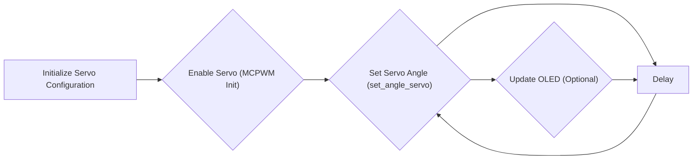

# Servo Control

This document explains the firmware implementation for controlling servo motors in the MARIO project. It covers setting servo zero positions and performing sweeps. The code examples are based on the ESP32 and utilize the MCPWM (Motor Control Pulse Width Modulation) peripheral.

## Setting Servo Zero Positions

The `firmware/1_servo_set_zero/main/main.c` file demonstrates how to set the zero position for each servo. This involves initializing the servo configurations and then setting the angle to 0 degrees.

```c
#include "sra_board.h"

#define TAG "MCPWM_SERVO_CONTROL"

servo_config servo_a = {
	.servo_pin = SERVO_A,
	.min_pulse_width = CONFIG_SERVO_A_MIN_PULSEWIDTH,
	.max_pulse_width = CONFIG_SERVO_A_MAX_PULSEWIDTH,
	.max_degree = CONFIG_SERVO_A_MAX_DEGREE,
	.mcpwm_num = MCPWM_UNIT_0,
	.timer_num = MCPWM_TIMER_0,
	.gen = MCPWM_OPR_A,
};
// ... other servo configurations
```

This code snippet initializes the `servo_config` structure for `servo_a`. The `servo_pin` specifies the GPIO pin connected to the servo.  `min_pulse_width` and `max_pulse_width` define the pulse width range corresponding to the minimum and maximum angles of the servo. `max_degree` defines the maximum degree the servo can rotate. `mcpwm_num` and `timer_num` specify which MCPWM unit and timer to use. `gen` specifies the MCPWM operator.
[View on GitHub](https://github.com/SRA-VJTI/MARIO/blob/humble/firmware/1_servo_set_zero/main/main.c)

```c
static void mcpwm_servo_control(void *arg)
{
	enable_servo();
#ifdef CONFIG_ENABLE_OLED
	// Initialising the OLED
	ESP_ERROR_CHECK(init_oled());
	display_logo(MARIO_LOGO);
	vTaskDelay(100);
#endif

	while (1)
	{
		set_angle_servo(&servo_a, 0);
		vTaskDelay(100);
		set_angle_servo(&servo_b, 0);
		vTaskDelay(100);
		set_angle_servo(&servo_c, 0);
		vTaskDelay(100);
		set_angle_servo(&servo_d, 0);
		vTaskDelay(100);
#ifdef CONFIG_ENABLE_OLED
		// Diplaying Servo A, Servo B, Servo C, Servo D values on OLED
		display_servo_values(read_servo(&servo_a), read_servo(&servo_b), read_servo(&servo_c), read_servo(&servo_d));
#endif
	}
}
```

The `mcpwm_servo_control` function sets the angle of each servo to 0 degrees using the `set_angle_servo` function. A delay of 100ms is introduced between each servo setting. If OLED is enabled, it also displays the servo angles using `display_servo_values`.
[View on GitHub](https://github.com/SRA-VJTI/MARIO/blob/humble/firmware/1_servo_set_zero/main/main.c)

## Performing Servo Sweeps

The `firmware/2_servo_sweep/main/main.c` file demonstrates how to perform a sweep motion with the servo motors. It moves the servos from 0 to 90 degrees and then back to 0 degrees.

```c
static void mcpwm_servo_control(void *arg)
{
	enable_servo();

	while (1)
	{
		for (int i = 0; i < 90; i++)
		{
			set_angle_servo(&servo_a, i);
			set_angle_servo(&servo_b, i);
			set_angle_servo(&servo_c, i);
			set_angle_servo(&servo_d, 45-i/2);
			vTaskDelay(5);
		}

		for (int i = 90; i > 0; i--)
		{
			set_angle_servo(&servo_a, i);
			set_angle_servo(&servo_b, i);
			set_angle_servo(&servo_c, i);
			set_angle_servo(&servo_d, 45-i/2);
			vTaskDelay(5);
		}
	}
}
```

This function contains the logic for sweeping the servos. It iterates from 0 to 90 degrees, setting the angle of each servo using `set_angle_servo`. `servo_d` has a different angle calculation `45-i/2`. A small delay of 5ms is introduced in each iteration to control the speed of the sweep. The code then iterates from 90 back to 0 degrees, repeating the process.
[View on GitHub](https://github.com/SRA-VJTI/MARIO/blob/humble/firmware/2_servo_sweep/main/main.c)

```c
#ifdef CONFIG_ENABLE_OLED

void update_oled()
{
	// Diplaying Servo A, Servo B, Servo C, Servo D values on OLED
	while (1)
	{
		display_servo_values(read_servo(&servo_a), read_servo(&servo_b), read_servo(&servo_c), read_servo(&servo_d));
	}
}

#endif
```

If the OLED display is enabled (`CONFIG_ENABLE_OLED`), the `update_oled` function is defined. This function continuously updates the OLED display with the current angle values of the four servos. It reads the servo angles using the `read_servo` function and displays them using the `display_servo_values` function. This provides a visual indication of the servo positions during operation.
[View on GitHub](https://github.com/SRA-VJTI/MARIO/blob/humble/firmware/2_servo_sweep/main/main.c)

## Servo Configuration

The `servo_config` struct is defined in `sra_board.h` and contains information about the servo motor.
```c
typedef struct {
  gpio_num_t servo_pin;           /*!< Servo GPIO pin number */
  uint32_t min_pulse_width;       /*!< Minimum pulse width in Microseconds */
  uint32_t max_pulse_width;       /*!< Maximum pulse width in Microseconds */
  uint32_t max_degree;            /*!< Maximum angle in degree supported by servo */
  mcpwm_unit_t mcpwm_num;         /*!< mcpwm unit number */
  mcpwm_timer_t timer_num;        /*!< mcpwm timer number */
  mcpwm_gen_t gen;                /*!< mcpwm operator number */
} servo_config;
```
[View on GitHub](https://github.com/SRA-VJTI/MARIO/blob/humble/firmware/include/sra_board.h)

The `enable_servo()` function, also present in `sra_board.c`, is responsible for initializing the MCPWM peripheral and configuring the timers and generators for each servo.
```c
void enable_servo() {
  mcpwm_config_t pwm_config = {
      .frequency = 50, // frequency = 50Hz, i.e. for every servo motor time period of pulse = 20ms
      .cmpr_a = 0,      // duty cycle of PWMxA = 0
      .cmpr_b = 0,      // duty cycle of PWMxB = 0
      .counter_mode = MCPWM_UP_COUNTER,
      .duty_mode = MCPWM_DUTY_MODE_0,
  };
  ESP_ERROR_CHECK(mcpwm_init(servo_a.mcpwm_num, servo_a.timer_num, &pwm_config)); // Configure PWM0, on timer 0
  ESP_ERROR_CHECK(mcpwm_init(servo_b.mcpwm_num, servo_b.timer_num, &pwm_config)); // Configure PWM0, on timer 0
  ESP_ERROR_CHECK(mcpwm_init(servo_c.mcpwm_num, servo_c.timer_num, &pwm_config)); // Configure PWM0, on timer 1
  ESP_ERROR_CHECK(mcpwm_init(servo_d.mcpwm_num, servo_d.timer_num, &pwm_config)); // Configure PWM0, on timer 1
}
```
[View on GitHub](https://github.com/SRA-VJTI/MARIO/blob/humble/firmware/sra_board/sra_board.c)

## Visualization of Servo Control Flow





This flowchart illustrates the main control flow for servo control.  It starts with initializing the servo configurations, then enabling the servo by initializing the MCPWM. The servo angle is then set, followed by a delay.  Optionally, the OLED display is updated with the servo angle. This process repeats continuously in a loop.

## Key Integration Points

*   **`sra_board.h`**: Defines the `servo_config` structure and declares functions for servo control.
*   **`sra_board.c`**: Implements the low-level servo control functions, including `enable_servo`, `set_angle_servo` and `read_servo`.
*   **`main.c`**: Contains the application logic for setting servo positions or performing sweeps.

**Best Practices:**

*   Use the `servo_config` struct to encapsulate all servo-related parameters.
*   Utilize the `enable_servo` function to correctly initialize the MCPWM peripheral.
*   Use the `set_angle_servo` function to set the servo angle, ensuring that the angle is within the specified range.
*   Consider adding error handling and input validation to prevent unexpected behavior.
*   For complex movements, create separate tasks or functions to handle the servo control logic.
```
```