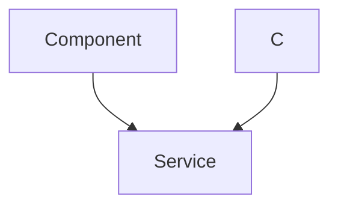
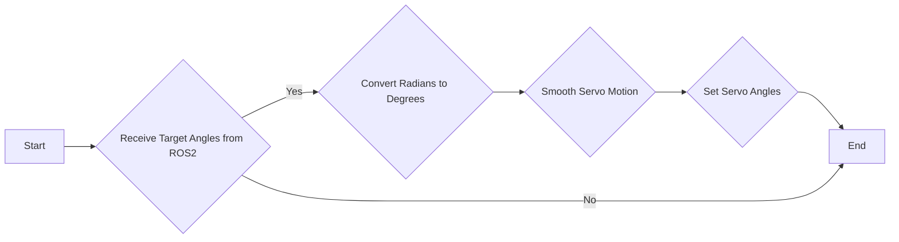

# MicroROS Integration

This document describes the MicroROS integration in the MARIO robotic arm project. MicroROS allows the robotic arm to communicate with a ROS2 system, enabling functionalities such as remote control, data acquisition, and integration with other ROS2-based tools and simulations. This integration utilizes the ESP32 microcontroller to run the MicroROS client.

## Key Features

- **ROS2 Communication:** Establishes a communication bridge between the ESP32 and a ROS2 network.
- **Joint State Publishing/Subscription:** Publishes joint states to ROS2 for visualization and control, or subscribes to joint states to control the arm.
- **Gazebo Integration:** Facilitates seamless integration with Gazebo simulations for testing and development.
- **Rviz Visualization:** Enables visualization of the robotic arm's state in Rviz.
- **Servo Control:** Provides precise control over the arm's servo motors based on ROS2 commands.

## Relevant Files

- `firmware/3_microros_rviz/main/main.c`: Contains the MicroROS client implementation for communicating with ROS2 and visualizing the arm in Rviz.
- `firmware/4_microros_gazebo/main/main.c`: Contains the MicroROS client implementation for communicating with ROS2 and controlling the arm in Gazebo simulations.

## Code Snippets and Explanations

### 1. MicroROS Task Initialization (firmware/3_microros_rviz/main/main.c)

This snippet shows the initialization of the MicroROS task, including setting up the ROS2 node, subscriber, and executor.

```c
	rcl_allocator_t allocator = rcl_get_default_allocator();
	rclc_support_t support;

	// Create init_options.
	rcl_init_options_t init_options = rcl_get_zero_initialized_init_options();
	RCCHECK(rcl_init_options_init(&init_options, allocator));

#ifdef CONFIG_MICRO_ROS_ESP_XRCE_DDS_MIDDLEWARE
	rmw_init_options_t* rmw_options = rcl_init_options_get_rmw_init_options(&init_options);

	// Static Agent IP and port can be used instead of autodisvery.
	RCCHECK(rmw_uros_options_set_udp_address(CONFIG_MICRO_ROS_AGENT_IP, CONFIG_MICRO_ROS_AGENT_PORT, rmw_options));
	//RCCHECK(rmw_uros_discover_agent(rmw_options));
#endif
	// Setup support structure.
	RCCHECK(rclc_support_init_with_options(&support, 0, NULL, &init_options, &allocator));

	// Create node.
	rcl_node_t node = rcl_get_zero_initialized_node();
	RCCHECK(rclc_node_init_default(&node, "joint_state_sub", "", &support));

	// Create subscriber.
	RCCHECK(rclc_subscription_init_default(
		&subscriber,
		&node,
		ROSIDL_GET_MSG_TYPE_SUPPORT(sensor_msgs, msg, JointState),
		"/joint_states"));
```

This code initializes the ROS2 environment using `rclc` (ROS Client Library for C).  It sets up the allocator, init options, support structure, node, and subscriber.  The subscriber listens to the `/joint_states` topic for joint angle commands. `RCCHECK` is a macro that checks for errors and aborts if necessary.
[View on GitHub](https://github.com/SRA-VJTI/MARIO/blob/humble/firmware/3_microros_rviz/main/main.c)

### 2. Joint State Subscription Callback (firmware/3_microros_rviz/main/main.c)

This function is the callback that is executed when a new `JointState` message is received.

```c
void subscription_callback(const void * msgin)
{
    
     const sensor_msgs__msg__JointState * msg = (const sensor_msgs__msg__JointState *)msgin;
    
    //To display data on terminal
    printf("Received: %lf\n",  msg->position.data[0]);
    printf("Received: %lf\n",  msg->position.data[1]);
    printf("Received: %lf\n",  msg->position.data[2]);
    printf("Received: %lf\n",  msg->position.data[3]);

    //To control motors according to the data
    set_angle_servo(&servo_a,msg->position.data[0]*180/pi);
    set_angle_servo(&servo_b,msg->position.data[1]*180/pi);
    set_angle_servo(&servo_c,msg->position.data[2]*180/pi);
    set_angle_servo(&servo_d,msg->position.data[3]*180/pi);
}
```

The `subscription_callback` receives the `sensor_msgs__msg__JointState` message, extracts the joint angles, converts them from radians to degrees, and sets the corresponding angles for each servo motor. The `set_angle_servo` function is used to control the servo motors.
[View on GitHub](https://github.com/SRA-VJTI/MARIO/blob/humble/firmware/3_microros_rviz/main/main.c)

### 3. MicroROS Task Initialization (firmware/4_microros_gazebo/main/main.c)

```c
    rcl_allocator_t allocator = rcl_get_default_allocator();
    rclc_support_t support;

    // Enable servo and initialize current positions
    enable_servo();
    current_pos.current_a = read_servo(&servo_a);
    current_pos.current_b = read_servo(&servo_b);
    current_pos.current_c = read_servo(&servo_c);
    current_pos.current_d = read_servo(&servo_d);

    // Create init_options
    rcl_init_options_t init_options = rcl_get_zero_initialized_init_options();
    RCCHECK(rcl_init_options_init(&init_options, allocator));

    #ifdef CONFIG_MICRO_ROS_ESP_XRCE_DDS_MIDDLEWARE
    rmw_init_options_t* rmw_options = rcl_init_options_get_rmw_init_options(&init_options);
    RCCHECK(rmw_uros_options_set_udp_address(CONFIG_MICRO_ROS_AGENT_IP, CONFIG_MICRO_ROS_AGENT_PORT, rmw_options));
    #endif

    // Setup support structure
    RCCHECK(rclc_support_init_with_options(&support, 0, NULL, &init_options, &allocator));

    // Create node
    rcl_node_t node = rcl_get_zero_initialized_node();
    RCCHECK(rclc_node_init_default(&node, "Set_servo_angles", "", &support));

    // Create subscriber
    RCCHECK(rclc_subscription_init_default(
        &subscriber,
        &node,
        ROSIDL_GET_MSG_TYPE_SUPPORT(std_msgs, msg, Float64MultiArray),
        "/forward_position_controller/commands"));
```

This code initializes the MicroROS environment for the Gazebo simulation. It sets up the allocator, support structure, node, and subscriber. The subscriber is configured to listen to the `/forward_position_controller/commands` topic, which publishes `Float64MultiArray` messages containing the target joint angles.
[View on GitHub](https://github.com/SRA-VJTI/MARIO/blob/humble/firmware/4_microros_gazebo/main/main.c)

### 4. Smooth Servo Motion (firmware/4_microros_gazebo/main/main.c)

To prevent abrupt movements, this function implements a smoothing algorithm for servo motion.

```c
void smooth_servo_motion(servo_config *servo, float current_angle, float target_angle) {
    float angle_diff = target_angle - current_angle;
    float step = angle_diff / SMOOTHING_STEPS;

    for(int i = 0; i < SMOOTHING_STEPS; i++) {
        float intermediate_angle = current_angle + (step * (i + 1));
        set_angle_servo(servo, intermediate_angle);
        vTaskDelay(pdMS_TO_TICKS(SMOOTHING_DELAY));
    }
}
```

The `smooth_servo_motion` function calculates intermediate angles between the current and target positions and moves the servo gradually over a series of steps. This reduces the stress on the servo motors and provides smoother motion.
[View on GitHub](https://github.com/SRA-VJTI/MARIO/blob/humble/firmware/4_microros_gazebo/main/main.c)

### 5. Float64MultiArray Subscription Callback (firmware/4_microros_gazebo/main/main.c)

```c
void subscription_callback(const void * msgin)
{
    const std_msgs__msg__Float64MultiArray * msg = (const std_msgs__msg__Float64MultiArray *)msgin;

    // Convert radians to degrees and calculate servo D angle
    float target_a = msg->data.data[0] * (180/pi);
    float target_b = msg->data.data[1] * (180/pi);
    float target_c = msg->data.data[2] * (180/pi);
    float target_d = 45 - (msg->data.data[3] * (180/pi)); // Modified calculation for servo D

    // Apply smooth motion to each servo if change is significant
    if (fabs(target_a - current_pos.current_a) > 0.5) {
        smooth_servo_motion(&servo_a, current_pos.current_a, target_a);
        current_pos.current_a = target_a;
    }

    if (fabs(target_b - current_pos.current_b) > 0.5) {
        smooth_servo_motion(&servo_b, current_pos.current_b, target_b);
        current_pos.current_b = target_b;
    }

    if (fabs(target_c - current_pos.current_c) > 0.5) {
        smooth_servo_motion(&servo_c, current_pos.current_c, target_c);
        current_pos.current_c = target_c;
    }

    if (fabs(target_d - current_pos.current_d) > 0.5) {
        smooth_servo_motion(&servo_d, current_pos.current_d, target_d);
        current_pos.current_d = target_d;
    }
}
```
This callback function receives `Float64MultiArray` messages, converts the angles from radians to degrees, and then calls the `smooth_servo_motion` function to smoothly move the servo motors to the target positions.  A threshold is used to avoid unnecessary movements. Note the specific calculation for `target_d`.
[View on GitHub](https://github.com/SRA-VJTI/MARIO/blob/humble/firmware/4_microros_gazebo/main/main.c)

### 6. Servo Configuration Structures

```c
servo_config servo_a = {
	.servo_pin = SERVO_A,
	.min_pulse_width = CONFIG_SERVO_A_MIN_PULSEWIDTH,
	.max_pulse_width = CONFIG_SERVO_A_MAX_PULSEWIDTH,
	.max_degree = CONFIG_SERVO_A_MAX_DEGREE,
	.mcpwm_num = MCPWM_UNIT_0,
	.timer_num = MCPWM_TIMER_0,
	.gen = MCPWM_OPR_A,
};
```

This code shows the configuration structure for servo A.  Each servo has a similar structure defining its pin, pulse width limits, maximum degree, MCPWM unit and timer. This structure encapsulates all the parameters required to control a specific servo motor.
[View on GitHub](https://github.com/SRA-VJTI/MARIO/blob/humble/firmware/3_microros_rviz/main/main.c)

## Sequence Diagram: ROS2 Communication Flow





This diagram illustrates the sequence of events in the MicroROS communication flow, starting with the initialization of the MicroROS client on the ESP32, the announcement of availability by the ROS2 agent, and the continuous exchange of joint state data between the ROS2 network and the ESP32.

## Flowchart: Gazebo Integration





This diagram represents the flow of data and operations in the Gazebo integration. It starts with receiving target angles from ROS2, converting them to degrees, applying a smoothing algorithm to the motion, and finally setting the servo angles.

## Key Integration Points

- **ROS2 Topic Selection:** Choose appropriate ROS2 topics for publishing and subscribing to joint states, considering the message types and data formats. For Gazebo simulations, using the `/forward_position_controller/commands` topic is a common practice.
- **Message Handling:** Implement robust error handling and data validation mechanisms to ensure the integrity of the data received from ROS2.
- **Servo Control Implementation:** Utilize the servo control functions (`set_angle_servo`, `read_servo`) provided by the `sra_board` library to precisely control the servo motors.
- **Smoothing Algorithms:** Implement smoothing algorithms, like the one provided in the Gazebo example, to ensure smooth and controlled motion of the robotic arm.
- **Configuration:** Properly configure the `servo_config` structs with appropriate values for each servo motor.  These values should match the physical characteristics of the servos used.
- **Networking:** Ensure that the ESP32 is properly connected to the network and that the ROS2 agent is accessible.

By carefully considering these integration points, you can effectively integrate MicroROS into the MARIO robotic arm project, enabling seamless communication and control within a ROS2 environment.
```