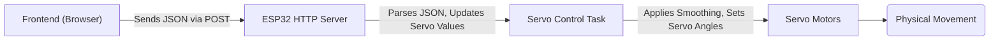

# Web Server Interface

This document details the web server implementation used in the MARIO project for testing and tuning servo parameters. The web server provides a user-friendly interface to control servo angles and observe their behavior in real-time.

## Overview

The web server is built on the ESP32 and utilizes SPIFFS for storing static web files. It provides a RESTful API endpoint for updating servo positions and serves a frontend interface built with HTML, CSS, and JavaScript. This setup allows for easy access and control of servo parameters via any web browser.

## Key Components

*   **Frontend (HTML/CSS/JavaScript):** Provides a user interface to set desired servo angles.
*   **REST API (HTTP Server):** Receives POST requests with target servo angles.
*   **Servo Control Logic:** Applies the received angles to the physical servos with smoothing to prevent jerky motion.
*   **SPIFFS Filesystem:** Stores the HTML, CSS, and JavaScript files for the web interface.

## Relevant Files

*   `firmware/5_servo_test_webserver/main/main.c`: Contains the main application logic, servo initialization, and control tasks.
*   `firmware/5_servo_test_webserver/frontend/index.html`: Defines the HTML structure and JavaScript logic for the web interface.
*   `firmware/5_servo_test_webserver/main/tuning_http_server.c`: Implements the HTTP server and REST API endpoint.

## Frontend Implementation (`index.html`)

The frontend, located at `firmware/5_servo_test_webserver/frontend/index.html`, provides an intuitive interface for controlling the servo angles.

```html
<!DOCTYPE html>
<html lang="en">
	<head>
		<meta charset="UTF-8" />
		<meta name="viewport" content="width=device-width, initial-scale=1.0" />
		<title>Tuning page</title>
		<style>
			/* Styles */
		</style>
	</head>
	<body>
		<main>
			<h1>MARIO SERVO TESTING</h1>
			<div class="button-group">
				<h3>Servo A</h3>
				<button>&lt;</button>
				<input type="text" value="0.000" id="servo_a" />
				<button>&gt;</button>
			</div>
            <!-- More servo controls -->
		</main>
		<script>
			// JavaScript Logic
		</script>
	</body>
</html>
```

[View on GitHub](https://github.com/SRA-VJTI/MARIO/blob/humble/firmware/5_servo_test_webserver/frontend/index.html)

The HTML defines input fields for each servo, along with buttons to increment and decrement their values. JavaScript code handles sending these values to the ESP32 via HTTP POST requests.

```javascript
let inpArray = document.querySelectorAll("input[type='text']");
function submitVals() {
    const data = {};
    data["servo_a"] = parseFloat(document.getElementById("servo_a").value);
    data["servo_b"] = parseFloat(document.getElementById("servo_b").value);
    data["servo_c"] = parseFloat(document.getElementById("servo_c").value);
    data["servo_d"] = parseFloat(document.getElementById("servo_d").value);
    let finaldata = JSON.stringify(data);

    let xhr = new XMLHttpRequest();
    let url = "/api/v1/servo";

    xhr.open("POST", url, true);
    xhr.setRequestHeader("Content-Type", "application/json");

    xhr.onreadystatechange = function () {
        if (xhr.readyState === 4) {
            if (xhr.status == 400) {
                console.log("Success!");
            } else {
                console.log(xhr.status);
            }
        }
    };
    xhr.send(finaldata);
}
for (let i = 0; i < inpArray.length; i++) {
    inpArray[i].addEventListener("change", submitVals);
}
```

[View on GitHub](https://github.com/SRA-VJTI/MARIO/blob/humble/firmware/5_servo_test_webserver/frontend/index.html)

This JavaScript snippet captures the values from the input fields, packages them into a JSON object, and sends them to the `/api/v1/servo` endpoint on the ESP32.

## HTTP Server (`tuning_http_server.c`)

The `tuning_http_server.c` file implements the HTTP server responsible for handling incoming requests and serving the web interface.

```c
#include "tuning_http_server.h"

static const char *TAG = "tuning_http_server";
static char scratch[SCRATCH_BUFSIZE];
static servo_const_t servo_constants = {.servo_a = 0.0, .servo_b = 0.0, .servo_c = 0.0, .servo_d = 0.0};

servo_const_t read_servo_const()
{
    return servo_constants;
}
```

[View on GitHub](https://github.com/SRA-VJTI/MARIO/blob/humble/firmware/5_servo_test_webserver/main/tuning_http_server.c)

This snippet shows the declaration of static variables to store servo constants and a function `read_servo_const()` to access these values. The `scratch` buffer is used for reading data from HTTP requests.

```c
static esp_err_t tuning_servo_post_handler(httpd_req_t *req)
{
    int total_len = req->content_len;
    int cur_len = 0;
    char *buf = scratch;
    memset(scratch, '\0', SCRATCH_BUFSIZE);
    int received = 0;

    if (total_len >= SCRATCH_BUFSIZE) {
        httpd_resp_send_err(req, HTTPD_500_INTERNAL_SERVER_ERROR, "content too long");
        return ESP_FAIL;
    }

    while (cur_len < total_len) {
        received = httpd_req_recv(req, buf + cur_len, total_len);
        if (received <= 0) {
            httpd_resp_send_err(req, HTTPD_500_INTERNAL_SERVER_ERROR, "Failed to post control value");
            return ESP_FAIL;
        }
        cur_len += received;
    }
    buf[total_len] = '\0';

    cJSON *root = cJSON_Parse(buf);
    if (root == NULL)
    {   
        ESP_LOGE(TAG, "invalid json response");
        return ESP_FAIL;
    }
    
    if (!cJSON_HasObjectItem(root, "servo_a") || !cJSON_HasObjectItem(root, "servo_b") || !cJSON_HasObjectItem(root, "servo_c"))
    {
        ESP_LOGE(TAG, "invalid json response");
        return ESP_FAIL;
    }
    
    servo_constants.servo_a = (float)cJSON_GetObjectItem(root, "servo_a")->valuedouble;
    servo_constants.servo_b = (float)cJSON_GetObjectItem(root, "servo_b")->valuedouble;
    servo_constants.servo_c = (float)cJSON_GetObjectItem(root, "servo_c")->valuedouble;
    servo_constants.servo_d = (float)cJSON_GetObjectItem(root, "servo_d")->valuedouble;

    cJSON_Delete(root);
    httpd_resp_sendstr(req, "Post control value successfully");
    return ESP_OK;
}
```

[View on GitHub](https://github.com/SRA-VJTI/MARIO/blob/humble/firmware/5_servo_test_webserver/main/tuning_http_server.c)

The `tuning_servo_post_handler` function handles the POST requests to `/api/v1/servo`. It reads the JSON data from the request body, parses it using the `cJSON` library, and updates the `servo_constants` variable with the new servo angle values.

```c
static esp_err_t rest_common_get_handler(httpd_req_t *req)
{
    char filepath[FILE_PATH_MAX] = WEB_MOUNT_POINT;

    if (strlen(req->uri) > 0 && req->uri[strlen(req->uri) - 1] == '/') 
    {
        strlcat(filepath, "/index.html", sizeof(filepath));
    }
    else 
    {
        strlcat(filepath, req->uri, sizeof(filepath));
    }

    int fd = open(filepath, O_RDONLY, 0);
    if (fd == -1) {
        ESP_LOGE(TAG, "Failed to open file : %s", filepath);
        httpd_resp_send_err(req, HTTPD_500_INTERNAL_SERVER_ERROR, "Failed to read existing file");
        return ESP_FAIL;
    }

    set_content_type_from_file(req, filepath);

    char *chunk = scratch;
    memset(scratch, '\0', SCRATCH_BUFSIZE);
    ssize_t read_bytes;
    do {
        read_bytes = read(fd, chunk, SCRATCH_BUFSIZE);
        if (read_bytes == -1) {
            ESP_LOGE(TAG, "Failed to read file : %s", filepath);
        } else if (read_bytes > 0) {
            if (httpd_resp_send_chunk(req, chunk, read_bytes) != ESP_OK) {
                close(fd);
                ESP_LOGE(TAG, "File sending failed!");
                httpd_resp_sendstr_chunk(req, NULL);
                httpd_resp_send_err(req, HTTPD_500_INTERNAL_SERVER_ERROR, "Failed to send file");
                return ESP_FAIL;
            }
        }
    } while (read_bytes > 0);

    close(fd);
    ESP_LOGI(TAG, "File sending complete");
    httpd_resp_send_chunk(req, NULL, 0);
    return ESP_OK;
}
```

[View on GitHub](https://github.com/SRA-VJTI/MARIO/blob/humble/firmware/5_servo_test_webserver/main/tuning_http_server.c)

The `rest_common_get_handler` function handles GET requests for static files. It reads the requested file from the SPIFFS filesystem and sends it as an HTTP response. It also sets the correct content type based on the file extension.

## Servo Control (`main.c`)

The `main.c` file initializes the servos and contains the main control loop. It reads the target servo angles from the `servo_constants` variable and applies them to the servos.

```c
#include "sra_board.h"
#include <stdio.h>
#include <math.h>
#include "tuning_http_server.h"

#define TAG "MCPWM_SERVO_CONTROL"
#define SMOOTHING_STEPS 20
#define SMOOTHING_DELAY 20

typedef struct {
    float current_a;
    float current_b;
    float current_c;
    float current_d;
} servo_positions;

static servo_positions current_pos = {0, 0, 0, 0};

void smooth_servo_motion(servo_config *servo, float current_angle, float target_angle) {
    float angle_diff = target_angle - current_angle;
    float step = angle_diff / SMOOTHING_STEPS;

    for(int i = 0; i < SMOOTHING_STEPS; i++) {
        float intermediate_angle = current_angle + (step * (i + 1));
        set_angle_servo(servo, intermediate_angle);
        vTaskDelay(pdMS_TO_TICKS(SMOOTHING_DELAY));
    }
}

static void mcpwm_servo_control(void *arg)
{
    enable_servo();

    // Initialize current positions
    current_pos.current_a = read_servo(&servo_a);
    current_pos.current_b = read_servo(&servo_b);
    current_pos.current_c = read_servo(&servo_c);
    current_pos.current_d = read_servo(&servo_d);

    while (1)
    {
        float target_a = read_servo_const().servo_a;
        float target_b = read_servo_const().servo_b;
        float target_c = read_servo_const().servo_c;
        float target_d = read_servo_const().servo_d;

        if (fabs(target_a - current_pos.current_a) > 0.5) {
            smooth_servo_motion(&servo_a, current_pos.current_a, target_a);
            current_pos.current_a = target_a;
        }

        if (fabs(target_b - current_pos.current_b) > 0.5) {
            smooth_servo_motion(&servo_b, current_pos.current_b, target_b);
            current_pos.current_b = target_b;
        }

        if (fabs(target_c - current_pos.current_c) > 0.5) {
            smooth_servo_motion(&servo_c, current_pos.current_c, target_c);
            current_pos.current_c = target_c;
        }

        if (fabs(target_d - current_pos.current_d) > 0.5) {
            smooth_servo_motion(&servo_d, current_pos.current_d, target_d);
            current_pos.current_d = target_d;
        }

        vTaskDelay(pdMS_TO_TICKS(100));
    }
}
```

[View on GitHub](https://github.com/SRA-VJTI/MARIO/blob/humble/firmware/5_servo_test_webserver/main/main.c)

This code snippet demonstrates the `mcpwm_servo_control` task. This task continuously reads the `servo_constants` values updated by the HTTP server and smoothly adjusts the servo angles accordingly using the `smooth_servo_motion` function. This function implements a smoothing algorithm to prevent abrupt servo movements.

## Workflow Diagram





## Key Integration Points

*   **Data Flow:** The frontend sends servo angle data to the ESP32 via HTTP POST requests. The ESP32 parses this data and updates the servo control logic. The servo control logic then smoothly adjusts the servo angles.
*   **Error Handling:** The HTTP server includes error handling to manage invalid JSON data and other potential issues.
*   **Smoothing:** The servo control logic implements smoothing to avoid jerky movements and potential damage to the servos.

## Best Practices

*   **Asynchronous Updates:** Ensure servo updates are performed asynchronously to prevent blocking the HTTP server and maintaining responsiveness.
*   **Input Validation:** Implement thorough input validation on both the frontend and backend to prevent invalid or malicious data from affecting the servos.
*   **Security:**  If the web server is exposed to a network, implement appropriate security measures such as authentication and authorization.
*   **Modular Design:** Keep the frontend, HTTP server, and servo control logic modular to facilitate testing and maintenance.
```