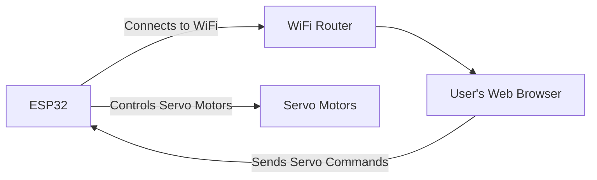
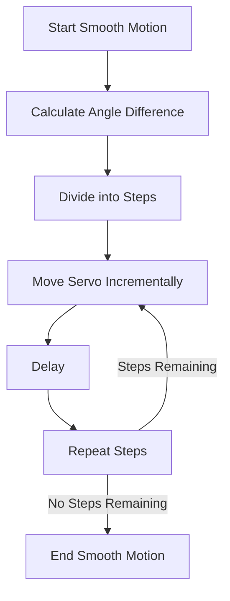

# Firmware Implementation

This section details the firmware development for the MARIO robotic arm, focusing on controlling servo motors, integrating with MicroROS, and enabling web-based control functionalities. The firmware is built using the ESP-IDF framework for ESP32 microcontrollers.

## Servo Control

The core of the firmware involves precise control of servo motors to achieve the desired robotic arm movements. This includes setting servo positions, calibrating servo ranges, and implementing smooth motion control.

### Setting Servo Zero Position

The `servo_set_zero` example demonstrates setting all servos to a defined zero position. This is crucial for calibrating the robot's starting configuration.

```bash
cd firmware/1_servo_set_zero
get_idf #or source . ./esp/esp-idf/export.sh
idf.py build
idf.py -p PORT flash
```

This sequence of commands navigates to the project directory, sources the ESP-IDF environment, builds the firmware, and flashes it to the connected ESP32 board.

[View on GitHub](https://github.com/SRA-VJTI/MARIO/blob/humble/firmware/1_servo_set_zero/README.md)

#### Troubleshooting Flash Errors

A common issue is the `cmake flash error`. This often relates to insufficient permissions to access the serial port. The following commands can resolve this:

```bash
sudo chmod 777 /dev/ttyUSB0   # Replace with your port
idf.py -p PORT flash
```

This grants full read and write permissions to the specified serial port, allowing the flashing process to proceed.

### Web-Based Servo Control

The `servo_test_webserver` example showcases a web interface for controlling the servo motors. This approach facilitates remote control and testing of the robotic arm.

```bash
cd ros2_ws_firmware/5_servo_test_webserver
idf.py menuconfig
idf.py build
idf.py -p PORT flash
idf.py monitor
```

The `menuconfig` step is vital for configuring the WiFi settings, ensuring the ESP32 can connect to the network and serve the web interface.

[View on GitHub](https://github.com/SRA-VJTI/MARIO/blob/humble/firmware/5_servo_test_webserver/README.md)





This diagram illustrates the flow of control from a user's web browser, through the WiFi network, to the ESP32, which in turn actuates the servo motors.

#### Key Configuration Snippet

Configuring WiFi credentials is crucial. The ESP-IDF's `menuconfig` provides an interface for setting the SSID and password.

```plaintext
Component config
  - MARIO testing
    - WiFi Config
      - Set SSID
      - Set Password
```

These settings must match the network credentials for the ESP32 to connect successfully.

#### Main Application Logic

The `main.c` file contains the core logic for controlling the servo motors based on commands received from the web server.

```c
#include "sra_board.h"
#include <stdio.h>
#include <math.h>
#include "tuning_http_server.h"

#define TAG "MCPWM_SERVO_CONTROL"

void app_main() {
    ESP_LOGD(TAG, "Testing servo motors\n");
    xTaskCreatePinnedToCore(mcpwm_servo_control, "mcpwm_example_servo_control", 4096, NULL, 5, NULL, 1);
    start_tuning_http_server();
}
```

This snippet shows the initialization of the servo control task and the HTTP server, which handles web-based commands.

[View on GitHub](https://github.com/SRA-VJTI/MARIO/blob/humble/firmware/5_servo_test_webserver/main/main.c)

#### Servo Control Task

The `mcpwm_servo_control` task is responsible for reading target servo positions from the web server and actuating the servo motors accordingly.

```c
static void mcpwm_servo_control(void *arg) {
    // ... (Initialization and main loop)

    while (1) {
        float target_a = read_servo_const().servo_a;
        float target_b = read_servo_const().servo_b;
        float target_c = read_servo_const().servo_c;
        float target_d = read_servo_const().servo_d;

        // Smooth motion for each servo
        if (fabs(target_a - current_pos.current_a) > 0.5) {
            smooth_servo_motion(&servo_a, current_pos.current_a, target_a);
            current_pos.current_a = target_a;
        }
        // ... (Similar logic for other servos)

        vTaskDelay(pdMS_TO_TICKS(100));
    }
}
```

This task continuously monitors the target servo positions and smoothly adjusts the servo angles to reach the desired positions.

#### Smooth Motion Implementation

To prevent jerky movements, a smooth motion function is implemented.

```c
void smooth_servo_motion(servo_config *servo, float current_angle, float target_angle) {
    float angle_diff = target_angle - current_angle;
    float step = angle_diff / SMOOTHING_STEPS;

    for(int i = 0; i < SMOOTHING_STEPS; i++) {
        float intermediate_angle = current_angle + (step * (i + 1));
        set_angle_servo(servo, intermediate_angle);
        vTaskDelay(pdMS_TO_TICKS(SMOOTHING_DELAY));
    }
}
```

This function divides the total angle difference into smaller steps and gradually moves the servo, resulting in a smoother motion.





This flowchart visualizes the steps involved in the smooth motion control algorithm.

## Key Integration Points

- **Web Server and Servo Control:** The HTTP server provides an interface for users to send commands, which are then processed by the servo control task to actuate the motors.
- **Smooth Motion Control:** Implementing smooth motion is crucial for preventing jerky movements and ensuring precise control of the robotic arm.
- **Configuration Management:** The ESP-IDF's `menuconfig` tool is essential for configuring WiFi credentials and other settings.

### Best Practices

- **Error Handling:** Implement robust error handling to gracefully handle unexpected situations, such as WiFi connection failures or servo motor malfunctions.
- **Calibration:** Proper calibration of servo motor ranges is crucial for accurate control.
- **Security:** Secure the web interface to prevent unauthorized access and control of the robotic arm.
- **Modular Design:** Design the firmware in a modular fashion to facilitate future extensions and modifications.
```