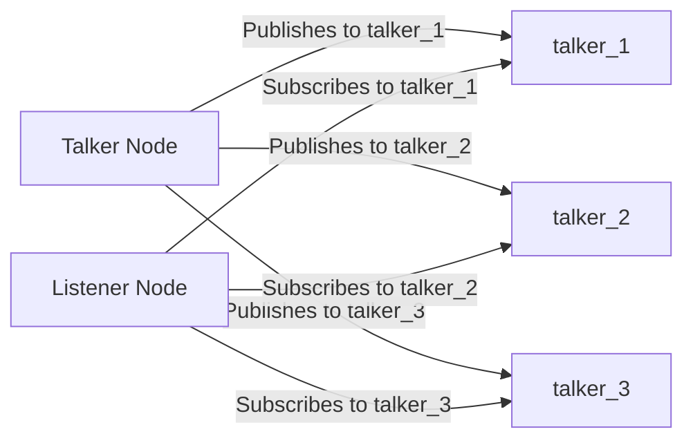
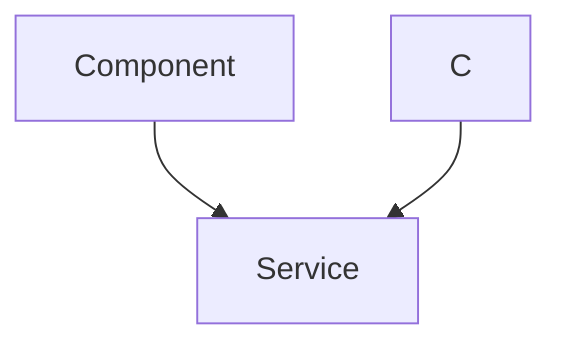

# ROS2 Communication

This document describes the ROS2 communication nodes used in the MARIO robotic arm project for controlling and monitoring its various functionalities. We will explore the functionalities of the `talker.py` and `listener.py` nodes. These are simplified examples, but they illustrate core ROS2 communication principles used throughout the project.

## Overview

ROS2 (Robot Operating System 2) is a set of software libraries and tools for building robot applications. It provides a distributed communication infrastructure that enables different software components (nodes) to interact with each other, regardless of their physical location.

The `talker.py` node publishes messages to different topics, and the `listener.py` node subscribes to these topics to receive the messages. This publish-subscribe model facilitates modularity and scalability in robotic systems.

## Talker Node (`talker.py`)

The `talker.py` node demonstrates how to publish messages to multiple topics. It creates three publishers, each publishing to a different topic: `talker_1`, `talker_2`, and `talker_3`.  The node cycles through these topics, publishing a "Hello from SRA" message to each in turn.

```python
#!/usr/bin/python3
import sys
import rclpy
from rclpy import qos
from std_msgs.msg import String

def main(args=None):
    rclpy.init(args=sys.argv)       
    
    global node,pub1,pub2,pub3
    node = rclpy.create_node("talker")
    pub1 = node.create_publisher(String, "talker_1", qos_profile=qos.qos_profile_parameters)
    pub2 = node.create_publisher(String, "talker_2", qos_profile=qos.qos_profile_parameters)
    pub3 = node.create_publisher(String, "talker_3", qos_profile=qos.qos_profile_parameters)
    timer_call.counter = 1
    timer_call.id = 1
    timer = node.create_timer(0.1,timer_call)

    try:
        rclpy.spin(node)
    except KeyboardInterrupt:
        pass

    rclpy.shutdown()

if __name__ == "__main__":
    main()
```

[View on GitHub](https://github.com/SRA-VJTI/MARIO/blob/humble/1_chatter_listener/scripts/talker.py)

**Explanation:**

*   The code initializes a ROS2 node named "talker."
*   It creates three publishers (`pub1`, `pub2`, `pub3`) for the topics "talker\_1," "talker\_2," and "talker\_3," respectively.
*   A timer is created to call the `timer_call` function periodically.

```python
def timer_call():
    msg = String()
    msg.data = "Hello from SRA%d %d" %(timer_call.id,timer_call.counter)
    if timer_call.id==1:
        pub1.publish(msg)
    elif timer_call.id == 2:
        pub2.publish(msg)
    elif timer_call.id == 3:
        pub3.publish(msg)           
                
    node.get_logger().info('Publishing: "%s"' % msg.data)
    timer_call.counter += 1
    if timer_call.counter > 50:
        timer_call.counter = 1
        timer_call.id += 1
    if timer_call.id > 3:
        timer_call.id = 1
```

[View on GitHub](https://github.com/SRA-VJTI/MARIO/blob/humble/1_chatter_listener/scripts/talker.py)

**Explanation:**

*   The `timer_call` function creates a `String` message and sets its data to a "Hello from SRA" message, including an ID and counter.
*   It then checks the `timer_call.id` to determine which publisher to use.
*   The message is published to the corresponding topic.
*   The counter and ID are incremented to cycle through the topics.

## Listener Node (`listener.py`)

The `listener.py` node demonstrates how to subscribe to multiple topics. It creates three subscribers, each listening to a different topic: `talker_1`, `talker_2`, and `talker_3`. When a message is received on any of these topics, a callback function is executed to process the message.

```python
#!/usr/bin/python3
import sys
import rclpy
from std_msgs.msg import String

def main(args=None):
    rclpy.init(args=sys.argv)
    node = rclpy.create_node("listener")
    sub1 = node.create_subscription(String, "talker_1", lambda msg: cb1(node, msg), 10)
    sub2 = node.create_subscription(String, "talker_2", lambda msg: cb2(node, msg), 10)
    sub3 = node.create_subscription(String, "talker_3", lambda msg: cb3(node, msg), 10)

    try:
        rclpy.spin(node)
    except KeyboardInterrupt:
        pass
    rclpy.shutdown()

if __name__ == "__main__":
    main()
```

[View on GitHub](https://github.com/SRA-VJTI/MARIO/blob/humble/1_chatter_listener/scripts/listener.py)

**Explanation:**

*   The code initializes a ROS2 node named "listener."
*   It creates three subscriptions (`sub1`, `sub2`, `sub3`) to the topics "talker\_1," "talker\_2," and "talker\_3," respectively.
*   Each subscription is associated with a callback function (`cb1`, `cb2`, `cb3`) that will be executed when a message is received on that topic.

```python
def cb1(node, msg:String):
    node.get_logger().info("Heard from talker1 %s" %(msg.data))

def cb2(node, msg:String):
    node.get_logger().info("Heard from talker2 %s" %(msg.data))
    
def cb3(node, msg:String):
    node.get_logger().info("Heard from talker3 %s" %(msg.data))
```

[View on GitHub](https://github.com/SRA-VJTI/MARIO/blob/humble/1_chatter_listener/scripts/listener.py)

**Explanation:**

*   The callback functions (`cb1`, `cb2`, `cb3`) receive the message as input.
*   They log the received message to the console using `node.get_logger().info()`.
*   Each callback function indicates which talker it received the message from.





## Communication Flow

The communication between the talker and listener nodes can be visualized as follows:

1.  The `talker.py` node publishes messages to the `talker_1`, `talker_2`, and `talker_3` topics.
2.  The ROS2 middleware (DDS) distributes these messages to any nodes that have subscribed to those topics.
3.  The `listener.py` node, which is subscribed to these topics, receives the messages.
4.  The corresponding callback functions (`cb1`, `cb2`, `cb3`) are executed, processing the received messages.





## Key Integration Points

*   **Topic Names:** Ensure that the talker and listener nodes use the same topic names. Mismatched topic names will prevent communication between the nodes.
*   **Message Types:** The talker and listener nodes must agree on the message type being used (e.g., `std_msgs/String`). Using different message types will result in errors during serialization and deserialization.
*   **Quality of Service (QoS):** QoS settings can be used to control the reliability and durability of messages.  Using appropriate QoS profiles is crucial for reliable communication, especially in noisy environments.  The `talker.py` script uses `qos.qos_profile_parameters`, which means it defaults to the standard QoS settings.

## Best Practices

*   **Clear Naming Conventions:** Use descriptive and consistent naming conventions for topics and nodes to improve code readability and maintainability.
*   **Modular Design:** Break down complex systems into smaller, modular nodes that communicate with each other through well-defined interfaces (topics and services).
*   **Error Handling:** Implement robust error handling to gracefully handle unexpected situations, such as network disconnects or malformed messages.
```