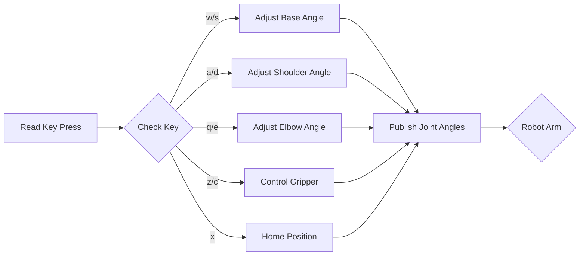
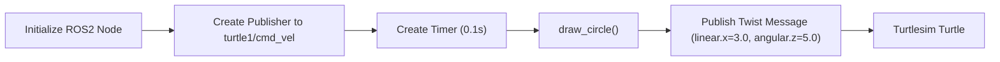

# Interactive Activities

This section documents various interactive activities designed to enhance understanding of robotics concepts and teleoperation, using examples ranging from 2D/3D rotations to teleoperating a robot arm and controlling a turtle in a simulation.

## 2D & 3D Rotations

This activity focuses on understanding and applying rotation transformations in 2D and 3D spaces. It presents questions that require calculating the new coordinates of a point after rotation.

**Example Questions:**

*   **2D Rotation:** If A (2, 3) is rotated clockwise by 90 degrees, what are the new coordinates?
*   **3D Rotation:** If A (5, 2, 6) is rotated counterclockwise by 180 degrees about the x-axis, what are the new coordinates?

These questions can be answered using rotation matrix formulas.

```markdown
[View on GitHub](https://github.com/SRA-VJTI/MARIO/blob/humble/activities/2D & 3D Rotations/README.md)
```

## Teleoperation Controller

The `teleop_key.py` script provides a keyboard-based teleoperation interface for controlling a robot arm.  It utilizes ROS 2 to publish joint angles to a forward position controller.

### Code Snippets and Explanations

1.  **Importing Libraries:** The script starts by importing necessary ROS 2 and Python libraries.

```python
import rclpy
from rclpy.node import Node
from std_msgs.msg import Float64MultiArray
import sys
import termios
import tty
import threading
from rclpy import qos
import math
```

[View on GitHub](https://github.com/SRA-VJTI/MARIO/blob/humble/activities/teleop_controller/teleop_key.py#L1-L9)

Explanation:  This section imports ROS 2 client libraries, message types (`Float64MultiArray`), system-level modules, threading, and the `math` module for angle calculations.

2.  **Teleop Instructions:** A multi-line string provides user instructions on how to control the robot arm using keyboard keys.

```python
msg = """
Robot Arm Teleop Controller
---------------------------
Moving around:
   q    w    e
   a    s    d
   z    x    c

w/s : increase/decrease base angle
a/d : increase/decrease shoulder angle
q/e : increase/decrease elbow angle
z/c : open/close gripper
x : home position

CTRL-C to quit
"""
```

[View on GitHub](https://github.com/SRA-VJTI/MARIO/blob/humble/activities/teleop_controller/teleop_key.py#L11-L24)

Explanation: This provides a clear guide for the user on how to control the robot arm using the keyboard.

3.  **`TeleopNode` Class:** This class defines the ROS 2 node responsible for publishing joint commands.

```python
class TeleopNode(Node):
    def __init__(self):
        super().__init__('teleop_key')
        self.publisher = self.create_publisher(
            Float64MultiArray,
            '/forward_position_controller/commands',
            qos_profile=qos.qos_profile_parameter_events
        )
        self.joint_msg = Float64MultiArray()
        self.joint_msg.data = joint_angles

    def publish_joints(self):
        try:
            self.joint_msg.data = [float(angle) for angle in joint_angles]
            self.publisher.publish(self.joint_msg)
        except Exception as e:
            self.get_logger().error(f'Failed to publish joint angles: {str(e)}')
```

[View on GitHub](https://github.com/SRA-VJTI/MARIO/blob/humble/activities/teleop_controller/teleop_key.py#L39-L56)

Explanation: The `TeleopNode` initializes a publisher that sends `Float64MultiArray` messages to the `/forward_position_controller/commands` topic.  The `publish_joints` method publishes the current joint angles.

4.  **Key Input Handling:** The `getKey` function reads a single character from the terminal without echoing it to the console.

```python
def getKey(settings):
    tty.setraw(sys.stdin.fileno())
    key = sys.stdin.read(1)
    termios.tcsetattr(sys.stdin, termios.TCSADRAIN, settings)
    return key
```

[View on GitHub](https://github.com/SRA-VJTI/MARIO/blob/humble/activities/teleop_controller/teleop_key.py#L26-L30)

Explanation: This function configures the terminal to read single characters directly from input without waiting for a newline, which enables real-time control via keystrokes.

5.  **Joint Angle Control Logic:** This section handles key presses to adjust joint angles.

```python
                # Base joint control (0 to 180 degrees = 0 to π radians)
                if key == 'w':
                    if joint_angles[0] < math.pi:
                        joint_angles[0] = min(joint_angles[0] + angle_step, math.pi)
                elif key == 's':
                    if joint_angles[0] > 0:
                        joint_angles[0] = max(joint_angles[0] - angle_step, 0.0)
```

[View on GitHub](https://github.com/SRA-VJTI/MARIO/blob/humble/activities/teleop_controller/teleop_key.py#L92-L99)

Explanation: The code checks if the key pressed is 'w' or 's'. If 'w' is pressed and the base joint angle is less than pi, it increases the angle by `angle_step`, ensuring it doesn't exceed pi.  Conversely, if 's' is pressed and the angle is greater than 0, it decreases the angle by `angle_step`, ensuring it doesn't go below 0. Similar logic applies to the other joints based on different key presses.

6.  **Home Position:**  Setting all joint angles to zero.

```python
                elif key == 'x':
                    joint_angles[:] = [0.0, 0.0, 0.0, 0.0, 0.0]
```

[View on GitHub](https://github.com/SRA-VJTI/MARIO/blob/humble/activities/teleop_controller/teleop_key.py#L119-L120)

Explanation: When the user presses the 'x' key, this code resets all joint angles to zero, effectively moving the robot arm to its home position. This provides a convenient way to reset the arm to a known state.

### Mermaid Diagram





### Key Integration Points

The teleoperation script integrates keyboard input, ROS 2 communication, and joint angle control.  It's a valuable tool for manually controlling a robot arm and testing its movements.  Best practices include handling exceptions to prevent program crashes and ensuring smooth, controlled movements by limiting the `angle_step`.

## Turtlesim Circle Drawing

The `draw_circle.py` script demonstrates how to control the Turtlesim turtle to draw a circle using ROS 2.

### Code Snippets and Explanations

1.  **Import Libraries:** Imports necessary ROS 2 and message type libraries.

```python
import rclpy
import sys
from rclpy import qos
from geometry_msgs.msg import Twist
```

[View on GitHub](https://github.com/SRA-VJTI/MARIO/blob/humble/activities/turtlesim/scripts/draw_circle.py#L22-L25)

Explanation: This imports libraries to work with ROS 2, including `rclpy` for core ROS 2 functionalities, `sys` for system-specific parameters and functions, `qos` for quality of service settings, and `Twist` message type from `geometry_msgs.msg` to control the turtle's velocity.

2.  **`draw_circle` Function:** Publishes a `Twist` message with linear and angular velocities.

```python
def draw_circle():
    global pub_vel
    msg = Twist()
    msg.linear.x = 3.0
    msg.angular.z = 5.0   
    pub_vel.publish(msg)
```

[View on GitHub](https://github.com/SRA-VJTI/MARIO/blob/humble/activities/turtlesim/scripts/draw_circle.py#L27-L32)

Explanation: This function creates a `Twist` message, sets the linear x velocity to 3.0 and the angular z velocity to 5.0, and then publishes it to the turtle's velocity command topic using the global publisher `pub_vel`.  These velocity values are chosen to make the turtle move in a circle.

3.  **`main` Function:** Initializes the ROS 2 node and publisher.

```python
def main(args=None):
    rclpy.init(args=sys.argv)
    global pub_vel
    node = rclpy.create_node("Circle")
    pub_vel = node.create_publisher(Twist,"turtle1/cmd_vel",qos_profile=qos.qos_profile_parameters)
    node.get_logger().info("Circle started")
    timer = node.create_timer(0.1,draw_circle)
    try:
        rclpy.spin(node)  # Spin only one node to handle callbacks
    except KeyboardInterrupt:
        pass

    rclpy.shutdown()
```

[View on GitHub](https://github.com/SRA-VJTI/MARIO/blob/humble/activities/turtlesim/scripts/draw_circle.py#L34-L47)

Explanation: This function initializes the ROS 2 environment, creates a node named "Circle", sets up a publisher (`pub_vel`) to send `Twist` messages to the "turtle1/cmd_vel" topic (which controls the turtle's movement), and creates a timer that calls the `draw_circle` function every 0.1 seconds to continuously publish velocity commands.  The `rclpy.spin(node)` function keeps the node active and listening for callbacks until a `KeyboardInterrupt` (Ctrl+C) is triggered.  Finally, it shuts down the ROS 2 environment.

### Mermaid Diagram





### Key Integration Points

The Turtlesim circle drawing script demonstrates basic ROS 2 node creation, publishing messages to control a simulated robot, and using timers to execute actions periodically.  It’s a simple example that illustrates the fundamental concepts of ROS 2 programming for robotics.

```plaintext
Ensure that ROS 2 is sourced before running the script:

source /opt/ros/humble/setup.bash
```
```bash
ros2 run turtlesim_activities draw_circle.py
```

```