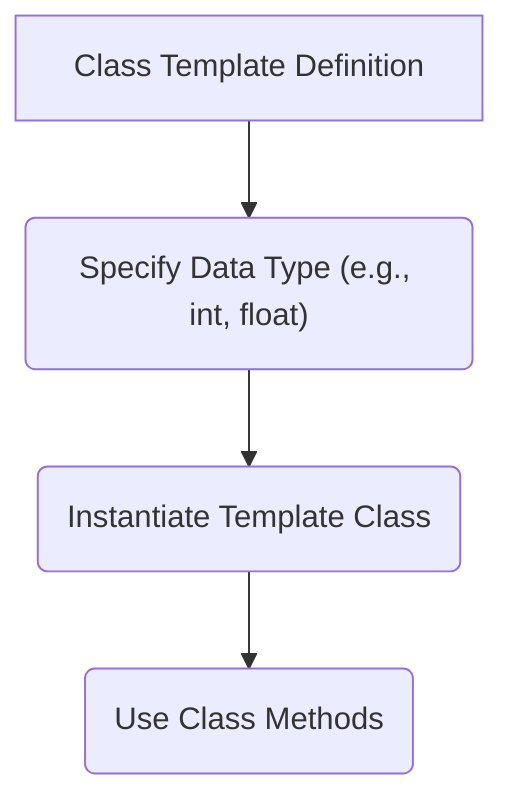
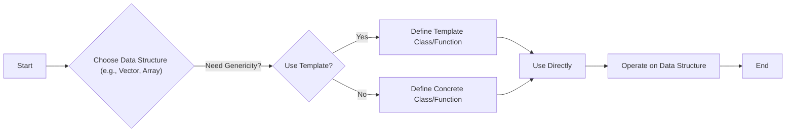

# Data Structures and Templates

This section provides an overview of commonly used data structures in C++ and the implementation of templates. We'll explore examples using arrays, vectors, and class templates to illustrate how these concepts are applied in practice.

## Arrays

Arrays are fundamental data structures used to store a collection of elements of the same type. In C++, arrays can be single-dimensional or multi-dimensional.

### 2D Arrays

2D arrays are useful for representing data in a tabular format, such as matrices or grids.

```cpp
#include <iostream>
using namespace std;
int main()
{
	int arr[4][2] = {// An array with 4 rows and 2 columns is made and initialized
					 {10, 11},
					 {20, 21},
					 {30, 31},
					 {40, 41}};

	int i, j; // Two variables for looping

	cout << "Printing a 2D Array:\n";
	for (i = 0; i < 4; i++) // traversing through row
	{
		for (j = 0; j < 2; j++) // traversing through column
		{
			cout << "\t" << arr[i][j];
		}
		cout << endl;
	}
	return 0;
}
```

This code initializes a 2D array `arr` with 4 rows and 2 columns. The nested loops iterate through each element of the array, printing its value to the console.

[View on GitHub](https://github.com/SRA-VJTI/Pixels_Seminar/blob/main/1_cpp_basics/7_arrays/arrays2d.cpp)

## Vectors

Vectors are dynamic arrays that can grow or shrink in size as needed. They provide a more flexible alternative to static arrays.

### Adding Elements to a Vector

The `push_back()` method allows you to add elements to the end of a vector.

```cpp
#include <iostream>
#include <vector>
using namespace std;

int main()
{
  vector<int> num{1, 2, 3, 4, 5}; // Initialising a vector

  cout << "Initial Vector: ";

  for (const int &i : num)
  {
    cout << i << "  ";
  }

  // add the integers 6 and 7 to the vector
  num.push_back(6);
  num.push_back(7);

  cout << "\nUpdated Vector: ";

  for (const int &i : num)
  {
    cout << i << "  ";
  }

  return 0;
}
```

This code demonstrates how to initialize a vector and add elements to it using `push_back()`. The updated vector is then printed to the console.

[View on GitHub](https://github.com/SRA-VJTI/Pixels_Seminar/blob/main/1_cpp_basics/9_vectors/addtovector.cpp)

### Accessing Vector Elements

You can access elements in a vector using the `at()` method, which provides bounds checking.

```cpp
#include <iostream>
#include <vector>
using namespace std;

int main()
{
  vector<int> num{1, 2, 3, 4, 5}; // Initialised a vector

  cout << "Element at Index 0: " << num.at(0) << endl; // Printing value at vector index 0
  cout << "Element at Index 2: " << num.at(2) << endl; // Printing value at vector index 2
  cout << "Element at Index 4: " << num.at(4);         // Printing value at vector index 4

  return 0;
}
```

This code shows how to access specific elements of a vector using the `at()` method, printing the values at indices 0, 2, and 4.

[View on GitHub](https://github.com/SRA-VJTI/Pixels_Seminar/blob/main/1_cpp_basics/9_vectors/access_vector.cpp)

## Templates

Templates are a powerful feature in C++ that allows you to write generic code that can work with different data types. They are particularly useful for creating reusable data structures and algorithms.

### Class Templates

Class templates allow you to define a class that can work with different data types.

```cpp
#include <iostream>
using namespace std;
template <class T> // Declaring the Class template
class A
{
public:
    T num1 = 5;
    T num2 = 6;
    void add()
    {
        std::cout << "Addition of num1 and num2 : " << num1 + num2 << std::endl;
    }
};

int main()
{
    A<int> d;
    d.add(); // Calling the class method
    return 0;
}
```

In this example, the `A` class is defined as a template, allowing it to work with any data type `T`. The `main()` function creates an instance of the class with `int` as the data type and calls the `add()` method.

[View on GitHub](https://github.com/SRA-VJTI/Pixels_Seminar/blob/main/1_cpp_basics/6_templates/class_template.cpp)

Let's illustrate the usage of templates with a simple diagram.





## Data Structures and Templates Workflow

Here's a flowchart that illustrates how data structures and templates might be used together in a typical C++ program.





## Key Integration Points

- **Flexibility with Templates**: Templates enable the creation of generic data structures and algorithms, reducing code duplication and increasing reusability.
- **Dynamic Memory with Vectors**: Vectors offer dynamic memory allocation, making them suitable for situations where the size of the data is not known at compile time.
- **Static Memory with Arrays**: Arrays provide a simple and efficient way to store a fixed number of elements.
- **Choosing the Right Data Structure**: The choice of data structure depends on the specific requirements of the application, such as the need for dynamic resizing or the importance of memory efficiency.

By understanding these key integration points, you can effectively leverage data structures and templates to build robust and efficient C++ applications.
```