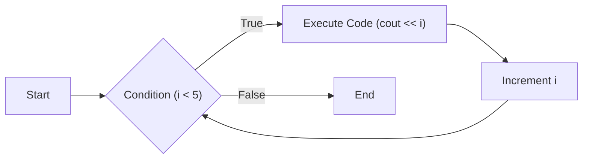
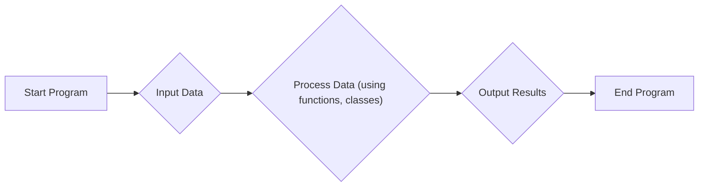

# C++ Basics

This document provides an introduction to fundamental C++ programming concepts. It covers variables, data types, control flow, functions, classes, and more.

## Variables and Data Types

In C++, a variable is a named storage location that holds a value. Each variable has a specific data type, determining the kind of value it can store (e.g., integer, floating-point number, character).

```c++
#include <iostream>
using namespace std;

int main() {
  int age = 30;        // Integer variable
  double salary = 50000.0; // Double-precision floating-point variable
  char grade = 'A';      // Character variable
  string name = "John Doe"; // String variable

  cout << "Name: " << name << endl;
  cout << "Age: " << age << endl;
  cout << "Salary: " << salary << endl;
  cout << "Grade: " << grade << endl;

  return 0;
}
```

This code demonstrates declaring variables of different data types and printing their values.

[View on GitHub](https://github.com/SRA-VJTI/Pixels_Seminar/blob/main/1_cpp_basics/README.md)

## Type Casting

Type casting converts a value from one data type to another. C++ supports both implicit (automatic) and explicit (manual) type casting.

```c++
#include <iostream>
using namespace std;

int main() {
  int x = 10;
  char y = 'a';

  // Implicit conversion
  x = x + y; // 'a' is implicitly converted to its ASCII value (97)
  cout << "x: " << x << endl;

  // Explicit conversion
  float z = 1.2;
  int sum = (int)z + 1; // Explicitly convert float to int
  cout << "Sum: " << sum << endl;

  return 0;
}
```

This example showcases implicit and explicit type conversions in C++.

[View on GitHub](https://github.com/SRA-VJTI/Pixels_Seminar/blob/main/1_cpp_basics/README.md)

## Namespace

Namespaces organize code into logical groups and prevent name collisions, especially when using multiple libraries.

```c++
#include <iostream>
using namespace std;

namespace first_space {
  void func() {
    cout << "Inside first_space" << endl;
  }
}

namespace second_space {
  void func() {
    cout << "Inside second_space" << endl;
  }
}

int main() {
  first_space::func();   // Call function from first namespace
  second_space::func();  // Call function from second namespace
  return 0;
}
```

This code demonstrates how to define and use namespaces to avoid naming conflicts.

[View on GitHub](https://github.com/SRA-VJTI/Pixels_Seminar/blob/main/1_cpp_basics/README.md)

## Conditional Statements

Conditional statements (if, else if, else, switch) allow you to execute different blocks of code based on specific conditions.

```c++
#include <iostream>
using namespace std;

int main() {
  int num = 10;

  if (num > 5) {
    cout << "Number is greater than 5" << endl;
  } else if (num < 5) {
    cout << "Number is less than 5" << endl;
  } else {
    cout << "Number is equal to 5" << endl;
  }

  return 0;
}
```

This illustrates the use of `if`, `else if`, and `else` statements to control the flow of execution based on a condition.

[View on GitHub](https://github.com/SRA-VJTI/Pixels_Seminar/blob/main/1_cpp_basics/README.md)

## Control Loops

Loops (for, while, do-while) allow you to repeat a block of code multiple times.

```c++
#include <iostream>
using namespace std;

int main() {
  // For loop
  for (int i = 0; i < 5; i++) {
    cout << "i: " << i << endl;
  }

  // While loop
  int j = 0;
  while (j < 5) {
    cout << "j: " << j << endl;
    j++;
  }

  return 0;
}
```

This example shows how to use `for` and `while` loops for repetitive tasks.

[View on GitHub](https://github.com/SRA-VJTI/Pixels_Seminar/blob/main/1_cpp_basics/README.md)





## Functions

Functions are reusable blocks of code that perform specific tasks.

```c++
#include <iostream>
using namespace std;

// Function declaration
int add(int x, int y);

int main() {
  int a = 10, b = 20;
  int sum = add(a, b);  // Function call
  cout << "Sum: " << sum << endl;
  return 0;
}

// Function definition
int add(int x, int y) {
  return x + y;
}
```

This demonstrates the declaration, definition, and calling of a function.

[View on GitHub](https://github.com/SRA-VJTI/Pixels_Seminar/blob/main/1_cpp_basics/README.md)

## Classes and Objects

Classes are blueprints for creating objects. They encapsulate data (member variables) and behavior (member functions).

```c++
#include <iostream>
using namespace std;

class Sra {
public:
  char first_letter;
  int id;

  void printletter();

  void printid() {
    cout << "SRA id is: " << id << endl;
  }
};

void Sra::printletter() {
  cout << "First letter of my name  is: " << first_letter << endl;
}

int main() {
  Sra obj1;
  obj1.first_letter = 'v';
  obj1.id = 24;

  obj1.printletter();
  obj1.printid();
  return 0;
}
```

This code defines a class `Sra` with member variables and functions, and creates an object of that class.

[View on GitHub](https://github.com/SRA-VJTI/Pixels_Seminar/blob/main/1_cpp_basics/5_classes_and_objects/classes_and_objects.cpp)

## Pointers

A pointer is a variable that stores the memory address of another variable.

```c++
#include <iostream>
using namespace std;

int main() {
  int number = 30;
  int *p;         // Pointer declaration
  p = &number;    // Assign address of number to p

  cout << "Address of number: " << &number << endl;
  cout << "Address stored in p: " << p << endl;
  cout << "Value of *p: " << *p << endl; // Dereferencing the pointer
  return 0;
}
```

This example demonstrates how to declare, assign, and dereference pointers.

[View on GitHub](https://github.com/SRA-VJTI/Pixels_Seminar/blob/main/1_cpp_basics/8_pointers/pointers.cpp)

## Vectors

Vectors are dynamic arrays that can grow or shrink in size during runtime.

```c++
#include <iostream>
#include <vector>
using namespace std;

int main() {
  vector<int> vector1 = {1, 2, 3, 4, 5};

  cout << "vector1 = ";
  for (const int &i : vector1) {
    cout << i << "  ";
  }
  cout << endl;

  return 0;
}
```

This shows how to initialize and iterate through a vector.

[View on GitHub](https://github.com/SRA-VJTI/Pixels_Seminar/blob/main/1_cpp_basics/9_vectors/vectors_initialization.cpp)

## Key Integration Points

*   **Data Structures:** Use vectors when you need dynamic arrays that can resize automatically.  Understand the differences between arrays and vectors and choose the appropriate structure based on your needs.
*   **Object-Oriented Programming:** Leverage classes and objects to model real-world entities and create modular, reusable code.
*   **Memory Management:** Be mindful when working with pointers.  Ensure you are properly allocating and deallocating memory to avoid memory leaks.  Use smart pointers to help automate memory management.
*   **Control Flow:** Effectively use conditional statements and loops to implement complex logic in your programs.




