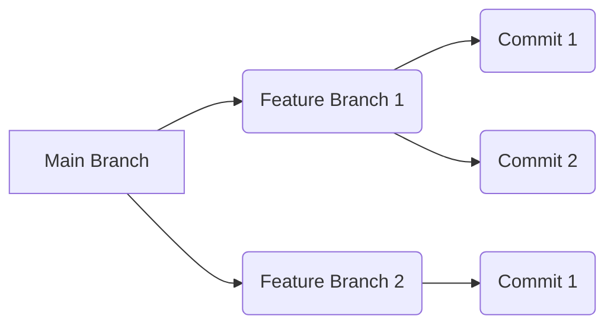
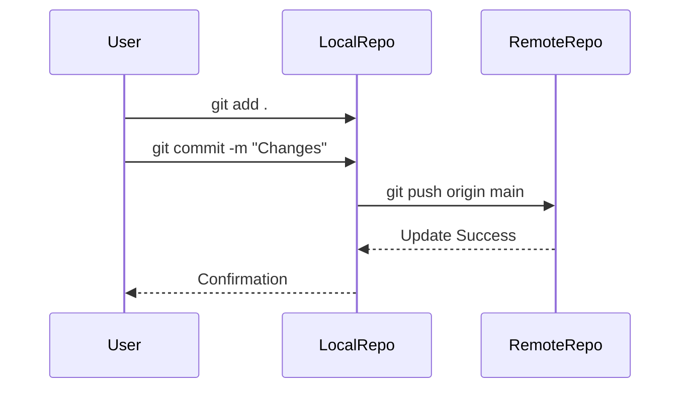

---
title: Build Systems and Version Control
description: Understanding build systems and using Git/GitHub for version control.
---

# Build Systems and Version Control

This section delves into the crucial aspects of build systems and version control using Git and GitHub. Understanding these tools and workflows is fundamental for efficient software development, collaboration, and maintainability.

## Build Systems

### What is a Build System?

A build system automates the process of compiling, linking, and packaging software. It transforms human-readable source code into executable binaries, libraries, or other deployable artifacts.

### Why Use a Build System?

*   **Automation:** Automates repetitive tasks, reducing manual effort and potential errors.
*   **Dependency Management:** Handles dependencies between different parts of the codebase and external libraries.
*   **Reproducibility:** Ensures consistent builds across different environments.
*   **Scalability:** Simplifies building large and complex projects.
*   **Optimization:** Enables optimizations like code minification and dead code elimination.

### GNU Make

GNU Make is a widely used build system that uses Makefiles to define build rules.

#### Makefile Structure

A Makefile contains rules that specify how to build targets from prerequisites.

```makefile
target: prerequisite1 prerequisite2 ...
	command1
	command2
	...
```

*   **Target:** The file or action to be created or performed.
*   **Prerequisites:** The files or targets that the target depends on.
*   **Commands:** The commands to be executed to create the target.

#### Example Makefile

```makefile
# Makefile

CC = g++
CFLAGS = -Wall -std=c++11
TARGET = main
SOURCES = main.cpp helper.cpp
OBJECTS = $(SOURCES:.cpp=.o)

all: $(TARGET)

$(TARGET): $(OBJECTS)
	$(CC) $(OBJECTS) -o $(TARGET)

%.o: %.cpp
	$(CC) $(CFLAGS) -c $< -o $@

clean:
	rm -f $(TARGET) $(OBJECTS)
```

**Explanation:**

*   `CC`:  Specifies the C++ compiler to use (g++).
*   `CFLAGS`:  Specifies compiler flags (enable all warnings, use C++11 standard).
*   `TARGET`:  The name of the executable to be built (main).
*   `SOURCES`: List of source files.
*   `OBJECTS`: List of object files (derived from SOURCES by replacing `.cpp` with `.o`).
*   `all`: The default target, which depends on the `$(TARGET)`.
*   `$(TARGET)`:  The rule to build the executable by linking the object files.
*   `%.o: %.cpp`:  A pattern rule to compile each `.cpp` file into a corresponding `.o` file.
*   `clean`: A rule to remove the executable and object files.

[View on GitHub](https://github.com/SRA-VJTI/Pixels_Seminar/blob/main/2_build_systems/README.md)

#### Variables in Makefiles

Makefiles support variables to store strings and values.

```makefile
# Variable assignment
SRC_DIR = src
BUILD_DIR = build

# Using variables
all:
	mkdir -p $(BUILD_DIR)
	$(CC) $(SRC_DIR)/main.cpp -o $(BUILD_DIR)/main
```

#### Automatic Variables

Make provides automatic variables that can be used in rules.

*   `$@`: The target of the rule.
*   `$<`: The first prerequisite of the rule.
*   `$^`: All prerequisites of the rule.

```makefile
# Using automatic variables
%.o: %.cpp
	$(CC) $(CFLAGS) -c $< -o $@
```

#### Example: Build Systems - OpenCV Integration

```cpp
// 2_build_systems/2_build_systems.cpp
#include "2_build_systems.hpp"

using namespace std;

int main(int argc, char** argv)
{
    // Create a black image
    cv::Mat image = cv::Mat::zeros( 400, 400, CV_8UC3 );

    // Write some Text
    cv::putText(image, "Hello World :)", cv::Point(15, 200),
        cv::FONT_HERSHEY_SIMPLEX, 2, cv::Scalar(0, 255, 0), 3);

    cv::imshow("Hello World", image);
    
    //display an image from the $PROJECT_SOURCE_DIR/assets/images/b&w.PNG
    cv::Mat img = cv::imread(std::string(PROJECT_SOURCE_DIR) + "/assets/images/rotate.png", cv::IMREAD_COLOR);
    cv::imshow("Example", img);

    // Wait for a keystroke in the window
    cv::waitKey(0);
    return 0;
}
```

This code snippet showcases OpenCV integration.  The `PROJECT_SOURCE_DIR` variable is often defined within a build system (like CMake or Make) to represent the project's root directory, allowing the program to locate assets relative to the project structure.

[View on GitHub](https://github.com/SRA-VJTI/Pixels_Seminar/blob/main/2_build_systems/2_build_systems.cpp)

## Version Control with Git and GitHub

### What is Version Control?

Version control is a system that records changes to a file or set of files over time so that you can recall specific versions later.  It allows you to:

*   Track changes to your code.
*   Revert to previous versions.
*   Collaborate with others on a project.
*   Manage different branches of development.

### Git

Git is a distributed version control system that is widely used in software development.

### GitHub

GitHub is a web-based platform for hosting and collaborating on Git repositories.

### Basic Git Commands

*   `git init`: Creates a new Git repository.
*   `git clone`: Creates a copy of an existing Git repository.
*   `git add`: Adds changes to the staging area.
*   `git commit`: Saves the changes in the staging area to the repository.
*   `git push`: Uploads changes from the local repository to a remote repository.
*   `git pull`: Downloads changes from a remote repository to the local repository.
*   `git status`: Shows the status of the working directory.
*   `git log`: Shows the commit history.
*   `git branch`: Manages branches.
*   `git checkout`: Switches between branches.
*   `git merge`: Merges changes from one branch into another.

### Git Workflow

1.  **Clone the repository:**  `git clone <repository_url>`
2.  **Create a new branch:** `git branch <branch_name>` followed by `git checkout <branch_name>`
3.  **Make changes:** Modify the code.
4.  **Add changes to the staging area:** `git add .` or `git add <file_name>`
5.  **Commit changes:** `git commit -m "Commit message"`
6.  **Push changes to the remote repository:** `git push origin <branch_name>`
7.  **Create a pull request:**  Submit your changes for review.
8.  **Merge the pull request:**  Integrate your changes into the main branch.

### .gitignore File

The `.gitignore` file specifies intentionally untracked files that Git should ignore.

```plaintext
# Ignore compiled object files
*.o
*.exe

# Ignore build directories
build/
dist/

# Ignore log files
*.log

# Ignore OS generated files
.DS_Store
```

[View on GitHub](https://github.com/SRA-VJTI/Pixels_Seminar/blob/main/3_git_github/3_git_commands.md)

### Git Branching

Branches allow you to work on different features or bug fixes in isolation without affecting the main codebase.





### Undoing Changes

*   `git checkout .`: Discards unstaged changes.
*   `git reset --hard <commit_hash>`: Resets the repository to a specific commit, discarding all subsequent changes.
*   `git revert <commit_hash>`: Creates a new commit that undoes the changes made in a specific commit.





### Example: Git commands
```bash
git init
git add .
git commit -m "Initial commit"
git remote add origin <repository_url>
git push -u origin main
```

This bash script initializes a Git repository, adds all files, commits the changes, connects to a remote repository, and pushes the changes to the main branch.

[View on GitHub](https://github.com/SRA-VJTI/Pixels_Seminar/blob/main/3_git_github/3_git_commands.md)

### Configuration and setup for git.

```bash
git config --global user.name "Your Name"
git config --global user.email "your.email@example.com"
```

This is used to configure the username and email, it's important because git uses this information and embed it into the commits you make.

[View on GitHub](https://github.com/SRA-VJTI/Pixels_Seminar/blob/main/3_git_github/3_git_commands.md)

## Key Integration Points

*   **Build systems and version control are essential components of a modern software development workflow.**
*   **Use a build system to automate the build process and manage dependencies.**
*   **Use Git and GitHub to track changes, collaborate with others, and manage different branches of development.**
*   **Establish a clear Git workflow to ensure code quality and consistency.**
*   **Use `.gitignore` to exclude unnecessary files from the repository.**
*   **Leverage branching to isolate new features and bug fixes.**
```
```