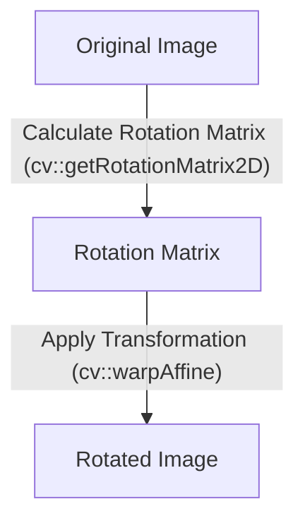
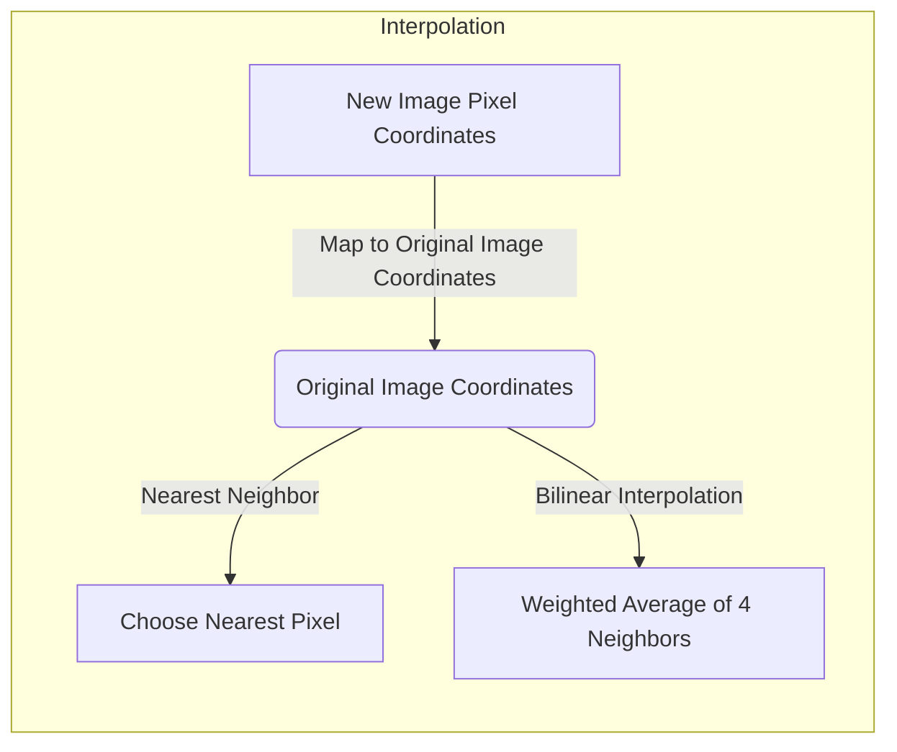

# Image Manipulation Techniques

This document explores fundamental image manipulation techniques using OpenCV, including pixel access, cropping, translation (implicitly through cropping), and rotation. These techniques form the basis for more advanced image processing tasks.

## Accessing and Modifying Pixels

Direct pixel manipulation is a core concept in image processing. By accessing individual pixel values, we can perform various operations like color adjustments, noise reduction, and feature extraction.

*   **Direct Pixel Access:** OpenCV provides methods to directly access and modify pixel values within a `cv::Mat` object. The `img.at<cv::Vec3b>(i, j)[channel]` method allows you to access the pixel at row `i`, column `j`, and specify the color channel (0 for Blue, 1 for Green, and 2 for Red).

```cpp
// File: 4_cv_basics/2_playing_with_images/0_accessing_pixels/main.cpp
cv::Mat black_out_rows(cv::Mat img, int height, int width) {
    for (int i = 0; i < height; i++) {
        for (int j = 0; j < width; j++) {
            if (i % 2 == 0) {
                img.at<cv::Vec3b>(i, j)[0] = 0; // Blue channel to 0
                img.at<cv::Vec3b>(i, j)[1] = 0; // Green channel to 0
                img.at<cv::Vec3b>(i, j)[2] = 0; // Red channel to 0
            }
        }
    }
    return img;
}
```

This snippet demonstrates how to black out alternate rows of an image by setting the RGB values of those pixels to 0.  [View on GitHub](https://github.com/SRA-VJTI/Pixels_Seminar/blob/main/4_cv_basics/2_playing_with_images/0_accessing_pixels/main.cpp)

```cpp
// File: 4_cv_basics/2_playing_with_images/0_accessing_pixels/main.cpp
cv::Mat change_blue(cv::Mat img, int height, int width) {
    for (int i = 0; i < height; i++) {
        for (int j = 0; j < width; j++) {
            if (i % 2 == 0) {
                img.at<cv::Vec3b>(i, j)[0] = 255; // Blue channel to 255
            }
        }
    }
    return img;
}
```

This snippet modifies the blue channel of alternate rows, setting it to its maximum value (255). [View on GitHub](https://github.com/SRA-VJTI/Pixels_Seminar/blob/main/4_cv_basics/2_playing_with_images/0_accessing_pixels/main.cpp)

## Image Cropping

Cropping involves extracting a specific region of interest from an image. This technique is useful for focusing on particular objects or features within an image.

*   **Using `cv::Range`:** OpenCV's `cv::Range` class provides a convenient way to specify the start and end indices for rows and columns to be extracted.  This allows creating a sub-image (cropped image) from the original.

```cpp
// File: 4_cv_basics/2_playing_with_images/2_image_cropping/main.cpp
cv::Mat img2 = img(cv::Range(0, width/2), cv::Range(0, height/2));
```

This code snippet crops the image `img` to extract the top-left quadrant, creating a new `cv::Mat` object `img2` that contains only that portion of the original image. [View on GitHub](https://github.com/SRA-VJTI/Pixels_Seminar/blob/main/4_cv_basics/2_playing_with_images/2_image_cropping/main.cpp)

*   **Manual Cropping using Loops**

```cpp
// File: 4_cv_basics/2_playing_with_images/2_image_cropping/main.cpp
cv::Mat img3 = cv::Mat::zeros(cv::Size(height/2, width/2), CV_8UC1);

    // The following implementation is using for loop to demonstrate pointer arithmetic
    for(int r = 0; r<height/2; r++)
    {
        for(int c = 0; c<width/2; c++)
        {
            img3.at<uchar>(c,r) = img.at<uchar>(c,r);
        }
    }
```

This code snippet provides another implementation of image cropping using a for loop and `.at<uchar>()` function, [View on GitHub](https://github.com/SRA-VJTI/Pixels_Seminar/blob/main/4_cv_basics/2_playing_with_images/2_image_cropping/main.cpp)

## Image Rotation

Rotating an image involves changing its orientation by a specified angle.  This is often required to align images or correct for camera tilt.

*   **`cv::getRotationMatrix2D` and `cv::warpAffine`:** OpenCV's `cv::getRotationMatrix2D` function generates a rotation matrix, and `cv::warpAffine` applies this transformation to the image.

```cpp
// File: 4_cv_basics/2_playing_with_images/4_image_rotation/main.cpp
cv::Mat rotate(cv::Mat src, double angle)
{
    cv::Mat dst;
    cv::Point2f pt(src.cols/2., src.rows/2.);
    cv::Mat r = cv::getRotationMatrix2D(pt, angle, 1.0);
    cv::warpAffine(src, dst, r, cv::Size(src.cols, src.rows));
    return dst;
}
```

This code defines a `rotate` function that takes an image (`src`) and an angle as input. It calculates the rotation matrix using `cv::getRotationMatrix2D`, specifying the center of rotation as the center of the image. Then, it uses `cv::warpAffine` to apply the rotation.  [View on GitHub](https://github.com/SRA-VJTI/Pixels_Seminar/blob/main/4_cv_basics/2_playing_with_images/4_image_rotation/main.cpp)





## Image Interpolation

Interpolation is crucial when resizing or rotating images, as the transformation often requires estimating pixel values at non-integer coordinates.

*   **Bilinear Interpolation:** This method calculates the value of a pixel based on a weighted average of the four nearest pixels in the original image.  It generally produces smoother results compared to nearest-neighbor interpolation.

```cpp
// File: 4_cv_basics/3_interpolation/src/interpolation.cpp
cv::Mat bilinear_interpolate(cv::Mat imageData, int width, int height, int channels)
{
    int x_l, y_l, x_h, y_h;
    float x_weight, y_weight;
    cv::Mat newImage = cv::Mat::zeros(cv::Size(width, height), CV_8UC3);
    double x_ratio = (double)(imageData.cols - 1) / (width - 1);
    double y_ratio = (double)(imageData.rows - 1) / (height - 1);

    cv::Scalar_<uint8_t> a, b, c, d, pixel;

    for (int i = 0; i < height; i++)
    {
        for (int j = 0; j < width; j++)
        {
            x_l = std::floor(x_ratio * j);
            y_l = std::floor(y_ratio * i);
            x_h = std::ceil(x_ratio * j);
            y_h = std::ceil(y_ratio * i);

            x_weight = (x_ratio * j - x_l);
            y_weight = (y_ratio * i - y_l);

            a = getPixel(imageData, y_l, x_l, channels);
            b = getPixel(imageData, y_l, x_h, channels);
            c = getPixel(imageData, y_h, x_l, channels);
            d = getPixel(imageData, y_h, x_h, channels);
            for (int k = 0; k < channels; k++)
            {
                pixel.val[k] = a.val[k] * (1 - x_weight) * (1 - y_weight) + b.val[k] * (x_weight) * (1 - y_weight) + c.val[k] * (1 - x_weight) * (y_weight) + d.val[k] * (x_weight) * (y_weight);
            }
            setPixel(newImage, pixel, i, j, channels);
        }
    }
    return newImage;
}
```

This code implements bilinear interpolation. It finds the four nearest neighbors of a pixel in the resized image, calculates weights based on the distance to each neighbor, and then computes the pixel value as a weighted average of the neighbors' values.  [View on GitHub](https://github.com/SRA-VJTI/Pixels_Seminar/blob/main/4_cv_basics/3_interpolation/src/interpolation.cpp)

*   **Nearest Neighbor Interpolation:** This simpler method assigns the value of the nearest pixel in the original image to the corresponding pixel in the resized image. While faster, it can result in blocky or pixelated images, especially for large resizing factors.

```cpp
// File: 4_cv_basics/3_interpolation/src/interpolation.cpp
cv::Mat nearest_neighbour_interpolate(cv::Mat imageData, int width, int height, int channels)
{
    cv ::Mat newImage = cv::Mat::zeros(cv::Size(width, height), CV_8UC3);
    double x_ratio = (double)(imageData.cols - 1) / (width - 1);
    double y_ratio = (double)(imageData.rows - 1) / (height - 1);

    cv::Scalar_<uint8_t> nearest_pixel, pixel;

    for (int i = 0; i < height; i++)
    {
        for (int j = 0; j < width; j++)
        {
            nearest_pixel = getPixel(imageData, std::round(i * y_ratio), std::round(j * x_ratio), channels);

            for (int k = 0; k < channels; k++)
            {

                pixel.val[k] = nearest_pixel.val[k];
            }
            setPixel(newImage, pixel, i, j, channels);
        }
    }

    return newImage;
}
```

This code implements nearest-neighbor interpolation. For each pixel in the resized image, it calculates the coordinates in the original image, rounds them to the nearest integer coordinates, and then assigns the value of that pixel in the original image to the pixel in the resized image. [View on GitHub](https://github.com/SRA-VJTI/Pixels_Seminar/blob/main/4_cv_basics/3_interpolation/src/interpolation.cpp)





## Key Integration Points

*   **Image Processing Pipelines:** These fundamental techniques are often integrated into larger image processing pipelines for tasks like object detection, image recognition, and image enhancement.
*   **Real-time Applications:** Optimizing pixel access and manipulation is crucial for real-time applications like video processing and augmented reality. Efficient interpolation algorithms are also necessary to maintain image quality during scaling and rotation.
*   **Data Augmentation:** Cropping and rotating images are common data augmentation techniques used to increase the size and diversity of training datasets for machine learning models. This helps improve the generalization performance of the models.
*   **Choosing the Right Interpolation:** For tasks where image quality is paramount, bilinear interpolation is generally preferred. However, for applications where speed is critical and some loss of quality is acceptable, nearest-neighbor interpolation may be a better choice.