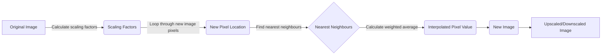
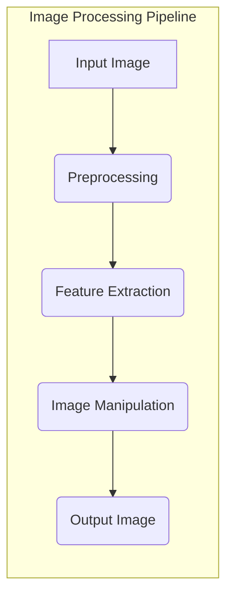

# OpenCV Fundamentals

## Introduction
This section provides a foundational understanding of image processing using OpenCV (Open Source Computer Vision Library). We will explore basic image representation, different image formats, and fundamental image manipulation techniques.

## Image Representation

### What is Image Representation?
Image representation is the method of converting visual information into a numerical format that computers can store and process. Images are essentially represented as matrices, where each element corresponds to a pixel.

### Important Terminologies
*   **Pixel:** The smallest unit of an image, characterized by color intensity (0-255) and its address.
*   **Resolution:** The number of pixels per unit area; higher resolution implies better image quality and larger file size.
*   **Aspect Ratio:** The proportional relationship between the width and height of an image (e.g., 16:9, 4:3).

### Types of Images
*   **Binary Images:** Images with only two pixel values (0 and 1), often used for simple segmentation tasks.
*   **Grayscale Images:** Images with shades of gray, ranging from black to white, where each pixel has a single intensity value.
*   **RGB Images:** Images composed of three color channels: Red, Green, and Blue, representing a wide range of colors.

### Colour Models
*   **Additive Model (RGB):** Combines Red, Green, and Blue light to produce various colors, used in digital media like monitors.
*   **Subtractive Model (CMYK):** Uses Cyan, Magenta, Yellow, and Black inks to create colors, primarily used in printing.
*   **HSV Colour Model :** Describes colors (hue or tint) in terms of their shade and brightness in cylindrical geometry. It has three components: hue, saturation, and value.

### Different Image Storing Formats

*   **Bitmap (.bmp):** Stores pixel color data without compression, resulting in large file sizes.
*   **TIFF (.tiff, .tif):** Uses lossless compression, retaining high image quality but with larger file sizes.
*   **JPG (.jpg, .jpeg):** Uses lossy compression, significantly reducing file size with some loss of image quality.
*   **PNG (.png):** Uses lossless compression and supports transparency, suitable for web graphics and images with transparent backgrounds.

### How Images are Stored (BMP Example)
BMP images are stored in four main blocks:

1.  **File Type Data (BITMAPFILEHEADER):** Contains the file type, size, and offset to pixel data.
2.  **Image Information Data (BITMAPINFOHEADER):** Contains information about the image dimensions, color depth, and compression.
3.  **Color Palette (Optional):** A table of colors used in the image, required for images with 8 bits per pixel or less.
4.  **Raw Pixel Data:** The actual pixel data, representing the color of each pixel in the image.

#### Example: Reading BMP File Header (C++)

```cpp
#pragma pack(push, 1)
struct BitMapFileHeader {
    char file_type[2];
    uint32_t file_size;
    uint16_t reserved1;
    uint16_t reserved2;
    uint32_t pixel_data_offset;
};
#pragma pack(pop)

// Example usage:
BitMapFileHeader header;
std::ifstream infile("image.bmp", std::ios::binary);
infile.read(reinterpret_cast<char*>(&header), sizeof(BitMapFileHeader));
std::cout << "File Size: " << header.file_size << std::endl;
```

[View on GitHub](https://github.com/SRA-VJTI/Pixels_Seminar/blob/main/4_cv_basics/1_image_representation/main.cpp)

This code snippet reads the `BITMAPFILEHEADER` from a BMP file, displaying the file size. The `#pragma pack` directives ensure correct memory alignment, which is important when reading binary file formats.

#### Example: Plotting Pixel Data (C++)
```cpp
SDL_Renderer* renderer;
// Assuming image.data contains pixel data
for (int i = 0; i < h; i++) {
    for (int j = 0; j < w; j++) {
        uint8_t k = image.data[j + i * h];
        SDL_SetRenderDrawColor(renderer, k, k, k, 255);
        SDL_RenderDrawPoint(renderer, j, h - i - 1);
    }
}
SDL_RenderPresent(renderer);
```

[View on GitHub](https://github.com/SRA-VJTI/Pixels_Seminar/blob/main/4_cv_basics/1_image_representation/main.cpp)

This code uses the SDL2 library to render pixel data on the screen. It iterates through the pixel data, sets the color of each pixel, and draws it on the renderer.

### Installations

#### Ubuntu
```bash
sudo apt-get install libsdl2-2.0-0
sudo apt-get install libsdl2-image-dev
```

#### MacOS
```bash
brew install sdl2
```

#### Example: Building with Make
```bash
make SRC=main.cpp
./image_representation assets/image.bmp
```

This shell script builds and runs the `image_representation` executable.

## Playing with Image Arrays

### Accessing Pixel Values

Directly manipulating image arrays is a fundamental image processing technique.

### Drawing on Images

Drawing shapes and text on images to add annotations or visual cues.

### Image Cropping

Extracting specific regions of interest from an image.

### Image Translation

Shifting an image in the x and y directions.

### Image Rotation

Rotating an image by a specified angle.

#### Example: Build and Run

```bash
make build SRC=1_drawing_on_images/main.cpp
./playing_with_images
```

[View on GitHub](https://github.com/SRA-VJTI/Pixels_Seminar/blob/main/4_cv_basics/2_playing_with_images/README.md)

This builds and runs the `playing_with_images` executable, which demonstrates drawing shapes on an image.

## Image Interpolation

### Nearest Neighbour Interpolation
The simplist method which assigns the nearest pixel value to new pixel.

### Bilinear Interpolation
The more sophisticated method which assigns the weighted average of the four nearest pixel values to the new pixel.

#### Example: Bilinear Interpolation Implementation(C++)

```cpp
cv::Mat bilinear_interpolate(const cv::Mat& src, int new_width, int new_height, int channels) {
    cv::Mat dst(new_height, new_width, src.type());
    float x_ratio = (float)(src.cols - 1) / (new_width - 1);
    float y_ratio = (float)(src.rows - 1) / (new_height - 1);

    for (int i = 0; i < new_height; i++) {
        for (int j = 0; j < new_width; j++) {
            float x = j * x_ratio;
            float y = i * y_ratio;
            int x_floor = floor(x);
            int y_floor = floor(y);
            int x_ceil = ceil(x);
            int y_ceil = ceil(y);

            float x_weight = x - x_floor;
            float y_weight = y - y_floor;

            for (int c = 0; c < channels; c++) {
                uchar a = src.at<cv::Vec3b>(y_floor, x_floor)[c];
                uchar b = src.at<cv::Vec3b>(y_floor, x_ceil)[c];
                uchar d = src.at<cv::Vec3b>(y_ceil, x_floor)[c];
                uchar e = src.at<cv::Vec3b>(y_ceil, x_ceil)[c];

                float value = (1 - x_weight) * (1 - y_weight) * a +
                              x_weight * (1 - y_weight) * b +
                              (1 - x_weight) * y_weight * d +
                              x_weight * y_weight * e;

                dst.at<cv::Vec3b>(i, j)[c] = cv::saturate_cast<uchar>(value);
            }
        }
    }
    return dst;
}
```

[View on GitHub](https://github.com/SRA-VJTI/Pixels_Seminar/blob/main/4_cv_basics/3_interpolation/main.cpp)

This `bilinear_interpolate` function implements bilinear interpolation to resize an image. It calculates the weighted average of the four nearest pixels to estimate the color value of the new pixel.





#### Main function (C++)
```cpp
int main(int argc, char **argv)
{
    cv::Mat image = cv::imread("./assets/pixel3.jpg");
    cv::Mat downscale_image = nearest_neighbour_interpolate(image, 100, 100, 3);
    cv::Mat upscale_image = bilinear_interpolate(image, 1000, 1000, 3);
    cv::imwrite("./assets/pixeli3s.jpg", upscale_image);
    cv::imwrite("./assets/pixeli3d.jpg", downscale_image);
    show(upscale_image, "Interpolation UpScaling!");
    show(downscale_image, "Interpolation DownScaling!");
}
```

[View on GitHub](https://github.com/SRA-VJTI/Pixels_Seminar/blob/main/4_cv_basics/3_interpolation/main.cpp)

This code reads an image, applies nearest neighbor interpolation to downscale it, and bilinear interpolation to upscale it. The results are then saved as new images.

## Key Integration Points

*   **Understanding image representation** is crucial for efficient image processing. Choosing the right image format and color model can significantly impact performance and storage requirements.
*   **Image manipulation techniques** like translation, rotation, and cropping are fundamental for tasks like object detection and image alignment.
*   **Image interpolation** is essential for image resizing and can significantly affect the quality of the resulting image.
*   The examples provided in this section serves as a solid foundation for more advanced image processing tasks.




