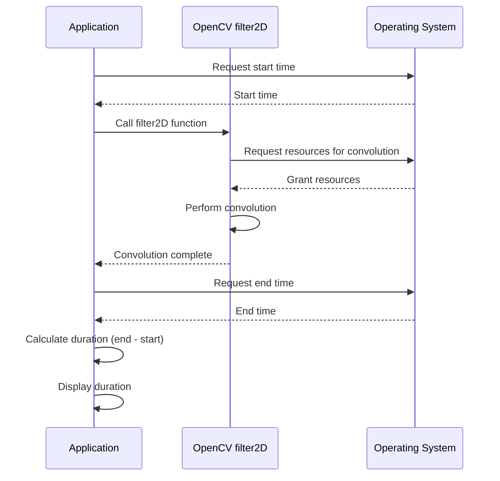

# Convolution Filters and Benchmarks

This document explores the implementation and performance of various convolution filters in C++ using OpenCV. We'll examine naive implementations, optimized separable convolutions, and the built-in OpenCV `filter2D` function, along with benchmarks to compare their efficiency.

## Naive Convolution Implementation

A naive convolution implementation directly applies the convolution kernel to each pixel in the input image. This process involves iterating over the image, and for each pixel, iterating over the kernel, performing element-wise multiplication and summation. While straightforward, this method is computationally expensive, especially for large kernels and images.

```cpp
// File: 4_cv_basics/4_convolutions_filtering/naive.cpp
#include <opencv2/opencv.hpp>
#include <iostream>
#include "convolution.hpp"     // Our naive implementation of the convolution operation

int main()
{
    std::cout << "Demonstrating naive convolution...\n";

    // Read input image
    std::string input_path = "./assets/Dog_img.jpeg";
    cv::Mat input = cv::imread(input_path, cv::IMREAD_COLOR);

    // Resize the input image
    cv::resize(input, input, cv::Size(input.cols*0.5, input.rows*0.5));

    // Create a 3x3 Sobel kernel
    cv::Mat sobel = (cv::Mat_<double>(3, 3) <<
        -1., 0., 1.,
        -2., 0., 2.,
        -1., 0., 1.
    );

    // Declare the output image matrix
    cv::Mat output;

    // Now to actually convolve
    output = convolve(input, sobel);                         // Convolve

    cv::namedWindow("Naive output", cv::WINDOW_NORMAL);
    cv::imshow("Naive output", output);
    cv::waitKey(0);
    
    return 0;
}
```

The `naive.cpp` file demonstrates the usage of the `convolve` function (defined in `convolution.hpp`, not shown here) to perform convolution. This implementation iterates through each pixel of the input image and applies the Sobel kernel.

[View on GitHub](https://github.com/SRA-VJTI/Pixels_Seminar/blob/main/4_cv_basics/4_convolutions_filtering/naive.cpp)

## Separable Convolutions

Separable convolutions decompose a 2D convolution kernel into two 1D kernels. This reduces the computational complexity from O(m*n*k*k) to O(m*n*2*k), where m and n are the image dimensions and k is the kernel size. For example, a Gaussian blur can be separated into horizontal and vertical 1D Gaussian blurs.

```cpp
// File: 4_cv_basics/4_convolutions_filtering/separableConvolutions.cpp
#include <opencv2/opencv.hpp>
#include <iostream>
#include "convolution.hpp"     // Our naive implementation of the convolution operation

int main()
{

    // Read input image
    std::string input_path = "./assets/Dog_img.jpeg";
    cv::Mat input = cv::imread(input_path, cv::IMREAD_COLOR);

    // Resize the input image
    cv::resize(input, input, cv::Size(input.cols*0.5, input.rows*0.5));

    // Declare the output image matrix
    cv::Mat output;
    std::cout << "Demonstrating separable convolutions...\n";

    // Define standard 3x3 Gaussian kernel
    cv::Mat gaussian = (cv::Mat_<double>(3, 3) <<
        1. / 16, 2. / 16, 1. / 16,
        2. / 16, 4. / 16, 2. / 16,
        1. / 16, 2. / 16, 1. / 16
    );

    filter2D(input, output, -1, gaussian);              // Convolve with original 'full' kernel

    // Define decomposed standard 3x3 Gaussian kernel
    cv::Mat gaussian_v = (cv::Mat_<double>(3, 1) << 1. / 4, 1. / 2, 1. / 4);
    cv::Mat gaussian_h = (cv::Mat_<double>(1, 3) << 1. / 4, 1. / 2, 1. / 4);

    // Declare matrix to store intermediate image
    cv::Mat intermediate;

    // Now to actually convolve
    intermediate = convolve(input, gaussian_v);         // Convolve Vertically
    output = convolve(intermediate, gaussian_h);        // Convolve Horizontally
    
    cv::namedWindow("Output by Naive Seperable Convolution", cv::WINDOW_NORMAL);
    cv::imshow("Output by Naive Seperable Convolution", output);
    cv::waitKey(0);
    
    cv::namedWindow("Output of Vertical Convolution", cv::WINDOW_NORMAL);
    cv::imshow("Output of Vertical Convolution", intermediate);
    cv::waitKey(0);
    
    cv::namedWindow("Output of Horizontal Convolution", cv::WINDOW_NORMAL);
    cv::imshow("Output of Horizontal Convolution", output);
    cv::waitKey(0);

    return 0;
}
```

This code demonstrates separable convolution using a Gaussian kernel. It first convolves the image vertically and then horizontally, achieving the same result as convolving with the full 2D Gaussian kernel but with improved efficiency.

[View on GitHub](https://github.com/SRA-VJTI/Pixels_Seminar/blob/main/4_cv_basics/4_convolutions_filtering/separableConvolutions.cpp)


## OpenCV's `filter2D` Function

OpenCV provides the `filter2D` function, which is a highly optimized convolution implementation.  It typically leverages SIMD instructions and other low-level optimizations for maximum performance.

```cpp
// File: 4_cv_basics/4_convolutions_filtering/convolutionUsingOpenCV.cpp
#include <opencv2/opencv.hpp>
#include <iostream>
int main()
{
    
    // Read input image
    std::string input_path = "./assets/Dog_img.jpeg";
    cv::Mat input = cv::imread(input_path, cv::IMREAD_COLOR);

    // Resize the input image
    cv::resize(input, input, cv::Size(input.cols*0.5, input.rows*0.5));

    // Create a 3x3 Sobel kernel
    cv::Mat sobel = (cv::Mat_<double>(3, 3) <<
        -1., 0., 1.,
        -2., 0., 2.,
        -1., 0., 1.
    );
    // Declare the output image matrix
    cv::Mat output;

    // using the built-in function
    cv::filter2D(input, output, -1, sobel, cv::Point(-1, -1), 5.0, cv::BorderTypes::BORDER_REPLICATE);
    cv::imshow("filter 2D output", output);
    cv::waitKey(0);
    return 0;
}
```

This code uses `cv::filter2D` to apply a Sobel filter to the input image. The parameters specify the input image, output image, depth of the output image (-1 for same as input), the kernel, the anchor point of the kernel, delta to add to the result, and the border handling method.

[View on GitHub](https://github.com/SRA-VJTI/Pixels_Seminar/blob/main/4_cv_basics/4_convolutions_filtering/convolutionUsingOpenCV.cpp)

## Benchmarking Convolution Implementations

To compare the performance of different convolution methods, it's essential to benchmark them.  The following code measures the execution time of OpenCV's `filter2D` function.

```cpp
// File: 4_cv_basics/4_convolutions_filtering/benchmarks/convolutionUsingOpenCV.cpp
#include <opencv2/opencv.hpp>
#include <iostream>
#include <chrono>              // To time execution - Benchmarking
int main()
{
    
    // Read input image
    std::string input_path = "./assets/Dog_img.jpeg";
    cv::Mat input = cv::imread(input_path, cv::IMREAD_COLOR);

    // Resize the input image
    cv::resize(input, input, cv::Size(input.cols*0.5, input.rows*0.5));

    // Create a 3x3 Sobel kernel
    cv::Mat sobel = (cv::Mat_<double>(3, 3) <<
        -1., 0., 1.,
        -2., 0., 2.,
        -1., 0., 1.
    );
    // Declare the output image matrix
    cv::Mat output;

    // And using the built-in function
    auto start = std::chrono::high_resolution_clock::now();
    cv::filter2D(input, output, -1, sobel, cv::Point(-1, -1), 5.0, cv::BorderTypes::BORDER_REPLICATE);
    auto stop = std::chrono::high_resolution_clock::now();

    auto duration = std::chrono::duration_cast<std::chrono::microseconds>(stop - start);
    std::cout << "Convolution using filter2D took " << duration.count() << " microseconds.\n";

    cv::imshow("filter 2D output", output);
    cv::waitKey(0);

    std::cout << '\n';
    cv::waitKey(0);
    return 0;
}
```

This code uses the `<chrono>` library to measure the time taken by `cv::filter2D`. It's crucial to run benchmarks multiple times and average the results to get reliable performance measurements.  A comparison with the naive and separable implementations would reveal the performance benefits of OpenCV's optimized function.

[View on GitHub](https://github.com/SRA-VJTI/Pixels_Seminar/blob/main/4_cv_basics/4_convolutions_filtering/benchmarks/convolutionUsingOpenCV.cpp)





## Data Types in OpenCV

OpenCV's `cv::Mat` objects use a type specification format `CV_[Bits][(S)igned/(U)nsigned/(F)loat][C[Channel No.]]`. Understanding this format is crucial for efficiently working with image data.  For example:

*   `CV_8UC1`: 8-bit unsigned integer, 1 channel (grayscale)
*   `CV_8UC3`: 8-bit unsigned integer, 3 channels (color BGR)
*   `CV_64F`: 64-bit floating-point number

Using the appropriate data type can significantly impact memory usage and performance.

```cpp
cv::Mat kernel;                        // Declaration
kernel.create(3, 3, CV_8UC(2));        // Creates an empty 3x3 matrix
kernel = cv::Mat::ones(4, 4, CV_64F);  // Creates a 4x4 unit matrix
kernel = cv::Mat::eye(3, 3, CV_64F);   // Creates a 3x3 indentity matrix
```

## Key Integration Points

*   **Performance Optimization:** Use OpenCV's built-in functions like `filter2D` for performance-critical convolution operations.
*   **Separable Kernels:**  Identify and exploit separable kernels for significant speedups.
*   **Data Type Awareness:**  Choose the correct `cv::Mat` data type to optimize memory usage and computational efficiency.

This exploration highlights the importance of choosing the right convolution method based on performance requirements and kernel properties.  OpenCV provides optimized tools, but understanding the underlying principles allows for informed decisions and potential custom optimizations.
```