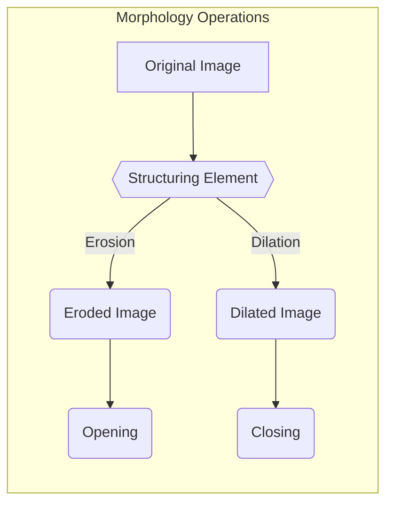

# Image Filtering and Morphology

This section explores image filtering using convolution and morphological operations, crucial techniques for image enhancement and analysis. We'll delve into the underlying principles, practical implementations, and optimization strategies.

## Convolutions and Filtering

Convolution is a fundamental image processing operation that applies a kernel (filter) to an image. The kernel is a small matrix that slides across the image, performing element-wise multiplication and summation to produce a new pixel value.

### Convolution Kernels

Different kernels can achieve various effects, such as blurring, sharpening, or edge detection.

*   **Box Blur:** Averages the pixel values in a neighborhood.

    ```math
    $$
    \begin{bmatrix}
    1 / 9 & 1 / 9 & 1 / 9 \\
    1 / 9 & 1 / 9 & 1 / 9 \\
    1 / 9 & 1 / 9 & 1 / 9
    \end{bmatrix}
    $$
    ```

*   **Edge Detection:** Highlights edges in the image.

    ```math
    $$
    \begin{bmatrix}
    -1 & -1 & -1 \\
    -1 & +8 & -1 \\
    -1 & -1 & -1
    \end{bmatrix}
    $$
    ```

*   **Sharpening:** Enhances details and textures.

    ```math
    $$
    \begin{bmatrix}
    0 & -0.5 & 0 \\
    -0.5 & +3 & -0.5 \\
    0 & -0.5 & 0
    \end{bmatrix}
    $$
    ```

### Convolution Implementation

The provided `convolution.cpp` implements a basic convolution operation.  A key part of the implementation resides in nested loops that traverse the image and kernel to calculate the new pixel value.  This snippet from the `convolve` function shows the core logic:

```cpp
for (int i = 1; i < image_pad.rows - 1; i++) 
{   
    for (int j = 1; j < image_pad.cols - 1 ; j++) 
    {
        for(int ch = 0 ; ch < original_image.channels() ; ch++){

            double tmp = 0.0;
            for (int k = 0; k < kernel_inv.rows; k++) 
            {
                for (int l = 0; l < kernel_inv.cols; l++) 
                {
                    int x = j - 1 + l;
                    int y = i - 1 + k;  

                    if ((x >= 0 && x < image_pad.cols) && (y >= 0 && y < image_pad.rows)){
                        tmp += (double)image_pad.at<cv::Vec3b>(y, x).val[ch] * (double)kernel.at<double>(k, l);
                    }
                }
            }

            resultant_image.at<cv::Vec3b>(i-1, j-1).val[ch] = cv::saturate_cast<uchar>(tmp);
        }
    }
}
```

[View on GitHub](https://github.com/SRA-VJTI/Pixels_Seminar/blob/main/4_cv_basics/4_convolutions_filtering/src/convolution.cpp)

### Separable Convolutions

Some kernels, like the Gaussian kernel, can be separated into two 1D kernels. This significantly reduces the computational cost.  Instead of $m \cdot n$ multiplications for an $m \times n$ kernel, it requires only $m + n$ multiplications.

```math
$$
\begin{bmatrix}
1 / 16 & 2 / 16 & 1 / 16 \\
2 / 16 & 4 / 16 & 2 / 16 \\
1 / 16 & 2 / 16 & 1 / 16
\end{bmatrix} = \begin{bmatrix}1 / 4 \\ 1 / 2 \\ 1 / 4\end{bmatrix} \begin{bmatrix}1 / 4 & 1 / 2 & 1 / 4\end{bmatrix}
$$
```

### Running the Convolution Filter

To run the convolution filter you can use the following commands:

```bash
cd 4_cv_basics/4_convolutions_filtering      # Enter the project directory
make SRC=main.cpp link=src/convolution.cpp   # Use make to build the project
./Convolution_Filtering                      # Execute the built project
```

### Optimization Considerations

The provided implementation can be further optimized by considering:

*   **Kernel Size:** Generalize the code to handle kernels of different sizes.
*   **Number of Channels:** Support images with varying numbers of color channels.
*   **Space Complexity:** Improve memory usage.


## Morphology

Morphological operations are techniques for analyzing the shapes and structures within an image. They are particularly useful for binary images.

### Basic Operations

*   **Erosion:** Shrinks foreground objects by removing pixels at the boundaries.

    ```cpp
    cv::Mat erosion(cv::Mat source_image, cv::Mat output_image, int Kernel_size)
    {
    	for (int i = 0; i < source_image.rows; i++)
    	{
    		for (int j = 0; j < source_image.cols; j++)
    		{
    			if (kernel_sum(source_image, i, j, Kernel_size) != 255 * (Kernel_size*Kernel_size))
    			{
    				output_image.at<u_char>(i, j) = cv::saturate_cast<char>(0);
    			}
    			else
    			{
    				output_image.at<u_char>(i, j) = cv::saturate_cast<char>(255);
    			}
    		}
    	}

    	return output_image;
    }
    ```

    [View on GitHub](https://github.com/SRA-VJTI/Pixels_Seminar/blob/main/4_cv_basics/6_morphology/src/morphology.cpp)

*   **Dilation:** Expands foreground objects by adding pixels to the boundaries.

    ```cpp
    cv::Mat dilation(cv::Mat source_image, cv::Mat output_image, int kernel_size)
    {
    	for (int i = 0; i < source_image.rows; i++)
    	{
    		for (int j = 0; j < source_image.cols; j++)
    		{
    			if (kernel_sum(source_image, i, j, kernel_size) > 0)
    			{
    				output_image.at<u_char>(i, j) = cv::saturate_cast<char>(255);
    			}
    			else
    			{
    				output_image.at<u_char>(i, j) = cv::saturate_cast<char>(0);
    			}
    		}
    	}

    	return output_image;
    }
    ```

    [View on GitHub](https://github.com/SRA-VJTI/Pixels_Seminar/blob/main/4_cv_basics/6_morphology/src/morphology.cpp)

### Compound Operations

*   **Opening:** Erosion followed by dilation. Removes small objects while preserving the shape of larger objects.

*   **Closing:** Dilation followed by erosion. Fills small holes and gaps.

*   **Gradient:** Difference between dilation and erosion. Highlights boundaries. The following snippet shows a diffrence operation which is required for implementing gradient.

    ```cpp
    cv::Mat difference(cv::Mat img_1, cv::Mat img_2, cv::Mat output)
    {
    	if (img_1.size() != img_2.size())
    	{
    		std::cout << "Images are of different sizes." << std::endl;
    	}
    	for (int i = 0; i < img_1.rows; i++)
    	{
    		for (int j = 0; j < img_1.cols; j++)
    		{
    			output.at<u_char>(i, j) = cv::saturate_cast<char>((abs)((int)img_1.at<u_char>(i, j) - (int)img_2.at<u_char>(i, j)));
    		}
    	}
    	return output;
    }
    ```

    [View on GitHub](https://github.com/SRA-VJTI/Pixels_Seminar/blob/main/4_cv_basics/6_morphology/src/morphology.cpp)

### Kernel Sum

The helper function `kernel_sum` calculates the sum of pixel values within the kernel's neighborhood. This function is used by both `erosion` and `dilation` to determine the output pixel value.

```cpp
int kernel_sum(cv::Mat image, int row, int col, int Kernel_size)
{
	if (Kernel_size % 2 != 1 || Kernel_size < 3)
	{
		std::cout << "Kernel size should be of odd and greater than or equal to 3";
		return -1;
	}

	int sum = 0;
	int kernel = ((Kernel_size - 1) / 2);
	for (int i = row - kernel; i <= row + kernel; i++)
	{
		for (int j = col - kernel; j <= col + kernel; j++)
		{
			if (i >= 0 && j >= 0 && i < image.rows && j < image.cols)
			{
				sum = sum + (int)image.at<u_char>(i, j);
			}

		}
	}
	return sum;
}
```

[View on GitHub](https://github.com/SRA-VJTI/Pixels_Seminar/blob/main/4_cv_basics/6_morphology/src/morphology.cpp)





## Key Integration Points

*   **Image Preprocessing:** Convolutions and morphological operations are often used as preprocessing steps for more advanced image analysis tasks, such as object detection and recognition.

*   **Noise Reduction:** Blurring kernels and morphological opening/closing can effectively reduce noise in images.

*   **Feature Extraction:** Edge detection kernels and morphological gradients can highlight important features in an image.

*   **Optimized Implementations:** Consider separable convolutions and optimized libraries (e.g., OpenCV) for performance-critical applications.
```