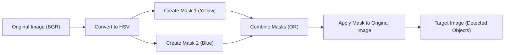
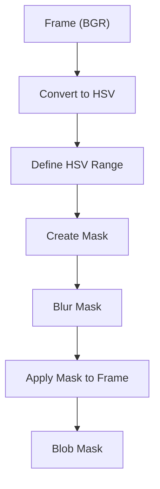
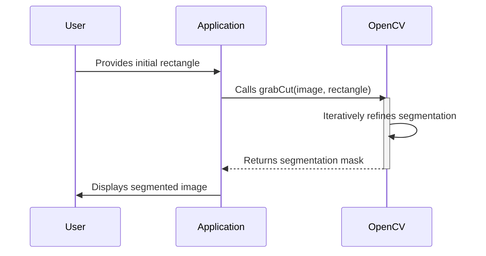

# OpenCV Overview and Applications

This document provides an overview of OpenCV, its applications in computer vision, and delves into practical examples of object detection and image segmentation.

## Introduction to OpenCV

OpenCV (Open Source Computer Vision Library) is a cross-platform library primarily aimed at real-time computer vision. It provides a wide range of functions for image processing, video capture, and analysis. It's used extensively in various applications, including robotics, automotive, security, and medical imaging.

### Computer Vision vs. Image Processing

It's important to distinguish between computer vision and image processing:

- **Image Processing:** Focuses on image-to-image transformation. The input and output are both images.
- **Computer Vision:** Aims to construct explicit, meaningful descriptions of physical objects from images. The output is a description or interpretation of a 3D scene.

### Applications of Computer Vision

Computer vision has diverse applications across various industries:

- **Medicine:** Tumor detection, lesion classification, 3D organ reconstruction.
- **Industrial Automation:** Defect detection, assembly line monitoring, object sorting.
- **Security:** Biometrics (face recognition, fingerprint scanning).
- **Transportation:** Autonomous vehicles, driver vigilance monitoring.

## OpenCV Basics

### Reading and Displaying Images

The fundamental step in any OpenCV project is reading and displaying images.

```cpp
#include <iostream>
#include <opencv2/opencv.hpp>

using namespace cv;
using namespace std;

int main() {
    // Read image
    Mat img = imread("./assets/images/DK.jpeg");

    // Check if image was successfully loaded
    if (img.empty()) {
        cout << "Error: Image not loaded!" << endl;
        return -1;
    }

    // Display image
    imshow("Image", img);
    waitKey(0); // Wait for a keystroke in the window
    destroyAllWindows();
    return 0;
}
```

[View on GitHub](https://github.com/SRA-VJTI/Pixels_Seminar/blob/main/4_cv_basics/7_opencv_overview/8_object_detection/main.cpp)

This code snippet demonstrates how to read an image from a file using `cv::imread()` and display it in a window using `cv::imshow()`.  `cv::waitKey(0)` pauses the execution until a key is pressed, and `cv::destroyAllWindows()` closes all OpenCV windows.

### Color Space Conversion

OpenCV allows converting images between different color spaces, such as BGR (Blue, Green, Red), HSV (Hue, Saturation, Value), and grayscale.

```cpp
    Mat img = imread("./assets/images/DK.jpeg");
    Mat hsv;
    cvtColor(img, hsv, COLOR_BGR2HSV);
    imshow("HSV", hsv);
```

[View on GitHub](https://github.com/SRA-VJTI/Pixels_Seminar/blob/main/4_cv_basics/7_opencv_overview/8_object_detection/main.cpp)

This code converts the image from BGR to HSV color space, which is useful for color-based object detection.

### Object Detection using Color Masking

Object detection can be achieved by isolating specific colors in an image using color masks.

```cpp
    Mat mask1;
    inRange(hsv, Scalar(15, 30, 150), Scalar(36, 255, 255), mask1);
    imshow("mask1", mask1);

    Mat mask2;
    inRange(hsv, Scalar(33, 52, 80), Scalar(150, 200, 255), mask2);
    imshow("mask2", mask2);

    Mat mask;
    bitwise_or(mask1, mask2, mask);
    imshow("mask", mask);

    Mat target;
    bitwise_and(img, img, target, mask);
    imshow("target", target);
```

[View on GitHub](https://github.com/SRA-VJTI/Pixels_Seminar/blob/main/4_cv_basics/7_opencv_overview/8_object_detection/main.cpp)

This code creates masks for yellow and blue colors using `cv::inRange()` and combines them using `cv::bitwise_or()`. Finally, it extracts the masked regions from the original image using `cv::bitwise_and()`.





## Blob Detection

Blob detection identifies regions of an image with approximately constant properties like intensity or color.

### Blob Detection Process

The typical process involves:

1.  **Preprocessing:** Choosing the color of the blob, converting to HSV, and finding bounding values for the mask.
2.  **Detecting the blob:** Constructing a mask and drawing the blob.

```cpp
    Scalar lower(h - 5, max(0, s - 50), max(0, v - 50));
    Scalar upper(h + 5, min(s + 50, 255), min(v + 50, 255));

    Mat masked;
    inRange(hsv, lower, upper, masked);

    Mat blur;
    medianBlur(masked, blur, 5);

    Mat blob_mask;
    bitwise_and(frame, frame, blob_mask, blur);

    imshow("blob_mask", blob_mask);
```

[View on GitHub](https://github.com/SRA-VJTI/Pixels_Seminar/blob/main/4_cv_basics/8_blob_detection/README.md)

This code snippet shows how to create a mask based on HSV values, blur it to reduce noise, and then apply it to the original frame to isolate the blob.





## Image Segmentation using GrabCut Algorithm

Image segmentation is the process of partitioning an image into multiple segments, making it easier to analyze.

### GrabCut Algorithm Overview

The GrabCut algorithm is an interactive image segmentation method.  It requires the user to draw a rectangle around the object of interest. The algorithm then iteratively refines the segmentation.

```cpp
    Rect rect(50, 50, 400, 300); // Example rectangle
    Mat bgdModel, fgdModel;
    Mat mask;
    grabCut(img, mask, rect, bgdModel, fgdModel, 5, GC_INIT_WITH_RECT);

    Mat foreground(img.size(), CV_8UC3, Scalar(255, 255, 255));
    img.copyTo(foreground, mask == GC_FGD | mask == GC_PR_FGD);

    imshow("GrabCut Result", foreground);
```

[View on GitHub](https://github.com/SRA-VJTI/Pixels_Seminar/blob/main/4_cv_basics/9_image_segmentation/README.md)

This code initializes the GrabCut algorithm with a rectangle and refines the segmentation over 5 iterations.  The segmented foreground is then extracted and displayed.

## Function Description

| Function Name            | Parameters                                                                                                                                                                                                                                                                                                                                                                                    | Description                                                                                                                                                                                                                                                      |
| -------------------------- | ------------------------------------------------------------------------------------------------------------------------------------------------------------------------------------------------------------------------------------------------------------------------------------------------------------------------------------------------------------------------------------------- | ---------------------------------------------------------------------------------------------------------------------------------------------------------------------------------------------------------------------------------------------------------------- |
| `cv::imread()`            | `const cv::String& filename`, `int flags = cv::IMREAD_COLOR`                                                                                                                                                                                                                                                                                                                                   | Loads an image from the specified file.                                                                                                                                                                                                                          |
| `cv::imshow()`            | `const cv::String& winname`, `cv::InputArray mat`                                                                                                                                                                                                                                                                                                                                             | Displays an image in the specified window.                                                                                                                                                                                                                       |
| `cv::cvtColor()`          | `cv::InputArray src`, `cv::OutputArray dst`, `int code`, `int dstCn = 0`                                                                                                                                                                                                                                                                                                                        | Converts an image from one color space to another.                                                                                                                                                                                                             |
| `cv::inRange()`           | `cv::InputArray src`, `cv::InputArray lowerb`, `cv::InputArray upperb`, `cv::OutputArray dst`                                                                                                                                                                                                                                                                                                     | Checks if array elements lie between the elements of two other arrays.                                                                                                                                                                                         |
| `cv::bitwise_and()`       | `cv::InputArray src1`, `cv::InputArray src2`, `cv::OutputArray dst`, `cv::InputArray mask = cv::noArray()`                                                                                                                                                                                                                                                                                         | Computes the bitwise conjunction of two arrays.                                                                                                                                                                                                                  |
| `cv::grabCut()`           | `cv::InputArray img`, `cv::InputOutputArray mask`, `cv::Rect rect`, `cv::InputOutputArray bgdModel`, `cv::InputOutputArray fgdModel`, `int iterCount`, `int mode`                                                                                                                                                                                                                               | Performs image segmentation using the GrabCut algorithm.                                                                                                                                                                                                     |

## Key Integration Points

-   **Real-time object detection:**  Integrate color-based masking with video streams for real-time object tracking.  Consider using `cv::VideoCapture` to capture video from a camera.

-   **Interactive segmentation:**  Enhance the GrabCut example to allow users to refine the segmentation by drawing foreground and background regions.

-   **Combining Techniques:**  Combine blob detection with image segmentation for more robust object isolation.  Use blob detection to identify potential regions of interest, then refine the segmentation using GrabCut.

- **Performance Optimization:** For real-time applications, optimize OpenCV code by using efficient data structures (e.g., `cv::UMat` for GPU acceleration) and algorithms.

- **Modular Design:** Break down complex image processing tasks into smaller, reusable functions for better maintainability and scalability.





```