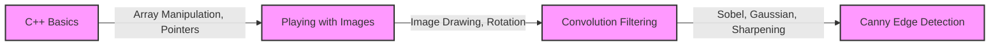

---
title: Assignments
description: Details and instructions for the seminar assignments.
---

# Assignments

This section details the assignments for the PIXELS Seminar, an initiative by the Society of Robotics & Automation (SRA) VJTI. These assignments are designed to provide hands-on experience in image processing and computer vision.

## Submission Instructions

Refer to the original `README.md` for detailed submission instructions.

### Steps to make a submission

1.  Create a `private` Repository with name `pixels_assignment_<Id no.>`. (Please replace `<Id no.>` with Id assigned to you)
2.  Clone this repository in your pc.
3.  Solve all the assignments and keep all submission files inside your repository folder i.e `pixels_assignment_<Id no.>`. Then `push` all files to your GitHub repository.

   ```bash
   git clone https://github.com/<username>/pixels_assignment_<Id no.>.git
   cd pixels_assignment_<Id no.>
   git add .
   git commit -m "assginment submission <Id no.>"
   git push
   ```

*   In case any doubts/queries ask your Seniors, add them to your repository as a collaborator.

## Assignment 1: C++ Basics

This assignment focuses on fundamental C++ concepts such as arrays, namespaces, pointers, and vectors.

### Question 1: Array Manipulation

Create functions to input and print elements of 1D and 2D arrays. Print only elements with indices that are multiples of three. Use namespaces to handle function overloading.

```cpp
#include <iostream>

namespace Array1D {
    void input(int arr[], int size) {
        std::cout << "Enter elements of 1D Array:\n";
        for (int i = 0; i < size; ++i) {
            std::cin >> arr[i];
        }
    }

    void print(int arr[], int size) {
        std::cout << "Elements of 1D Array at Index which is a multiple of 3:\n";
        for (int i = 0; i < size; ++i) {
            if (i % 3 == 0) {
                std::cout << arr[i] << std::endl;
            }
        }
    }
}

namespace Array2D {
    void input(int arr[][4], int rows, int cols) {
        std::cout << "Enter elements of 2D Array:\n";
        for (int i = 0; i < rows; ++i) {
            for (int j = 0; j < cols; ++j) {
                std::cin >> arr[i][j];
            }
        }
    }

    void print(int arr[][4], int rows, int cols) {
        std::cout << "Elements of 2D Array at Index which is a multiple of 3:\n";
        for (int i = 0; i < rows; ++i) {
            for (int j = 0; j < cols; ++j) {
                if ((i * cols + j) % 3 == 0) {
                    std::cout << arr[i][j] << std::endl;
                }
            }
        }
    }
}

int main() {
    int arr2d[3][4];
    int arr1d[9];

    Array2D::input(arr2d, 3, 4);
    Array1D::input(arr1d, 9);

    Array2D::print(arr2d, 3, 4);
    Array1D::print(arr1d, 9);

    return 0;
}
```

This code demonstrates the use of namespaces to define functions with the same name but different signatures for 1D and 2D arrays. The `input` functions take array elements as input, and the `print` functions display elements at indices that are multiples of 3. [View on GitHub](https://github.com/SRA-VJTI/Pixels_Seminar/blob/main/5_assignments/1_cpp_basics/README.md)

### Question 2: Size of Integer

Find the size of an integer data type without using the `sizeof` operator.

```cpp
#include <iostream>

int main() {
    int *ptr1 = nullptr;
    int *ptr2 = nullptr;
    ptr1 = (int*)1000;
    ptr2 = ptr1 + 1;
    std::cout << "Size of integer data type is " << (char*)ptr2 - (char*)ptr1 << "." << std::endl;
    return 0;
}
```

This code uses pointer arithmetic to determine the size of an integer. By incrementing an integer pointer, the memory address is increased by the size of the integer. The difference between the incremented and original pointers gives the size of the integer. [View on GitHub](https://github.com/SRA-VJTI/Pixels_Seminar/blob/main/5_assignments/1_cpp_basics/README.md)

### Question 3: Array Sorting with Pointers

Write a function to sort an array in ascending order using a pointer to the array's first element.

```cpp
#include <iostream>

void sortArray(int *arr, int size) {
    for (int i = 0; i < size - 1; ++i) {
        for (int j = 0; j < size - i - 1; ++j) {
            if (arr[j] > arr[j + 1]) {
                int temp = arr[j];
                arr[j] = arr[j + 1];
                arr[j + 1] = temp;
            }
        }
    }
}

int main() {
    int size;
    std::cout << "Enter the number of elements in array:\n";
    std::cin >> size;
    int arr[size];
    std::cout << "Enter the elements in array:\n";
    for (int i = 0; i < size; ++i) {
        std::cin >> arr[i];
    }

    sortArray(arr, size);

    for (int i = 0; i < size; ++i) {
        std::cout << arr[i] << std::endl;
    }

    return 0;
}
```

This code sorts an array using the bubble sort algorithm. The `sortArray` function takes a pointer to the first element of the array and the size of the array as input. The function then sorts the array in ascending order by comparing adjacent elements and swapping them if necessary. [View on GitHub](https://github.com/SRA-VJTI/Pixels_Seminar/blob/main/5_assignments/1_cpp_basics/README.md)

### Question 4: Vector Operations

Find the smallest and largest elements in a vector using iterators.

```cpp
#include <iostream>
#include <vector>
#include <algorithm>

int main() {
    int n;
    std::cin >> n;
    std::vector<int> vec(n);
    for (int i = 0; i < n; ++i) {
        std::cin >> vec[i];
    }

    int smallest = *std::min_element(vec.begin(), vec.end());
    int largest = *std::max_element(vec.begin(), vec.end());

    std::cout << "Smallest: " << smallest << std::endl;
    std::cout << "Largest: " << largest << std::endl;

    return 0;
}
```

This code uses the `std::min_element` and `std::max_element` functions from the `<algorithm>` header to find the smallest and largest elements in the vector. Iterators `vec.begin()` and `vec.end()` are used to specify the range of elements to search.  [View on GitHub](https://github.com/SRA-VJTI/Pixels_Seminar/blob/main/5_assignments/1_cpp_basics/README.md)

## Assignment 2: Playing with Images

This assignment involves basic image manipulation techniques without using OpenCV.

### Tasks

*   Draw a filled rectangle
*   Draw a filled-circle
*   Draw a hollow rectangle
*   Draw a hollow circle
*   Rotating an image by 180 degrees
*   Bonus Task: Rotate the image by arbitrary angles with and without bounds.

### Approach

These tasks can be implemented using basic image processing techniques. Each pixel of the image is represented by its coordinates (x, y). For drawing shapes, the corresponding pixels within the shape's boundaries are modified to the desired color. For rotation, trigonometric functions can be used to map each pixel to its new position.

```cpp
// Example function to draw a filled rectangle (Conceptual)
void drawFilledRectangle(unsigned char* image, int width, int height, int x1, int y1, int x2, int y2, unsigned char color) {
    for (int y = y1; y <= y2; ++y) {
        for (int x = x1; x <= x2; ++x) {
            image[y * width + x] = color; // Simplistic grayscale representation
        }
    }
}
```

This code provides a basic idea to draw a filled rectangle. It iterates through the rectangle and sets each pixel's color to the specified value. [View on GitHub](https://github.com/SRA-VJTI/Pixels_Seminar/blob/main/5_assignments/2_playing_with_images/README.md)

## Assignment 3: Convolution Filtering

This assignment focuses on implementing convolution-based image filtering techniques.

### Tasks

*   Sobel Edge Detection in X
*   Sobel Edge Detection in Y
*   Gaussian Smoothing
*   Sharpening
*   Canny Edge Detection

### Convolution Operation

Convolution involves sliding a kernel (a small matrix) over the image and computing a weighted sum of the pixel values under the kernel.

```cpp
// Example of a convolution operation (Conceptual)
float applyKernel(unsigned char* image, int width, int height, int x, int y, float* kernel, int kernelSize) {
    float sum = 0.0;
    int halfKernelSize = kernelSize / 2;
    for (int i = -halfKernelSize; i <= halfKernelSize; ++i) {
        for (int j = -halfKernelSize; j <= halfKernelSize; ++j) {
            int imageX = x + j;
            int imageY = y + i;
            if (imageX >= 0 && imageX < width && imageY >= 0 && imageY < height) {
                sum += image[imageY * width + imageX] * kernel[(i + halfKernelSize) * kernelSize + (j + halfKernelSize)];
            }
        }
    }
    return sum;
}
```

This code gives a conceptual overview of a convolution operation. It iterates through the kernel elements and multiplies them with the corresponding image pixel values. The sum of these products gives the convolved value for the center pixel. [View on GitHub](https://github.com/SRA-VJTI/Pixels_Seminar/blob/main/5_assignments/3_convolution_filtering/README.md)

### Sobel Edge Detection

Sobel operators are used to detect edges by approximating the gradient of the image intensity function. Sobel X detects edges in the horizontal direction, while Sobel Y detects edges in the vertical direction.

```cpp
// Example Sobel X kernel
float sobelXKernel[9] = {
    -1, 0, 1,
    -2, 0, 2,
    -1, 0, 1
};

// Example Sobel Y kernel
float sobelYKernel[9] = {
    -1, -2, -1,
     0,  0,  0,
     1,  2,  1
};
```

These kernels are applied to the image using the convolution operation. The resulting image highlights edges in the corresponding direction.

### Gaussian Smoothing

Gaussian smoothing is a blurring technique that reduces noise and detail in an image. It uses a Gaussian kernel for convolution.

```cpp
// Example Gaussian kernel (3x3)
float gaussianKernel[9] = {
    1.0/16, 2.0/16, 1.0/16,
    2.0/16, 4.0/16, 2.0/16,
    1.0/16, 2.0/16, 1.0/16
};
```

### Sharpening

Sharpening enhances edges and fine details in an image, making it appear more defined.

```cpp
// Example Sharpening Kernel
float sharpeningKernel[9] = {
     0, -1,  0,
    -1,  5, -1,
     0, -1,  0
};
```

### Canny Edge Detection

Canny edge detection is a multi-stage algorithm that detects a wide range of edges in images.  It typically involves Gaussian smoothing, Sobel filtering, non-maximum suppression, and hysteresis thresholding.

## Key Integration Points

The assignments build upon each other, starting with fundamental C++ concepts and progressing to image processing techniques. The C++ basics assignment prepares students for the more complex image manipulation and convolution filtering tasks. The image processing assignments provide a foundation for further exploration in computer vision.





By completing these assignments, students will gain a practical understanding of image processing techniques and their implementation. [View on GitHub](https://github.com/SRA-VJTI/Pixels_Seminar/blob/main/5_assignments/README.md)
```