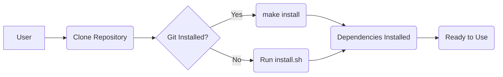

# Repository Configuration

This document outlines the configuration of the Pixels_Seminar repository, focusing on issue templates, workflow configurations, and essential setup details. Understanding these configurations is crucial for contributing effectively and maintaining the project's quality.

## Issue Templates

The repository uses issue templates to streamline bug reports and feature requests. These templates ensure that contributors provide necessary information, making it easier for maintainers to understand and address issues.

### Bug Report Template

The `bug_report.md` template guides users in reporting bugs. It prompts them to describe the bug, provide steps to reproduce it, explain the expected behavior, and include relevant screenshots and system information.

```markdown
---
name: Bug report
about: Create a report to help us improve
title: ''
labels: ''
assignees: ''

---

**Describe the bug**
A clear and concise description of what the bug is.

**To Reproduce**
Steps to reproduce the behavior:
1. Go to '...'
2. Click on '....'
3. Scroll down to '....'
4. See error

**Expected behavior**
A clear and concise description of what you expected to happen.

**Screenshots**
If applicable, add screenshots to help explain your problem.

**Desktop (please complete the following information):**
 - OS: [e.g., iOS]
 - Browser [e.g., chrome, safari]
 - Version [e.g., 22]

**Smartphone (please complete the following information):**
 - Device: [e.g., iPhone6]
 - OS: [e.g., iOS8.1]
 - Browser [e.g., stock browser, safari]
 - Version [e.g., 22]

**Additional context**
Add any other context about the problem here.
```

[View on GitHub](https://github.com/SRA-VJTI/Pixels_Seminar/blob/main/.github/ISSUE_TEMPLATE/bug_report.md)

### Feature Request Template

The `feature_request.md` template helps users suggest new features. It asks them to describe the problem the feature would solve, the desired solution, any alternatives considered, and additional context.

```markdown
---
name: Feature request
about: Suggest an idea for this project
title: ''
labels: ''
assignees: ''

---

**Is your feature request related to a problem? Please describe.**
A clear and concise description of what the problem is. Ex. I'm always frustrated when [...]

**Describe the solution you'd like**
A clear and concise description of what you want to happen.

**Describe alternatives you've considered**
A clear and concise description of any alternative solutions or features you've considered.

**Additional context**
Add any other context or screenshots about the feature request here.
```

[View on GitHub](https://github.com/SRA-VJTI/Pixels_Seminar/blob/main/.github/ISSUE_TEMPLATE/feature_request.md)

## Workflow Configuration

The repository uses GitHub Actions for continuous integration (CI). The `test-install-script.yml` workflow automates the testing of the `install.sh` script on various operating systems.

### Test Install Script Workflow

The `test-install-script.yml` workflow is triggered on pushes to the `main` and `test-install-script` branches, as well as on pull requests to `main`. It tests the `install.sh` script on Linux (Ubuntu, Arch Linux), Windows (WSL), and macOS.

```yaml
name: Test Install Script

concurrency:
  group: ${{ github.workflow }}-${{ github.head_ref || github.ref }}
  cancel-in-progress: true

on:
  push:
    branches:
      - main
      - test-install-script
    paths:
      - '.github/workflows/test-install-script.yml'
      - 'install.sh'
  pull_request:
    branches:
      - main
    paths:
      - '.github/workflows/test-install-script.yml'
      - 'install.sh'

jobs:
  linux:
    strategy:
      fail-fast: false
      matrix:
        os: [ubuntu-latest, ubuntu-22.04, archlinux]
        include:
          - os: ubuntu-latest
            image: ubuntu:latest
          - os: ubuntu-22.04
            image: ubuntu:22.04
          - os: archlinux
            image: archlinux:latest

    name: ${{ matrix.os }}
    runs-on: ubuntu-latest
    container:
      image: ${{ matrix.image }}

    steps:
      - uses: actions/checkout@v3
        with:
          fetch-depth: 0

      - name: Make install.sh Executable
        run: chmod +x install.sh

      - name: Run Installation Script
        run: ./install.sh


  wsl:
    name: WSL
    runs-on: windows-latest
    
    steps:
      - uses: actions/checkout@v3
        with:
          fetch-depth: 0

      - name: Set up WSL2
        uses: vedantmgoyal9/setup-wsl2@main

      - name: Install dos2unix and Convert Line Endings
        run: |
          wsl sudo apt update -y
          wsl sudo apt install dos2unix -y
          wsl dos2unix "/mnt/d/a/Pixels_Seminar/Pixels_Seminar/install.sh"  # Convert line endings 

      - name: Make Executable and Run Script
        run: |
          wsl chmod +x "/mnt/d/a/Pixels_Seminar/Pixels_Seminar/install.sh"
          wsl bash "/mnt/d/a/Pixels_Seminar/Pixels_Seminar/install.sh"  # Run the script

  macos:
    name: MacOS Latest
    runs-on: macos-latest

    steps:
      - uses: actions/checkout@v3
        with:
          fetch-depth: 0

      - name: Make install.sh Executable
        run: chmod +x install.sh

      - name: Run Installation Script
        run: ./install.sh
```

[View on GitHub](https://github.com/SRA-VJTI/Pixels_Seminar/blob/main/.github/workflows/test-install-script.yml)

The workflow defines three jobs: `linux`, `wsl`, and `macos`. Each job runs the `install.sh` script in a different environment.

#### Linux Job

The `linux` job uses a matrix strategy to test the script on multiple Linux distributions.

```yaml
  linux:
    strategy:
      fail-fast: false
      matrix:
        os: [ubuntu-latest, ubuntu-22.04, archlinux]
        include:
          - os: ubuntu-latest
            image: ubuntu:latest
          - os: ubuntu-22.04
            image: ubuntu:22.04
          - os: archlinux
            image: archlinux:latest

    name: ${{ matrix.os }}
    runs-on: ubuntu-latest
    container:
      image: ${{ matrix.image }}

    steps:
      - uses: actions/checkout@v3
        with:
          fetch-depth: 0

      - name: Make install.sh Executable
        run: chmod +x install.sh

      - name: Run Installation Script
        run: ./install.sh
```

It checks out the repository, makes the `install.sh` script executable, and then runs it.

#### WSL Job

The `wsl` job runs the script on Windows using WSL2. It sets up WSL2, installs `dos2unix` to convert line endings, makes the script executable, and then runs it.

```yaml
  wsl:
    name: WSL
    runs-on: windows-latest
    
    steps:
      - uses: actions/checkout@v3
        with:
          fetch-depth: 0

      - name: Set up WSL2
        uses: vedantmgoyal9/setup-wsl2@main

      - name: Install dos2unix and Convert Line Endings
        run: |
          wsl sudo apt update -y
          wsl sudo apt install dos2unix -y
          wsl dos2unix "/mnt/d/a/Pixels_Seminar/Pixels_Seminar/install.sh"  # Convert line endings 

      - name: Make Executable and Run Script
        run: |
          wsl chmod +x "/mnt/d/a/Pixels_Seminar/Pixels_Seminar/install.sh"
          wsl bash "/mnt/d/a/Pixels_Seminar/Pixels_Seminar/install.sh"  # Run the script
```

#### macOS Job

The `macos` job runs the script on macOS. It checks out the repository, makes the `install.sh` script executable, and then runs it.

```yaml
  macos:
    name: MacOS Latest
    runs-on: macos-latest

    steps:
      - uses: actions/checkout@v3
        with:
          fetch-depth: 0

      - name: Make install.sh Executable
        run: chmod +x install.sh

      - name: Run Installation Script
        run: ./install.sh
```

### Install Script

The `install.sh` script automates the installation of dependencies required for the project. It checks the operating system and installs the necessary packages using the appropriate package manager.

```bash
#!/bin/bash

# Update package lists
sudo apt update

# Install required packages
sudo apt install -y build-essential cmake git wget unzip

# Install libopencv-dev
sudo apt install -y libopencv-dev

# Install make
sudo apt install -y make

echo "Dependencies installation completed."
```

[View on GitHub](https://github.com/SRA-VJTI/Pixels_Seminar/blob/main/install.sh)

This script updates the package lists, installs essential build tools (like `build-essential`, `cmake`), version control (`git`), utility tools (`wget`, `unzip`), the OpenCV development library (`libopencv-dev`), and the `make` build automation tool.

### README.md Overview

The `README.md` file provides an overview of the project, including its purpose, demonstration, and table of contents. It also includes installation instructions for setting up the project.

```markdown
# PIXELS

`PIXELS` is an introduction to Computer Vision and Image Processing. Similar to a `pixel` which is the fundamental unit of any digital image, the objective is to emphasise the fundamental ideas of image and its algorithm in relation to contemporary technologies, such as the industry standard `OpenCV`. A thorough understanding of the fundamentals can aid in research and system redesign for domain-specific optimisations to meet the hardware needs of edge devices.

Every program is written in `C++` to provide the flexibility required by programmers. It also includes principles of essential development tools such as `Make` and `Git`.

## Demonstration 


This repository includes basics to :
1. [C++](./1_cpp_basics/README.md) 
2. [Build Systems](./2_build_systems/README.md) 
3. [Git and GitHub](./3_git_github/README.md)
4. [Computer Vision](./4_cv_basics) 
5. [Assignments](./5_assignments)  

### The aim of this repository is to provide:  
- A brief idea of algorithms involved in **Computer Vision** . 
- Introduction to Version Control System: **Git** and **GitHub**. 
- Computer Vision and Image Processing basics, idea of implementation of various algorithms involved from scratch (instead of any dedicated image processing library like OpenCV.)
- Introduction to a commonly used Image Processing Library: **OpenCV**
- Functionality of **Blob detection** using ROI (Region of Interest).

## Table Of Contents
- [Table Of Contents](#table-of-contents)
- [C++ basics](./1_cpp_basics/README.md)
    - [Typecasting](./1_cpp_basics/0_typecasting/explicit_typecasting.cpp)
    - [Namespace](/./1_cpp_basics/1_namespace/namespace.cpp)
    - [Conditional Statements](./1_cpp_basics/2_conditional_statements/if.cpp)
    - [Enumeration](./1_cpp_basics/3_enumeration/enumeration.cpp)
    - [Functions](./1_cpp_basics/4_functions/function.cpp)
    - [Classes and Objects](./1_cpp_basics/5_classes_and_objects/classes_and_objects.cpp)
    - [Templates](./1_cpp_basics/6_templates/class_template.cpp)
    - [Arrays](./1_cpp_basics/7_arrays/arrays2d.cpp)
    - [Pointers](./1_cpp_basics/8_pointers/pointers.cpp)
    - [Vectors](./1_cpp_basics/9_vectors/access_vector.cpp)
- [Build System](./2_build_systems/README.md)
- [Introduction to Git and GitHub](./3_git_github/README.md)
    - [Intro to Git](./3_git_github/1_git_intro%20.md)
    - [Git Workflow](./3_git_github/2_git_workflow.md)
    - [Git commands](./3_git_github/3_git_commands.md)
- [Image Processing](./4_cv_basics)
    - [Image Representation](./4_cv_basics/1_image_representation/README.md)
    - [Playing with Images](./4_cv_basics/2_playing_with_images/README.md)
    - [Interpolation](./4_cv_basics/3_interpolation/README.md)
    - [Convolution](./4_cv_basics/4_convolutions_filtering/README.md)
    - [Masking](./4_cv_basics/5_masking/README.md)
    - [Morphology](./4_cv_basics/6_morphology/README.md)
    - [OpenCV](./4_cv_basics/7_opencv_overview/README.md)
    - [Blob Detection](./4_cv_basics/8_blob_detection/README.md)
- [Assignments](./5_assignments)
- [Installation Instructions](#installation-instructions)
```

[View on GitHub](https://github.com/SRA-VJTI/Pixels_Seminar/blob/main/README.md)

The installation instructions guide users on how to clone the repository and install the necessary dependencies, using either `make` or the `install.sh` script.





## Key Integration Points

-   **Issue Templates**: Ensure clear communication and structured issue reporting, streamlining the development process.
-   **GitHub Actions**: Automate testing and validation of the installation script across multiple platforms, improving reliability and maintainability.
-   **Installation Script**: Simplifies the setup process for new contributors and users, reducing friction and ensuring consistent environments.

By understanding and utilizing these configurations, contributors can efficiently contribute to the project, and users can easily set up and use the repository.
```