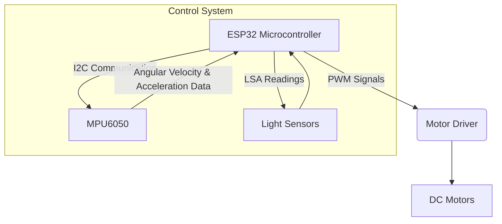
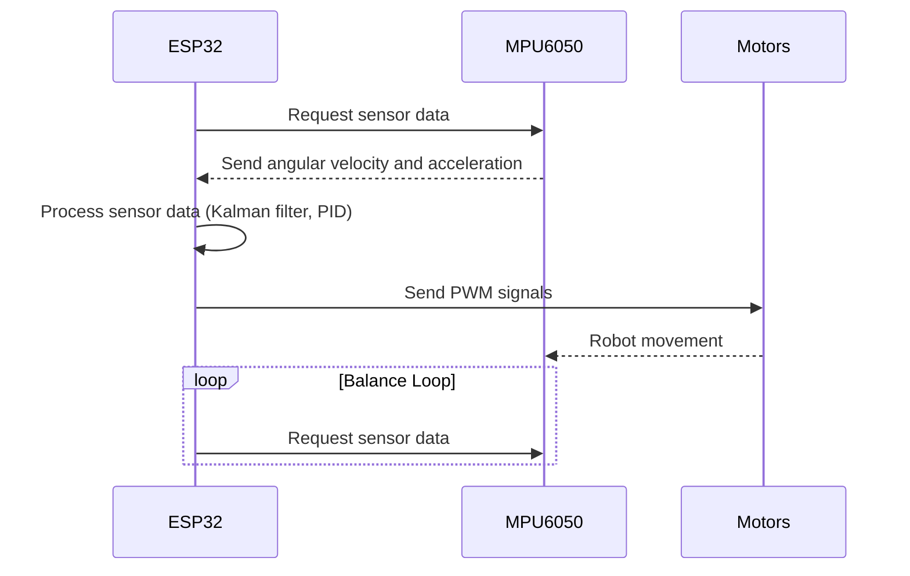

---
title: "Introduction to Wall-E"
description: "Provides an overview of the Wall-E project and its purpose."
---

# Introduction to Wall-E

Wall-E is a robotics platform developed by SRA-VJTI, primarily used in workshops to introduce first-year students to the world of robotics and embedded systems. It focuses on concepts such as line following and self-balancing using the ESP32 microcontroller. The project aims to provide hands-on experience with essential concepts like PID control, embedded communication protocols, PWM, filters, and RTOS. This documentation provides a comprehensive overview of the Wall-E project, its features, installation process, and key components.

## About Wall-E

The Wall-E project serves as an educational tool, designed to teach fundamental robotics concepts in an engaging and practical manner. It utilizes a custom-made SRA Development Board with an ESP32 microcontroller, offering features like Wi-Fi and BLE connectivity. The workshops cover various topics, from basic motor control to complex self-balancing algorithms. The project emphasizes hands-on learning, allowing participants to build and program their robots.

Key features of the Wall-E project include:

*   **Line Following:** Implementing algorithms to enable the robot to follow a designated line.
*   **Self-Balancing:** Developing control systems to maintain balance on a two-wheeled platform.
*   **Motor Control:** Utilizing PWM and PID control to precisely manage motor speed and direction.
*   **Embedded Communication:** Understanding UART, SPI, and I2C protocols for inter-device communication.

## Installation Guide

Setting up the Wall-E development environment involves installing the ESP-IDF (Espressif IoT Development Framework) and cloning the project repository. The installation process varies depending on the operating system.

### Windows Installation

1.  **Install ESP-IDF:** Download and install the ESP-IDF v5.2 (offline version).
2.  **Clone the Repository:** Open the ESP-IDF PowerShell and clone the Wall-E repository using the following commands:

```powershell
cd ~
mkdir Projects
cd Projects
git clone https://github.com/SRA-VJTI/Wall-E --recursive --depth 1
cd Wall-E
```

[View on GitHub](https://github.com/SRA-VJTI/Wall-E)

### Linux Installation

1.  **Download Installation Script:** Use `curl` to download the installation script:

```sh
cd $HOME
curl https://raw.githubusercontent.com/SRA-VJTI/Wall-E/refs/heads/master/wall_e_install.sh -o $HOME/wall_e_install.sh
```

[View on GitHub](https://github.com/SRA-VJTI/Wall-E/blob/refs/heads/master/wall_e_install.sh)

2.  **Execute Script:** Run the installation script:

```sh
chmod +x $HOME/wall_e_install.sh
./wall_e_install.sh && source $HOME/."${SHELL#${SHELL%/*}/}"rc
```

### MacOS Installation

1.  **Download Installation Script:** Download the installation script using `curl`.

```sh
curl https://raw.githubusercontent.com/SRA-VJTI/Wall-E/refs/heads/master/wall_e_install.sh -o wall_e_install.sh
sudo chmod +x wall_e_install.sh
./wall_e_install.sh
```

[View on GitHub](https://github.com/SRA-VJTI/Wall-E/blob/refs/heads/master/wall_e_install.sh)

2.  **Navigate to the Cloned Repository:** Change the directory to the Wall-E repository.

```sh
cd $HOME
cd Wall-E
```

## Code Examples

The Wall-E repository contains several examples demonstrating different functionalities. Here are a few key examples:

### LED Blink

This example demonstrates basic GPIO control by blinking an LED connected to the ESP32.

```c
#include <stdio.h>
#include "freertos/FreeRTOS.h"
#include "freertos/task.h"
#include "driver/gpio.h"

#define LED_PIN 2

void app_main(void) {
    gpio_reset_pin(LED_PIN);
    gpio_set_direction(LED_PIN, GPIO_MODE_OUTPUT);

    while(true) {
        gpio_set_level(LED_PIN, 1);
        vTaskDelay(1000 / portTICK_PERIOD_MS);
        gpio_set_level(LED_PIN, 0);
        vTaskDelay(1000 / portTICK_PERIOD_MS);
    }
}
```

[View on GitHub](https://github.com/SRA-VJTI/Wall-E/blob/master/1_led_blink/main/led_blink_example_main.c)

### Light Sensing Array (LSA)

This example demonstrates the use of a light sensing array for line following.

```c
// Example code snippet (hypothetical)
int read_lsa_values() {
  // Code to read values from the light sensors
  return 0;
}
```

[View on GitHub](https://github.com/SRA-VJTI/Wall-E/blob/master/2_LSA/README.md)

### MPU6050

This example showcases how to interface with the MPU6050, a 6-axis motion tracking device, to measure angular velocity and acceleration.

```c
// Example code snippet (hypothetical)
void init_mpu6050() {
  // Code to initialize the MPU6050
}

float get_gyro_data() {
  // Code to read gyroscope data from MPU6050
  return 0.0;
}
```

[View on GitHub](https://github.com/SRA-VJTI/Wall-E/blob/master/3_MPU/README.md)

### PWM Motor Control

This example demonstrates the use of Pulse Width Modulation (PWM) to control the speed of the motors.

```c
// Example code snippet (hypothetical)
void set_motor_speed(int speed) {
  // Code to set the motor speed using PWM
}
```

[View on GitHub](https://github.com/SRA-VJTI/Wall-E/blob/master/5_PWM/README.md)

## Self-Balancing Algorithm

The self-balancing algorithm is a crucial component of the Wall-E project. It involves using sensor data from the MPU6050 to calculate the robot's angle and adjust motor speeds to maintain balance. The control loop typically involves a PID (Proportional-Integral-Derivative) controller.

```python
# Simplified Python-like pseudocode for PID control
def calculate_pid(error, kp, ki, kd, last_error, integral):
    proportional = kp * error
    integral = integral + error
    integral = ki * integral
    derivative = kd * (error - last_error)
    output = proportional + integral + derivative
    return output, error
```

## Wall-E System Architecture

The following diagram illustrates the high-level architecture of the Wall-E system:





## Build and Flash

To compile and upload code to the ESP32, follow these steps:

1.  **Configure the Project:** Use `idf.py menuconfig` to set project-specific configurations, such as serial port and Wi-Fi settings.
2.  **Build the Project:** Execute `idf.py build` to compile the code and generate the necessary binary files.

    ```bash
    idf.py build
    ```

3.  **Flash the Device:** Use `idf.py -p PORT flash` to upload the compiled code to the ESP32, replacing `PORT` with the appropriate serial port (e.g., `/dev/ttyUSB0` on Linux, `COM3` on Windows).

    ```bash
    idf.py -p /dev/ttyUSB0 flash
    ```

4.  **Monitor Output:** Use `idf.py monitor` to view the serial output from the ESP32.

    ```bash
    idf.py monitor
    ```

## Key Integration Points

The Wall-E project integrates several key components:

*   **ESP32 and ESP-IDF:** The ESP32 microcontroller and the ESP-IDF provide the foundation for the entire project. Understanding the ESP-IDF build system, configuration options, and API is crucial.
*   **MPU6050 Integration:** Reading and processing data from the MPU6050 is essential for self-balancing. This involves understanding the sensor's communication protocol (I2C) and implementing filtering algorithms to reduce noise.
*   **Motor Control with PWM and PID:** The motors must be controlled precisely to achieve both line following and self-balancing. PWM is used to control motor speed, and PID control is used to fine-tune the motor output based on sensor feedback.

The following sequence diagram illustrates the basic flow of the self-balancing algorithm:





By understanding these key integration points, developers can effectively build, customize, and extend the Wall-E project to create their own robotics applications.
```