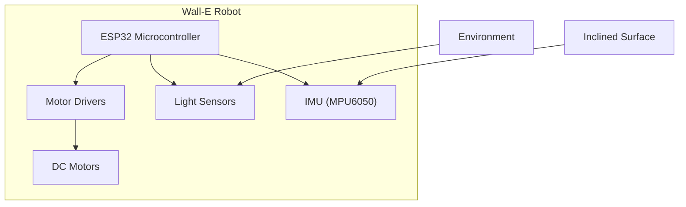
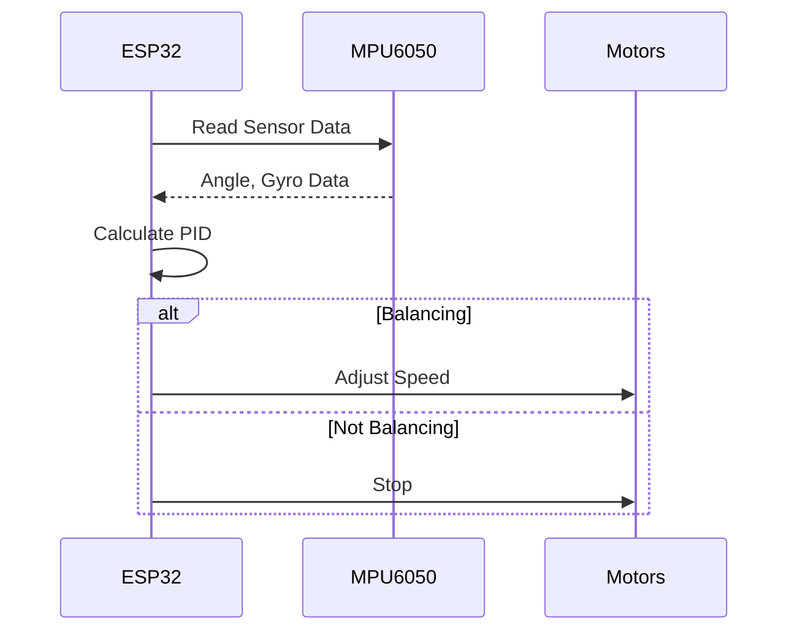

---
title: "Project Overview"
description: "Provides a high-level introduction to the Wall-E project and its objectives."
---

# Project Overview

Wall-E is a robotics project designed for educational purposes, specifically targeting first-year students with an introduction to robotics and embedded systems. It focuses on fundamental concepts such as line following and self-balancing using the ESP32 microcontroller. The project utilizes a custom-made SRA Development Board and ESP-IDF, Espressif's official IoT Development Framework. Wall-E aims to provide a hands-on experience with motor control, sensor integration (accelerometer, gyroscope), and embedded communication protocols.

## Key Features

*   **Line Following:** Implementation of algorithms enabling the robot to follow a designated path.
*   **Self-Balancing:** Development of control systems to maintain the robot's balance using feedback from inertial sensors.
*   **Custom Hardware:** Utilization of the SRA Development Board, designed to facilitate the learning process.
*   **ESP32 Microcontroller:** Leverages the capabilities of the ESP32, including Wi-Fi and Bluetooth connectivity.
*   **Educational Focus:** Designed to be easily understandable and modifiable, making it suitable for educational workshops and introductory robotics courses.

## Installation and Setup

To get started with Wall-E, you'll need to set up your development environment. The project supports Windows, Linux, and MacOS operating systems. Comprehensive installation instructions can be found in the [Installations.md](Installations.md) file. Here's a brief overview:

1.  **Install ESP-IDF:** The Espressif IoT Development Framework is essential for programming the ESP32. Download the appropriate installer for your operating system.
2.  **Clone the Repository:** Clone the Wall-E repository from GitHub using the command line.
3.  **Configure the Environment:** Set up the necessary environment variables to use the ESP-IDF tools.

### Code Snippet: Cloning the Repository

```bash
mkdir Projects
cd Projects
git clone https://github.com/SRA-VJTI/Wall-E --recursive --depth 1
cd Wall-E
```

This snippet demonstrates how to clone the Wall-E repository to your local machine. The `--recursive` flag ensures that any submodules are also cloned, and `--depth 1` creates a shallow clone, downloading only the most recent commit to save space and time.

[View on GitHub](https://github.com/SRA-VJTI/Wall-E/blob/master/)

### Code Snippet: Setting the Target

```bash
idf.py set-target esp32
```

This command configures the ESP-IDF build system to target the ESP32 microcontroller. This step is crucial before building any Wall-E project, ensuring that the code is compiled correctly for the target hardware.

[View on GitHub](https://github.com/SRA-VJTI/Wall-E/blob/master/1_led_blink/README.md)

### Code Snippet: Building the Project

```bash
idf.py build
```

This command compiles the Wall-E project, generating the necessary binaries for flashing onto the ESP32. It automatically resolves dependencies and links the required libraries.

[View on GitHub](https://github.com/SRA-VJTI/Wall-E/blob/master/1_led_blink/README.md)

### Code Snippet: Flashing the Project

```bash
idf.py -p /dev/ttyUSB0 flash
```

This command flashes the compiled binaries onto the ESP32 microcontroller. The `-p` flag specifies the serial port connected to the ESP32. You might need to adjust the port depending on your operating system and hardware setup.

[View on GitHub](https://github.com/SRA-VJTI/Wall-E/blob/master/1_led_blink/README.md)

### Code Snippet: Monitoring Output

```bash
idf.py monitor
```

This command opens a serial monitor, allowing you to view the output from the ESP32. This is useful for debugging and monitoring the behavior of your Wall-E project.

[View on GitHub](https://github.com/SRA-VJTI/Wall-E/blob/master/1_led_blink/README.md)

### Code Snippet: Linux Installation Script

```bash
curl https://raw.githubusercontent.com/SRA-VJTI/Wall-E/refs/heads/master/wall_e_install.sh -o $HOME/wall_e_install.sh
chmod +x $HOME/wall_e_install.sh
./wall_e_install.sh && source $HOME/."${SHELL#${SHELL%/*}/}"rc
```

This set of commands downloads, makes executable, and runs the installation script for Linux systems. It automates the setup of the ESP-IDF and clones the Wall-E repository.

[View on GitHub](https://github.com/SRA-VJTI/Wall-E/blob/master/wall_e_install.sh)

## Examples and Applications

The Wall-E repository includes several examples that demonstrate key concepts and functionalities. These examples range from basic LED blinking to more complex applications like line following and self-balancing.

*   **LED Blink:** A simple example demonstrating basic GPIO control on the ESP32.
*   **LSA (Light Sensing Array):** An example using an array of light sensors, commonly employed for line following applications.
*   **MPU6050:** An example using the MPU6050 IMU (Inertial Measurement Unit) to measure angles and motion.
*   **PWM (Pulse Width Modulation):** An example demonstrating motor speed control using PWM.
*   **Line Following:** A complete line following implementation, combining sensor input and motor control.
*   **Self-Balancing:** An advanced example implementing a self-balancing algorithm.

## System Architecture

The following diagram illustrates the high-level architecture of the Wall-E system:





This diagram shows the main components of the Wall-E robot, including the ESP32 microcontroller, motor drivers, light sensors, and IMU. It also indicates the interactions between these components and the external environment.

## Software Flow

The diagram shows the software flow for the self-balancing algorithm.





## Contribution Guidelines

Contributions to the Wall-E project are welcome. If you'd like to contribute, please follow these guidelines:

1.  Fork the repository.
2.  Create a new branch for your feature or bug fix.
3.  Make your changes and commit them with clear, concise messages.
4.  Submit a pull request to the main branch.

## Key Integration Points

The Wall-E project effectively integrates hardware components (SRA board, ESP32, sensors, motors) with software algorithms (PID control, sensor fusion). Key integration points include:

*   **Sensor Data Acquisition:** Reading data from the light sensors and IMU and preprocessing it for control algorithms.
*   **Motor Control:** Converting control signals into motor commands via PWM.
*   **Feedback Loop:** Implementing a closed-loop control system where sensor data is used to adjust motor speeds and maintain balance or follow a line.

By understanding these integration points and best practices, students can gain valuable experience in embedded systems development and robotics. This project serves as a stepping stone for more advanced robotics projects and concepts.
```