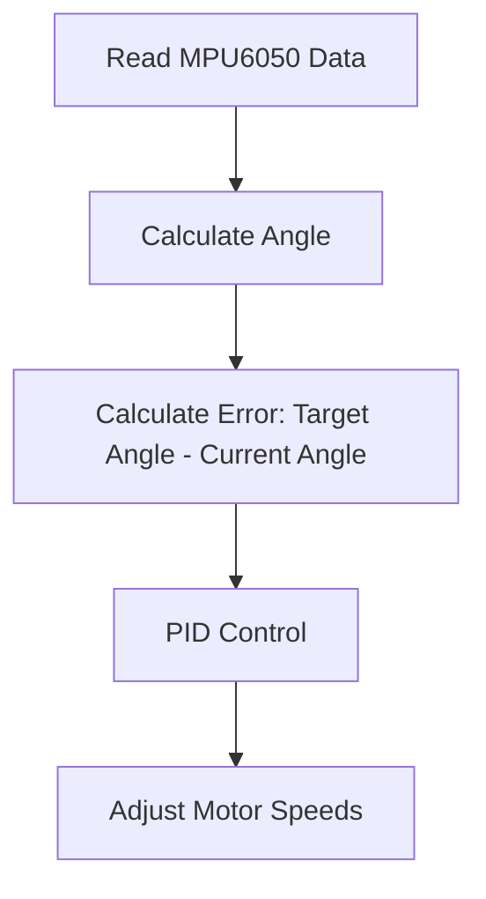
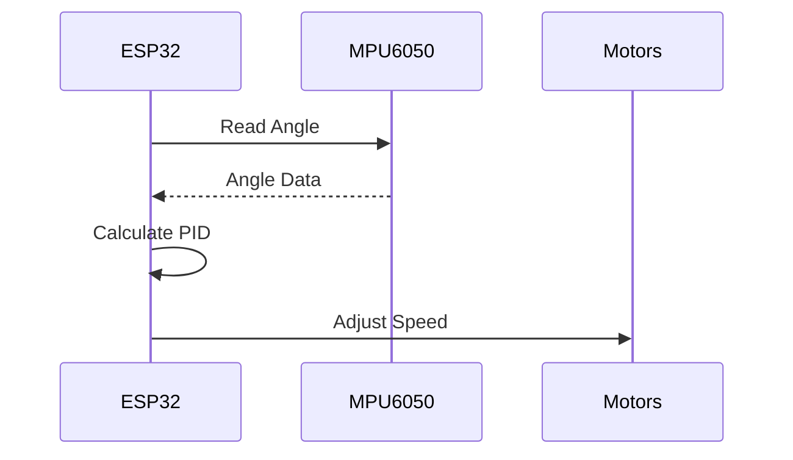

 # Project Overview

The Wall-E project is an educational initiative focused on teaching fundamental robotics and embedded systems concepts to first-year students. It centers around a custom-built, two-wheeled robot designed to perform line following and self-balancing tasks. This project utilizes the ESP32 microcontroller and the ESP-IDF framework, offering a hands-on approach to learning essential skills in robotics, embedded programming, and control systems. The project aims to provide a practical understanding of concepts such as PID control, motor control, sensor integration, and communication protocols.

## Key Features

*   **Line Following:** The robot can autonomously follow a designated line using a light sensor array (LSA).
*   **Self-Balancing:** Utilizing an MPU6050 inertial measurement unit (IMU), the robot can maintain balance on two wheels.
*   **Custom Hardware:** The project uses a custom-made SRA development board with an ESP32 microcontroller.
*   **ESP-IDF Framework:** Development is based on the Espressif IoT Development Framework (ESP-IDF).
*   **Modular Examples:** A series of progressively complex examples are provided, covering basic LED control to advanced self-balancing algorithms.

## Core Technologies

*   **ESP32 Microcontroller:** A low-cost, low-power system-on-a-chip (SoC) with Wi-Fi and Bluetooth capabilities.
*   **ESP-IDF:** The official development framework for ESP32, providing comprehensive tools and libraries.
*   **MPU6050:** An IMU that measures angular velocity and acceleration.
*   **Light Sensor Array (LSA):** An array of light sensors used to detect the line for line following.

## Installation

To get started with the Wall-E project, follow the detailed installation instructions in the [Installations.md](Installations.md) file. The setup process involves installing the ESP-IDF framework, cloning the project repository, and configuring the development environment.

## Code Examples

### LED Blink

The `1_led_blink` example demonstrates basic GPIO control by blinking an LED connected to the ESP32. This serves as an introduction to hardware interaction using the ESP-IDF. [View on GitHub](https://github.com/SRA-VJTI/Wall-E/blob/master/1_led_blink/README.md)

```c
#include <stdio.h>
#include "freertos/FreeRTOS.h"
#include "freertos/task.h"
#include "driver/gpio.h"
#include "sdkconfig.h"

#define LED_PIN 2

void app_main(void) {
    gpio_reset_pin(LED_PIN);
    gpio_set_direction(LED_PIN, GPIO_MODE_OUTPUT);
    while(true) {
        printf("Turning the LED ON\n");
        gpio_set_level(LED_PIN, 1);
        vTaskDelay(1000 / portTICK_PERIOD_MS);
        printf("Turning the LED OFF\n");
        gpio_set_level(LED_PIN, 0);
        vTaskDelay(1000 / portTICK_PERIOD_MS);
    }
}
```

### Light Sensor Array (LSA)

The `2_LSA` example demonstrates how to read data from the Light Sensor Array. This data is crucial for the line-following functionality. [View on GitHub](https://github.com/SRA-VJTI/Wall-E/blob/master/2_LSA/README.md)

```c
// Example code snippet for reading LSA values
#define LSA_PIN_1 32
#define LSA_PIN_2 33
// ... other LSA pins

void read_lsa_values() {
    int lsa_value_1 = gpio_get_level(LSA_PIN_1);
    int lsa_value_2 = gpio_get_level(LSA_PIN_2);
    // ... read other LSA values
    printf("LSA Values: %d, %d, ...\n", lsa_value_1, lsa_value_2);
}
```

### MPU6050

The `3_MPU` example shows how to interface with the MPU6050 IMU to obtain acceleration and angular velocity data, which is essential for self-balancing. [View on GitHub](https://github.com/SRA-VJTI/Wall-E/blob/master/3_MPU/README.md)

```c
// Example code snippet for initializing and reading MPU6050 data
#include "driver/i2c.h"

#define I2C_MASTER_SCL_IO 22        /*!< gpio number used for I2C master clock */
#define I2C_MASTER_SDA_IO 21        /*!< gpio number used for I2C master data  */
#define MPU6050_ADDR 0x68           /*!< MPU6050 sensor address */

void init_mpu6050() {
    i2c_config_t conf = {
        .mode = I2C_MODE_MASTER,
        .sda_io_num = I2C_MASTER_SDA_IO,
        .scl_io_num = I2C_MASTER_SCL_IO,
        .sda_pullup_en = GPIO_PULLUP_ENABLE,
        .scl_pullup_en = GPIO_PULLUP_ENABLE,
        .master.clk_speed = 100000,
    };
    i2c_param_config(I2C_NUM_0, &conf);
    i2c_driver_install(I2C_NUM_0, I2C_MODE_MASTER, 0, 0, 0);

    // Wake up MPU6050
    uint8_t data = 0;
    i2c_master_write_to_device(I2C_NUM_0, MPU6050_ADDR, &data, 1, 1000 / portTICK_PERIOD_MS);
}
```

### Line Following

The `6_line_following` example integrates the LSA data to implement a line-following algorithm, enabling the robot to navigate along a predefined path. [View on GitHub](https://github.com/SRA-VJTI/Wall-E/tree/master/6_line_following/)

```c
// Pseudo-code for line following algorithm
float error = calculate_error(lsa_values); // Determine deviation from the line
float correction = pid_control(error); // Calculate correction based on PID
set_motor_speeds(base_speed + correction, base_speed - correction); // Adjust motor speeds
```

### Self-Balancing

The `7_self_balancing` example uses the MPU6050 data and PID control to maintain the robot's balance, showcasing advanced control system implementation. [View on GitHub](https://github.com/SRA-VJTI/Wall-E/blob/master/7_self_balancing/README.md)

```c
// Pseudo-code for self-balancing algorithm
float angle = get_angle_from_mpu6050(); // Get the current angle from IMU
float error = target_angle - angle; // Calculate the error
float correction = pid_control(error); // Calculate the correction
set_motor_speeds(correction, -correction); // Apply the correction to motors
```

## Project Structure

The project repository is organized into several directories, each containing a specific example or module:

*   `1_led_blink`: Basic LED blinking example.
*   `2_LSA`: Light Sensor Array interface.
*   `3_MPU`: MPU6050 IMU interface.
*   `4_switch_controlled_motor_normal`: Manual motor control using switches.
*   `5_PWM`: Pulse Width Modulation motor control.
*   `6_line_following`: Line following algorithm implementation.
*   `7_self_balancing`: Self-balancing algorithm implementation.
*   `documentation`: Project documentation and assets.

## Workflow

The general workflow for working with the Wall-E project involves:

1.  **Installation:** Setting up the development environment as described in [Installations.md](Installations.md).
2.  **Code Exploration:** Examining the example code in the respective directories.
3.  **Building and Flashing:** Compiling the code using `idf.py build` and flashing it to the ESP32 using `idf.py flash monitor`.
4.  **Testing and Debugging:** Testing the functionality and debugging any issues.
5.  **Modification and Extension:** Modifying the existing code or adding new features to the project.

## Visual Representation

Here's a simplified process flow for the self-balancing algorithm:





## Key Integration Points

The Wall-E project demonstrates several key integration points in robotics and embedded systems:

*   **Sensor Data Acquisition:** Integrating data from the LSA and MPU6050 sensors.
*   **Motor Control:** Using PWM to control the speed and direction of the motors.
*   **Control Algorithms:** Implementing PID control for line following and self-balancing.
*   **Real-Time Processing:** Processing sensor data and adjusting motor speeds in real-time.





## Best Practices

*   **Modular Code:** Break down complex tasks into smaller, manageable functions.
*   **Code Comments:** Add comments to explain the purpose and functionality of the code.
*   **Version Control:** Use Git for version control to track changes and collaborate effectively.
*   **Testing:** Test the code thoroughly to ensure it functions correctly.
*   **Documentation:** Document the code and project to make it easier to understand and use.