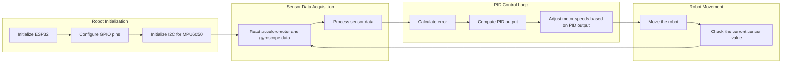

 # Project Overview

The Wall-E project is an educational initiative focused on teaching fundamental robotics concepts to first-year students, primarily through hands-on workshops. It revolves around a custom-built, two-wheeled robot designed to demonstrate line-following and self-balancing principles. The project utilizes the ESP32 microcontroller and the ESP-IDF framework, providing a platform for learning about embedded systems, control algorithms, and communication protocols. The goal is to give attendees a practical introduction to robotics and embedded hardware. [View on GitHub](https://github.com/SRA-VJTI/Wall-E/blob/main/README.md)

## Key Features

*   **Line Following:** The robot can autonomously follow a predefined path, typically marked by a white line.
*   **Self-Balancing:** The robot uses feedback control to maintain its balance on two wheels.
*   **Custom Hardware:** The project uses a custom-designed SRA development board with an ESP32 microcontroller.
*   **ESP-IDF Framework:** The robot's software is developed using Espressif's official IoT Development Framework.
*   **Modular Examples:** The project provides multiple modular examples from basic LED blinking to the complex Self-Balancing.
*   **Simulation**: The project also has a simulation of the Wall-E bot [Wall-E bot simulation](https://github.com/SRA-VJTI/Wall-E-Sim)

## Software Stack

The Wall-E project relies on the following key software components:

| Component        | Description                                                                                                |
| ---------------- | ---------------------------------------------------------------------------------------------------------- |
| ESP-IDF          | Espressif's IoT Development Framework, providing the SDK and tools for ESP32 development.                  |
| FreeRTOS         | A real-time operating system (RTOS) used for task scheduling and resource management.                      |
| C/C++            | The primary programming languages used for developing the robot's firmware.                               |
| Git              | Version control system used for managing the project's source code.                                      |
| Build System     | The project uses CMake for building the firmware.                                                         |

## Installation Process

The project provides installation scripts for Windows, Linux, and macOS, making it easier for users to set up the development environment.

### Windows

The Windows installation involves downloading and installing the ESP-IDF toolchain. The `Installations.md` file provides a step-by-step guide, including downloading the offline installer, selecting components, and configuring the ESP-IDF environment.

```markdown
# Step 1: Download the installer from [here](https://dl.espressif.com/dl/esp-idf/?idf=5.2)
Please download the **offline** version pointed by the arrow
<p align="center">
  
</p>
```

[View on GitHub](https://github.com/SRA-VJTI/Wall-E/blob/main/Installations.md)

### Linux

The Linux installation uses a shell script (`wall_e_install.sh`) to automate the process of installing the ESP-IDF toolchain and cloning the Wall-E repository. The script handles the installation of required packages and sets up the environment variables.

```bash
cd $HOME
curl https://raw.githubusercontent.com/SRA-VJTI/Wall-E/refs/heads/master/wall_e_install.sh -o $HOME/wall_e_install.sh
chmod +x $HOME/wall_e_install.sh
./wall_e_install.sh && source $HOME/."${SHELL#${SHELL%/*}/}"rc
```
[View on GitHub](https://github.com/SRA-VJTI/Wall-E/blob/main/Installations.md)

### MacOS

Similar to Linux, the MacOS installation uses a shell script to automate the setup. The script downloads and installs the necessary tools and configures the environment.

```bash
curl https://raw.githubusercontent.com/SRA-VJTI/Wall-E/refs/heads/master/wall_e_install.sh -o wall_e_install.sh
sudo chmod +x wall_e_install.sh
./wall_e_install.sh
```
[View on GitHub](https://github.com/SRA-VJTI/Wall-E/blob/main/Installations.md)

## Code Examples

The project includes a variety of code examples that demonstrate different functionalities of the robot. Here's a snippet from the LED Blink example:

```c
#include <stdio.h>
#include "freertos/FreeRTOS.h"
#include "freertos/task.h"
#include "driver/gpio.h"
#include "sdkconfig.h"

#define BLINK_GPIO CONFIG_BLINK_GPIO

void blink_task(void *pvParameter)
{
    /* Configure the IOMUX register for pad BLINK_GPIO (some pads are
       muxed to GPIO on reset already, but some default to other
       functions and need to be switched to GPIO). Consult the
       Technical Reference for a list of pads and their default
       functions.
    */
    gpio_reset_pin(BLINK_GPIO);
    /* Set the GPIO as a push/pull output */
    gpio_set_direction(BLINK_GPIO, GPIO_MODE_OUTPUT);
    while(1) {
        /* Blink off (output low) */
        printf("Turning off the LED\n");
        gpio_set_level(BLINK_GPIO, 0);
        vTaskDelay(1000 / portTICK_PERIOD_MS);
        /* Blink on (output high) */
        printf("Turning on the LED\n");
        gpio_set_level(BLINK_GPIO, 1);
        vTaskDelay(1000 / portTICK_PERIOD_MS);
    }
}

void app_main()
{
    xTaskCreate(&blink_task, "blink_task", configMINIMAL_STACK_SIZE, NULL, 5, NULL);
}
```

This code demonstrates how to control a GPIO pin to blink an LED. It uses the FreeRTOS to create a task that toggles the LED state every second. [View on GitHub](https://github.com/SRA-VJTI/Wall-E/blob/master/1_led_blink/main/led_blink_example_main.c)

Here's the configuration code from the LSA example:

```c
#define LSA_LEFT 32
#define LSA_MIDDLE 33
#define LSA_RIGHT 25

void app_main(void)
{
    gpio_set_direction(LSA_LEFT, GPIO_MODE_INPUT);
    gpio_set_direction(LSA_MIDDLE, GPIO_MODE_INPUT);
    gpio_set_direction(LSA_RIGHT, GPIO_MODE_INPUT);

    while (true) {
        int left_value = gpio_get_level(LSA_LEFT);
        int middle_value = gpio_get_level(LSA_MIDDLE);
        int right_value = gpio_get_level(LSA_RIGHT);

        printf("LSA Values: Left=%d, Middle=%d, Right=%d\n", left_value, middle_value, right_value);
        vTaskDelay(pdMS_TO_TICKS(500));
    }
}
```

This example reads the values from three light sensors and prints them to the console. This is a basic implementation of a Light Sensing Array (LSA) used for line following. [View on GitHub](https://github.com/SRA-VJTI/Wall-E/blob/master/2_LSA/main/lsa_example.c)

Here's a code snippet from the MPU6050 example that reads the accelerometer and gyroscope data:

```c
#include <stdio.h>
#include "driver/i2c.h"
#include "esp_err.h"
#include "freertos/FreeRTOS.h"
#include "freertos/task.h"

#define I2C_MASTER_SCL_IO           21          /*!< gpio number for I2C master clock */
#define I2C_MASTER_SDA_IO           15          /*!< gpio number for I2C master data  */
#define I2C_MASTER_NUM              I2C_NUM_0   /*!< I2C port number for master dev */
#define I2C_MASTER_FREQ_HZ          100000      /*!< I2C master clock frequency */
#define MPU6050_ADDR                0x68        /*!< MPU6050 sensor address */

esp_err_t mpu6050_read_reg(uint8_t reg_addr, uint8_t *data, size_t len) {
    i2c_cmd_handle_t cmd = i2c_cmd_link_create();
    i2c_master_start(cmd);
    i2c_master_write_byte(cmd, (MPU6050_ADDR << 1) | I2C_MASTER_WRITE, true);
    i2c_master_write_byte(cmd, reg_addr, true);
    i2c_master_start(cmd);
    i2c_master_write_byte(cmd, (MPU6050_ADDR << 1) | I2C_MASTER_READ, true);
    i2c_master_read(cmd, data, len, I2C_MASTER_LAST_NACK);
    i2c_master_stop(cmd);
    esp_err_t ret = i2c_master_cmd_begin(I2C_MASTER_NUM, cmd, 1000 / portTICK_PERIOD_MS);
    i2c_cmd_link_delete(cmd);
    return ret;
}
```
This code initializes the I2C communication and reads the data from the MPU6050 sensor. [View on GitHub](https://github.com/SRA-VJTI/Wall-E/blob/master/3_MPU/main/mpu6050_example_main.c)

Here is a code snippet from the Self balancing code:
```c
#define KP 16
#define KD 7
#define KI 0.2

float PID(float error, float error_sum, float last_error) {
  float P = KP * error;
  float I = KI * error_sum;
  float D = KD * (error - last_error);
  return P + I + D;
}
```
This code represents the PID controller used in the self-balancing algorithm. The PID controller adjusts the motor speed based on the error between the desired angle and the current angle. [View on GitHub](https://github.com/SRA-VJTI/Wall-E/blob/master/7_self_balancing/main/self_balancing.c)

## Project Structure

The Wall-E project is organized into several directories, each containing a specific functionality or example:

```
Wall-E/
├── 1_led_blink/
├── 2_LSA/
├── 3_MPU/
├── 4_switch_controlled_motor_normal/
├── 5_PWM/
├── 6_line_following/
├── 7_self_balancing/
├── documentation/
├── wall_e_install.sh
└── README.md
```

## Key Integration Points

### PID Control

The PID control algorithm is a crucial part of the self-balancing functionality. It continuously adjusts the motor speed based on the error between the desired angle and the current angle.

### Sensor Integration

The project integrates various sensors, such as the MPU6050 (accelerometer and gyroscope) and the light sensors, to gather data about the robot's environment and its own state. The sensor data is used to make decisions about motor control and navigation.

### Motor Control

The project uses PWM (Pulse Width Modulation) to control the speed of the motors. The PWM signal is generated by the ESP32 and used to drive the motor drivers.

## Control Flow


