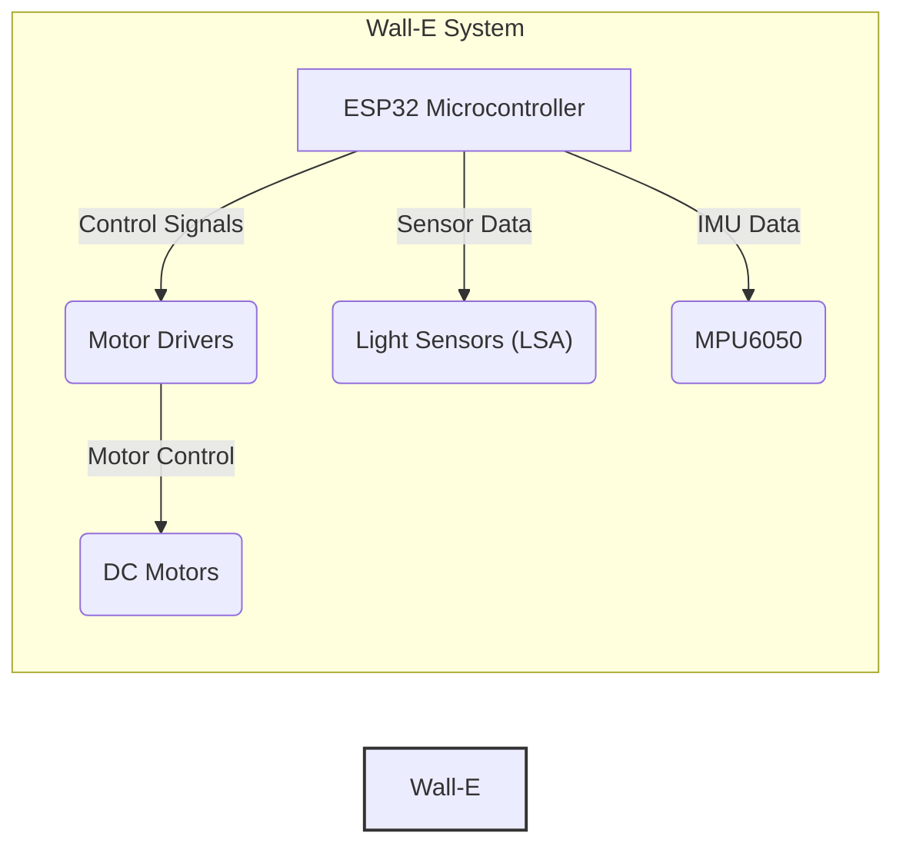
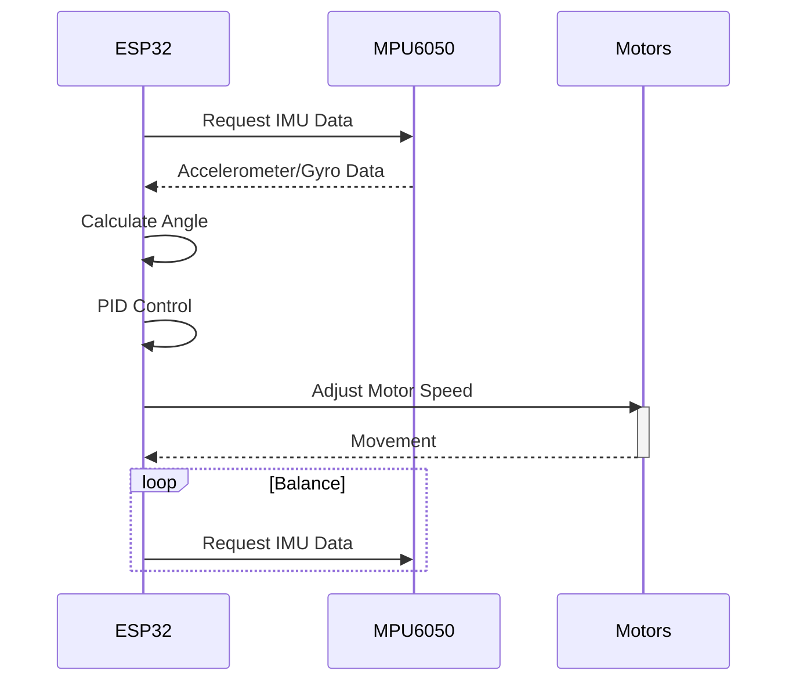

---
title: Project Overview
description: A high-level introduction to the Wall-E project and its objectives.
---

# Project Overview

Wall-E is an educational robotics platform developed by SRA-VJTI, designed to introduce first-year students to the world of robotics and embedded systems. The project focuses on core concepts like line following, self-balancing, PID control, and embedded communication protocols using the ESP32 microcontroller. The platform aims to provide a hands-on learning experience using a custom-made development board and the ESP-IDF framework.

## Key Features

*   **Line Following:** Implementing algorithms for the robot to autonomously follow a predefined line using light sensors.
*   **Self-Balancing:** Developing control systems to enable the robot to maintain its balance on two wheels.
*   **Custom SRA Development Board:** A specially designed board with components tailored for the Wall-E project.
*   **ESP32 Microcontroller:** Utilizing the features of the ESP32, including Wi-Fi and Bluetooth capabilities.
*   **ESP-IDF Framework:** Using Espressif's official IoT development framework for programming the ESP32.

## Installation Guide

To get started with the Wall-E project, you'll need to set up your development environment. The installation process varies slightly depending on your operating system. Detailed instructions for Windows, Linux, and MacOS can be found in the [Installations.md](Installations.md) file. Here's a summary:

1.  **Install ESP-IDF:** The ESP-IDF (Espressif IoT Development Framework) is required to compile and flash code to the ESP32. The recommended version is v5.2.
2.  **Clone the Repository:** Clone the Wall-E Git repository to your local machine using the command line.
3.  **Configuration:** Configure the project settings using the `idf.py menuconfig` command.
4.  **Build and Flash:** Build the project using `idf.py build` and flash it to the ESP32 using `idf.py -p PORT flash`.

### Installation Snippet (Linux)

```bash
# Download the installation script
curl https://raw.githubusercontent.com/SRA-VJTI/Wall-E/refs/heads/master/wall_e_install.sh -o $HOME/wall_e_install.sh

# Make the script executable
chmod +x $HOME/wall_e_install.sh

# Execute the script
./wall_e_install.sh && source $HOME/."${SHELL#${SHELL%/*}/}"rc
```

[View on GitHub](https://github.com/SRA-VJTI/Wall-E/blob/master/wall_e_install.sh)

This script automates the installation of the ESP-IDF framework and clones the Wall-E repository on Linux systems.

### Windows Installation Tip

On Windows, it's crucial to use the offline installer for ESP-IDF v5.2 and ensure all checkboxes are marked during the installation process. This ensures that all necessary components are installed correctly.

## Code Examples

The Wall-E repository includes various code examples that demonstrate different functionalities of the platform. Here are a few key examples:

### LED Blink

This example demonstrates a simple LED blink program. It's often the first program used to test the setup.

```c
#include <stdio.h>
#include "freertos/FreeRTOS.h"
#include "freertos/task.h"
#include "driver/gpio.h"

#define LED_PIN 2

void app_main(void)
{
    gpio_set_direction(LED_PIN, GPIO_MODE_OUTPUT);
    while (true) {
        gpio_set_level(LED_PIN, 0);
        vTaskDelay(pdMS_TO_TICKS(500));
        gpio_set_level(LED_PIN, 1);
        vTaskDelay(pdMS_TO_TICKS(500));
    }
}
```

[View on GitHub](https://github.com/SRA-VJTI/Wall-E/blob/master/1_led_blink/main/led_blink_main.c)

This code configures a GPIO pin as an output and toggles it on and off, causing an LED connected to that pin to blink.

### Light Sensing Array (LSA)

This example showcases the use of light sensors to detect and follow a line.

```c
// Example code snippet (conceptual)
int read_lsa_values() {
  // Code to read values from multiple light sensors
  // and return an aggregated value or array
}

void follow_line() {
  int lsa_value = read_lsa_values();
  // Use LSA value to determine direction and adjust motors
}
```

[View on GitHub](https://github.com/SRA-VJTI/Wall-E/blob/master/2_LSA/README.md)

This snippet illustrates the basic principle of reading data from light sensors and using it to control the robot's movement.

### MPU6050 (Motion Processing Unit)

This example integrates the MPU6050 accelerometer and gyroscope to measure angles and orientation.

```c
// Example code snippet (conceptual)
void read_mpu6050_data() {
  // Code to initialize and read data from MPU6050
  // Calculate angles from accelerometer and gyroscope readings
}

void app_main() {
    read_mpu6050_data();
    // Use angle data for self-balancing or other applications
}
```

[View on GitHub](https://github.com/SRA-VJTI/Wall-E/blob/master/3_MPU/README.md)

This example demonstrates how to read and process data from the MPU6050 sensor, which is crucial for self-balancing applications.

### PWM (Pulse Width Modulation)

This example uses PWM to control the speed of the motors.

```c
// Example code snippet (conceptual)
void set_motor_speed(int motor_pin, int speed) {
  // Code to set the PWM duty cycle for the motor
  // based on the desired speed
}

void app_main() {
  set_motor_speed(MOTOR_LEFT_PIN, 50);  // Set left motor to 50% speed
  set_motor_speed(MOTOR_RIGHT_PIN, 75); // Set right motor to 75% speed
}
```

[View on GitHub](https://github.com/SRA-VJTI/Wall-E/blob/master/5_PWM/README.md)

This code shows how to control motor speed using PWM signals, allowing for precise control of the robot's movement.

## Key Integration Points

The Wall-E project integrates several key components to achieve its objectives. The following diagram illustrates the relationships between these components:





This diagram shows how the ESP32 microcontroller acts as the central processing unit, receiving sensor data from the light sensors (LSA) and the MPU6050 IMU, and controlling the DC motors through motor drivers.

## Self-Balancing Algorithm

The self-balancing functionality is a core aspect of the Wall-E project. The control loop for self-balancing can be visualized as follows:





This sequence diagram illustrates the closed-loop control system used for self-balancing. The ESP32 continuously reads data from the MPU6050, calculates the robot's angle, applies PID control to determine the necessary motor adjustments, and sends signals to the motors to maintain balance.

## Contribution Guidelines

Contributions to the Wall-E project are highly encouraged! If you're interested in contributing, please follow these guidelines:

1.  Fork the repository.
2.  Create a new branch for your feature or bug fix.
3.  Implement your changes and test thoroughly.
4.  Submit a pull request with a clear description of your changes.

By contributing to the Wall-E project, you can help improve the educational experience for future students and contribute to the open-source robotics community.
```