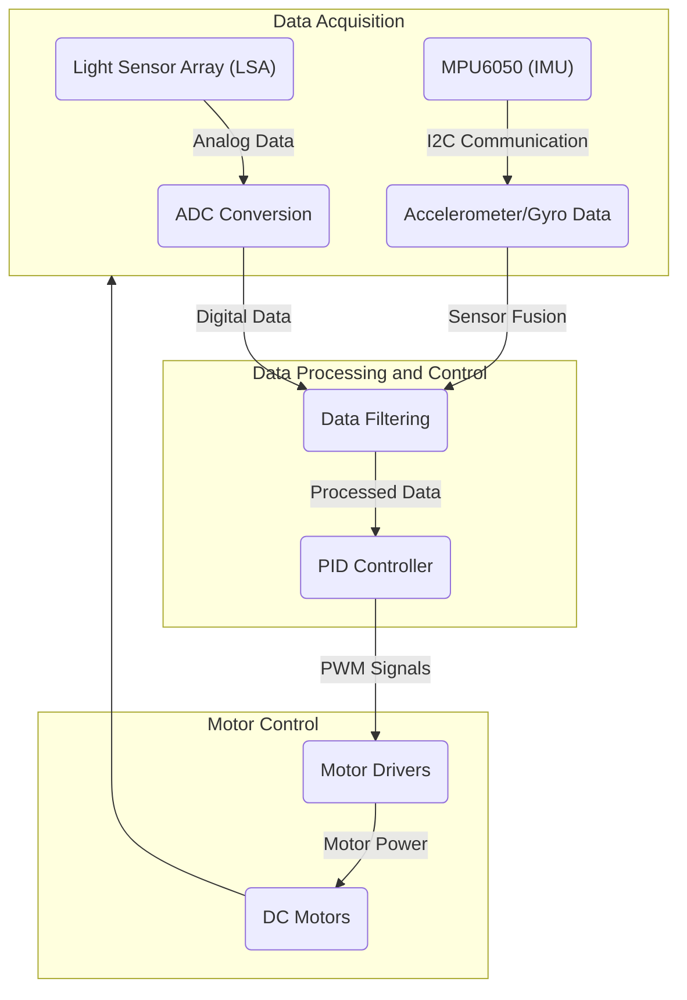

---
title: "Project Overview"
description: "Introduces the Wall-E project and its objectives."
---

# Project Overview

Wall-E is an educational robotics platform developed by SRA-VJTI (Student Robotics Association, Veermata Jijabai Technological Institute).  It aims to provide first-year students with a hands-on introduction to robotics and embedded systems.  The project encompasses a custom-designed robot, accompanying firmware, and a series of workshops designed to teach fundamental concepts like line following, self-balancing, and embedded communication protocols.

Key objectives of the Wall-E project include:

*   **Education:**  Introduce students to embedded programming, control systems, and robotics principles.
*   **Hands-on Experience:** Provide practical experience with microcontrollers, sensors, and actuators.
*   **Skill Development:** Foster skills in problem-solving, debugging, and teamwork.
*   **Open Source:** Promote collaboration and knowledge sharing through an open-source platform.

The project's codebase focuses on the ESP32 microcontroller, leveraging the ESP-IDF (Espressif IoT Development Framework). The robot itself is designed to be modular and extensible, allowing students to experiment with different sensors, actuators, and control algorithms.

## Core Features

*   **Line Following:**  The robot is equipped with a light sensor array (LSA) to follow a predefined path.  This involves implementing appropriate control algorithms (e.g., PID) to steer the robot along the line.
*   **Self-Balancing:**  The robot uses an Inertial Measurement Unit (IMU), specifically the MPU6050, to maintain balance.  This requires sophisticated sensor fusion techniques (e.g., complementary filters) and feedback control.
*   **Motor Control:**  The robot's movement is controlled by DC motors, driven by PWM signals generated by the ESP32.
*   **Communication Protocols:** The project utilizes UART, SPI, and I2C for communication between different components (e.g., sensors, display).
*   **Real-Time Operating System (RTOS):** ESP-IDF is based on FreeRTOS, enabling concurrent task execution and efficient resource management.

## Technical Stack

| Component           | Technology/Library          | Description                                                                  |
| :------------------ | :-------------------------- | :--------------------------------------------------------------------------- |
| Microcontroller     | ESP32                       | Main processing unit, handling sensor data, motor control, and communication |
| IDE/Framework       | ESP-IDF                     | Espressif IoT Development Framework                                          |
| IMU                 | MPU6050                     | Inertial Measurement Unit, providing accelerometer and gyroscope data       |
| Light Sensor Array  | Custom Design               | Array of light sensors used for line following                               |
| Motor Drivers       | Custom Design               | Circuitry to control the DC motors                                           |
| RTOS                | FreeRTOS                    | Real-time operating system for concurrent task execution                    |
| Programming Language| C/C++                       | Used for firmware development                                               |

## Installation Guide

The installation process varies depending on the operating system.  The project provides detailed instructions for Windows, Linux, and macOS in the `Installations.md` file.  A dedicated installation script (`wall_e_install.sh`) simplifies the setup process for Linux and macOS.

Here's a snippet from the Linux installation script:

```bash
# [View on GitHub](https://github.com/SRA-VJTI/Wall-E/blob/master/wall_e_install.sh)
#!/bin/bash

# Install ESP-IDF and clone the Wall-E repository

set -e

# Check if ESP-IDF is already installed
if [ ! -d "$HOME/esp/esp-idf" ]; then
  echo "Installing ESP-IDF..."
  # Add ESP-IDF installation commands here
  # (This is a simplified example; the actual script contains more detailed steps)
  git clone --depth 1 -b v5.2 https://github.com/espressif/esp-idf.git $HOME/esp/esp-idf
  echo "ESP-IDF installed."
else
  echo "ESP-IDF already installed."
fi

# Clone the Wall-E repository
if [ ! -d "$HOME/Wall-E" ]; then
  echo "Cloning the Wall-E repository..."
  git clone https://github.com/SRA-VJTI/Wall-E --recursive --depth 1 $HOME/Wall-E
  echo "Wall-E repository cloned."
else
  echo "Wall-E repository already cloned."
fi

echo "Installation complete!"
```

This script automates the installation of the ESP-IDF framework and the cloning of the Wall-E repository.  It checks for existing installations to avoid redundant steps. The `--depth 1` flag in the `git clone` commands creates a shallow clone, reducing the download size.  The `--recursive` flag ensures that submodules are also cloned.

## Example Snippets

Here's an example of how to configure the target device to ESP32:

```python
# [View on GitHub](https://github.com/SRA-VJTI/Wall-E/blob/master/1_led_blink/main/led_blink.c)
#include <stdio.h>
#include "freertos/FreeRTOS.h"
#include "freertos/task.h"
#include "driver/gpio.h"
#include "sdkconfig.h"

#define LED_PIN 2 // Define the GPIO pin for the LED

void app_main(void) {
    gpio_reset_pin(LED_PIN);  // Reset the GPIO pin
    gpio_set_direction(LED_PIN, GPIO_MODE_OUTPUT); // Set the GPIO pin as an output

    while (true) {
        gpio_set_level(LED_PIN, 1); // Turn the LED on
        vTaskDelay(pdMS_TO_TICKS(500)); // Delay for 500 milliseconds
        gpio_set_level(LED_PIN, 0); // Turn the LED off
        vTaskDelay(pdMS_TO_TICKS(500)); // Delay for 500 milliseconds
    }
}
```

This code snippet demonstrates a simple LED blink example, showcasing the use of GPIO (General Purpose Input/Output) pins on the ESP32. It initializes a GPIO pin as an output and then toggles its state in a loop, causing the LED connected to that pin to blink.

Here's another example related to the MPU6050 sensor:

```c
// [View on GitHub](https://github.com/SRA-VJTI/Wall-E/blob/master/3_MPU/main/mpu6050.c)
#include <stdio.h>
#include "freertos/FreeRTOS.h"
#include "freertos/task.h"
#include "driver/i2c.h"

#define I2C_MASTER_SCL_IO           22      /*!< gpio number for I2C master clock */
#define I2C_MASTER_SDA_IO           21      /*!< gpio number for I2C master data  */
#define I2C_MASTER_NUM              I2C_NUM_0        /*!< I2C port number for master dev */
#define I2C_MASTER_FREQ_HZ          100000                     /*!< I2C master clock frequency */
#define MPU6050_ADDR                0x68        /*!< Slave address of MPU6050 */

static esp_err_t i2c_master_init(void)
{
    i2c_config_t conf = {
        .mode = I2C_MODE_MASTER,
        .sda_io_num = I2C_MASTER_SDA_IO,
        .scl_io_num = I2C_MASTER_SCL_IO,
        .sda_pullup_en = GPIO_PULLUP_ENABLE,
        .scl_pullup_en = GPIO_PULLUP_ENABLE,
        .master.clk_speed = I2C_MASTER_FREQ_HZ,
        .clk_flags = 0,          /*!< Optional, you can use I2C_SCLK_SRC_FLAG_* flags to choose i2c source clock here. */
    };
    esp_err_t err = i2c_param_config(I2C_MASTER_NUM, &conf);
    if (err != ESP_OK) {
        return err;
    }
    return i2c_driver_install(I2C_MASTER_NUM, conf.mode, 0, 0, 0);
}
```

This snippet shows the initialization of the I2C interface for communication with the MPU6050. It configures the SDA (Serial Data) and SCL (Serial Clock) pins, sets the clock frequency, and installs the I2C driver. The MPU6050's address is defined as `0x68`.

Here's a code example demonstrating Pulse Width Modulation (PWM) for controlling motor speed.

```c
// [View on GitHub](https://github.com/SRA-VJTI/Wall-E/blob/master/5_PWM/main/pwm_example.c)
#include <stdio.h>
#include "freertos/FreeRTOS.h"
#include "freertos/task.h"
#include "driver/ledc.h"
#include "esp_err.h"

#define LEDC_TIMER              LEDC_TIMER_0
#define LEDC_MODE               LEDC_LOW_SPEED_MODE
#define LEDC_OUTPUT_IO          (18) // Define the output GPIO pin
#define LEDC_CHANNEL            LEDC_CHANNEL_0
#define LEDC_DUTY_RES           LEDC_TIMER_13_BIT // Set duty resolution to 13 bits
#define LEDC_FREQUENCY          (5000) // Frequency in Hz

void app_main(void)
{
    // Prepare and then apply the LEDC PWM timer configuration
    ledc_timer_config_t ledc_timer = {
        .speed_mode       = LEDC_MODE,
        .timer_num        = LEDC_TIMER,
        .duty_resolution  = LEDC_DUTY_RES,
        .freq_hz          = LEDC_FREQUENCY,  // Set output frequency at 5 kHz
        .clk_cfg          = LEDC_AUTO_CLK
    };
    ESP_ERROR_CHECK(ledc_timer_config(&ledc_timer));

    // Prepare and then apply the LEDC PWM channel configuration
    ledc_channel_config_t ledc_channel = {
        .speed_mode     = LEDC_MODE,
        .channel        = LEDC_CHANNEL,
        .timer_sel      = LEDC_TIMER,
        .intr_enable    = 0,
        .gpio_num       = LEDC_OUTPUT_IO,
        .duty           = 0, // Set duty to 0%
        .hpoint         = 0
    };
    ESP_ERROR_CHECK(ledc_channel_config(&ledc_channel));

    // Set duty cycle and update PWM
    while (true) {
        for (int duty = 0; duty <= 8191; duty++) {
            ESP_ERROR_CHECK(ledc_set_duty(LEDC_MODE, LEDC_CHANNEL, duty));
            ESP_ERROR_CHECK(ledc_update_duty(LEDC_MODE, LEDC_CHANNEL));
            vTaskDelay(pdMS_TO_TICKS(1));
        }

        for (int duty = 8191; duty >= 0; duty--) {
            ESP_ERROR_CHECK(ledc_set_duty(LEDC_MODE, LEDC_CHANNEL, duty));
            ESP_ERROR_CHECK(ledc_update_duty(LEDC_MODE, LEDC_CHANNEL));
            vTaskDelay(pdMS_TO_TICKS(1));
        }
    }
}
```

This code sets up a PWM signal on a specified GPIO pin ( `LEDC_OUTPUT_IO` ). The duty cycle is varied in a loop to control the speed of a motor or the brightness of an LED connected to that pin.

Here is an example of UART communication:

```c
// [View on GitHub](https://github.com/SRA-VJTI/Wall-E/blob/master/UART_Example/main/uart_example_main.c)
#include <stdio.h>
#include "freertos/FreeRTOS.h"
#include "freertos/task.h"
#include "driver/uart.h"
#include "string.h"

#define UART_PORT_NUM 0
#define UART_TXD  (GPIO_NUM_4)
#define UART_RXD  (GPIO_NUM_5)
#define UART_BAUD_RATE 115200

void app_main(void)
{
    uart_config_t uart_config = {
        .baud_rate = UART_BAUD_RATE,
        .data_bits = UART_DATA_8_BITS,
        .parity = UART_PARITY_DISABLE,
        .stop_bits = UART_STOP_BITS_1,
        .flow_ctrl = UART_HW_FLOWCTRL_DISABLE,
        .source_clk = UART_SCLK_APB,
    };
    uart_driver_install(UART_PORT_NUM, 1024 * 2, 0, 0, NULL, 0);
    uart_param_config(UART_PORT_NUM, &uart_config);
    uart_set_pin(UART_PORT_NUM, UART_TXD, UART_RXD, UART_PIN_NO_CHANGE, UART_PIN_NO_CHANGE);

    const char* tx_data = "Hello World\n";
    while (1) {
        uart_write_bytes(UART_PORT_NUM, tx_data, strlen(tx_data));
        vTaskDelay(1000 / portTICK_PERIOD_MS);
    }
}
```

This code snippet demonstrates basic UART (Universal Asynchronous Receiver/Transmitter) communication. It configures the UART port, sets the baud rate, and transmits the string "Hello World" every second.

## Control Flow and Best Practices

The Wall-E project's control flow generally involves the following steps:

1.  **Sensor Data Acquisition:**  Sensors (e.g., IMU, LSA) collect data about the robot's environment.
2.  **Data Processing:**  The ESP32 processes the raw sensor data, applying filters and performing calculations.
3.  **Control Algorithm:**  A control algorithm (e.g., PID) determines the appropriate motor commands based on the processed sensor data.
4.  **Motor Control:**  The ESP32 generates PWM signals to control the speed and direction of the motors.
5.  **Feedback Loop:**  The robot's movement affects the sensor readings, creating a closed-loop feedback system.

**Best Practices:**

*   **Modular Design:**  Break down the project into smaller, manageable modules.
*   **Code Comments:**  Write clear and concise comments to explain the code.
*   **Version Control:**  Use Git for version control and collaboration.
*   **Testing:**  Thoroughly test each module and the integrated system.
*   **Documentation:**  Maintain up-to-date documentation for the project.

## Mermaid Diagram





This diagram illustrates the general flow of data in the Wall-E project, from sensor data acquisition to motor control.

## Key Integration Points

The successful operation of Wall-E hinges on the seamless integration of several key components:

*   **Sensor Fusion:**  Combining data from the accelerometer and gyroscope to estimate the robot's orientation.
*   **PID Control:** Implementing effective PID control algorithms for line following and self-balancing.
*   **Motor Driver Interface:**  Properly interfacing the ESP32's PWM outputs with the motor driver circuitry.
*   **RTOS Task Scheduling:**  Efficiently scheduling tasks to ensure timely sensor data acquisition and motor control.

By mastering these integration points, students can gain a deeper understanding of embedded systems and robotics principles.
```