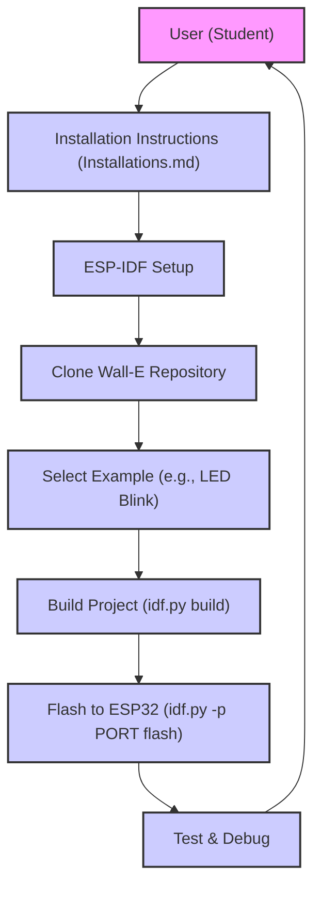
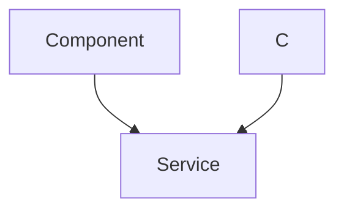

 
---
title: "Project Overview"
description: "An introduction to the Wall-E project and its goals."
---

# Project Overview

The Wall-E project is an educational initiative focused on robotics and embedded systems, designed to provide hands-on experience to students, particularly first-year undergraduates. The project centers around building and programming a small, two-wheeled robot, "Wall-E," using the ESP32 microcontroller. The primary goals of the project include:

*   **Introducing fundamental robotics concepts:** Covering topics such as line following, self-balancing, and motor control.
*   **Providing hands-on experience with embedded systems:** Utilizing the ESP32, which includes Wi-Fi and BLE capabilities, along with concepts like PID control, communication protocols, and RTOS.
*   **Fostering practical skills:** Offering the ability to build, program, and debug a real-world robotic system.
*   **Building a community:** Encouraging collaboration and knowledge sharing among students.

The project repository contains all the necessary resources, code examples, and documentation to get started with building and programming the Wall-E robot. The project leverages the ESP-IDF (Espressif IoT Development Framework) for development. Installation instructions for various operating systems are provided, ensuring accessibility for all users. The project also provides examples that cover various aspects of robotics and embedded systems.

## Key Features

The Wall-E project focuses on several key areas, allowing students to understand different aspects of robotics and embedded systems. Here are the main features:

*   **Line Following:** Implementing an algorithm that allows the robot to follow a pre-defined path.
*   **Self-Balancing:** Designing a control system that enables the robot to balance its weight.
*   **Motor Control:** Utilizing PWM (Pulse Width Modulation) for precise motor speed and direction control.
*   **Sensor Integration:** Integrating and utilizing sensors like accelerometers, gyroscopes, and light sensors to gather information about the environment.
*   **Communication Protocols:** Implementing communication protocols like UART, SPI, and I2C.
*   **Embedded Programming:** Using the ESP-IDF framework to program the ESP32.

## Project Structure

The project is structured to make it easy to understand and use.

The project structure is as follows:

```plaintext
Wall-E/
├── 1_led_blink/
│   ├── main/
│   │   └── main.c
│   ├── CMakeLists.txt
│   └── README.md
├── 2_LSA/
│   ├── main/
│   │   └── main.c
│   ├── CMakeLists.txt
│   └── README.md
├── 3_MPU/
│   ├── main/
│   │   └── main.c
│   ├── CMakeLists.txt
│   └── README.md
├── 4_switch_controlled_motor_normal/
│   ├── main/
│   │   └── main.c
│   ├── CMakeLists.txt
│   └── README.md
├── 5_PWM/
│   ├── main/
│   │   └── main.c
│   ├── CMakeLists.txt
│   └── README.md
├── 6_line_following/
│   ├── main/
│   │   └── main.c
│   ├── CMakeLists.txt
│   └── README.md
├── 7_self_balancing/
│   ├── main/
│   │   └── main.c
│   ├── CMakeLists.txt
│   └── README.md
├── CMakeLists.txt
├── README.md
├── LICENSE
└── documentation/
    ├── images/
    │   └── ...
    └── Installation/
        └── ...
```

*   Each of the numbered directories (e.g., `1_led_blink`, `2_LSA`) represents a specific example or module within the project.
*   Each example directory contains a `main` directory with the source code (`main.c`), a `CMakeLists.txt` file for the build system, and a `README.md` file providing details about the example.
*   The `documentation` directory stores images and documentation assets.
*   The root `README.md` provides an overview of the entire project.

## Installation and Setup

Detailed installation instructions are provided in the `Installations.md` file within the repository, covering the installation process for Windows, Linux, and MacOS. These instructions involve installing the ESP-IDF framework, cloning the Wall-E repository, and setting up the necessary environment variables.

### Windows Installation Snippet

The following code block highlights how to clone the repository within the ESP-IDF PowerShell:

```powershell
cd ~
mkdir Projects
cd Projects
git clone https://github.com/SRA-VJTI/Wall-E --recursive --depth 1
cd Wall-E
```

[View on GitHub](https://github.com/SRA-VJTI/Wall-E/blob/master/Installations.md)

### Linux Installation Snippet

The following commands show how to install the necessary packages and clone the Wall-E repository on a Linux system.

```bash
sudo apt install curl
cd $HOME
curl https://raw.githubusercontent.com/SRA-VJTI/Wall-E/refs/heads/master/wall_e_install.sh -o $HOME/wall_e_install.sh
chmod +x $HOME/wall_e_install.sh
./wall_e_install.sh && source $HOME/."${SHELL#${SHELL%/*}/}"rc
```

[View on GitHub](https://github.com/SRA-VJTI/Wall-E/blob/master/Installations.md)

### MacOS Installation Snippet

The following commands are used to clone the Wall-E repository and run a hello world example in the terminal.

```bash
curl https://raw.githubusercontent.com/SRA-VJTI/Wall-E/refs/heads/master/wall_e_install.sh -o wall_e_install.sh
sudo chmod +x wall_e_install.sh
./wall_e_install.sh
cd ~/esp/esp-idf/examples/get-started/hello_world
idf.py flash monitor
cd $HOME
cd Wall-E
```
[View on GitHub](https://github.com/SRA-VJTI/Wall-E/blob/master/Installations.md)

## Building and Flashing

After setting up the development environment, the general procedure for compiling and flashing code onto the ESP32 involves the following steps:
### Build project:
```sh
idf.py build #Command for building the code
```

[View on GitHub](https://github.com/SRA-VJTI/Wall-E/blob/master/Installations.md)

### Flash the project:

```sh
idf.py -p PORT flash 
```

[View on GitHub](https://github.com/SRA-VJTI/Wall-E/blob/master/Installations.md)

## Example: LED Blink

The `1_led_blink` example, located in the repository, provides a simple introduction to controlling an LED using the ESP32. The `main.c` file contains the code to toggle an LED connected to a specific GPIO pin.

```c
#include <stdio.h>
#include "driver/gpio.h"
#include "freertos/FreeRTOS.h"
#include "freertos/task.h"

#define LED_PIN 2 // Replace with the GPIO pin your LED is connected to

void app_main(void) {
    gpio_set_direction(LED_PIN, GPIO_MODE_OUTPUT);
    while (1) {
        gpio_set_level(LED_PIN, 1); // Turn the LED on
        vTaskDelay(pdMS_TO_TICKS(500)); // Delay for 500ms
        gpio_set_level(LED_PIN, 0); // Turn the LED off
        vTaskDelay(pdMS_TO_TICKS(500)); // Delay for 500ms
    }
}
```

[View on GitHub](https://github.com/SRA-VJTI/Wall-E/blob/master/1_led_blink/main/main.c)

This code initializes the specified GPIO pin as an output, then toggles the LED's state with a 500ms delay.

## Key Integration Points

The Wall-E project provides a complete environment for learning about embedded systems and robotics. Here's a summary of the main integration points and best practices:

*   **ESP-IDF as the Core:** The ESP-IDF provides all the necessary tools and libraries to develop applications for the ESP32. The project's build system, flashing, and configuration are all handled using ESP-IDF commands, creating a unified development experience.
*   **Modular Code Structure:** The project is organized into modular examples (e.g., LED blink, LSA, MPU6050, PWM, etc.). Each module is self-contained and demonstrates a particular concept or functionality, making it easy for users to understand and experiment with different aspects of robotics.
*   **Sensor and Motor Integration:** The project integrates with the sensors and motors. This integration includes reading sensor data, controlling motors via PWM, and implementing control algorithms. This integration is crucial for the line-following and self-balancing functionalities.
*   **Configuration:** The project utilizes `menuconfig` for the configuration of project-specific settings. This allows users to configure the project easily.
*   **Clear Documentation and Examples:** Comprehensive documentation and clear code examples guide users through each step of the project, including installation, setup, and usage.







