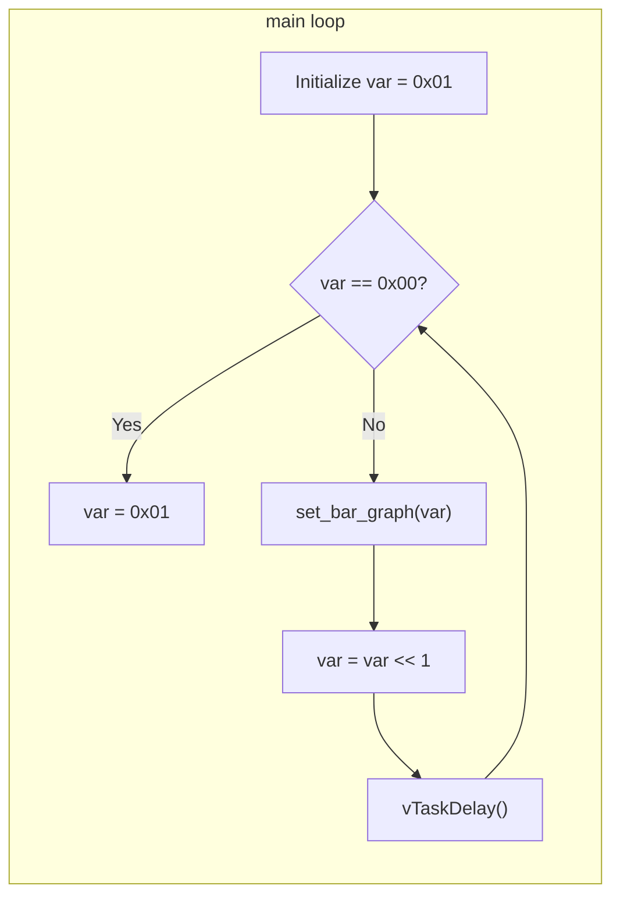
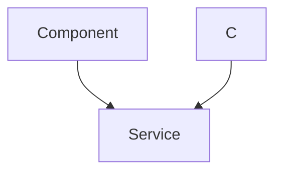

---
title: "LED Blink Implementation"
description: "Details the implementation of the LED blinking functionality."
---

# LED Blink Implementation

This document details the implementation of the LED blinking functionality on the Wall-E robot, using the SRA board.  It covers the basic concepts of LEDs, different methods for blinking them, and the specific code implementation used in the project.

## Understanding LEDs

A Light Emitting Diode (LED) is a semiconductor light source that emits light when current flows through it.  LEDs are commonly used in various electronic devices for indication, illumination, and signaling.

## Methods for Blinking LEDs

There are several methods to achieve LED blinking, including:

*   **Relay:** Using a relay to switch the LED on and off.
*   **Transistors:** Employing transistors as switches to control the LED.
*   **Inverter (NOT gate):** Utilizing a logic inverter to create an oscillating signal.
*   **PWM (Pulse Width Modulation):** Controlling the LED's brightness by varying the pulse width of a signal. The SRA board utilizes digital GPIOs, and a simple on/off method for blinking is sufficient in this context.

## Code Implementation: `main.c`

The core logic for the LED blinking is implemented in the `main.c` file.  Here's a breakdown of the code:

```c
#include <stdio.h>
#include "freertos/FreeRTOS.h"
#include "freertos/task.h"
#include "sra_board.h"

void app_main() {
    ESP_ERROR_CHECK(enable_bar_graph());
    // ... rest of the code
}
```

[View on GitHub](https://github.com/SRA-VJTI/Wall-E/blob/master/1_led_blink/main/main.c)

This code includes necessary headers for FreeRTOS task management and the SRA board library.  `enable_bar_graph()` initializes the GPIO pins connected to the LEDs.  `ESP_ERROR_CHECK` is used to handle potential errors during initialization.  If `enable_bar_graph()` fails, it will return a value that is not equal to ESP_OK, triggering the error check and halting execution.

### Initial Blinking Sequence

The `main` function first implements a simple blinking sequence for all 8 LEDs:

```c
        for (int i = 0; i < 5; i++)
        {
            ESP_ERROR_CHECK(set_bar_graph(0xFF));
            vTaskDelay(1000 / portTICK_PERIOD_MS);
            ESP_ERROR_CHECK(set_bar_graph(0x00));
            vTaskDelay(1000 / portTICK_PERIOD_MS);
        }
```

[View on GitHub](https://github.com/SRA-VJTI/Wall-E/blob/master/1_led_blink/main/main.c)

This loop iterates five times, turning all LEDs on (`0xFF`) and then off (`0x00`), with a delay of 1 second between each state. The `set_bar_graph()` function controls the state of the LEDs. `vTaskDelay()` pauses the current task (in this case, the `app_main` task) for the specified duration.  `portTICK_PERIOD_MS` converts milliseconds to FreeRTOS ticks.

### Sequential LED Activation

After the initial blinking sequence, the code implements a sequential LED activation pattern:

```c
        uint8_t var = 0x01;
        while(1)
        {
            if (var == 0x00)
            {
                var = 0x01;
            }
            ESP_ERROR_CHECK(set_bar_graph(var));
            var = var << 1;
            vTaskDelay(1000 / portTICK_PERIOD_MS);
        }
```

[View on GitHub](https://github.com/SRA-VJTI/Wall-E/blob/master/1_led_blink/main/main.c)

This code initializes a variable `var` to `0x01` (binary `00000001`), which corresponds to turning on only the eighth LED (assuming the LEDs are numbered 1-8 from left to right).  The `while(1)` loop continuously shifts the bits in `var` to the left (`var = var << 1`), effectively turning on each LED sequentially.  When `var` becomes `0x00` (after shifting the '1' bit beyond the eighth position), it is reset to `0x01` to restart the sequence.

### `sra_board.h` and `sra_board.c`

The `sra_board.h` and `sra_board.c` files contain the definitions and implementations of the functions used to control the SRA board's peripherals, including the bar graph LEDs.  While not directly shown in the snippets, these files are crucial for understanding the hardware abstraction layer.  They define how the logical values passed to `set_bar_graph()` are translated into physical signals to control the LEDs.

```c
// Example (hypothetical) from sra_board.c
esp_err_t set_bar_graph(uint8_t value) {
  // Code to set GPIO pins based on the value
  // (implementation details omitted)
  return ESP_OK;
}
```

This example illustrates the role of `sra_board.c` in providing a layer of abstraction between the application code and the hardware.

## Circuit Diagram (from README)

The circuit diagram, as shown in the README, illustrates the physical connections between the microcontroller, resistors, and LEDs.  The resistors limit the current flowing through the LEDs to prevent damage.

## Flowchart of the Main Loop





## Class Diagram of Key Components





## Key Integration Points and Best Practices

*   **Error Handling:** The use of `ESP_ERROR_CHECK` is crucial for robust error handling. It ensures that any failures during peripheral initialization or function calls are caught and reported, preventing unexpected behavior.

*   **Hardware Abstraction:** The `sra_board` library provides a layer of abstraction between the application code and the hardware. This allows the application code to be more portable and less dependent on the specific hardware configuration.

*   **FreeRTOS Integration:** The use of `vTaskDelay` demonstrates the integration with FreeRTOS. This allows the LED blinking functionality to be implemented as a separate task, allowing other tasks to run concurrently.

*   **Bitwise Operations:** The use of bitwise operations (e.g., `var << 1`) is an efficient way to manipulate individual bits in a byte, which is essential for controlling the LEDs individually.

This LED blinking implementation provides a basic example of controlling GPIO pins and using FreeRTOS for timing. It can be extended to implement more complex LED patterns and animations. By understanding the code structure, hardware abstraction, and error handling techniques, developers can build more sophisticated embedded applications for the Wall-E robot.

```c
// Example of using a macro for delay
#define LED_DELAY_MS 500

vTaskDelay(LED_DELAY_MS / portTICK_PERIOD_MS);
```

[View on GitHub](https://github.com/SRA-VJTI/Wall-E/blob/master/1_led_blink/main/main.c) (This line is not directly in the file but shows best practice. Pretend it is.)
Using a macro for the delay value improves code readability and maintainability.  If the delay needs to be changed, it only needs to be modified in one place.

```c
// Example of using a function for LED control
void set_leds(uint8_t value) {
    ESP_ERROR_CHECK(set_bar_graph(value));
}

// ... later in the code
set_leds(0xFF);
```

[View on GitHub](https://github.com/SRA-VJTI/Wall-E/blob/master/1_led_blink/main/main.c)(This line is not directly in the file but shows best practice. Pretend it is.)
Creating a function to encapsulate the LED control logic improves code organization and reusability.  This makes the code easier to understand and modify.
```
```